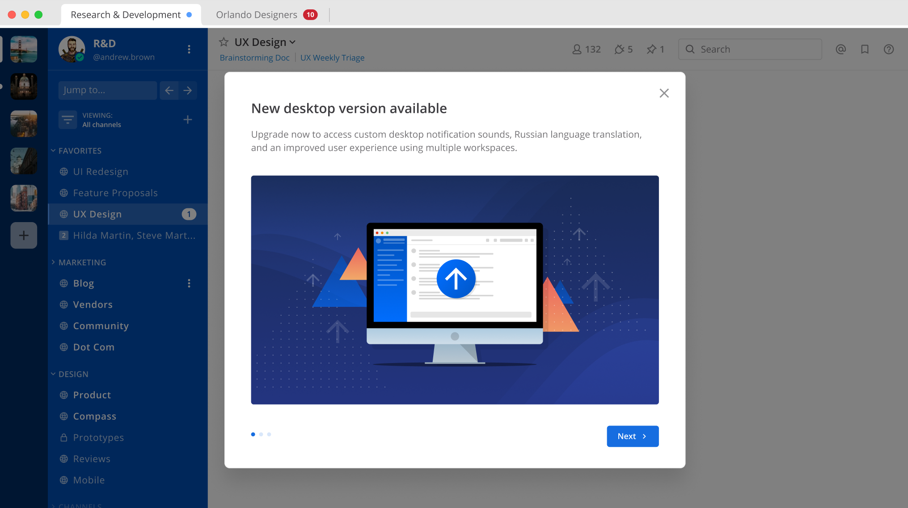

Site Configuration
==================

Announcement Banner
-------------------

Available in `Enterprise Edition E10 and higher <https://about.mattermost.com/pricing/>`__.

In Mattermost Enterprise Edition, an announcement banner is available that allows System Admins to display a notice that's visible to all users on the system.

.. image:: ../../images/announcement-banner-1106x272.png
  :width: 1106
  :height: 272
  :alt: Shows the announcement banner at the top of the user's screen.

By default, users can dismiss the banner until they log in again or until you update the banner. You can update the banner by either changing the text of the banner or by re-enabling the banner after it has been disabled. You can also control the text color and the background color. A setting in the System Console allows you to prevent users from dismissing the banner.

**To enable the banner**:

1. Open **System Console > Site Configuration**.
2. In the *Enable Announcement Banner* section, click **true**.
3. In the *Banner Text* field, enter the text of the announcement that you want to make.
4. Set the background and text colors.
5. To prevent users from dismissing the banner, in the *Allow Banner Dismissal* section, click **false**.
6. Click **Save**.

In-Product Notices
------------------

Mattermost in-product notices keep users and administrators informed of the newest product improvements, features, and releases.

Administrator Notices
^^^^^^^^^^^^^^^^^^^^^

Administrator notices are used to inform System Admins when a new server version is available, or if a server upgrade is recommended due to ending support life cycles. System Admins may also receive notices about recommended server configuration options to optimize the user experience of their deployment.

Administrator notices can be disabled in the **System Console > Notices** page.

End User Notices
^^^^^^^^^^^^^^^^

End user notices are used to inform users and Admins of new feature enhancements and when new desktop versions are available. They can be disabled in **System Console > Notices**.

FAQs
^^^^

Are notices enabled by default?
~~~~~~~~~~~~~~~~~~~~~~~~~~~~~~~

Notices are enabled by default for all Mattermost users. System Admins may choose to disable administrator or end user notices in **System Console > Notices**.

Will I still receive notices if my server is air-gapped?
~~~~~~~~~~~~~~~~~~~~~~~~~~~~~~~~~~~~~~~~~~~~~~~~~~~~~~~~

No, the Mattermost server requires a connection to the internet to receive notices.

How often will users receive notices?
~~~~~~~~~~~~~~~~~~~~~~~~~~~~~~~~~~~~~

Notices will be used to raise awareness of new features as part of our monthly release cadence. Users will only receive notices that specifically apply to them. For example, if a user is already running the latest Desktop App version, they will not receive an upgrade notice.
