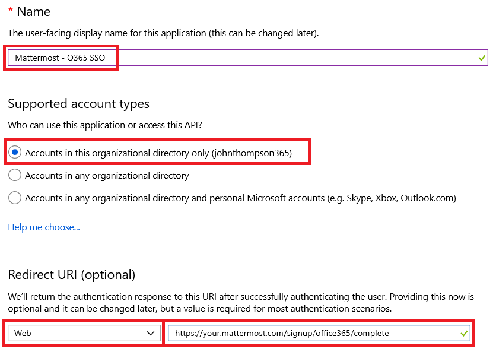

# Office 365 Single Sign-On

## Migrating from OAuth to OpenID Connect

OAuth 2.0 is being deprecated and replaced by OpenID Connect. Refer to the product documentation to [convert your existing OAuth configuration](https://docs.mattermost.com/cloud/cloud-administration/converting-oauth-2.0-to-openid-connect) for Office 365 to the OpenID Connect standard.

## Configuring Office 365 as a Single Sign-On (SSO) service

Follow these steps to configure Mattermost to use your Office 365 logon credentials and Azure Active Directory account as a Single Sign-on (SSO) service for team creation, account creation, and sign-in.

**Note:** The system must be using SSL for use with Office365 as Microsoft only allows OAuth redirect URIs that are SSL enabled.

### Step 1: Register an application in Azure Portal

1. Log in to your [Azure Portal](https://portal.azure.com/) with the account that relates to the Azure Active Directory tenant where you want to register the application. You can confirm the tenant in the top right corner of the portal.

2. In the left-hand navigation pane, select the **Azure Active Directory service**, then select **App registrations > New registration**.

3. Give your new registration a **Name**.

4. Define which **Supported account types** can access the application. For example, if this is to be only accessed from your enterprise's Azure AD accounts, then select **Accounts in this organizational directory only**. 

5. Define the **Redirect URI** as Web client, then input the URL with the host name that will be specific to your Mattermost service followed by `/signup/office365/complete`. An example below is: `https://your.mattermost.com/signup/office365/complete`

   

   

Once the App Registration has been created, you can configure it further. The standard Azure AD documentation is [here](https://docs.microsoft.com/en-gb/azure/active-directory/develop/quickstart-register-app) for reference.

### Step 2: Generate a new client secret in Azure Portal

1. In the Azure Portal, select **Certificates and Secrets** from the menu, then select the button to generate a **New Client secret**. 

2. Provide a description, define the expiry for the token, then select **Add**.

3. In Azure Portal, select **Overview** from the menu, then copy and paste both the _Application (client) ID_ and the _Directory (tenant) ID_ to a temporary location. You will enter these values as an **Application ID** and as part of an **Auth Endpoint** and **Token Endpoint** URL in the Mattermost System Console.

   
   

### Step 3: Configure Mattermost for Office 365 SSO

1. Log in to Mattermost, then go to **System Console > Authentication > OpenID Connect**.

2. Select **Office 365** as the service provider.

3. Paste in the _Directory (tenant) ID_ from Azure Portal as the **Directory (tenant) ID** in Mattermost.

4. The **Discovery Endpoint** for OpenID Connect with Office 365 is prepopulated with ``https://login.microsoftonline.com/common/v2.0/.well-known/openid-configuration``.

5. Paste in the _Application (client) ID_ from Azure Portal as the **Client ID** in Mattermost.

6. Paste in the _client secret value_ from Azure Portal as the **Client Secret** in Mattermost.

7. Select **Save**.

8. Restart your Mattermost server to see the changes take effect.

### Note about Microsoft Active Directory Tenants

A Microsoft Active Directory (AD) tenant is a dedicated instance of Azure Active Directory (Azure AD) that you own and would have received when signing up for a Microsoft cloud service such as Azure or Office 365. Tenants are commonly used by organizations who want to store information about their users such as passwords, user profile data and permissions. You can learn more about [getting an Azure AD tenant here](https://docs.microsoft.com/en-us/azure/active-directory/active-directory-howto-tenant).

To allow your Azure AD users to sign in to Mattermost using Office 365 SSO, you must register Mattermost in the Microsoft Azure AD tenant that contains the users' information. The registration can be done from the [Microsoft Azure portal](https://manage.windowsazure.com/). The steps to register the Mattermost account in the tenant should be similar to those provided above, and you can find more information about [integrating apps with Azure AD here](https://azure.microsoft.com/en-us/documentation/articles/active-directory-integrating-applications/).

If you don't register Mattermost in the Microsoft Azure AD tenant your organization uses, Office 365 SSO will likely fail for your users.

**Note:** If you do not use Azure Active Directory, you may register Mattermost with your Office 365 or Azure account (a personal, work, or school account), then set up Office 365 SSO with Mattermost using the steps provided above.
