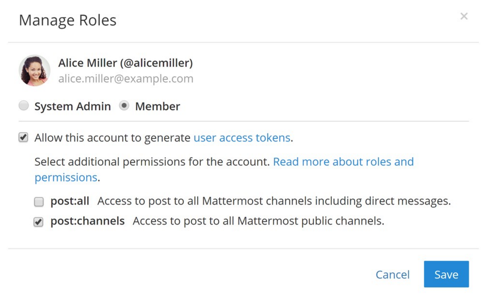
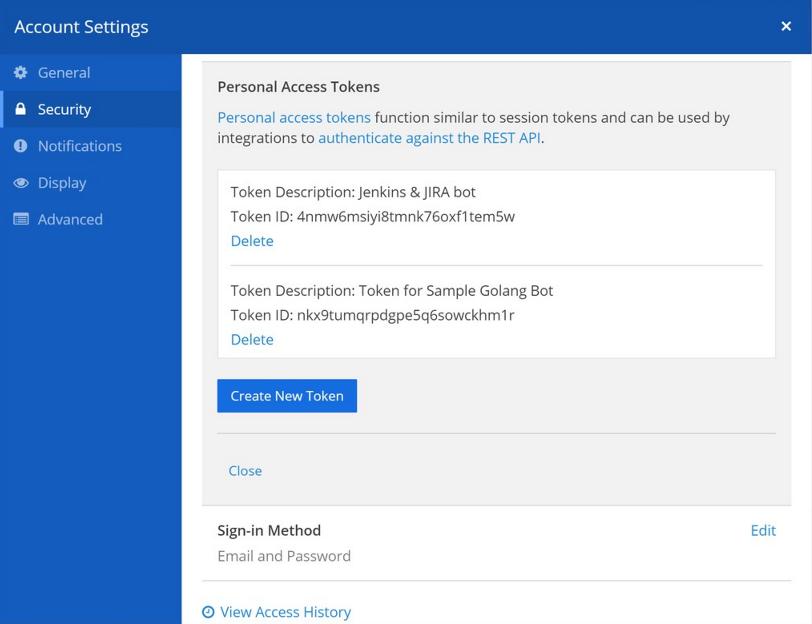

Personal Access Tokens
=======================

Personal access tokens function similar to session tokens and can be used by integrations to `authenticate against the REST API <https://about.mattermost.com/default-api-authentication>`__. It is the most commonly used type of token for integrations.

.. contents::
  :backlinks: top
  :depth: 1
  :local:

Creating a Personal Access Token
~~~~~~~~~~~~~~~~~~~~~~~~~~~~~~~~~

1. Enable personal access tokens in **System Console > Integrations > Integration Management**.
2. Identify the account you want to create a personal access token with. You may optionally create a new user account for your integration, such as for a bot account. By default, only System Admins have permissions to create a personal access token. 
3. To create an access token with a non-admin account, you must first give it the appropriate permissions. Go to **System Console > User Management > Users**, search for the user account, then select **Manage Roles** from the dropdown.

.. image:: ../../../source/images/access_token_manage_roles.png
  :width: 500 px

4. Select **Allow this account to generate personal access tokens.**

You may optionally allow the account to post to any channel in your Mattermost workspace, including direct messages by choosing the **post:all** role. **post:channels** role allows the account to post to any public channel in the Mattermost workspace.

5. Select **Save**.

6. Sign in to the user account to create a personal access token.

7. Go to **Account Settings > Security > Personal Access Tokens**, then select **Create New Token**.

8. Enter a description for the token, so you remember what it's used for. 

9. Select **Save**.

.. note::
  If you create a personal access token for a System Admin account, be extra careful who you share it with. The token enables a user to have full access to the account, including System Admin privileges. It is recommended to create a personal access token for non-admin accounts.
  
10. Copy the access token now for your integration and store it in a secure location. You won't be able to see it again!

11. You're all set! You can now use the personal access token for integrations to interact with your Mattermost workspace and `authenticate against the Mattermost REST API <https://about.mattermost.com/default-api-authentication>`__.

Revoking a Personal Access Token
~~~~~~~~~~~~~~~~~~~~~~~~~~~~~~~~~

A personal access token can be revoked by deleting the token from either the user's account settings or from the System Console. Once deleted, all sessions using the token are deleted, and any attempts to use the token to interact with the Mattermost workspace are blocked.

Tokens can also be temporarily deactivated from the user's account settings. Once deactivated, all sessions using the token are deleted, and any attempts to use the token to interact with the Mattermost workspace are blocked. However, the token can be reactivated at any time. 

Account Settings
.................

1. Sign in to the user account and go to **Account Settings > Security > Personal Access Tokens**. 
2. Identify the access token you want to revoke, then select **Delete**. 
3. Confirm the deletion.

System Console
.................

1. Go to **System Console > User Management > Users**, search for the user account which the token belongs to, then select **Manage Tokens** from the dropdown.
2. Identify the access token you want to revoke, then select **Delete**. 
3. Confirm the deletion.

Frequently Asked Questions (FAQ)
~~~~~~~~~~~~~~~~~~~~~~~~~~~~~~~~~

How do personal access tokens differ from regular session tokens?
..................................................................

- Personal access tokens do not expire. As a result, you can more easily integrate with Mattermost, bypassing the `session length limits set in the System Console <https://docs.mattermost.com/administration/config-settings.html#sessions>`__.
- Personal access tokens can be used to authenticate against the API more easily, including with AD/LDAP and SAML accounts.
- You can optionally assign additional roles for the account creating personal access tokens. This lets the account post to any channel in Mattermost, including direct messages.

Additionally, personal access tokens are exactly the same as regular session tokens. They are cryptic random IDs and are not different from a user's regular session token created after logging in to Mattermost.

Can I set personal access tokens to expire?
............................................

Not in Mattermost, but you can automate your integration to cycle its token `through the REST API <https://api.mattermost.com/#tag/users%2Fpaths%2F~1users~1%7Buser_id%7D~1tokens%2Fpost>`__.

How do I identify a badly behaving personal access token?
..........................................................

The best option is to go to **System Console > Logs** and finding error messages relating to a particular token ID. Once identified, you can search which user account the token ID belongs to in **System Console > User Management > Users** and revoke it through the **Manage Tokens** dropdown option.

Do personal access tokens continue to work if the user is deactivated?
........................................................................

No. The session used by the personal access token is revoked immediately after a user is deactivated, and a new session won't be created. The tokens are preserved and continue to function if the user account is re-activated. This is useful when a bot account is temporarily deactivated for troubleshooting, for instance.
