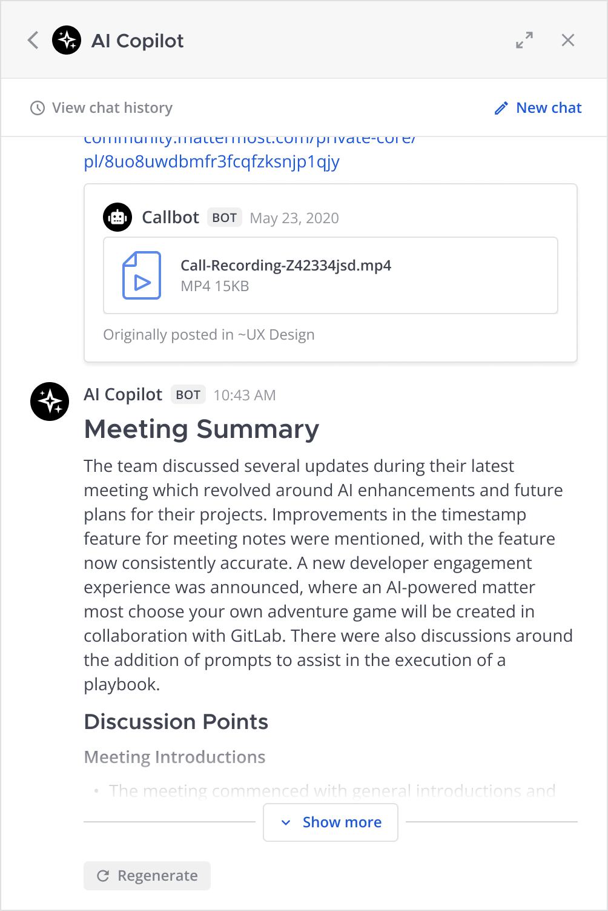

Chat with AI Copilot
====================

.. include:: ../_static/badges/allplans-cloud-selfhosted.rst
  :start-after: :nosearch:

Overcome information overload and streamline communication and collaboration by chatting with the Mattermost AI Copilot in your Mattermost instance.

.. note::

    AI Copilot must be :doc:`enabled and configured </configure/enable-ai-copilot>` by a Mattermost system admin in the System Console before you can start using it.

Get started
~~~~~~~~~~~

Access AI capabilities directly from the right-hand apps bar in Mattermost or by messaging the AI bot directly.

SHOW

Begin with suggested prompts, or engage in a private thread with the AI Copilot bot for a tailored experience. If you have follow-up questions or need further insights, simply ask! AI Copilot is designed to provide deeper understanding based on your inquiries, and AI Copilot remembers the context for follow-on questions and requests.

With AI Copilot you can perform the following tasks:

- summarize your call recordings
- turn long threads & unread channel messages into concise summarizes
- stay on top of all of your commucations by identifying next steps, decisions made, and pinpointing unanswered questions
- Extract learnings and transform content into charts, resources, documentation, articles, and more
- dig further into any topic that's on your mind

Summarize Mattermost call recordings
~~~~~~~~~~~~~~~~~~~~~~~~~~~~~~~~~~~~~

.. include:: ../_static/badges/ent-only.rst
  :start-after: :nosearch:

Leverage Mattermost Calls to turn meeting recordings into actionable summaries with a single click. Ensure key points are captured and shared easily, and enable easy sharing of meeting insights with your team and the broader organization, enhancing communication and productivity.

HOW

Summarize threads & unread channel messages
~~~~~~~~~~~~~~~~~~~~~~~~~~~~~~~~~~~~~~~~~~~

.. include:: ../_static/badges/ent-only.rst
  :start-after: :nosearch:

Accelerate decision-making and improve information flows with concise summaries of long discussions delivered to you directly through direct messages. 

HOW

Ensure you stay on top of communications across threads, channels, and teams, by using AI Copilot to summarize new messages, identify next steps, and pinpoint unanswered questions.

.. image:: ../images/copilot-Unread-Channel-Messages-Summarization.webp
  :alt: Quickly summarize new messages, find action opens, and seek out unanswered questions with your AI Copilot.

HOW

Chat privately with the AI bot
~~~~~~~~~~~~~~~~~~~~~~~~~~~~~~~

Chat privately with your AI Copilot within a Mattermost direct message for personalized assistance.

.. image:: ../images/copilot-AI-RHS.webp
  :alt: Privately chat with your AI Copilot inside Mattermost via the right-hand sidebar.

HOW

Bring AI Copilot into any conversation
~~~~~~~~~~~~~~~~~~~~~~~~~~~~~~~~~~~~~~~

Invoke the power of AI by @mentioning your AI bot in any thread to bring AI's capabilities to your conversation, allowing for quick extraction of information or transformation of discussions into charts, resources, documentation, articles, and more. With the power of Mattermost integrations and interoperability, the potential to enhance your workflow is limitless.

.. image:: ../images/copilot-Contextual-Interrogation.webp
  :alt: Bring your AI into the conversation. @ mention your AI Copilot directly within any thread and use the context to work faster and smarter.

HOW