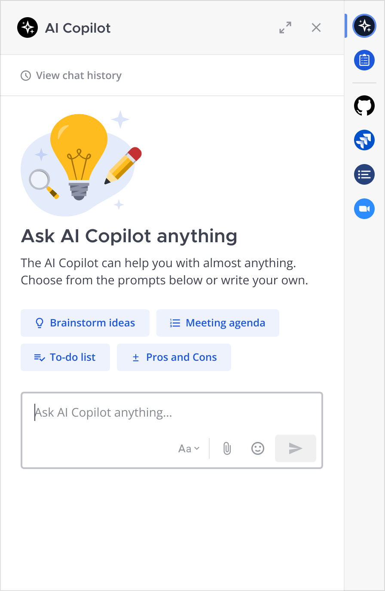
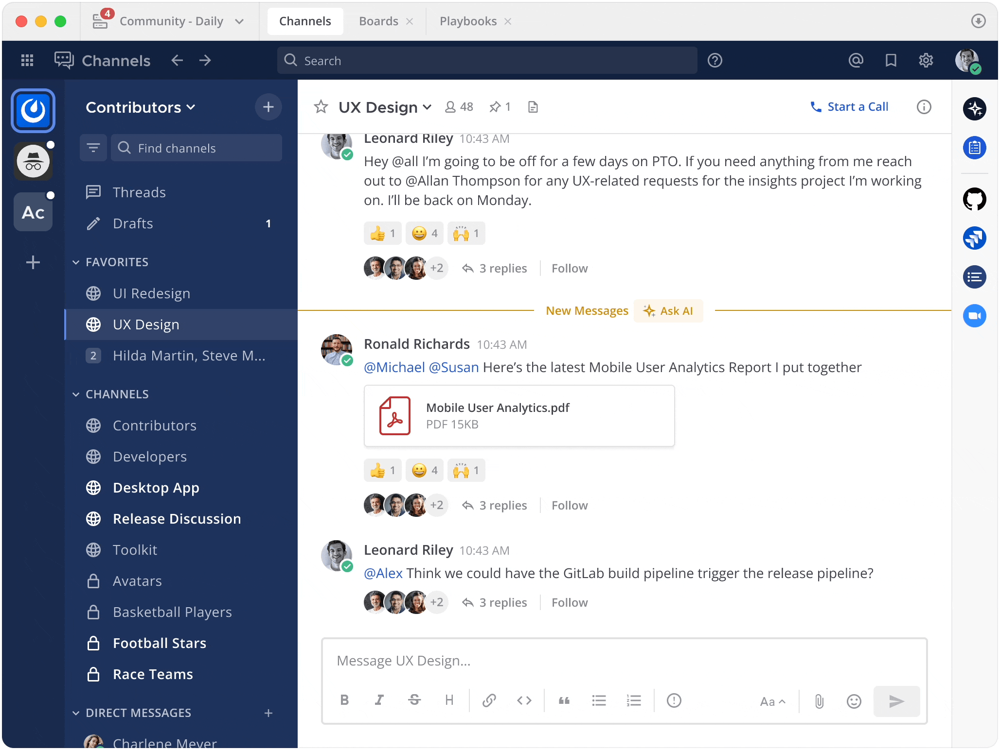
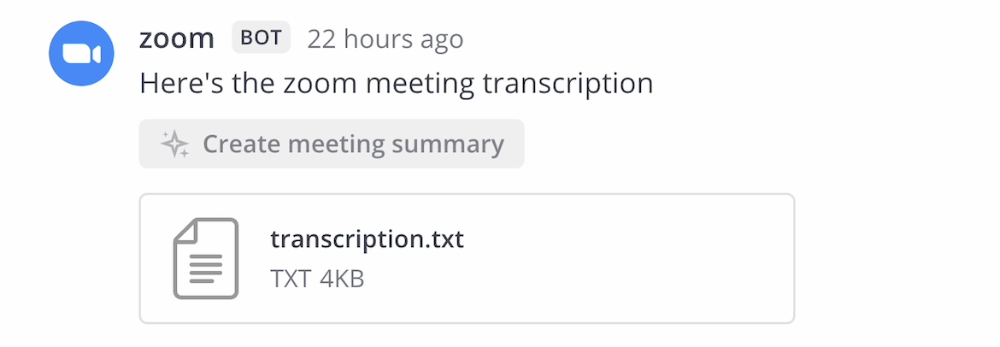
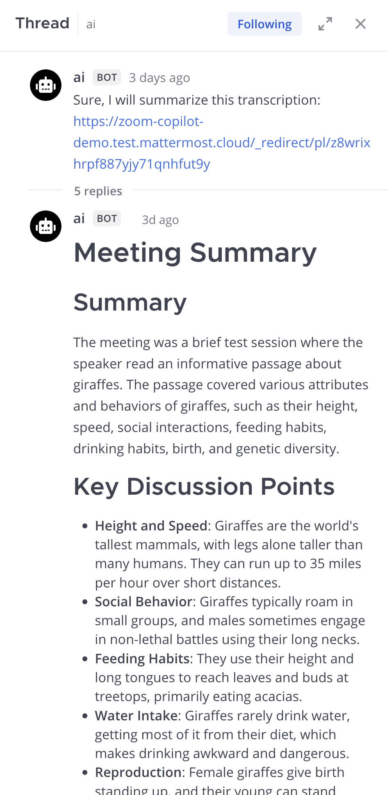

Chat with Copilot (Beta)
=========================

.. include:: ../_static/badges/allplans-cloud-selfhosted.rst
  :start-after: :nosearch:

Overcome information overload and streamline communication and collaboration by chatting with Mattermost Copilot in your Mattermost instance.

.. note::

  Copilot must be :doc:`enabled and configured </configure/enable-copilot>` by a Mattermost system admin in the System Console before you can start using it.

.. include:: ../_static/badges/academy-copilot-calls.rst
  :start-after: :nosearch:

Get started
~~~~~~~~~~~

Select the **Copilot** icon in the apps bar located to the far right of the Mattermost screen to open the Copilot tab in the right pane.

Begin with suggested prompts, or engage in a private thread with the Copilot bot for a tailored experience. If you have follow-up questions or need further insights, simply ask! Copilot is designed to provide deeper understanding based on your inquiries. 

Copilot remembers the context for follow-on questions and requests. Access all previous conversations by selecting **View chat history**. from the Copilot pane.

With Copilot you can perform the following tasks:

- Summarize your call recordings
- Turn long threads & unread channel messages into concise summarizes
- Stay on top of all of your commucations by identifying next steps, decisions made, and pinpointing unanswered questions
- Extract learnings and transform content into charts, resources, documentation, articles, and more
- Dig further into any topic that's on your mind

Summarize Mattermost call recordings
~~~~~~~~~~~~~~~~~~~~~~~~~~~~~~~~~~~~~

.. include:: ../_static/badges/ent-only.rst
  :start-after: :nosearch:

Leverage Mattermost Calls to turn meeting recordings into actionable summaries with a single click. Ensure key points are captured and shared easily, and enable easy sharing of meeting insights with your team and the broader organization, enhancing communication and productivity.

To summarize a Mattermost call recording:

1. :ref:`Start a call in Mattermost <collaborate/make-calls:start a call>`.
2. :ref:`Record the call <collaborate/make-calls:record a call>`.
3. Once the call ends, and the call recording and transcription is ready, select the **Create meeting summary** option located directly above the call recording.

.. image:: ../images/create-meeting-summary.png
  :alt: Select the Create meeting summary option to summarize your call recording in Mattermost.

4. The meeting summary is generated and shared as a direct message with the person who requested the meeting summary.

.. image:: ../images/copilot-Calls-Meeting-Summary.png
  :alt: Easily share the updates from your Mattermost Calls with your team and broader organization by turning recordings into detailed summaries at the click of a button.
  :scale: 50

Summarize threads & unread channel messages
~~~~~~~~~~~~~~~~~~~~~~~~~~~~~~~~~~~~~~~~~~~

.. include:: ../_static/badges/ent-only.rst
  :start-after: :nosearch:

Accelerate decision-making and improve information flows with concise summaries of long discussions delivered to you directly through direct messages. 

Ensure you stay on top of communications across threads, channels, and teams, by using Copilot to summarize new messages, identify next steps, and pinpoint unanswered questions.

To summarize Mattermost threads:

1. Hover over the first message in any conversation thread, select the **AI Actions** |ai-actions-icon| icon, and select **Summarize Thread**.
2. The thread summary is generated in the Copilot pane, and only you can view the summary.

To summarize unread Mattermost channels:

1. In a channel with unread messages, scroll to the **New Messages** cutoff, select **Ask AI**, and then select **Summarize new messages**.
2. The channel summary is generated in the Copilot pane, and only you can view the summary.

Summarize Zoom meetings in Mattermost
~~~~~~~~~~~~~~~~~~~~~~~~~~~~~~~~~~~~~

.. include:: ../_static/badges/ent-only.rst
  :start-after: :nosearch:

.. note::

  The Zoom plugin must be :doc:`enabled and configured </integration/zoom-interoperability>` by a Mattermost system admin and Zoom cloud recordings and transcripts must be enabled before you can summarize Zoom meetings.

If the Zoom plugin is enabled and configured, subscribe a Mattermost channel to a Zoom meeting (``/zoom subscribe [meeting ID]``) and record the meeting. Once the recording and transcription are available, they are automatically shared back to the channel.

Use Mattermost to turn Zoom meeting recordings into actionable AI-generated summaries with any model of your choosing, including your own. By summarizing your Zoom meeting recordings in Mattermost, you can easily share the insights with your team and the broader organization, enhancing communication and productivity without sacrificing data privacy and control. 

To summarize a Zoom meeting in Mattermost:

1. Subscribe a Mattermost channel to a recurring Zoom meeting with ``/zoom subscribe [meeting ID]``
2. Record the Zoom meeting.
3. Once the meeting ends and the transcript file is posted to Mattermost, select  the **Create meeting summary** option located directly below the file.

4. The meeting summary is generated and shared as a direct message with the person who requested the meeting summary.

Chat privately with Copilot
~~~~~~~~~~~~~~~~~~~~~~~~~~~~

You can also chat privately with your Copilot in direct message threads like you would any other Mattermost user.

Bring Copilot into any conversation
~~~~~~~~~~~~~~~~~~~~~~~~~~~~~~~~~~~~~~~

Invoke the power of AI by @mentioning the Copilot bot (@copilot) in any thread to bring AI's capabilities to your conversation, allowing for quick extraction of information or transformation of discussions into charts, resources, documentation, articles, and more. With the power of Mattermost integrations and interoperability, the potential to enhance your workflow is limitless.

.. image:: ../images/Contextual-Interrogation-Updated-4-3.gif
  :alt: Bring your AI into the conversation. @mention your Copilot directly within any thread and use the context to work faster and smarter.