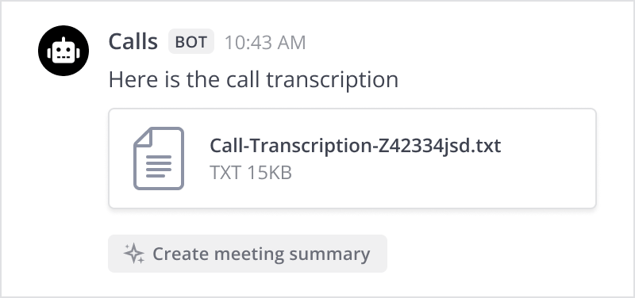

Chat with Copilot
=========================

.. include:: ../_static/badges/allplans-cloud-selfhosted.rst
  :start-after: :nosearch:

.. include:: /agents/docs/user_guide.md
  :parser: myst

Overcome information overload and streamline team communication and collaboration with Mattermost Copilot in your Mattermost instance. Copilot is a generative AI assistant with a flexible LLM backend that can be configured to meet your organization's needs. Copilot can summarize call recordings, threads, unread channel messages, and provide insights on any topic you're curious about.

.. tip::

  Looking for a Mattermost Copilot demo? `Try it yourself <https://mattermost.com/demo/copilot/>`_! Then, watch this `AI-Enhanced Collaboration on-demand webinar <https://mattermost.com/webinar/copilot-demo-ai-enhanced-collaboration/>`_ to learn how Copilot can enhance your mission-critical workflows.

.. include:: ../_static/badges/academy-copilot-calls.rst
  :start-after: :nosearch:

With Copilot you can perform the following tasks:

- Summarize your call and meeting recordings
- Turn long threads & unread channel messages into concise summaries
- Stay on top of your messages by identifying next steps, decisions, and unanswered questions
- Extract learnings and transform content into charts, resources, documentation, articles, and more
- Dig further into any topic by asking for insights
- Leverage voice dictation tools for hands-free communication with Copilot

.. note::

  Copilot must be :doc:`enabled and configured </configure/enable-copilot>` by a Mattermost system admin in the System Console before you can start using it.

Get started
------------

Begin with suggested prompts, or engage in a private thread with Copilot for a tailored experience. If you have follow-up questions or need further insights, simply ask! Copilot is designed to provide deeper understanding based on your inquiries.

Copilot remembers the context for follow-up questions and requests. Access all previous AI conversations by selecting **View chat history** from the Copilot panel.

.. tab:: Web/Desktop

  Select the **Copilot** icon in the apps sidebar to open the Copilot panel.

  .. image:: ../images/copilot-AI-RHS.webp
    :alt: Privately chat with Copilot inside Mattermost via the right-hand sidebar.
    :scale: 50

  If your Mattermost workspace has multiple Copilot bots, switch between them by selecting the bot name in the top right corner of the Copilot panel.

  .. image:: ../images/multi-llm-copilot.png
    :alt: Switch between multiple bots by selecting the bot name in the top right corner of the Copilot panel.
    :scale: 50

.. tab:: Mobile

  Start or open a direct message with the Copilot bot. If your administrator has configured multiple bots, switch between them by starting or opening each bot by name.

  .. image:: ../images/mobile-start-a-conversation-with-copilot.gif
    :alt: Start a new conversation with Copilot in the Mattermost mobile app.
    :scale: 50

Summarize Mattermost call recordings
------------------------------------

.. include:: ../_static/badges/ent-only.rst
  :start-after: :nosearch:

Leverage Mattermost Calls to turn meeting recordings into actionable summaries with a single click. Ensure key points are captured and shared easily, and enable easy sharing of meeting insights with your team and the broader organization, enhancing communication and productivity.

To summarize a Mattermost call recording:

1. :ref:`Start a call in Mattermost <collaborate/make-calls:start a call>`.
2. :ref:`Record the call <collaborate/make-calls:record a call>`.
3. Once the call ends, and the call recording and transcription is ready, select the **Create meeting summary** option located directly above the call recording.

4. The meeting summary is generated and shared as a direct message with the person who requested the meeting summary.

.. image:: ../images/copilot-Calls-Meeting-Summary.png
  :alt: Easily share the updates from your Mattermost Calls with your team and broader organization by turning recordings into detailed summaries at the click of a button.
  :scale: 50

Summarize threads & unread channel messages
-------------------------------------------

.. include:: ../_static/badges/ent-only.rst
  :start-after: :nosearch:

Accelerate decision-making and improve information flows with concise summaries of long discussions delivered to you directly through direct messages.
Ensure you stay on top of communications across threads, channels, and teams, by using Copilot to summarize new messages, identify next steps, and pinpoint unanswered questions.

.. tab:: Summarize threads

  To summarize Mattermost threads:

  1. Hover over the first message in any conversation thread, select the **AI Actions** |ai-actions-icon| icon, and select **Summarize Thread**.
  2. The thread summary is generated in the Copilot pane, and only you can view the summary.

.. tab:: Summarize unread channels

  To summarize unread Mattermost channels:

  1. In a channel with unread messages, scroll to the **New Messages** cutoff, select **Ask AI**, and then select **Summarize new messages**.
  2. The channel summary is generated in the Copilot pane, and only you can view the summary.

  When your system admin has :doc:`configured multiple bots </configure/enable-copilot>`, you can switch between them by selecting one from the drop-down menu.

  .. image:: ../images/Unread-Channel-Messages-Summarization-Updated-4-3.gif
    :alt: Quickly summarize new messages, find action opens, and seek out unanswered questions with your Copilot.

Bring Copilot into any conversation
------------------------------------

.. include:: ../_static/badges/ent-only.rst
  :start-after: :nosearch:

Invoke the power of AI by @mentioning Copilot bots by their username, such as ``@copilot``, in any thread to bring AI's capabilities to your conversation.

Copilot can help extract information quickly or transform discussions into charts, resources, documentation, articles, and more. Copilot can find action items and open questions in new messages. With the power of Mattermost integrations and interoperability, the potential to enhance your workflow is limitless.

.. image:: ../images/Contextual-Interrogation-Updated-4-3.gif
  :alt: Bring your AI into the conversation. @mention your Copilot directly within any thread and use the context to work faster and smarter.

Chat privately with Copilot
----------------------------

In addition to chatting with Copilot in the right pane, you can also chat privately with Copilot in direct message threads like you would any other Mattermost user.

Go hands-free with Copilot
~~~~~~~~~~~~~~~~~~~~~~~~~~~

Enable your Operating System's voice dictation or speech recognition tools for hands-free communication with Copilot.

.. tab:: Windows

  1. Start a direct message chat with Copilot, and ensure your cursor is in the Mattermost message text box.
  2. Ensure your microphone is connected and working.
  3. Activate Microsoft Voice Typing by pressing the **Windows** key + :kbd:`H` to open the voice typing tool.
  4. Start talking. Windows transforms your voice into text within Mattermost.

  See Microsoft's `Voice Typing documentation <https://support.microsoft.com/en-us/windows/use-voice-typing-to-talk-instead-of-type-on-your-pc-fec94565-c4bd-329d-e59a-af033fa5689f>`_ to learn more about working with Microsoft's Voice Typing tools.

.. tab:: MacOS

  1. Navigate to **System Settings > Keyboard > Dictation** and enable dictation.

    a. Ensure the Microphone source is set correctly.
    b. Specify the shortcut key you want to use to turn dictation on and off.

  2. Start a direct message chat with Copilot, and ensure your cursor is in the Mattermost message text box.
  3. Turn dictation on with the shortcut key you configured, and then start talking. MacOS transforms your voice into text within Mattermost.

  See Apple's `Voice control documentation <https://support.apple.com/en-us/102225>`_ to learn more about working with Apple's dictation tools.

.. tab:: Linux

  You'll need an open-source speech recognition tool for Linux, such as `Simon <https://simon.kde.org/>`_, `SpeechControl <https://wiki.ubuntu.com/SpeechControl>`_, or `Julius <https://github.com/julius-speech/julius>`_

  Once you have a speech recognition tool installed and working, enable it, start a direct message with Copilot, and start talking.

.. tip::

  When working with AI technology like Copilot, it's important to understand that the process is often iterative. Using an iterative approach ensures that you leverage Copilot to complement your work, leading to higher quality results. Here are some tips for being more effective with Copilot:

  - Avoid a one-and-done mindset: Don't assume that the first output from Copilot will be perfect. Instead, review and refine the content to ensure it meets your standards and needs.

    - Make corrections. Use voice dictation to say, "In the second section, remove mention of widgets. Add voice memos instead."
    - Make edits. For example, say "Remove Section 3" or "Switch Section 3 with Section 5"
    - Reduce unnecessary words. Say, "Remove unnecessary phrases to make this more concise."
    - Compact statements. Say, "Condense this into a single paragraph."

  - Use AI as a tool, not a replacement: Treat the outputs generated by Copilot as initial drafts. Copilot can help you enhance your writing and analysis, not replace your own skills and judgment. Think of Copilot as your very own high-tech assistant that can provide suggestions and help you brainstorm.
  - Iterate for quality: Go through multiple rounds of revisions to catch errors, improve clarity, and refine the content to better align with your goals. By continually reviewing and tweaking the outputs, you'll end up with more polished and accurate content, and maximize the value of Copilot by producing professional-grade results.

Learn more
-----------

Learn more about Copilot:

.. toctree::
  :maxdepth: 1
  :hidden:

   Copilot Context Management </collaborate/copilot-context-management>

* :doc:`Copilot Context Management </collaborate/copilot-context-management>` - Learn how Copilot manages LLM context and how to ensure data privacy.