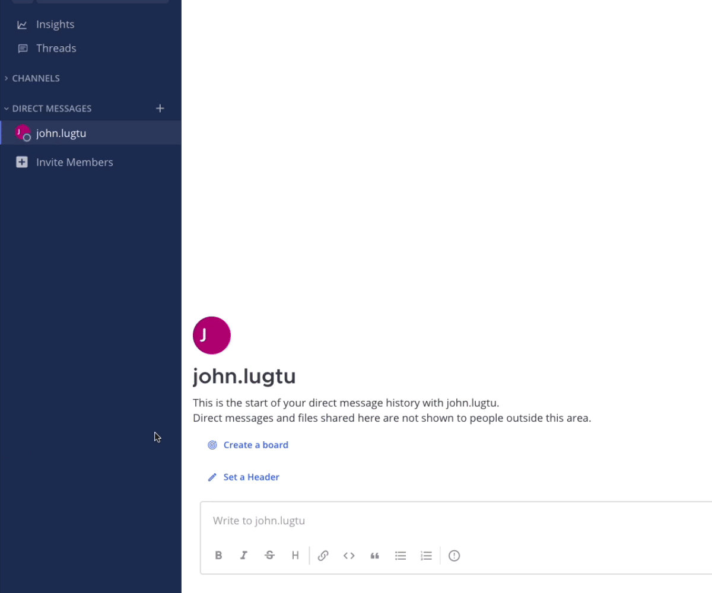

Collaborate within Microsoft Teams (Beta)
=========================================

.. include:: ../_static/badges/ent-cloud-selfhosted.rst
  :start-after: :nosearch:

.. |plus-icon| image:: ../images/plus_F0415.svg
  :alt: Open menus using the plus icon.
  :class: theme-icon

The :doc:`Mattermost for Microsoft Teams plugin </about/mattermost-for-microsoft-teams>` integration enables you to collaborate with Microsoft Teams users without leaving Mattermost.

.. include:: ../_static/badges/academy-msteams.rst
  :start-after: :nosearch:

Connect your Mattermost account to your Microsoft Teams account
---------------------------------------------------------------

To use the Microsoft Teams plugin, you must connect your Mattermost user account to Microsoft Teams. You only need to complete this step once.

1. Log into Mattermost using your credentials. 
2. When you log in, you’ll be prompted to enter your Microsoft Teams user information, including your Microsoft Teams email address and your Microsoft Teams password.

Mattermost will tell you when you’ve successfully connected your account. 

.. note::

  - If you're not prompted to connect your accounts, display the prompt in a browser window by running the Mattermost slash command ``/msteams connect`` in Mattermost. Follow the link to connect your accounts.
  - To change which accounts are linked, in Mattermost, run the slash command ``/msteams disconnect``, then connect your Mattermost account to a new Microsoft Teams account.
  - If a Microsoft Teams user account is removed from Microsoft Teams, the linked Mattermost user account is also removed the next time user accounts are synchronized.

Once you've connected your Mattermost account to your Microsoft Teams account, you’re ready to collaborate across your organization, regardless of which tool you’re in. You have two ways to collaborate:

- `Through direct and group messages <#collaborate-through-messages>`_
- `Through linked channels <#collaborate-through-linked-channels>`_

Collaborate through messages
----------------------------

You can start a direct or group message between Mattermost and Microsoft Teams users unless your Mattermost administrator has :ref:`disabled the ability to do so in the System Console <configure/plugins-configuration-settings:sync direct and group messages>`. 

- Within Mattermost select the |plus-icon| icon next to **Direct Messages** in the left pane, then search for the user you want to message. Your direct or group conversation is visible in both Mattermost and Microsoft Teams.

- Within Microsoft Teams, select **Chat > New chat**, and select the users you want to chat with. Your conversation is visible in both Mattermost and Microsoft Teams for all users who have connected their Mattermost user account to their Microsoft Teams user account.

Collaborate through linked channels
------------------------------------

Collaborating through linked channels starts with a Mattermost admin linking a Mattermost public or private channel to a Microsot Teams channel. 

Link channels
~~~~~~~~~~~~~~

As a Mattermost channel admin, team admin, or system admin, run the following slash command in the channel you want to link: ``/msteams link``, then select the Microsoft Teams team and channel identifiers you want to link the current Mattermost channel to. Mattermost notifies you when the linking is complete or if the channel is already linked.

.. tip:: 

  Want to change an existing link? Unlink a current Mattermost channel using the ``/msteams unlink`` slash command, then relink to a new Microsoft Teams channel as needed.

Collaborate with colleagues
~~~~~~~~~~~~~~~~~~~~~~~~~~~

You have many ways to collaborate with colleagues in linked channels using a web browser or the Mattermost desktop app, including:

- :doc:`Send messages </collaborate/send-messages>` and :doc:`reply to messages </collaborate/reply-to-messages>`
- :doc:`Attach files to messages </collaborate/share-files-in-messages>`
- :doc:`Express yourself with emojis and GIFs </collaborate/react-with-emojis-gifs>`
- :doc:`Share complex systems data and formatted code </collaborate/format-messages>`
- :ref:`Edit or delete sent messages <collaborate/send-messages:edit or delete messages>`

No matter which tool you use, your message is visible across both Mattermost and Microsoft Teams.
