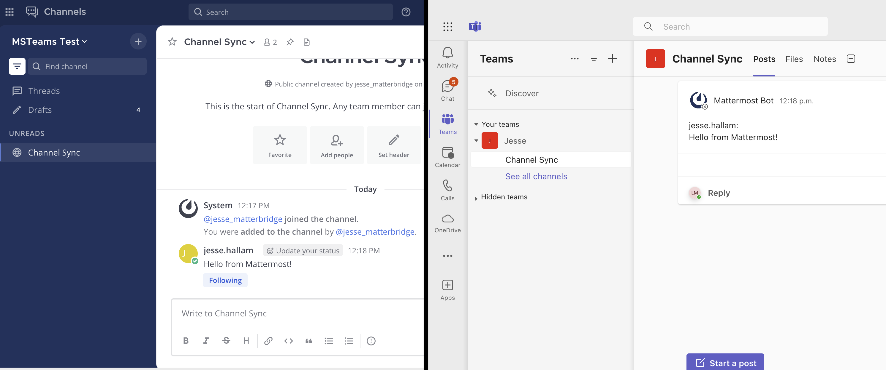

Collaborate within Microsoft Teams
~~~~~~~~~~~~~~~~~~~~~~~~~~~~~~~~~~

.. |plus-icon| image:: ../images/plus_F0415.svg
  :alt: Open menus using the plus icon.
  :class: theme-icon

The :doc:`Mattermost for Microsoft Teams plugin </about/mattermost-for-microsoft-teams>` enables you to break through siloes in a mixed Mattermost and Teams environment by forwarding real-time chat notifications from Teams to Mattermost.

.. include:: ../_static/badges/academy-msteams.rst
  :start-after: :nosearch:

Connect your Mattermost account to your Microsoft Teams account
^^^^^^^^^^^^^^^^^^^^^^^^^^^^^^^^^^^^^^^^^^^^^^^^^^^^^^^^^^^^^^^

To use the Microsoft Teams plugin, you must connect your Mattermost user account to your Microsoft Teams account. You only need to complete this step once.

1. Log into Mattermost using your credentials. 
2. In any channel, run the ``/msteams connect`` slash command, and select the resulting link.
3. Authenticate with Microsoft Teams using the email address matching your account in Mattermost.

Mattermost will confirm when your account is connected, and prompt you to enable notifications.

Enable notifications
^^^^^^^^^^^^^^^^^^^^

Once you've connected your Mattermost account to your Microsoft Teams account, Mattermost prompts you to enable notifications. When enabled, any messages you receive in a chat or group chat in Microsoft Teams will be appear in Mattermost as a notification, with a link to open the chat in Microsoft Teams and continue the conversation.

.. note::
  Your system administrator must :ref:`enable support for notifications <configure/plugins-configuration-settings:sync notifications>`. 

.. image:: ../images/microsoft-teams-chat-notifications.png
   :alt: An example of a chat message notification.

Link one or more channels (Beta)
^^^^^^^^^^^^^^^^^^^^^^^^^^^^^^^^

In addition to receiving notifications for chats and group chats, you can also link a channel in Mattermost to a channel in Microsoft Teams. Messages sent from one platform will be sent to the other using the connected bot account.

.. note::
  - Your system administrator must :ref:`enable support for linked channels <configure/plugins-configuration-settings:sync linked channels>`. 
  - This feature remains in beta and may change or be deprecated in the future.

Mattermost Slash commands
^^^^^^^^^^^^^^^^^^^^^^^^^

You can run the following Mattermost slash commands by typing the commands into the Mattermost message text box, and selecting **Send**:

- ``/msteams connect``: Connect your Mattermost account to Microsoft Teams account.
- ``/msteams disconnect``: Disconnect your Mattermost account from Microsoft Teams account.
- ``/msteams status``: Show your current connection status.
- ``/msteams notifications``: Manage and show your current notifications settings.
- ``/msteams link``: Link the currently active Mattermost channel with an Microsoft Teams channel. You must be a Mattermost channel admins to use this slash command, and you must have your Mattermost account connected with Microsoft Teams. This command takes two arguments: ``Microsoft Teams team ID`` and ``channel ID``, which you can get from command autocomplete.
- ``/msteams unlink``: Unlink the currently active Mattermost channel with the Microsoft Teams channel. You must be a Mattermost channel admin to run this slash command, but you don't need to have your Mattermost account connected to Microsoft Teams.
- ``/msteams show``: Show the link of the currently active Mattermost channel, including the team and channel name in Microsoft Teams to which the Mattermost channel is linked.
