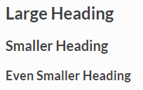
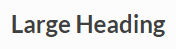

Format messages
===============

.. include:: ../_static/badges/allplans-cloud-selfhosted.rst
  :start-after: :nosearch:

.. |bold-icon| image:: ../images/format-bold_F0264.svg
  :alt: Bold message text using the Bold icon in the message formatting toolbar.

.. |italics-icon| image:: ../images/format-italic_F0277.svg
  :alt: Italicize message text using the Italic icon in the message formatting toolbar.


.. |headings-icon| image:: ../images/format-header_E81D.svg
  :alt: Format message text as a heading using the Heading icon in the message formatting toolbar. Headings 1 through 6 are supported.

.. |links-icon| image:: ../images/link-variant_F0339.svg
  :alt: Add a message link using the Link icon in the message formatting toolbar.

.. |attachments-icon| image:: ../images/paperclip_F03E2.svg
  :alt: Add a message attachment using the Upload files icon in the message formatting toolbar.

.. |numbered-icon| image:: ../images/format-list-numbered_F027B.svg
  :alt: Format message text as a numbered list using the Numbered list icon in the message formatting toolbar.

.. |bullets-icon| image:: ../images/format-list-bulleted_F0279.svg
  :alt: Format message text as a bulleted list using the Bulleted list icon in the message formatting toolbar.

.. |quotes-icon| image:: ../images/format-quote-open_F0757.svg
  :alt: Format message text as a quotation using the Quote icon in the message formatting toolbar.

.. |code-icon| image:: ../images/code-tags_F0174.svg
  :alt: Format message text as code using the Code icon in the message formatting toolbar.

.. |emoji-icon| image:: ../images/emoticon-outline_F01F2.svg
  :alt: Add emojis or GIFs to message text using the Emoji/Gif picker icon in the message formatting toolbar.


.. |preview-icon| image:: ../images/eye-outline_F06D0.svg
  :alt: Review your message text formatting using the Show/Hide preview icon in the message formatting toolbar.

.. |settings-icon| image:: ../images/settings-outline_F08BB.svg
  :alt: Access and manage your Channels settings using the Gear icon.

.. |message-priority-icon| image:: ../images/Priority-Message-Icon.svg
  :alt: Mark a message as important or urgent using the Priority Message icon.

.. contents:: On this page
  :backlinks: top
  :local:
  :depth: 2

.. include:: ../_static/badges/academy-message-formatting.rst
  :start-after: :nosearch:

Use the messaging formatting toolbar
------------------------------------

From Mattermost v7.0, you can format your messages in Mattermost using the message formatting toolbar without having to specify any Markdown syntax.

.. image:: ../images/message-formatting-toolbar.gif
  :scale: 50
  :alt: The message formatting toolbar, available from Mattermost v7.0, doesn't require Markdown syntax, and makes formatting message text fast and easy.

The message formatting toolbar offers the following formatting options:

+-------------------------------------------------------------------+-------------------------+
| **Formatting option**                                             | **Icon**                | 
+===================================================================+=========================+
| `Bold, italicize, or strike out text <#use-markdown>`_            | |bold-icon|             |
|                                                                   | |italics-icon|          | 
|                                                                   | |strikeout-icon|        | 
+-------------------------------------------------------------------+-------------------------+
| Add `headings <#headings>`_, `links <#links>`_,                   | |headings-icon|         |
| or attachments                                                    | |links-icon|            | 
|                                                                   | |attachments-icon|      |
+-------------------------------------------------------------------+-------------------------+
| Format a numbered list, a bulleted list, quoted text, or          | |numbered-icon|         |
| text as code                                                      | |bullets-icon|          |
|                                                                   | |quotes-icon|           |
|                                                                   | |code-icon|             |
+-------------------------------------------------------------------+-------------------------+
| `Add emojis or GIFs </collaborate/react-with-emojis-gifs.html>`__ | |emoji-icon|            |
+-------------------------------------------------------------------+-------------------------+
| `Set message priority </collaborate/message-priority.html>`__     | |message-priority-icon| |
+-------------------------------------------------------------------+-------------------------+

Review how your message formatting will look when the message is sent by selecting the **Show/Hide Preview** |preview-icon| icon. Return to your draft message by selecting the icon again.

.. tip::

  - Hide the formatting options by selecting the **Show/Hide Formatting** |hide-formatting-icon| icon. Select the icon again to show the formatting options. 
  - You can control whether post formatting is rendered within the message formatting editor. When disabled, raw text is shown. See the `Channels customization </preferences/manage-advanced-options>`__ documentation for details. 
 
Use Markdown
-------------

You can also format your messages in Mattermost using Markdown to control `text styling <#text-style>`__, `links <#links>`__, `headings <#headings>`__, `lists <#lists>`__, `code blocks <#code-blocks>`__, `in-line code <#in-line-code>`__, `in-line images <#in-line-images>`__, `horizontal lines <#horizontal-lines>`__, `block quotes <#block-quotes>`__, `tables <#tables>`__, and `math formulas <#math-formulas>`__. Markdown makes it easy to format messages: type a message as you normally would, then use formatting syntax to render the message a specific way. For a guide to using Markdown in Mattermost, `see this blog post <https://mattermost.com/blog/laymans-guide-to-markdown-on-mattermost/>`_.

.. image:: ../images/messagesTable1.png
   :alt: Formatting markdown controls the look and feel of text messages.

Text style
~~~~~~~~~~

You can use either ``_`` or ``*`` around a word or phrase to make it italic, or ``__`` or ``**`` around a word or phrase to make it bold. 

.. tip::
    
    Common formatting keyboard shortcuts are supported. Bold text by pressing :kbd:`Ctrl` :kbd:`B` on Windows and Linux, or :kbd:`⌘` :kbd:`B` on Mac. Italicize text by pressing :kbd:`Ctrl` :kbd:`I` on Windows or Linux, or :kbd:`⌘` :kbd:`I` on Mac.

* ``*italics*`` (or ``_italics_``) renders as *italics*
* ``**bold**`` renders as **bold**
* ``***bold-italic***`` renders as |bold_italics|
* ``~~strikethrough~~`` renders as |strikethrough|

.. |bold_italics| image:: ../images/bold_italics.png
  :width: 100px
  :alt: Bold Italics
  
.. |strikethrough| image:: ../images/strikethrough.png
  :width: 100px
  :alt: Strike Through

Links
~~~~~

.. tip::

  Format selected message text as a link by pressing :kbd:`Ctrl` :kbd:`K` on Windows and Linux, or by pressing :kbd:`⌘` :kbd:`K` on Mac.

Channel links
^^^^^^^^^^^^^

Create a link to a public channel in a message by typing ``~`` followed by the channel name (e.g. ``~roadmap``). Channel members see private channel names returned.

Labeled links
^^^^^^^^^^^^^

Create labeled links by putting the desired text in square brackets ``[ ]`` and the associated link in round brackets ``( )``.

``[Check out Mattermost!](https://about.mattermost.com/)``

Renders as: `Check out Mattermost! <https://about.mattermost.com/>`__

Headings
~~~~~~~~

Make a heading by typing ``#`` and a space before your title. For smaller headings, use more ``#``'s.

.. code-block:: none

  ## Large Heading
  ### Smaller Heading
  #### Even Smaller Heading

Renders as:



Alternatively, you can underline the text using equal signs ``===`` or hyphens ``---`` to create headings.

.. code-block:: none

  Large Heading
  -------------

Renders as:



Lists
~~~~~

Create a list by using asterisks ``*``, hyphens ``-``, and/or plus signs ``+`` interchangeably as bullets. Indent bullet points by adding two spaces in front each one.

.. code-block:: none

  * item one
  - item two
    + item two sub-point

Renders as:

* item one
* item two

  * item two sub-point

Make an ordered list by using numbers instead:

.. code-block:: none

  1. Item one
  1. Item two
  1. item three

Renders as:

#. Item one
#. Item two
#. Item three

You can also start a list at any number:

.. code-block:: none

  4. The first list number is 4.
  1. The second list number is 5.
  1. The third list number is 6.

Renders as:

4. The first list number is 4.
5. The second list number is 5.
6. The third list number is 6.

Make a task list by including square brackets ``[ ]``. Mark a task as complete by adding an ``x``.

.. code-block:: none

  - [ ] Item one
  - [ ] Item two
  - [x] Completed item

Renders as:

.. image:: ../images/checklist.png
   :alt: List

Code blocks
~~~~~~~~~~~

Creating a fixed-width code block is recommended for pasting multi-line blocks of code or other text output because it's easier to read with fixed-width font alignment. Examples include block text snippets, ASCII tables, and log files.

This can be accomplished by placing three backticks ``````` on the line directly above and directly below your code:

.. code-block:: none

  ```
  this is my
  code block
  ```

.. tip::

  Type three backticks ```````, press :kbd:`Shift` :kbd:`Enter` on Windows or Linux, or :kbd:`⇧` :kbd:`↵` on Mac, ``<type_your_code>``, press  :kbd:`Shift` :kbd:`Enter` on Windows or Linux, or :kbd:`⇧` :kbd:`↵` on Mac again, then type three more backticks ```````.


Or by indenting each line by four spaces:

.. code-block:: none

      this is my
      code block

  ^^^^ 4x spaces

**Syntax highlighting**

To add syntax highlighting, type the language to be highlighted after the ``````` at the beginning of the code block. Mattermost also offers four different code themes (GitHub, Solarized Dark, Solarized Light, and Monokai) that can be changed in **Settings > Display > Theme > Custom Theme > Center Channel Styles**.

Supported languages and their aliases include:

.. include:: syntax-highlighting.rst
  :start-after: :nosearch:

Example:

.. code-block:: none

  ``` go
  package main
  import "fmt"
  func main() {
      fmt.Println("Hello, 世界")
  }
  ```
Renders as:

**GitHub Theme**

.. image:: ../images/syntax-highlighting-github.png
   :alt: Syntax Highlighting in GitHub

**Solarized Dark Theme**

.. image:: ../images/syntax-highlighting-sol-dark.png
   :alt: Syntax Highlighting Dark

**Solarized Light Theme**

.. image:: ../images/syntax-highlighting-sol-light.png
   :alt: Syntax Highlighting Light

**Monokai Theme**

.. image:: ../images/syntax-highlighting-monokai.png
   :alt: Syntax Highlighting Monokai

In-line code
~~~~~~~~~~~~

Create in-line monospaced code text by surrounding it with backticks `````. Don't use single quotes ``'``.

.. code-block:: none

  `monospace`

Renders as: ``monospace``.

In-line images
~~~~~~~~~~~~~~

In-line images are images added within lines of text. You can control whether all in-line images over 100px in height are automatically collapsed or expanded in messages by setting a `user preference </preferences/manage-your-display-options>`__, or by using the ``/collapse`` and ``/expand`` slash commands.

To add in-line images to text, use an exclamation mark ``!`` followed by the ``alt text`` in square brackets ``[ ]``, then the ``image URL`` in round brackets ``( )``. You can add hover text after the link by placing the text in quotes ``" "``.

Example:

.. code-block:: none

  

If the height of the original image is more than 500 pixels, Mattermost sets the image height at 500 pixels and adjusts the width to maintain the original aspect ratio.

You can set the width and height of the displayed image after the URL of the image by using an equals sign ``=`` followed by values for both width and height ``##x##``. If you set only the width, Mattermost adjusts the height to maintain the original aspect ratio.

.. warning::
  The native apps do not support fixed width and height and will display the full-size image.

Examples:

.. code-block:: none

  .. |mattermost-icon-76x76| image:: ../images/icon-76x76.png
  .. |mattermost-icon-50x76| image:: ../images/icon-50x76.png

In-line image with hover text
^^^^^^^^^^^^^^^^^^^^^^^^^^^^^

.. code-block:: none

  

Renders as:

  .. image:: ../images/icon-76x76.png
    :alt: Mattermost

In-line image with link
^^^^^^^^^^^^^^^^^^^^^^^

.. note::
  An extra set of square brackets ``[ ]`` is required around the alt text, and round brackets ``( )`` are required around the image link.

.. code-block:: none

  [](https://github.com/mattermost/mattermost)

Renders as:

  .. image:: ../images/icon-76x76.png
    :target: https://github.com/mattermost/mattermost
   
In-line image displayed with fixed width and height
^^^^^^^^^^^^^^^^^^^^^^^^^^^^^^^^^^^^^^^^^^^^^^^^^^^

Example: An in-line image that's 50 pixels wide and 76 pixels high.

.. code-block:: none

  

Renders as:

  .. image:: ../images/icon-50x76.png
    :alt: Mattermost
    :name: Mattermost Icon 

In-line image displayed with fixed width
^^^^^^^^^^^^^^^^^^^^^^^^^^^^^^^^^^^^^^^^

Example: An in-line image that's 50 pixels wide where the system adjusts the height to maintain the original aspect ratio.

.. code-block:: none

  

Renders as:

  .. image:: ../images/icon-76x76.png
    :alt: Mattermost
    :width: 50
 
Horizontal lines
~~~~~~~~~~~~~~~~

Create a line by using three ``*``, ``_``, or ``-``.

``***``

Renders as:

---------------------------------------------------------------------------

Block quotes
~~~~~~~~~~~~

Create block quotes using ``>``.

``> block quotes`` renders as:

.. image:: ../images/blockQuotes.png

Tables
~~~~~~

Create a table by placing a dashed line ``---`` under the header row, then separating each column with using pipes ``|``. The columns don’t need to line up exactly. Choose how to align table columns by including colons ``:`` within the header row.

.. code-block:: none

  | Left-Aligned  | Center Aligned  | Right Aligned |
  | :------------ |:---------------:| -----:|
  | Left column 1 | this text       |  $100 |
  | Left column 2 | is              |   $10 |
  | Left column 3 | centered        |    $1 |

Renders as:


Math Formulas
~~~~~~~~~~~~~

.. tabs::

  .. tab:: Using Inline LaTeX

    You can create formulas that display inline using LaTeX. Use the dollar sign ($) symbol at the beginning and end of each formula.

    .. note::

      This feature is `disabled by default </configure/configuration-settings.html#enable-inline-latex-rendering>`__. Contact your system admin to enable this setting in **System Console > Site Configuration > Posts** to use this feature.

    .. code-block:: none

      $X_k = \sum_{n=0}^{2N-1} x_n \cos \left[\frac{\pi}{N} \left(n+\frac{1}{2}+\frac{N}{2}\right) \left(k+\frac{1}{2}\right) \right]$
  
    Renders as:

    .. image:: ../images/latex-inline.png
      :alt: An inline LaTeX math equation sample.
      
  .. tab:: Using LaTeX in Code Blocks

    Create formulas as code blocks by using LaTeX in a ``latex`` `code blocks <#code-blocks>`__. 

    .. note::

      This feature is `disabled by default </configure/configuration-settings.html#enable-latex-code-block-rendering>`__. Contact your system admin to enable this setting in **System Console > Site Configuration > Posts** to use this feature.

    .. code-block:: none

      ```latex
      X_k = \sum_{n=0}^{2N-1} x_n \cos \left[\frac{\pi}{N} \left(n+\frac{1}{2}+\frac{N}{2}\right) \left(k+\frac{1}{2}\right) \right]
      ```

    Renders as:

    .. image:: ../images/latex-codeblock.png
      :alt: A LaTeX code block math equation sample.
