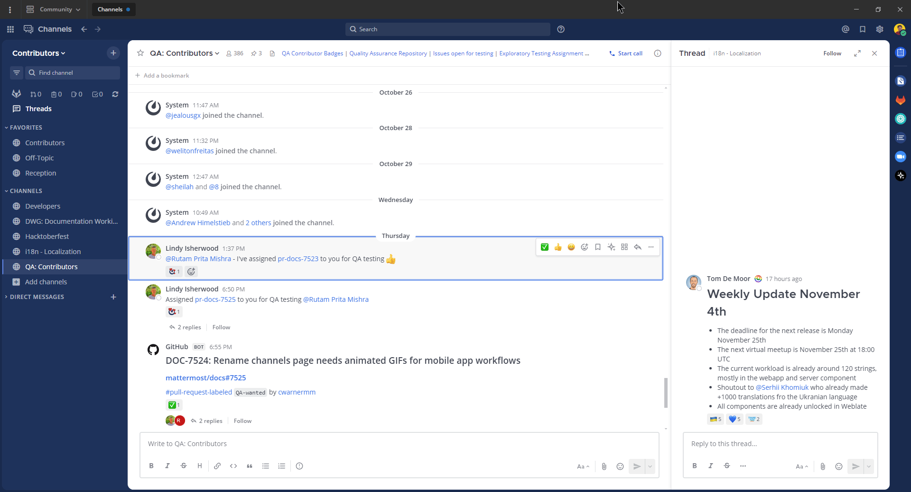
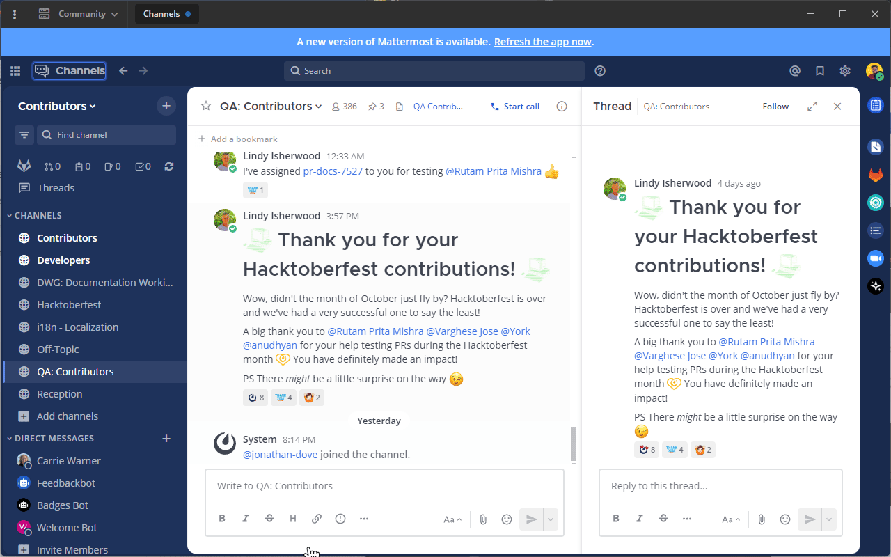

Keyboard accessibility
=======================

.. include:: ../_static/badges/allplans-cloud-selfhosted.rst
  :start-after: :nosearch:

Navigational keyboard shortcuts help you use Mattermost in a web browser or the desktop app without needing a mouse. Below is a list of supported accessibility shortcuts. Elements in focus have a colored outline, as shown here:

.. image:: ../images/focus.png
  :alt: Navigate Mattermost using a keyboard.

+----------------------------------------------+----------------------------------------------------------------------------------+
| Keyboard shortcut                            | Description                                                                      |
+==============================================+==================================================================================+
|| Desktop App: :kbd:`F6`                      || Move focus to the next section                                                  |
|| Browser: :kbd:`Ctrl` :kbd:`F6`              ||                                                                                 |
+----------------------------------------------+----------------------------------------------------------------------------------+
|| Desktop App: :kbd:`Shift` :kbd:`F6`         || Move focus to the previous section                                              |
|| Browser: :kbd:`Ctrl` :kbd:`Shift` :kbd:`F6` |                                                                                  |
+----------------------------------------------+----------------------------------------------------------------------------------+
| :kbd:`Tab`                                   | Move focus to the next element                                                   |
+----------------------------------------------+----------------------------------------------------------------------------------+
| :kbd:`Shift` :kbd:`Tab`                      | Move focus to the previous element                                               |
+----------------------------------------------+----------------------------------------------------------------------------------+
| :kbd:`↑` or :kbd:`↓`                         | Move focus between messages in the post list or sections in the channel sidebar  |
+----------------------------------------------+----------------------------------------------------------------------------------+
| :kbd:`Enter`                                 | Take action on the focused element                                               |
+----------------------------------------------+----------------------------------------------------------------------------------+

Region navigation
------------------

Mattermost has eight regions that can be focused for navigation. Use :kbd:`F6` in the desktop app, or use :kbd:`Ctrl` :kbd:`F6` in a browser repeatedly to move focus and loop through the regions in this order:

1. Message list region
2. Message input region
3. Right-hand side message list region
4. Right-hand side message input region
5. Team menu region
6. Channel sidebar region
7. Channel header region
8. Search

.. image:: ../images/navigation.gif
  :alt: Navigate through the sections of Mattermost using a keyboard.

Message navigation
------------------

When the message list region is focused, use the  :kbd:`↑` or :kbd:`↓` arrow keys to navigate through messages and reply threads. Press :kbd:`Tab` to navigate through message actions.

Message composition
~~~~~~~~~~~~~~~~~~~

Mattermost is compatible with most popular screen readers, such as `Apple VoiceOver <https://www.apple.com/ca/accessibility/vision/>`__ or `JAWS for Windows <https://www.freedomscientific.com/products/software/jaws/>`__. A custom readout is composed for each message by combining the message elements and reading them together in full sentences. Message elements will read in the following order:

1. Header: Author, timestamp, message type (i.e. parent post or reply)
2. Main Content: The message content typed by the author
3. Attachments: The number of attachments (if applicable)
4. Emoji Reactions: The number of unique emoji reactions (if applicable)
5. Saves/Pins: If a message is saved or pinned (if applicable)

For example, a message read by a screen reader may sound like the following:

.. code-block:: none
  
  Eric Sethna at 12:57pm Thursday June 13th wrote a reply "Thanks for the review", 3 attachments, 2 reactions, message is saved and pinned.

Channel sidebar navigation
--------------------------

When the channel sidebar region is focused, use the :kbd:`↑` or :kbd:`↓` arrow keys to focus individual sidebar sections, such as Insights, Threads, Favorites, custom categories, public channels, private channels, and direct messages. Press :kbd:`Tab` to navigate through channels or other buttons within a sidebar section.

