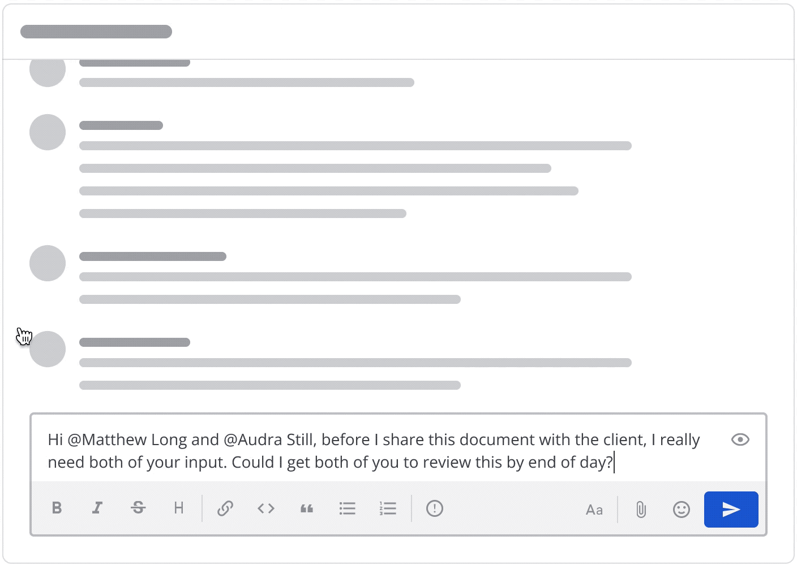
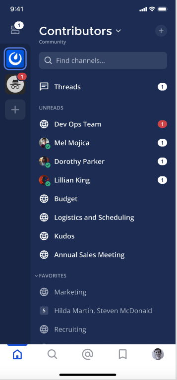

Set message priority (beta)
===========================

.. include:: ../_static/badges/allplans-cloud-selfhosted.rst
  :start-after: :nosearch:

From Mattermost v7.7 and version v2.4 of the Mattermost mobile app, you can add a message priority label to root messages to make important messages requiring timely action or response more visible and less likely to be overlooked.

To set the priority of a new root message:

1. Select the **Message Priority** |priority-icon| icon in the message formatting toolbar. Select from Standard, Important, or Urgent.
2. Select the priority for the message. Messages have a standard priority by default.
3. Select **Apply**

When you send a priority message, the priority label displays next to your name in the channel, as well as the **Threads** view when others reply to the thread. 

Send persistent notifications
-----------------------------

.. include:: ../_static/badges/ent-pro-only.rst
  :start-after: :nosearch:

From Mattermost v8.0, when you add an urgent priority label, and your message @mentions at least one other user, `Mattermost Professional or Enterprise <https://mattermost.com/pricing>`__ customers can enable persistent notifications which notify recipients at regular intervals and for a set amount of time until the recipient acknowledges, reacts, or replies to the message.

To enable persistent notifications for a message:

1. Compose a root message with at least one @mention.
2. Select the **Message Priority** |priority-icon| icon in the message formatting toolbar. 
3. Select **Urgent**.
4. Select **Send persistent notifications**.
5. Select **Apply**.

.. note:: 

  - @channel, @all and @here mentions don't send persistent notifications.
  - System admins can customize the maximum number of @mentions permitted, how frequently and how many persistent notifications are sent, as well as disable persistent notifications for all users, if preferred. By default, users are notified every 5 minutes for a total of 30 minutes. See the :ref:`configuration <configure/site-configuration-settings:persistent notifications>` documentation for details.

Receive persistent notifications
--------------------------------

You must have desktop and/or mobile push notifications enabled to receive persistent notifications. How you're notified depends on your :doc:`notifications preferences </preferences/manage-your-notifications>` for desktop and mobile push notifications. You won't be notified when your availability is set to **Do Not Disturb**, or if you're :ref:`Out of Office <preferences/set-your-status-availability:set your availability>`. Learn more about customizing how you receive notifications by visiting the :ref:`get notified <preferences/manage-your-notifications:get notified>` documentation.

Urgent messages show a red mention badge which remains visibible until you view the message. Selecting the **Acknowledge** icon (when present) won't impact the urgent red mention badge.

To stop receiving persistent notifications, you can reply to the thread, select the **Acknowlege** icon (when present), or react to the thread with an emoji. Persistent notifications also stop if the original message is deleted, or if the maximum number of persistent notifications are sent.

Request acknowledgements
------------------------

.. include:: ../_static/badges/ent-pro-only.rst
  :start-after: :nosearch:

`Mattermost Professional or Enterprise <https://mattermost.com/pricing>`__ customers can additionally request that recipients actively acknowledge the message to track that messages have been seen and actioned. By default, marking a message as Urgent priority automatically requests an acknowledgement. 

When you request acknowlegement of a message, an **Acknowledge** |acknowledge-button| button is added below the sent message. You can mark message as acknowledged by selecting the button, and you can hover over the **Acknowledged** |acknowledged-icon| icon to review who has acknowledged the message.

.. tip::

    - When you have push notifications enabled on mobile, you'll be notified every five minutes until you acknowledge or reply to the message.
    - After acknowledging a message, you have up to five minutes to change your mind. Select the **Acknowledged** |acknowledged-icon| button again to remove your name from the list of acknowledged users.

