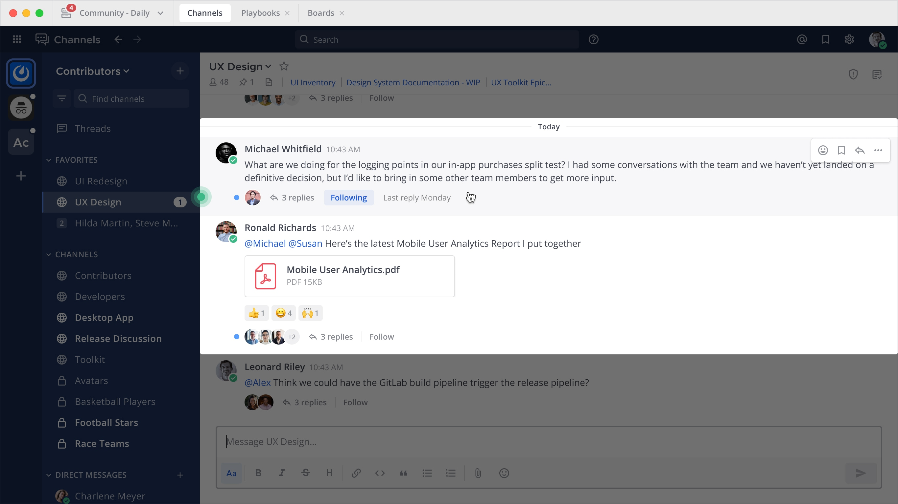
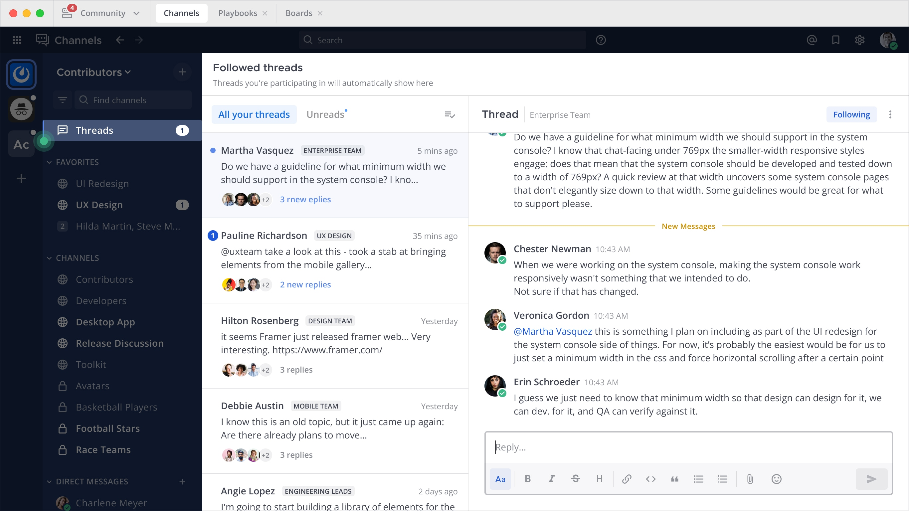

Organize conversations using Collapsed Reply Threads
====================================================

.. include:: ../_static/badges/allplans-cloud-selfhosted.rst
  :start-after: :nosearch:

.. |more-actions-icon| image:: ../images/dots-horizontal_F01D8.svg
  :alt: Access additional message actions using the More Actions icon.
  :class: theme-icon

Threads are a key part of the messaging experience in Mattermost. They're used to organize conversations and enable users to discuss topics without adding noise to channels or direct messages.

Collapsed Reply Threads offers an enhanced experience for users communicating in threads and replying to messages that includes a unified threads inbox to read all conversations in one view. Threads improve the ability to process channel content, find, follow, and resume conversations more easily, and keep threaded conversations focused.

.. image:: ../images/collapsed-reply-threads.gif
  :alt: Organize conversations using Collapsed Reply Threads.

Start or reply to threads
-------------------------

`Replies to messages </collaborate/reply-to-messages.html>`__ are collapsed under the first message of a thread. 

.. tip:: 
    
    - When replying to a thread in a web browser or the desktop app, you can also select the reply count if a thread already exists, and you can select anywhere on a message in a channel in the center pane to view it or reply to it.
    - In channels, a dot next to the thread participants indicates there are unread replies. You'll only see unreads for threads you're following.

Follow threads and messages
---------------------------

You'll automatically follow every thread you participate or are mentioned in. You can manually follow particular messages and threads so that any reply activity triggers `notifications </preferences/manage-your-notifications.html>`__. Follow or unfollow any thread, at any time.

.. image:: ../images/crt-following-thread.png
   :alt: Follow threads to stay updated on replies to messages.

.. tab:: Web/Desktop

  Toggle the thread’s **Follow/Following** indicator, or select **Follow thread** from the **More Actions** |more-actions-icon| icon. 
  
  **Unfollow threads**
  
  If you’re no longer interested in a or message thread, unfollow it to stop receiving notifications. Viewing a thread without responding to it doesn’t automatically follow that thread.

  .. image:: ../images/crt-following-thread.jpg
    :alt: Follow, unfollow, and mark threads as unread from the More Actions icon.

.. tab:: Mobile

  Long-press on a message to access message options, then tap **Follow Thread**. 
  
  **Unfollow threads**
  
  If you’re no longer interested in a or message thread, unfollow it to stop receiving notifications. Viewing a thread without responding to it doesn’t automatically follow that thread.

.. tip::
  - Follow messages with no replies from the **More Actions** |more-actions-icon| icon to be notified if someone replies to the message later based on your notification preferences.
  - You can also use keyboard arrow keys to navigate threads in the **Threads** view.

View all threads
----------------

Select **Threads** at the top of the channel sidebar to see all your followed threads on the currently selected team. Threads with the most recent replies display at the top of the list. 

Select **Unreads** to filter your followed threads by only those with unread replies.

Enable Collapsed Reply Threads
------------------------------

See our `configuration settings </configure/configuration-settings.html#collapsed-reply-threads>`__ documentation for details on configuring the default availability of collapsed reply threads. From Mattermost v7.0, Collapsed Reply Threads are enabled by default for all new Mattermost deployments.

Depending on how your system admin has configured **Collapsed Reply Threads** for your workspace, it may already be enabled for you, or you may be able to `enable this feature for your account </preferences/manage-your-display-options.html#collapsed-reply-threads>`__ by going to **Settings > Display > Collapsed Reply Threads**.

Tutorial video
---------------

.. raw:: html

  

   

Known issues
------------

Collapsed Reply Threads was released as generally available in Mattermost v7.0, including significant server performance improvements and more flexible configuration options for system admins to enable the feature by default. We highly recommended `upgrading to Mattermost v7.0 </upgrade/upgrading-mattermost-server.html>`__ to take advantage of these configuration and performance enhancements.

Customers running Collapsed Reply Threads in beta on Mattermost v6.7 or earlier will likely experience bugs and unoptimized server performance. Learn more about the `beta release performance considerations <https://support.mattermost.com/hc/en-us/articles/4413183568276>`__ applicable only to Mattermost v5.37 through v6.7 deployments.

In particular, please be aware of these important known issues and risks:

  - When enabling Collapsed Reply Threads for the first time, you may see channels or threads you’ve seen before appear as unread. To resolve this, navigate to any unread channel, or select the **Mark all as read** button in the **Threads** view to mark all of your threads as read.
  - You may experience lag in your desktop or web client if you're following many threads or opening threads with many replies.
  - Server performance for instances with many users and posts may be impacted. 
  - You should expect to see more unread channels and notifications on your mobile device than you'll see on your desktop instance of Mattermost. This is expected when running a mobile app release older than v1.46.
