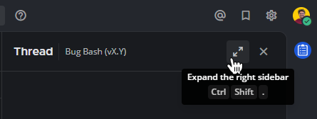

Reply to messages
=================

.. include:: ../_static/badges/allplans-cloud-selfhosted.rst
  :start-after: :nosearch:

.. tab:: Web/Desktop

  Reply to messages by selecting the **Reply** |reply-arrow| icon next to the message text. 

  .. |reply-arrow| image:: ../images/reply-outline_F0F20.svg
    :alt: Reply icon.
    :class: theme-icon

  .. image:: ../images/reply-to-message.png
    :alt: Reply to Mattermost messages

.. tab:: Mobile

  Tap on a message to reply to it, or long press and select **Reply**.

Depending on how the system admin has configured Mattermost, you may also be able to :ref:`edit and delete messages <collaborate/send-messages:edit or delete messages>` after you've sent them. Your system admin may also restrict messaging actions, such as editing or deleting messages, by configuring :doc:`advanced permissions </onboard/advanced-permissions>`, available in `Mattermost Enterprise and Professional subscription plans <https://mattermost.com/pricing>`__.

.. tip::

  It's easy to return to a message in progress with global message drafts. Find all of your draft messages in the **Drafts** view available at the top of the channel sidebar. See the :ref:`draft messages <collaborate/send-messages:draft messages>` documentation for details.

Organize conversations into threads
-----------------------------------

When you reply to messages, those replies are organized into a conversation thread. Threaded conversations are easy to follow and allow multiple parallel conversations to occur at the same time without confusion. 

Using Mattermost in a web browser or the desktop app, replies appear indented slightly in the center pane to indicate that they are child messages of a parent message, and selecting the reply link opens a sidebar in the right-hand sidebar in a web browser and the desktop app. To expand the right-hand sidebar to its full width, select the **Expand** icon with two arrows at the top of the sidebar.

To shrink the right-hand sidebar to its original width, select the same **Collapse** icon.

.. image:: ../images/collapse-sidebar.png
   :alt: Collapse the right-hand sidebar to its original width

Work with Collapsed Reply Threads
---------------------------------

Collapsed Reply Threads is generally available in Mattermost Cloud and from self-hosted Mattermost v7.0, and is enabled by default for all new Mattermost deployments. Collapsed Reply Threads offer a new way to organize conversations within channels. See our :doc:`Organizing Conversations using Collapsed Reply Threads </collaborate/organize-conversations>` documentation to learn more.