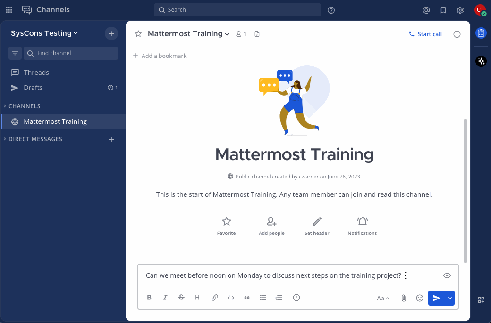

Schedule messages
==================

.. include:: ../_static/badges/allplans-cloud-selfhosted.rst
  :start-after: :nosearch:

There are times when you want to send a message, but you don't want it sent immediately. For example, it may be after working hours for the recipient. You can schedule messages to send at a date and time in the future.

From Mattermost v10.3, using Mattermost in a web browser or the desktop app, you can schedule messages to send in the future. Compose a message, then select the right side of the **Send** icon |send-icon| to schedule when the message will be sent.

.. tip::

    When scheduling a direct message, Mattermost displays both your local time and the recipient's local time.

Manage scheduled messages
-------------------------

Once you schedule a message to send in the future, that message is available within the **Drafts** view, under the **Scheduled** tab.

You can manage scheduled messages with the following actions:

- **Delete scheduled post**: Confirm that you want to delete the message.
- **Edit scheduled post**: Make changes to the draft inline before its sent.
- **Copy text**: Copy the draft text.
- **Reschedule message**: Change when the message should be sent.
- **Send now**: Confirm that you want to send the message immediately.

.. image:: ../images/manage-scheduled-message.png
    :alt: Once a message is scheduled, you can delete, edit, and reschedule it, copy the message text, or send it immediately.

Troubleshoot scheduled messages
-------------------------------

If a scheduled message fails to send, you'll be alerted with a banner at the top of the Mattermost screen. Scheduled messages may fail for the following reasons:

- You're no longer a member of the channel.
- The channel is archived.
- The channel is read-only.
- The Mattermost server didn't respond. Mattermost will try to send the message for up to 30 minutes.