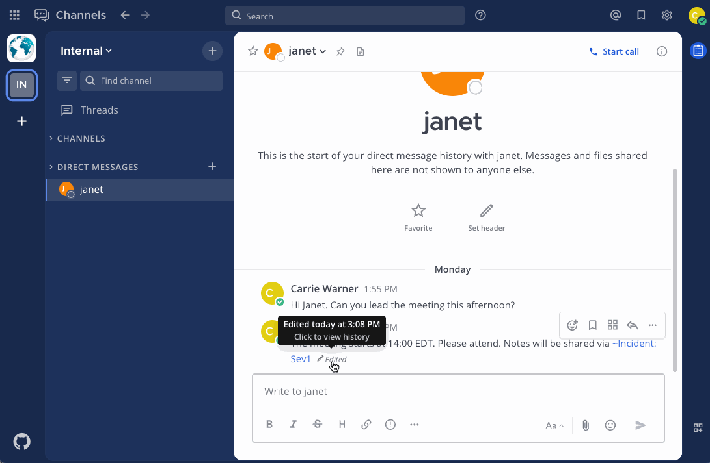

Send messages
=============

.. include:: ../_static/badges/allplans-cloud-selfhosted.rst
  :start-after: :nosearch:

.. |gear-icon| image:: ../images/settings-outline_F08BB.svg
  :alt: Select the Gear icon to open the Settings dialog.
  :class: theme-icon

.. |more-icon| image:: ../images/dots-horizontal_F01D8.svg
  :alt: Select the More icon to access additional message actions.
  :class: theme-icon

.. |send-icon| image:: ../images/send_F048A.svg
  :alt: Select the Send icon to post your message.
  :class: theme-icon

.. |restore-edit| image:: ../images/restore_F099B.svg
  :alt: Use the Restore icon to restore a previous version of an edited message.
  :class: theme-icon
  :width: 25

Enter a message in the text field, then select **Send** |send-icon| to send the message. You can include images and file attachments to your messages by:

- copying and pasting images.
- dragging-and-drop image files into the text field.
- selecting the **Attachment** |attachment| icon.

.. |attachment| image:: ../images/paperclip_F03E2.svg
  :alt: Use the Attachment icon to add images or files to your messages.
  :class: theme-icon

Compose a message by typing into the text box at the bottom of the Mattermost screen, then select the **Send** |send-icon| icon.

.. tab:: Web/Desktop

  You can also use a keyboard to send messages:
  
  - Press :kbd:`Enter` on Windows or Linux, or :kbd:`↵` on Mac. 
  - To create new text lines, press :kbd:`Shift` :kbd:`Enter` on Windows or Linux, or press :kbd:`⇧` :kbd:`↵` on Mac. 

  .. tip::

    If you find you're accidentally sending messages too soon, you can configure Mattermost to require :kbd:`Shift` :kbd:`Enter` on Windows or Linux, or press :kbd:`⇧` :kbd:`↵` on Mac to send all messages. Select the **gear** |gear-icon| icon to go to **Settings**, then select **Advanced > Send messages on CTRL+ENTER**.

.. tab:: Mobile

  Tap the **Smile** icon |smile-icon| to add emojis while composing your message.

.. tip::

  - When you send messages in a channel, depending on the :doc:`channel actions configured </collaborate/create-channels>`, specific words in the post can trigger a prompt to run a playbook. Access **Channel Actions** from the channel name drop-down menu in the center pane to see what automatic actions have been configured for the current channel.
  - Using a RTL plugin, Mattermost can automatically detect and display messages written using right-to-left scripts, such as Arabic, Hebrew, or Persian. Your system admin must install the `RTL Plugin <https://github.com/QueraTeam/mattermost-rtl>`__ to enable this functionality.
  - `Mattermost Enterprise or Professional <https://mattermost.com/pricing>`__ customers can `edit or delete messages <#edit-or-delete-messages>`__ after sending them if the system admin hasn't restricted the ability to do so using :doc:`advanced permissions </onboard/advanced-permissions>`.
  
Draft messages
--------------

From Mattermost v7.7, when composing new messages, it's easy to return to a message in progress later. Draft messages are added to a **Drafts** view available at the top of the channel sidebar 

.. image:: ../images/Global-Drafts-Animated-GIF.gif
  :width: 700
  :alt: Global drafts makes it easy for you to find all messages in progress.

By default, message drafts are synchronized on the Mattermost server and are accessible everywhere you access Mattermost, including a web browser or the desktop app with mobile support coming in a future release. 

.. Tip::
  
  You can disable server-synchronized drafts and limit drafts to your current Mattermost client only by going to **Settings > Advanced > Allow message drafts to sync with the server**.
  
.. note::

  To disable global drafts, system admins can set the feature flag ``MM_FEATUREFLAGS_GLOBALDRAFTS`` to ``false`` to disable it server-wide. It can't be disabled on a per-user basis. The code is located `here <https://github.com/mattermost/mattermost/blob/master/server/public/model/feature_flags.go#L11>`_.

Edit messages
--------------

All users can edit their own sent messages, unless the system admin has :doc:`restricted the ability to do so </onboard/advanced-permissions>`.

1. Using Mattermost in a web browser or the desktop app, select the **More** |more-icon| icon next to a message that you've sent.

  .. image:: ../images/more-actions.png
     :alt: Select the More option to edit or delete a sent message.

2. Select **Edit** to edit your own messages. Editing a message won't trigger new :doc:`@mention notifications </collaborate/mention-people>`, or :doc:`desktop notifications </preferences/manage-your-notifications>`.

Restore a previous version of an edited message
-----------------------------------------------

From Mattermost v7.9, you can view the edit history of your edited messages, and restore a previous version of an edited message. Message recipients can't see your message edit history, and restoring a previous message version won't trigger new :doc:`@mention notifications </collaborate/mention-people>`.

1. Select the word *Edited* next to your message. 
2. In the right pane, you'll see all previous versions of the message.
3. Select the **Restore** |restore-edit| icon next to the version you want to restore.
4. Select **Confirm**.

Delete messages
----------------

All users can delete their own sent messages, unless the system admin has :doc:`restricted the ability to do so </onboard/advanced-permissions>`.

1. Using Mattermost in a web browser or the desktop app, select the **More** |more-icon| icon next to a message that you want to delete.
2. Select **Delete** to delete your own messages. Select **Delete** again to confirm.

Do more with your messages
--------------------------

Express yourself your way using the following message features:

- :doc:`Set message priority </collaborate/message-priority>`
- :doc:`Format messages </collaborate/format-messages>`
- :doc:`Mention people </collaborate/mention-people>`
- :doc:`Share files </collaborate/share-files-in-messages>`
- :doc:`Share links to channels and messages </collaborate/share-links>`
