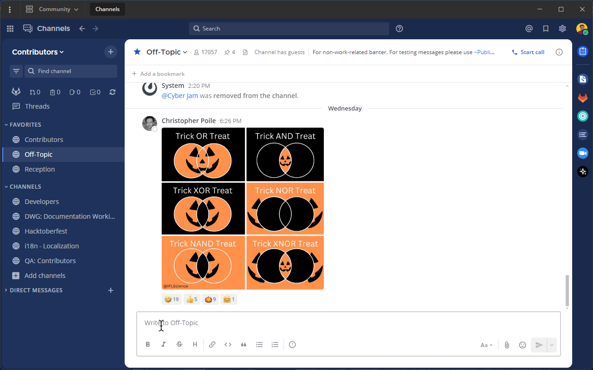

Send messages
=============

.. include:: ../_static/badges/allplans-cloud-selfhosted.rst
  :start-after: :nosearch:

.. |gear-icon| image:: ../images/settings-outline_F08BB.svg
  :alt: Select the Gear icon to open the Settings dialog.
  :class: theme-icon

.. |more-icon| image:: ../images/dots-horizontal_F01D8.svg
  :alt: Select the More icon to access additional message actions.
  :class: theme-icon

.. |send-icon| image:: ../images/send_F048A.svg
  :alt: Select the Send icon to post your message.
  :class: theme-icon

Enter a message in the text field, then select **Send** |send-icon| to send the message. You can include images and file attachments to your messages by:

- copying and pasting images.
- dragging-and-drop image files into the text field.
- selecting the **Attachment** |attachment| icon.

Compose a message by typing into the text box at the bottom of the Mattermost screen, then select the **Send** |send-icon| icon.

.. tab:: Web/Desktop

  You can also use a keyboard to send messages:
  
  - Press :kbd:`Enter` on Windows or Linux, or :kbd:`↵` on Mac. 
  - To create new text lines, press :kbd:`Shift` :kbd:`Enter` on Windows or Linux, or press :kbd:`⇧` :kbd:`↵` on Mac. 

  .. tip::

    If you find you're accidentally sending messages too soon, you can configure Mattermost to require :kbd:`Shift` :kbd:`Enter` on Windows or Linux, or press :kbd:`⇧` :kbd:`↵` on Mac to send all messages. Select the **gear** |gear-icon| icon to go to **Settings**, then select **Advanced > Send messages on CTRL+ENTER**.

.. tab:: Mobile

  Tap the **Smile** icon |smile-icon| to add emojis while composing your message.

.. tip::
  
  - When you send messages in a channel, depending on the `channel actions configured </collaborate/create-channels.html>`__, specific words in the post can trigger a prompt to run a playbook. Access **Channel Actions** from the channel name drop-down menu in the center pane to see what automatic actions have been configured for the current channel.
  - Using a RTL plugin, Mattermost can automatically detect and display messages written using right-to-left scripts, such as Arabic, Hebrew, or Persian. Your system admin must install the `RTL Plugin <https://github.com/QueraTeam/mattermost-rtl>`__ to enable this functionality.
  - `Mattermost Professional or Enterprise <https://mattermost.com/pricing>`__ customers can `edit or delete messages <#edit-or-delete-messages>`__ after sending them if the system admin hasn't restricted the ability to do so using `advanced permissions </onboard/advanced-permissions.html>`__.
  
Draft messages
--------------

From Mattermost v7.7, when composing new messages, it's easy to return to a message in progress later. Draft messages are added to a **Drafts** view available at the top of the channel sidebar 

By default, message drafts are synchronized on the Mattermost server and are accessible everywhere you access Mattermost, including a web browser or the desktop app with mobile support coming in a future release. 

.. Tip::
  
  You can disable server-synchronized drafts and limit drafts to your current Mattermost client only by going to **Settings > Advanced > Allow message drafts to sync with the server**.
  
.. note::

  To disable global drafts, system admins can set the feature flag ``MM_FEATUREFLAGS_GLOBALDRAFTS`` to ``false`` to disable it server-wide. It can't be disabled on a per-user basis. The code is located `here <https://github.com/mattermost/mattermost/blob/master/server/public/model/feature_flags.go#L11>`_.

Edit or delete messages
-----------------------

Using Mattermost in a web browser or the desktop app, select the **More** |more-icon| icon next to a message that you've sent.

.. image:: ../images/more-actions.png
   :alt: Select the More option to edit or delete a sent message.

Select **Edit** to edit your own messages. Editing a message won't trigger new @mention notifications, desktop notifications, or notification sounds.

Select **Delete** to delete your own messages. Select **Delete** again to confirm.

From Mattermost v7.9, you can view the edit history of an edited message and restore a previous version of an edited message.

- **To view edit history:** Hover over the word *Edited* next to your edited message. In the right-hand sidebar, you'll see all previous versions of the message.
- **To restore a message:** Select the icon in the top-right corner of the message you want to restore and confirm the action.

Do more with your messages
--------------------------

Express yourself your way using the following message features:

- `Set message priority </collaborate/message-priority.html>`__
- `Format messages </collaborate/format-messages.html>`__
- `Mention people </collaborate/mention-people.html>`__
- `Share files </collaborate/share-files-in-messages.html>`__
- `Share links to channels and messages </collaborate/share-links.html>`__
