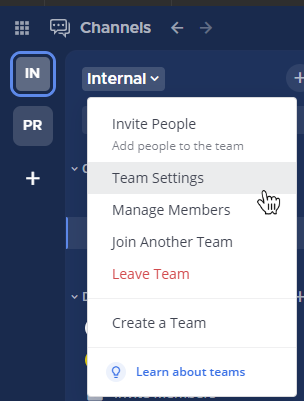
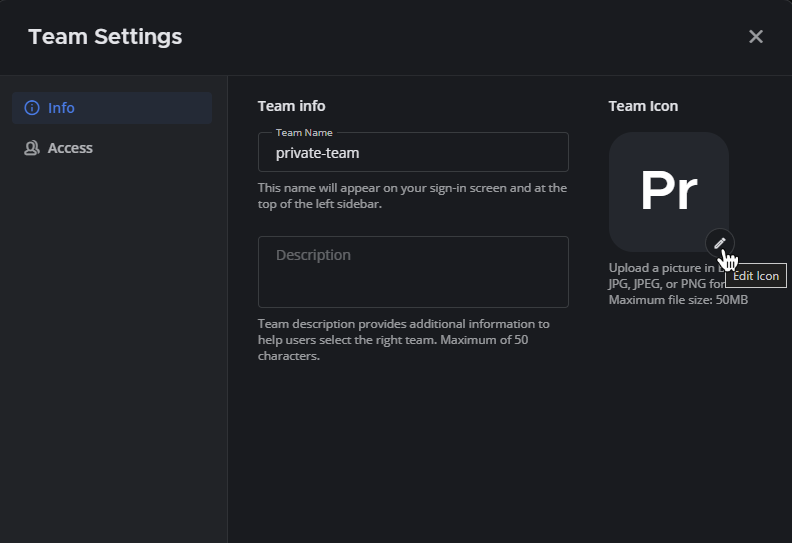

Team settings
=============

.. include:: ../_static/badges/allplans-cloud-selfhosted.rst
  :start-after: :nosearch:

Team settings enable you to adjust settings applied to a specific team. Using Mattermost in a web browser or the desktop app, select the team name to access additional team options, including **Team Settings**. 

General
-------

General settings provide options around how teams are displayed to users. 

Team name
~~~~~~~~~

Your **Team Name** is displayed on the login screen, and in the top of the channel sidebar for your team. 

Team names can contain any letters, numbers, or symbols, must be 2 - 64 characters in length, and are case-sensitive. `Some unicode characters <https://www.w3.org/TR/unicode-xml/#Charlist>`_ aren't supported in team names. 

Team description
~~~~~~~~~~~~~~~~

Your **Team Description** is displayed when viewing the list of teams available to join and in the tooltip when hovering over the team name in the team sidebar.

You can enter a description up to 50 characters in length. Please note that `some unicode characters <https://www.w3.org/TR/unicode-xml/#Charlist>`_ are not supported. 

Team icon
~~~~~~~~~

Your **Team Icon** appears in the team sidebar, and it's visible if you're a member of more than one team. By default, teams display an icon containing the first two letters of the team name. You can customize the team icon.

1. Select **Team Settings**.

2. Edit the **Team Icon** option.

3. Upload an icon image in BMP, JPG, or PNG format. We recommend using square images with a solid background color since transparency in PNG icons fills with a white background in the team sidebar. 

.. image:: ../images/upload-team-icon.png
  :alt: Upload a team icon from Team Settings.

Removing the team icon resets it to the default icon that contains the first two letters of the team name.

Allow only users with a specific email domain to join this team
~~~~~~~~~~~~~~~~~~~~~~~~~~~~~~~~~~~~~~~~~~~~~~~~~~~~~~~~~~~~~~~

Specifying domains in this setting prevents users from joining the team when their email domain is not on the list. Only users that have an email domain matching the defined domains may join the team.

Users without a matching domain on the team prior to the domain being specified will not be removed after the domain is added. For servers with email authentication **System Console > Authentication > Email > Require Email Verification** must be set to **true** for domain restrictions to be effective.

Allow anyone to join this team
~~~~~~~~~~~~~~~~~~~~~~~~~~~~~~

After a user logs in to the site, they are shown a Team Selection page if they don't belong to a team. Any team with **Allow anyone to join this team** option set to **Yes** will show up on this page under "Teams you can join". 

A user can access the Team Selection page by also clicking the "+" icon at the bottom of their team sidebar or from the **Main Menu > Join Another Team**.

Invite code
~~~~~~~~~~~

The **Invite Code** is used as part of the URL in the team invitation link retrieved when you select your team name and then choose **Invite people**.

Import
------

Import from Slack
~~~~~~~~~~~~~~~~~

This feature has been deprecated. See our :doc:`Migration Guide </onboard/migrating-to-mattermost>` for details on migrating to Mattermost from other solutions, including :doc:`Slack </onboard/migrate-from-slack>`. 
