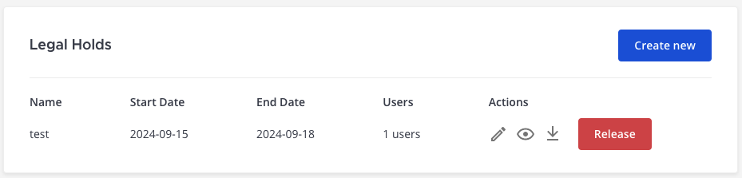

Legal hold
===========

.. include:: ../_static/badges/ent-selfhosted.rst
  :start-after: :nosearch:

A legal hold, also known as a litigation hold, is a process that an organization uses to preserve all forms of relevant information when litigation is reasonably anticipated. It's a requirement established by the Federal Rules of Civil Procedure (FRCP) in the United States and similar laws in other jurisdictions.

Primary use cases include:

1. **Litigation**: In anticipation or in the event of a lawsuit, organizations need to preserve all relevant documents and electronic data to ensure they can adequately defend their position. A failure to do so could result in court penalties.
2. **Regulatory investigation**: If an organization is being investigated by a regulatory body, it may be required to preserve and produce certain documents or data.
3. **Audits**: During an audit, whether internal or external, an organization might need to put a hold on certain data that is relevant to the audit.
4. **Records management**: In some cases, organizations might use a legal hold to temporarily suspend the deletion of data that would otherwise be purged as part of its records management policy.

Mattermost is used as a secure collaboration hub by technical and operational teams, with critical documents and data shared on a daily basis. Thus, legal hold is a key requirement for Enterprises and public sector organizations who have deployed Mattermost for their teams, to meet compliance & auditory requirements while minimizing risk.

Mattermost legal hold can be combined with :doc:`eDiscovery </comply/electronic-discovery>` integration and :doc:`data retention policies </comply/data-retention-policy>` to customize the data retained and deleted to comply with compliance requirements.

Legal hold demo (Sneak Peek)
----------------------------

Check out this `YouTube sneak peek demo <https://youtu.be/86c8NoOxlQw>`_ to learn about Mattermost's legal hold workflow.

.. raw:: html
  
   <iframe width="560" height="315" src="https://www.youtube.com/embed/86c8NoOxlQw" alt="Mattermost legal hold workflow" frameborder="0" allow="autoplay; encrypted-media" allowfullscreen></iframe>

Below are step-by-step instructions on how to carry out a legal hold for Mattermost using the Mattermost Legal Hold plugin.

How to carry out a legal hold
-----------------------------

Step 1: Upgrade to Mattermost Enterprise
~~~~~~~~~~~~~~~~~~~~~~~~~~~~~~~~~~~~~~~~~

Legal hold is available in :ref:`Mattermost Enterprise <about/editions-and-offerings:mattermost enterprise edition>`. Learn more about the Enterprise plan & request a quote online at https://mattermost.com/pricing/

Step 2: Establish a legal hold policy
~~~~~~~~~~~~~~~~~~~~~~~~~~~~~~~~~~~~~

Establish a policy for when to implement a legal hold. This should be developed in consultation with your legal counsel and should include procedures for identifying relevant custodians (those who have potentially relevant information).

Establishing a legal hold policy first enables you to configure the Mattermost system correctly to meet your compliance & auditory requirements, minimizing associated risk.

Step 3: Set up the Mattermost legal hold plugin
~~~~~~~~~~~~~~~~~~~~~~~~~~~~~~~~~~~~~~~~~~~~~~~~

Install the plugin
^^^^^^^^^^^^^^^^^^

1. Log in to your Mattermost workspace as a system administrator.
2. Download the latest version of the `plugin binary release <https://github.com/mattermost/mattermost-plugin-legal-hold/releases/>`_, compatible with Mattermost v8.0.1 and later. If you are using an earlier version of Mattermost, :doc:`follow our documentation </upgrade/upgrading-mattermost-server>` to upgrade to Mattermost v8.0.1 or later.
3. Go to **System Console > Plugins > Plugin Management > Upload Plugin**, and upload the plugin binary you downloaded in the previous step.
4. In the **Installed Plugins** section, scroll to **Legal Hold Plugin**, and select **Enable**.

Configure the plugin
^^^^^^^^^^^^^^^^^^^^^

When the Legal Hold integration is enabled, you can configure when it runs using the format ``HH:MM ±HHMM`` and ``+0000`` for UTC. 

You can configure a custom Amazon S3 bucket for legal holds by specifying Amazon S3 configuration settings. If no S3 configuration is specified, the  Mattermost server file store used. Learn more about file storage configuration options in our :ref:`product documentation <configure/environment-configuration-settings:file storage>`.

(Optional) Configure a data retention policy
^^^^^^^^^^^^^^^^^^^^^^^^^^^^^^^^^^^^^^^^^^^^^

You can optionally configure a :doc:`data retention policy </comply/data-retention-policy>` to control how long data and file attachments are retained in the Mattermost database.

Step 4: Create a legal hold
~~~~~~~~~~~~~~~~~~~~~~~~~~~~

In Mattermost, create a legal hold by completing the following steps:

1. Go to **System Console > Plugins > Legal Hold Plugin**, and select **Create new**.
2. Enter a name for the legal hold.
3. Specify the user names or user groups of custodians you want to place on legal hold.
4. (Optional) Public channels are excluded by default. You can choose to include public channels that the specified users or user groups are members of, if preferred.
5. Specify the number of days custodians are placed in legal hold with a start date. An end date is optional.
6. Select **Create legal hold**.

While the legal hold is in place, you can edit it by adding or removing custodians, as well as download a copy of the preserved data to your local machine.

Step 5: Release a legal hold
~~~~~~~~~~~~~~~~~~~~~~~~~~~~~

Once the legal hold has completed, release it to take custodians off of the legal hold by selecting the **Release** option to the right of the legal hold task. 

.. important::

  Once a legal hold is released, all data is irretrievably deleted from Mattermost.

Frequently asked questions
---------------------------

Who can implement legal hold?
~~~~~~~~~~~~~~~~~~~~~~~~~~~~~

Only Mattermost system admins can implement a legal hold.

Does a user know if they're placed under a legal hold in Mattermost?
~~~~~~~~~~~~~~~~~~~~~~~~~~~~~~~~~~~~~~~~~~~~~~~~~~~~~~~~~~~~~~~~~~~~

No, users won't be notified if they're placed under a legal hold, and no reference to legal holds will be visible in their Mattermost client or accessible via the Mattermost API. This allows for investigations to be conducted without influencing user behavior and without conflicts of interest.

What types of content does legal hold cover?
~~~~~~~~~~~~~~~~~~~~~~~~~~~~~~~~~~~~~~~~~~~~

The legal hold covers all messages and file uploads shared in conversations where the legal hold is active, including messages posted by plugins, bots or webhooks. This includes messages or files shared in public channels, private channels, direct messages and group messages.

However, legal hold does not apply to reactions, collaborative playbooks, or audio calls.

Can users delete their messages while on a legal hold?
~~~~~~~~~~~~~~~~~~~~~~~~~~~~~~~~~~~~~~~~~~~~~~~~~~~~~~

Yes, users can delete messages, but they are retained for the purposes of legal hold when implemented with the aforementioned steps.

Can a legal hold be applied retroactively to collect past data?
~~~~~~~~~~~~~~~~~~~~~~~~~~~~~~~~~~~~~~~~~~~~~~~~~~~~~~~~~~~~~~~

Yes, but this is only guaranteed for existing and future messages/files once legal hold is activated. It won't recover messages or files that were deleted before the legal hold was activated.

Is legal hold the same as e-discovery?
~~~~~~~~~~~~~~~~~~~~~~~~~~~~~~~~~~~~~~

No. While they serve a related use case, they are not the same.

Legal hold is an initial step to ensure relevant electronically stored information (ESI) is preserved. On the other hand, e-discovery is a multi-step process that uses this preserved data to identify, collect, preserve, process, review, and produce ESI in the context of a legal or investigative process.

How do I enable e-discovery for Mattermost?
~~~~~~~~~~~~~~~~~~~~~~~~~~~~~~~~~~~~~~~~~~~

Learn more about extracting data for e-discovery in our :doc:`product documentation </comply/electronic-discovery>`.