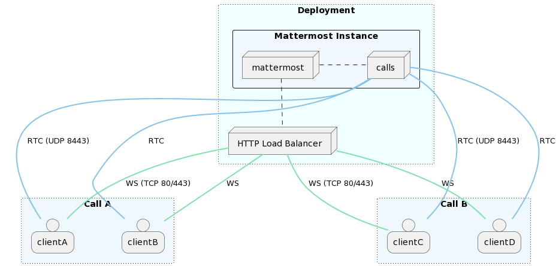
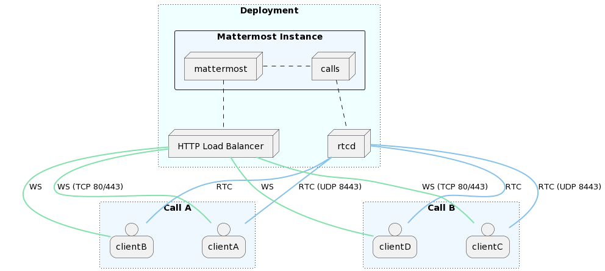
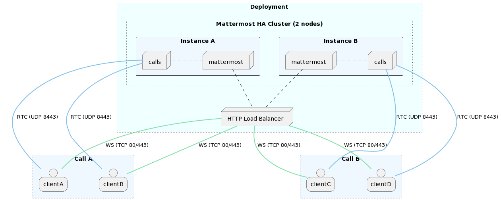
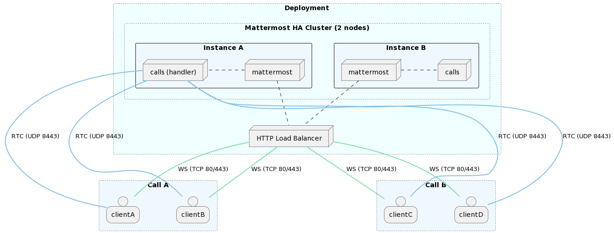
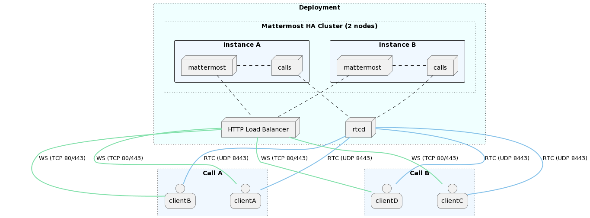
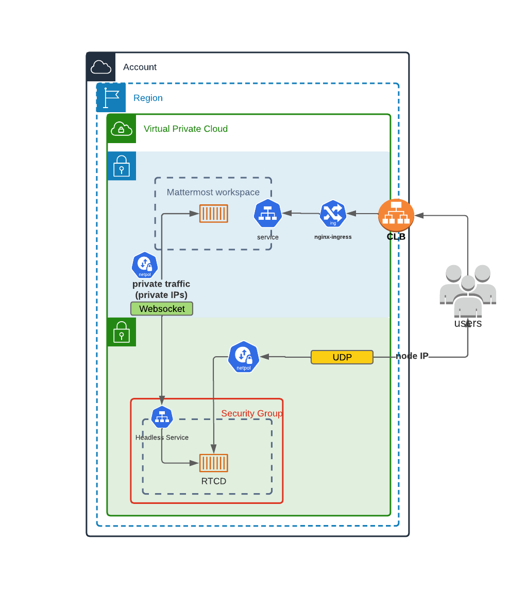

Calls self-hosted deployment
============================

.. include:: ../_static/badges/allplans-cloud-selfhosted.rst
  :start-after: :nosearch:

This document provides information on how to successfully make the Calls plugin work on self-hosted deployments. It also outlines some of the most common deployment strategies with example diagrams, and also provides the deployment guidelines for the recording service.

- `Terminology <#terminology>`__
- `Plugin components <#plugin-components>`__
- `Requirements <#requirements>`__
- `Limitations <#limitations>`__
- `Configuration <#configuration>`__
- `Kubernetes deployments <#kubernetes-deployments>`__
- `Performance <#performance>`__
- `RTCD Service <#the-rtcd-service>`__
- `Configure recording <#configure-recording>`__
- `Frequently asked questions <#frequently-asked-questions>`__

Terminology
-----------

- `WebRTC <https://bloggeek.me/webrtcglossary/webrtc-2/>`__: The set of underlying protocols/specifications on top of which calls are implemented.
- **RTC (Real Time Connection)**: The real-time connection. This is the channel used to send media tracks (audio/video/screen).
- **WS (WebSocket)**: The WebSocket connection. This is the channel used to set up a connection (signaling process).
- `NAT (Network Address Translation) <https://bloggeek.me/webrtcglossary/nat/>`__: A networking technique to map IP addresses.
- `STUN (Session Traversal Utilities for NAT) <https://bloggeek.me/webrtcglossary/stun/>`__: A protocol/service used by WebRTC clients to help traversing NATs. On the server side it's mainly used to figure out the public IP of the instance.
- `TURN (Traversal Using Relays around NAT) <https://bloggeek.me/webrtcglossary/turn/>`__: A protocol/service used to help WebRTC clients behind strict firewalls connect to a call through media relay.

Plugin components
-----------------

- **Calls plugin**: This is the main entry point and a requirement to enable channel calls.

- **rtcd**: This is an optional service that can be deployed to offload all the functionality and data processing involved with the WebRTC connections. Read more about when and why to use `rctd <#the-rtcd-service>`__ below.

Requirements
------------

Server
~~~~~~

- Run Mattermost server on a secure (HTTPs) connection. This is a necessary requirement on the client to allow capturing devices (e.g., microphone, screen). See the `config TLS </install/config-tls-mattermost.html>`__ section for more info.
- See `network requirements </configure/calls-deployment.html#network>`__ below.

Client
~~~~~~

- Clients need to be able to connect (send and receive data) to the instance hosting the calls through the UDP port configured as ``RTC Server Port``. If this is not possible a TURN server should be used to achieve connectivity.
- Depending on the platform or operating system, clients may need to grant additional permissions to the application (e.g., browser, desktop app) to  allow them to capture audio inputs or share the screen.

Network
~~~~~~~

+---------------------------------+--------+-----------------+------------------------------------------------------------+------------------------------------------+-----------------------------------------------------------------------------------------------------------------------------------------------------------------------------------------------------------------------------------------------------------------------------------------------------------------------------------+
| Service                         | Ports  | Protocols       | Source                                                     | Target                                   | Purpose                                                                                                                                                                                                                                                                                                                           |
+=================================+========+=================+============================================================+==========================================+===================================================================================================================================================================================================================================================================================================================================+
| API (Calls plugin)              | 80,443 | TCP (incoming)  | Mattermost clients (web/desktop/mobile)                    | Mattermost instance (Calls plugin)       | To allow for HTTP and WebSocket connectivity from clients to Calls plugin. This API is exposed on the same connection as Mattermost, so there’s likely no need to change anything.                                                                                                                                                |
+---------------------------------+--------+-----------------+------------------------------------------------------------+------------------------------------------+-----------------------------------------------------------------------------------------------------------------------------------------------------------------------------------------------------------------------------------------------------------------------------------------------------------------------------------+
| RTC (Calls plugin or ``rtcd``)  | 8443   | UDP (incoming)  | Mattermost clients (Web/Desktop/Mobile)                    | Mattermost instance or ``rtcd`` service  | To allow clients to establish connections that transport calls related media (e.g. audio, video). This should be open on any network component (e.g. NAT, firewalls) in between the instance running the plugin (or ``rtcd``) and the clients joining calls so that UDP traffic is correctly routed both ways (from/to clients).  |
+---------------------------------+--------+-----------------+------------------------------------------------------------+------------------------------------------+-----------------------------------------------------------------------------------------------------------------------------------------------------------------------------------------------------------------------------------------------------------------------------------------------------------------------------------+
| API (``rtcd``)                  | 8045   | TCP (incoming)  | Mattermost instance(s) (Calls plugin)                      | ``rtcd`` service                         | To allow for HTTP/WebSocket connectivity from Calls plugin to ``rtcd`` service. Can be expose internally as the service only needs to be reachable by the instance(s) running the Mattermost server.                                                                                                                              |
+---------------------------------+--------+-----------------+------------------------------------------------------------+------------------------------------------+-----------------------------------------------------------------------------------------------------------------------------------------------------------------------------------------------------------------------------------------------------------------------------------------------------------------------------------+
| STUN (Calls plugin or ``rtcd``) | 3478   | UDP (outgoing)  | Mattermost Instance(s) (Calls plugin) or ``rtcd`` service  | Configured STUN servers                  | (Optional) To allow for either Calls plugin or ``rtcd`` service to discover their instance public IP. Only needed if configuring STUN/TURN servers. This requirement does not apply when manually setting an IP or hostname through the |ice_host_override_link| config option.                                                   |
+---------------------------------+--------+-----------------+------------------------------------------------------------+------------------------------------------+-----------------------------------------------------------------------------------------------------------------------------------------------------------------------------------------------------------------------------------------------------------------------------------------------------------------------------------+

.. |ice_host_override_link| replace:: `ICE Host Override <plugins-configuration-settings.html#ice-host-override>`__

Limitations
-----------

- In Mattermost Cloud, up to 200 participants per channel can join a call.
- In Mattermost self-hosted deployments, the default maximum number of participants is unlimited. The recommended maximum number of participants per call is 200. This setting can be changed in **System Console > Plugin Management > Calls > Max call participants**. There's no limit to the total number of participants across all calls as the supported value greatly depends on instance resources. For more details, refer to the `performance section </configure/calls-deployment.html#performance>`__ below.

Configuration
-------------

For Mattermost self-hosted customers, the calls plugin is pre-packaged, installed, and enabled. Configuration to allow end-users to use it can be found in the `System Console </configure/plugins-configuration-settings.html#calls-beta>`__.

Modes of operation
------------------

Depending on how the Mattermost server is running, there are several modes under which the Calls plugin can operate. Please refer to the section below on `the rtcd service <#the-rtcd-service>`__ to learn about the ``rtcd`` and the Selective Forwarding Unit (SFU).

============================ =============== =================
 Mattermost deployment       SFU             SFU deployment
============================ =============== =================
 Single instance             integrated
 Single instance             rtcd
 High availability cluster   integrated      clustered
 High availability cluster   integrated      single handler
 High availability cluster   rtcd
============================ =============== =================

Single instance
~~~~~~~~~~~~~~~

Integrated
^^^^^^^^^^

This is the default mode when first installing the plugin on a single Mattermost instance setup. The WebRTC service is integrated in the plugin itself and runs alongside the Mattermost server.

rtcd
^^^^

An external, dedicated and scalable WebRTC service (``rtcd``) is used to handle all calls media routing.

High availability cluster
~~~~~~~~~~~~~~~~~~~~~~~~~

Clustered
^^^^^^^^^

This is the default mode when running the plugin in a high availability cluster. Every Mattermost node will run an instance of the plugin that includes a WebRTC service. Calls are distributed across all available nodes through the existing load-balancer: a call is hosted on the instance where the initiating websocket connection (first client to join) is made. A single call will be hosted on a single cluster node.

Single handler
^^^^^^^^^^^^^^

This is a fallback mode to only let one node in the cluster to host calls. While the plugin would still run on all nodes, all calls will be routed through the handler node. This mode must be enabled by running the instance with a special environment variable set (MM_CALLS_IS_HANDLER=true).

rtcd (HA)
^^^^^^^^^^

Kubernetes deployments
----------------------

If Mattermost isn't deployed in a Kubernetes cluster, and you want to use this deployment type, visit the `Kubernetes operator guide </install/mattermost-kubernetes-operator.html>`__.

``rtcd`` is deployed with a Helm chart. To install this Helm chart run:

.. code-block:: none

  helm repo add mattermost https://helm.mattermost.com

More info about the version and the chart itself, please check here. Regarding changing the parameters of the helm chart, please check and copy the default values from here.

An example with sample values:

.. code-block:: none

  image:
    repository: mattermost/rtcd
    pullPolicy: IfNotPresent
    tag: "v0.9.0"

  imagePullSecrets: []
  nameOverride: ""
  fullnameOverride: ""

  serviceAccount:
    create: true
    annotations: {}
    name: ""

  podAnnotations: {}

  podSecurityContext: {}

  securityContext: {}

  # Which deployment method you'd like to use "deployment" or "daemonset"
  deploymentType: "deployment"

  configuration:
    # Only needed if deploymentType is set to "deployment"
    replicas: 2

    environmentVariables:
      RTCD_API_SECURITY_ALLOWSELFREGISTRATION: "\"true\""
      RTCD_RTC_ICESERVERS:
    "\'[{\"urls\":[\"stun:stun.global.calls.mattermost.com:3478\"]}]\'"
      RTCD_LOGGER_CONSOLELEVEL: "\"DEBUG\""
      RTCD_LOGGER_ENABLEFILE: "\"false\""
    maxUnavailable: 1 # Only used when updateStrategy is set to "RollingUpdate"
    updateStrategy: RollingUpdate
    terminationGracePeriod: 18000 # 5 hours, used to gracefully draining the instance.

  service:
    # APIport is the port used by rtcd HTTP/WebSocket API.
    APIport: 8045
    # RTCport is the UDP port used to route all the calls related traffic.
    RTCport: 8443

  ingress:
    enabled: false
    classname: nginx-calls
    annotations:
    hosts:
      - host: mattermost-rtcd.local
        paths:
          - "/"

  resources:
    limits:
      cpu: 7800m # Values for c5.2xlarge in AWS
      memory: 15Gi # Values for c5.2xlarge in AWS
    requests:
      cpu: 100m
      memory: 32Mi

  nodeSelector:
    kops.k8s.io/instancegroup: rtcd

  tolerations:
    - key: "rtcd"
      operator: "Equal"
      value: "true"
      effect: "NoSchedule"

  dnsConfig:
    options:
    - name: ndots
      value: "1"

  affinity:
    podAntiAffinity:
      requiredDuringSchedulingIgnoredDuringExecution:
        - labelSelector:
            matchExpressions:
              - key: app.kubernetes.io/name
                operator: In
                values:
                  - mattermost-rtcd
          topologyKey: topology.kubernetes.io/zone
      preferredDuringSchedulingIgnoredDuringExecution:
        - weight: 100
          podAffinityTerm:
            labelSelector:
              matchExpressions:
                - key: app.kubernetes.io/name
                  operator: In
                  values:
                    - mattermost-rtcd
            topologyKey: topology.kubernetes.io/zone

``rtcd`` will be deployed as a deployment as shown in the `deploymentType` field. For that reason the sections of `deployment.replicas`, `nodeSelector` and `tolerations` are used so that ``rtcd`` to be deployed in specific nodes.

After having the values above, to deploy the ``rtcd`` helm chart run:

.. code-block:: none

  helm upgrade mattermost-rtcd mattermost/mattermost-rtcd -f /Users/myuser/rtcd_values.yaml --namespace mattermost-rtcd --create-namespace --install --debug

Performance
-----------

Calls performance primarily depends on two resources: CPU and bandwidth (both network latency and overall throughput). The final consumption exhibits quadratic growth with the number of clients transmitting and receiving media.

As an example, a single call with 10 participants of which two are unmuted (transmitting voice data) will generally consume double the resources than the same call with a single participant unmuted. What ultimately counts towards performance is the overall number of concurrent media flows (in/out) across the server.

Benchmarks
~~~~~~~~~~

Here are some results from internally conducted performance tests on a dedicated ``rtcd`` instance:

+-------+------------+--------------+----------------+-----------+--------------+--------------------+----------------+
| Calls | Users/call | Unmuted/call | Screen sharing | CPU (avg) | Memory (avg) | Bandwidth (in/out) | Instance (EC2) |
+=======+============+==============+================+===========+==============+====================+================+
| 100   | 8          | 2            | no             | 60%       | 0.5GB        | 22Mbps / 125Mbps   | c6i.xlarge     |
+-------+------------+--------------+----------------+-----------+--------------+--------------------+----------------+
| 100   | 8          | 2            | no             | 30%       | 0.5GB        | 22Mbps / 125Mbps   | c6i.2xlarge    |
+-------+------------+--------------+----------------+-----------+--------------+--------------------+----------------+
| 100   | 8          | 2            | yes            | 86%       | 0.7GB        | 280Mbps / 2.2Gbps  | c6i.2xlarge    |
+-------+------------+--------------+----------------+-----------+--------------+--------------------+----------------+
| 10    | 50         | 2            | no             | 35%       | 0.3GB        | 5.25Mbps / 86Mbps  | c6i.xlarge     |
+-------+------------+--------------+----------------+-----------+--------------+--------------------+----------------+
| 10    | 50         | 2            | no             | 16%       | 0.3GB        | 5.25Mbps / 86Mbps  | c6i.2xlarge    |
+-------+------------+--------------+----------------+-----------+--------------+--------------------+----------------+
| 10    | 50         | 2            | yes            | 90%       | 0.3GB        | 32Mbps / 1.33Gbps  | c6i.xlarge     |
+-------+------------+--------------+----------------+-----------+--------------+--------------------+----------------+
| 10    | 50         | 2            | yes            | 45%       | 0.3GB        | 32Mbps / 1.33Gbps  | c6i.2xlarge    |
+-------+------------+--------------+----------------+-----------+--------------+--------------------+----------------+
| 5     | 200        | 2            | no             | 65%       | 0.6GB        | 8.2Mbps / 180Mbps  | c6i.xlarge     |
+-------+------------+--------------+----------------+-----------+--------------+--------------------+----------------+
| 5     | 200        | 2            | no             | 30%       | 0.6GB        | 8.2Mbps / 180Mbps  | c6i.2xlarge    |
+-------+------------+--------------+----------------+-----------+--------------+--------------------+----------------+
| 5     | 200        | 2            | yes            | 90%       | 0.7GB        | 31Mbps / 2.2Gbps   | c6i.2xlarge    |
+-------+------------+--------------+----------------+-----------+--------------+--------------------+----------------+

Dedicated service
~~~~~~~~~~~~~~~~~

For Enterprise customers we offer a way to offload performance costs through a `dedicated service <https://github.com/mattermost/rtcd>`__ that can be used to further scale up calls.

Load testing
~~~~~~~~~~~~

We provide a `load-test tool <https://github.com/mattermost/mattermost-plugin-calls/tree/main/lt>`__ that can be used to simulate and measure the performance impact of calls.

Monitoring
~~~~~~~~~~

Both the plugin and the external ``rtcd`` service expose some Prometheus metrics to monitor performance. We provide an `official dashboard <https://github.com/mattermost/mattermost-performance-assets/blob/master/grafana/mattermost-calls-performance-monitoring.json>`__ that can be imported in Grafana. You can refer to `Performance monitoring </scale/performance-monitoring.html>`__ for more information on how to set up Prometheus and visualize metrics through Grafana.

Calls plugin metrics
^^^^^^^^^^^^^^^^^^^^

Metrics for the calls plugin are exposed through the public ``/plugins/com.mattermost.calls/metrics`` API endpoint.

**Process**

- ``mattermost_plugin_calls_process_cpu_seconds_total``: Total user and system CPU time spent in seconds.
- ``mattermost_plugin_calls_process_max_fds``: Maximum number of open file descriptors.
- ``mattermost_plugin_calls_process_open_fds``: Number of open file descriptors.
- ``mattermost_plugin_calls_process_resident_memory_bytes``: Resident memory size in bytes.
- ``mattermost_plugin_calls_process_virtual_memory_bytes``: Virtual memory size in bytes.

**WebRTC connection**

- ``mattermost_plugin_calls_rtc_conn_states_total``: Total number of RTC connection state changes.
- ``mattermost_plugin_calls_rtc_errors_total``: Total number of RTC errors.
- ``mattermost_plugin_calls_rtc_rtp_bytes_total``: Total number of sent/received RTP packets in bytes.
- ``mattermost_plugin_calls_rtc_rtp_packets_total``: Total number of sent/received RTP packets.
- ``mattermost_plugin_calls_rtc_sessions_total``: Total number of active RTC sessions.

**Database**

- ``mattermost_plugin_calls_store_ops_total``: Total number of db store operations.

**WebSocket**

- ``mattermost_plugin_calls_websocket_connections_total``: Total number of active WebSocket connections.
- ``mattermost_plugin_calls_websocket_events_total``: Total number of WebSocket events.

WebRTC service metrics
^^^^^^^^^^^^^^^^^^^^^^

Metrics for the ``rtcd`` service are exposed through the ``/metrics`` API endpoint.

**Process**

- ``rtcd_process_cpu_seconds_total``:  Total user and system CPU time spent in seconds.
- ``rtcd_plugin_calls_process_max_fds``: Maximum number of open file descriptors.
- ``rtcd_plugin_calls_process_open_fds``: Number of open file descriptors.
- ``rtcd_plugin_calls_process_resident_memory_bytes``: Resident memory size in bytes.
- ``rtcd_plugin_calls_process_virtual_memory_bytes``: Virtual memory size in bytes.

**WebRTC Connection**

- ``rtcd_rtc_conn_states_total``: Total number of RTC connection state changes.
- ``rtcd_rtc_errors_total``: Total number of RTC errors.
- ``rtcd_rtc_rtp_bytes_total``: Total number of sent/received RTP packets in bytes.
- ``rtcd_rtc_rtp_packets_total``: Total number of sent/received RTP packets.
- ``rtcd_rtc_sessions_total``: Total number of active RTC sessions.

**WebSocket**

- ``rtcd_ws_connections_total``: Total number of active WebSocket connections.
- ``rtcd_ws_messages_total``: Total number of received/sent WebSocket messages.

System tunings
~~~~~~~~~~~~~~

If you want to host many calls or calls with a large number of participants, take a look at the following platform specific (Linux) tunings (this is the only officially supported target for the plugin right now):

.. code::

  # Setting the maximum buffer size of the receiving UDP buffer to 16MB
  net.core.rmem_max = 16777216

  # Setting the maximum buffer size of the sending UDP buffer to 16MB
  net.core.wmem_max = 16777216

  # Allow to allocate more memory as needed for more control messages that need to be sent for each socket connected
  net.core.optmem_max = 16777216

The rtcd service
----------------

.. include:: ./calls-rtcd-ent-only.rst
  :start-after: :nosearch:

The Calls plugin has a built-in `Selective Forwarding Unit (SFU) <https://bloggeek.me/webrtcglossary/sfu/>`__ to route audio and screensharing data. This is the ``integrated`` option described in the `<#modes-of-operation>`__ section above. But this SFU functionality can be deployed separately as an external ``rtcd`` instance.

Reasons to use the ``rtcd`` service
~~~~~~~~~~~~~~~~~~~~~~~~~~~~~~~~~~~

This section will help you understand when and why your organization would want to use ``rtcd``.

.. note::

  ``rtcd`` is a standalone service, which adds operational complexity, maintenance costs, and requires an enterprise licence. For those who are evaluating  Calls, and for many small instances of Mattermost, the integrated SFU (the one included in the Calls plugin) may be sufficient initially.

The ``rtcd`` service is the recommended way to host Calls for the following reasons:

- **Performance of the main Mattermost server(s).** When the Calls plugin runs the SFU, calls traffic is added to the processing load of the server running the rest of your Mattermost services. If Calls traffic spikes, it can negatively affect the responsiveness of these services. Using an rtcd service isolates the calls traffic processing to those rtcd instances, and also reduces costs by minimizing CPU usage spikes.

- **Performance, scalability, and stability of the Calls product.** If Calls traffic spikes, or more overall capacity is needed, ``rtcd`` servers can be added to balance the load. As an added benefit, if the Mattermost traffic spikes, or if a Mattermost instance needs to be restarted, those people in a current call will not be affected - current calls won't be dropped.

Some caveats apply here. Web socket events (for example: emoji reactions, hand raising, muting/unmuting) will not be transmitted while the main Mattermost server is down. But the call itself will continue while the main server restarts.

- **Kubernetes deployments.** In a Kubernetes deployment, ``rtcd`` is strongly recommended; it is currently the only officially supported way to run Calls.
- **Technical benefits.** The dedicated ``rtcd`` service has been optimized and tuned at the system/network level for real-time audio/video traffic, where latency is generally more important than throughput.

In general, ``rtcd`` is the preferred solution for a performant and scalable deployment. With ``rtcd``, the Mattermost server will be minimally impacted when hosting a high number of calls.

Configure recording
-------------------

Before you can start recording calls, you need to configure the ``calls-offloader`` job service. You can read about how to do that `here <https://github.com/mattermost/calls-offloader/blob/master/docs/getting_started.md>`__. Performance and scalability recommendations related to this service can be found in `here <https://github.com/mattermost/calls-offloader/blob/master/docs/performance.md>`__.

Frequently asked questions
--------------------------

Is there encryption?
~~~~~~~~~~~~~~~~~~~~

Media (audio/video) is encrypted using security standards as part of WebRTC. It's mainly a combination of DTLS and SRTP. It's not e2e encrypted in the sense that in the current design all media needs to go through Mattermost which acts as a media router and has complete access to it. Media is then encrypted back to the clients so it's secured during transit. In short: only the participant clients and the Mattermost server have access to unencrypted call data.

Are there any third-party services involved?
~~~~~~~~~~~~~~~~~~~~~~~~~~~~~~~~~~~~~~~~~~~~

The only external service used is Mattermost official STUN server (``stun.global.calls.mattermost.com``) which is configured as default. This is primarily used to find the public address of the Mattermost instance. The only information sent to this service is the IP addresses of clients connecting as no other traffic goes through it. It can be removed in case the |ice_host_override_link| setting is provided.

Is using UDP a requirement?
~~~~~~~~~~~~~~~~~~~~~~~~~~~

Yes, UDP is the recommended protocol to serve real-time media as it allows for the lowest latency between peers. While theoretically possible to use TCP, it's not currently supported by the plugin. If using a UDP port is unfeasible, one possible solution would be to run calls through an external TURN server that listens on TCP and relays all media traffic between peers. However, this is a sub-optimal solution that should be avoided if possible as it will introduce extra latency along with added infrastructural cost.

Do I need a TURN server?
~~~~~~~~~~~~~~~~~~~~~~~~

TURN becomes necessary when you expect to have clients that are unable to connect through the configured UDP port. This can happen due to very restrictive firewalls that either block non standard ports even in the outgoing direction or don't allow the use of the UDP protocol altogether (e.g. some corporate firewalls). In such cases TURN is needed to allow connectivity.

We officially support and recommend using `coturn <https://github.com/coturn/coturn>`__ for a stable and performant TURN service implementation.

How will this work with an existing reverse proxy sitting in front of Mattermost?
~~~~~~~~~~~~~~~~~~~~~~~~~~~~~~~~~~~~~~~~~~~~~~~~~~~~~~~~~~~~~~~~~~~~~~~~~~~~~~~~~

Generally clients should connect directly to either Mattermost or, if deployed, the dedicated ``rtcd`` service through the configured UDP port . However, it's also possible to route the traffic through an existing load balancer as long as this has support for routing the UDP protocol (e.g. nginx). Of course this will require additional configuration and potential changes to how the plugin is run as it won't be possible to load balance the UDP flow across multiple instances like it happens for HTTP.

Do calls require a dedicated server to work or can they run alongside Mattermost?
~~~~~~~~~~~~~~~~~~~~~~~~~~~~~~~~~~~~~~~~~~~~~~~~~~~~~~~~~~~~~~~~~~~~~~~~~~~~~~~~~

The plugin can function in different modes. By default calls are handled completely by the plugin which runs as part of Mattermost. It's also possible to use a dedicated service to offload the computational and bandwidth costs and scale further (Enterprise only).

Can the traffic between Mattermost and ``rtcd``  be kept internal or should it be opened to the public?
~~~~~~~~~~~~~~~~~~~~~~~~~~~~~~~~~~~~~~~~~~~~~~~~~~~~~~~~~~~~~~~~~~~~~~~~~~~~~~~~~~~~~~~~~~~~~~~~~~~~~~~

When possible, it's recommended to keep communication between the Mattermost cluster and the dedicated ``rtcd`` service under the same private network as this can greatly simplify deployment and security. There's no requirement to expose ``rtcd``'s HTTP API to the public internet.
