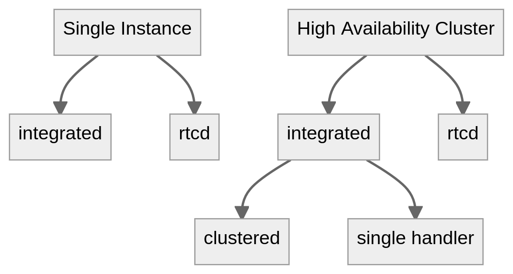

Calls self-hosted deployment
============================

.. include:: ../_static/badges/allplans-cloud-selfhosted.rst
  :start-after: :nosearch:

This document provides information on how to successfully make the Calls plugin work on self-hosted deployments. It also outlines some of the most common deployment strategies with example diagrams.

Terminology
-----------

- `WebRTC <https://bloggeek.me/webrtcglossary/webrtc-2/>`__: The set of underlying protocols/specifications on top of which calls are implemented. 
- **RTC (Real Time Connection)**: The real-time connection. This is the channel used to send media tracks (audio/video/screen).
- **WS (WebSocket)**: The WebSocket connection. This is the channel used to set up a connection (signaling process).
- `NAT (Network Address Translation) <https://bloggeek.me/webrtcglossary/nat/>`__: A networking technique to map IP addresses. 
- `STUN (Session Traversal Utilities for NAT) <https://bloggeek.me/webrtcglossary/stun/>`_: A protocol/service used by WebRTC clients to help traversing NATs. On the server side it's mainly used to figure out the public IP of the instance. 
- `TURN (Traversal Using Relays around NAT) <https://bloggeek.me/webrtcglossary/turn/>`_: A protocol/service used to help WebRTC clients behind strict firewalls connect to a call through media relay. 

Components
----------

- **Calls plugin**: This is the main entry point and a requirement to enable channel calls.

.. include:: ../_static/badges/ent-only.rst
  :start-after: :nosearch:

- **rtcd**: This is an optional service that can be deployed to offload all the functionality and data processing involved with the WebRTC connections. This is the preferred solution for a performant and scalable deployment. With ``rtcd``, the Mattermost server will be minimally impacted when hosting a high number of calls.

Requirements
------------

Server
~~~~~~

- Run Mattermost server on a secure (HTTPs) connection. This is a necessary requirement on the client to allow capturing devices (e.g., microphone, screen). See the `config TLS </install/config-tls-mattermost.html>`_ section for more info.
- See `network requirements </configure/calls-deployment.html#network>`_ below.

Client
~~~~~~
- Clients need to be able to connect (send and receive data) to the instance hosting the calls through the UDP port configured as ``RTC Server Port``. If this is not possible a TURN server should be used to achieve connectivity.
- Depending on the platform or operating system, clients may need to grant additional permissions to the application (e.g., browser, desktop app) to  allow them to capture audio inputs or share the screen.

Network
~~~~~~~

+---------------------------------+-------------------+-------------------------------+----------------------------------------------------------------------------------------------------------------------------------------------------------------------------------------------------------------------------------------------------------------------------------------------------------------------------------------------+
| Service name                    | Ports (defaults)  | Protocols                     | Notes                                                                                                                                                                                                                                                                                                                                        |
+=================================+===================+===============================+==============================================================================================================================================================================================================================================================================================================================================+
| API (plugin)                    | 80, 443           | TCP (incoming) HTTP(s)/WS(s)  | This API is exposed on the same connection as Mattermost, so there’s no need to change anything.                                                                                                                                                                                                                                             |
+---------------------------------+-------------------+-------------------------------+----------------------------------------------------------------------------------------------------------------------------------------------------------------------------------------------------------------------------------------------------------------------------------------------------------------------------------------------+
| RTC (plugin or ``rtcd``)        | 8443              | UDP (incoming)                | Public/client facing. This should be open on any network component (e.g. NAT, firewalls) in between the instance running the plugin (or ``rtcd``) and the clients joining calls so that UDP traffic is correctly routed both ways (from/to clients). This is the connection that transports all the calls related media (e.g. audio, video)  |
+---------------------------------+-------------------+-------------------------------+----------------------------------------------------------------------------------------------------------------------------------------------------------------------------------------------------------------------------------------------------------------------------------------------------------------------------------------------+
| API (``rtcd``)                  | 8045              | TCP (incoming)                | Internal, private network. Only needs to be reachable by the instances running the Mattermost server.                                                                                                                                                                                                                                        |
+---------------------------------+-------------------+-------------------------------+----------------------------------------------------------------------------------------------------------------------------------------------------------------------------------------------------------------------------------------------------------------------------------------------------------------------------------------------+
| STUN/TURN (plugin or ``rtcd``)  | 3478              | UDP (outgoing)                | Public/client facing. Only needed if configuring STUN/TURN servers. This requirement does not apply when manually setting an IP/hostname through the ICE Host Override config option.                                                                                                                                                        |
+---------------------------------+-------------------+-------------------------------+----------------------------------------------------------------------------------------------------------------------------------------------------------------------------------------------------------------------------------------------------------------------------------------------------------------------------------------------+

Limitations
-----------

- In Mattermost Cloud, up to 200 participants per channel can join a call. 
- In Mattermost self-hosted deployments, the default maximum number of participants is unlimited. The recommended maximum number of participants per call is 200. This setting can be changed in **System Console > Plugin Management > Calls > Max call participants**. There's no limit to the total number of participants across all calls as the supported value greatly depends on instance resources. For more details, refer to the `performance section </configure/calls-deployment.html#performance>`_ below.

Configuration
-------------

For Mattermost self-hosted customers, the calls plugin is pre-packaged, installed, and enabled. Configuration to allow end-users to use it can be found in the `System Console </configure/configuration-settings.html#calls-beta>`_.

Modes of operation
------------------

Depending on how the Mattermost server is running, there are several modes under which the Calls plugin can operate.

Single instance
~~~~~~~~~~~~~~~

Integrated
^^^^^^^^^^

This is the default mode when first installing the plugin on a single Mattermost instance setup. The WebRTC service is integrated in the plugin itself and runs alongside the Mattermost server.

.. image:: ../images/calls-deployment-image3.png
  :alt: A diagram of the integrated configuration model of a single instance.

rtcd
^^^^

An external, dedicated and scalable WebRTC service (``rtcd``) is used to handle all calls media routing.

.. image:: ../images/calls-deployment-image7.png
  :alt: A diagram of a Web RTC deployment configuration.

High availability cluster
~~~~~~~~~~~~~~~~~~~~~~~~~

Clustered
^^^^^^^^^

This is the default mode when running the plugin in a HA cluster. Every Mattermost node will run an instance of the plugin that includes a WebRTC service. Calls are distributed across all available nodes through the existing load-balancer: a call is hosted on the instance where the initiating websocket connection (first client to join) is made. A single call will be hosted on a single cluster node.

.. image:: ../images/calls-deployment-image5.png
  :alt: A diagram of a clustered calls deployment.

Single handler
^^^^^^^^^^^^^^

This is a fallback mode to only let one node in the cluster to host calls. While the plugin would still run on all nodes, all calls will be routed through the handler node. This mode must be enabled by running the instance with a special environment variable set (MM_CALLS_IS_HANDLER=true).

.. image:: ../images/calls-deployment-image4.png
  :alt: A diagram of a single handler deployment.

rtcd (HA)
^^^^^^^^^

.. image:: ../images/calls-deployment-image2.png
  :alt: A diagram of an rtcd deployment.

Kubernetes deployments
----------------------

.. image:: ../images/calls-deployment-kubernetes.png
  :alt: A diagram of calls deployed in a Kubernetes cluster.
  
If Mattermost is not deployed in a Kubernetes cluster, and you want to use this deployment type, visit the `Kubernetes operator guide </install/mattermost-kubernetes-operator.html>`_.

``rtcd`` is deployed with a Helm chart. To install this Helm chart run:

.. code-block:: none

  helm repo add mattermost https://helm.mattermost.com

More info about the version and the chart itself, please check here. Regarding changing the parameters of the helm chart, please check and copy the default values from here.

An example with sample values:

.. code-block:: none

 image:
   repository: mattermost/rtcd
   pullPolicy: IfNotPresent
   tag: "v0.6.9"

 imagePullSecrets: []
 nameOverride: ""
 fullnameOverride: ""

 serviceAccount:
    create: true
    annotations: {}
    name: ""

 podAnnotations: {}

 podSecurityContext: {}

  securityContext: {}

  daemonset:
    environmentVariables:
      RTCD_API_SECURITY_ALLOWSELFREGISTRATION: "\"true\""
      RTCD_RTC_ICESERVERS: 
    "\'[{\"urls\":[\"stun:stun.global.calls.mattermost.com:3478\"]}]\'"
      RTCD_LOGGER_CONSOLELEVEL: "\"DEBUG\""
      RTCD_LOGGER_ENABLEFILE: "\"false\""
    maxUnavailable: 1 # Only used when updateStrategy is set to 
   "RollingUpdate"
    updateStrategy: RollingUpdate
    terminationGracePeriod: 18000 # 5 hours, used to gracefully draining the instance.

  service:
    # APIport is the port used by rtcd HTTP/WebSocket API.
    APIport: 8045
    # RTCport is the UDP port used to route all the calls related traffic.
    RTCport: 8443

 ingress:
    enabled: false
    classname: nginx-calls
    annotations:
    hosts:
      - host: mattermost-rtcd.local
        paths:
          - "/"
          
 resources:
    limits:
      cpu: 7800m # Values for c5.2xlarge in AWS
      memory: 15Gi # Values for c5.2xlarge in AWS
    requests:
      cpu: 100m
      memory: 32Mi

 nodeSelector:
    kops.k8s.io/instancegroup: rtcd

  tolerations:
    - key: "rtcd"
      operator: "Equal"
      value: "true"
      effect: "NoSchedule"

  dnsConfig:
    options:
    - name: ndots
      value: "1"

  affinity: {}

``rtcd`` will be deployed as DaemonSet, for that reason the sections of nodeSelector and tolerations are used so that ``rtcd`` to be deployed in specific nodes.

After having the values above, to deploy the ``rtcd`` helm chart run:

.. code-block:: none

  helm upgrade mattermost-rtcd mattermost/mattermost-rtcd -f /Users/myuser/rtcd_values.yaml --namespace mattermost-rtcd --create-namespace --install --debug
  

Performance
-----------

Calls performance primarily depends on two resources: CPU and bandwidth (both network latency and overall throughput).
The final consumption exhibits quadratic growth with the number of clients transmitting and receiving media.

As an example, a single call with 10 participants of which two are unmuted (transmitting voice data) will generally consume double the resources than the same call with a single participant unmuted. What ultimately counts towards performance is the overall number of concurrent media flows (in/out) across the server.

Benchmarks
~~~~~~~~~~
Here are some results from internally conducted performance tests on a dedicated instance:

 ======== ============= =============== ================ ================= 
  Calls    Users/call    Unmuted/call    Screensharing    Instance (EC2)   
 ======== ============= =============== ================ ================= 
  100      4             1               100              c5.xlarge        
  200      8             2               25               c5.xlarge        
  200      8             2               0                c5.xlarge        
  50       20            2               50               c5.2xlarge       
  100      8             4               100              c5.2xlarge       
 ======== ============= =============== ================ ================= 

Dedicated service
~~~~~~~~~~~~~~~~~

For Enterprise customers we offer a way to offload performance costs through a `dedicated service <https://github.com/mattermost/rtcd>`_ that can be used to further scale up calls. 

System tunings
~~~~~~~~~~~~~~

If you wish to host many calls or calls with a large number of participants, take a look at the following platform specific (Linux) tunings (this is the only officially supported target for the plugin right now):

.. code::

  # Setting the maximum buffer size of the receiving UDP buffer to 16MB
  net.core.rmem_max = 16777216

  # Setting the maximum buffer size of the sending UDP buffer to 16MB
  net.core.wmem_max = 16777216

  # Allow to allocate more memory as needed for more control messages that need to be sent for each socket connected
  net.core.optmem_max = 16777216

Frequently asked questions
--------------------------

Is using UDP a requirement?
~~~~~~~~~~~~~~~~~~~~~~~~~~~

Yes, UDP is the recommended protocol to serve real-time media as it allows for the lowest latency between peers. While theoretically possible to use TCP, it's not currently supported by the plugin. If using a UDP port is unfeasible, one possible solution would be to run calls through an external TURN server that listens on TCP and relays all media traffic between peers. However, this is a sub-optimal solution that should be avoided if possible as it will introduce extra latency along with added infrastructural cost.

Do I need a TURN server?
~~~~~~~~~~~~~~~~~~~~~~~~

TURN becomes necessary when you expect to have clients that are unable to connect through the configured UDP port. This can happen due to very restrictive firewalls that either block non standard ports even in the outgoing direction or don't allow the use of the UDP protocol altogether (e.g. some corporate firewalls). In such cases TURN is needed to allow connectivity.

We officially support and recommend using `coturn <https://github.com/coturn/coturn>`_ for a stable and performance TURN service implementation.

How will this work with an existing reverse proxy sitting in front of Mattermost?
~~~~~~~~~~~~~~~~~~~~~~~~~~~~~~~~~~~~~~~~~~~~~~~~~~~~~~~~~~~~~~~~~~~~~~~~~~~~~~~~~

Generally clients should connect directly to either Mattermost or, if deployed, the dedicated ``rtcd`` service through the configured UDP port . However, it's also possible to route the traffic through an existing load balancer as long as this has support for routing the UDP protocol (e.g. nginx). Of course this will require additional configuration and potential changes to how the plugin is run as it won't be possible to load balance the UDP flow across multiple instances like it happens for HTTP.

Do calls require a dedicated server to work or can they run alongside Mattermost?
~~~~~~~~~~~~~~~~~~~~~~~~~~~~~~~~~~~~~~~~~~~~~~~~~~~~~~~~~~~~~~~~~~~~~~~~~~~~~~~~~

The plugin can function in different modes. By default calls are handled completely by the plugin which runs as part of Mattermost. It's also possible to use a dedicated service to offload the computational and bandwidth costs and scale further (Enterprise only).

Can the traffic between Mattermost and ``rtcd``  be kept internal or should it be opened to the public?
~~~~~~~~~~~~~~~~~~~~~~~~~~~~~~~~~~~~~~~~~~~~~~~~~~~~~~~~~~~~~~~~~~~~~~~~~~~~~~~~~~~~~~~~~~~~~~~~~~~~~~~

When possible, it's recommended to keep communication between the Mattermost cluster and the dedicated ``rtcd`` service under the same private network as this can greatly simplify deployment and security. There's no requirement to expose ``rtcd``'s HTTP API to the public internet.
