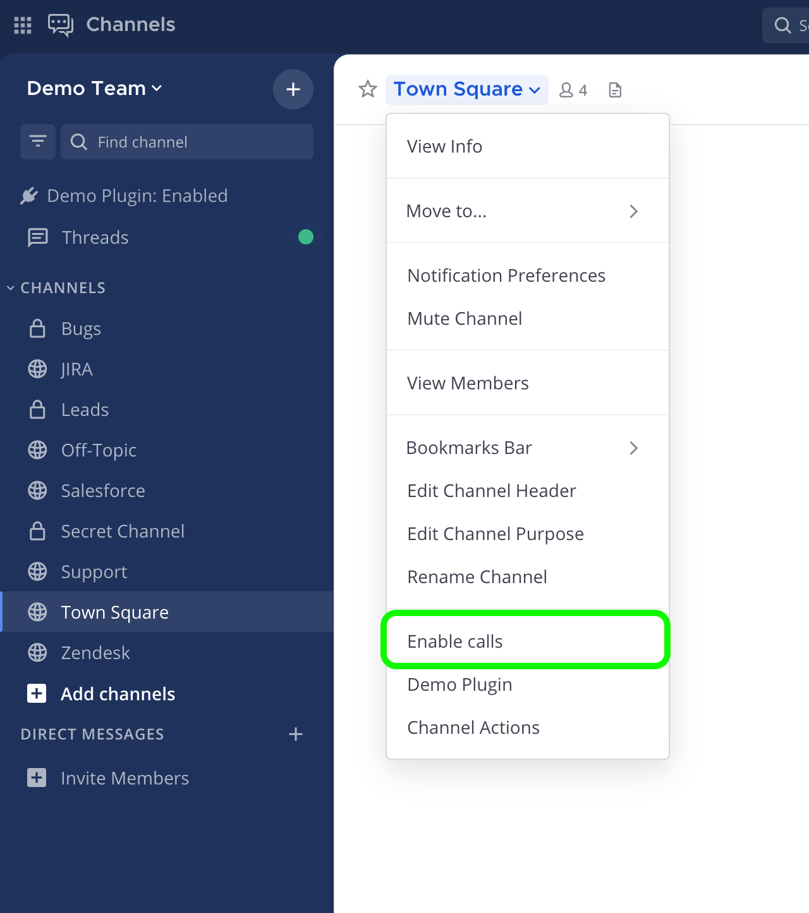

Calls self-hosted deployment
============================

.. include:: ../_static/badges/allplans-cloud-selfhosted.rst
  :start-after: :nosearch:

This document provides an overview of Mattermost Calls deployment options for self-hosted environments, including deployment architectures, key requirements, and important considerations.

.. toctree::
   :maxdepth: 1
   :hidden:

   calls-rtcd-setup
   calls-offloader-setup
   calls-metrics-monitoring
   calls-kubernetes
   calls-troubleshooting

Quick Links
----------

For detailed information on specific topics, please refer to these specialized guides:

- `RTCD Setup and Configuration <calls-rtcd-setup.html>`__: Comprehensive guide for setting up the dedicated RTCD service
- `Calls Offloader Setup and Configuration <calls-offloader-setup.html>`__: Comprehensive guide for setting up the calls-offloader service for recording and transcription
- `Calls Troubleshooting <calls-troubleshooting.html>`__: Detailed troubleshooting steps and debugging techniques
- `Calls Metrics and Monitoring <calls-metrics-monitoring.html>`__: Guide to monitoring Calls performance using metrics and observability
- `Calls Deployment on Kubernetes <calls-kubernetes.html>`__: Detailed guide for deploying Calls in Kubernetes environments

About Mattermost Calls
---------------------

Mattermost Calls provides integrated audio calling and screen sharing capabilities within Mattermost channels. It's built on WebRTC technology and can be deployed either:

1. **Integrated mode**: Built into the Calls plugin (simpler, suitable for smaller deployments)
2. **RTCD mode**: Using a dedicated service for improved performance and scalability (recommended for production environments)

Terminology
-----------

- `WebRTC <https://bloggeek.me/webrtcglossary/webrtc-2/>`__: The set of protocols on which calls are built
- **RTC**: Real-Time Connection channel used for media (audio/video/screen)
- **WS**: WebSocket connection used for signaling and connection setup
- **SFU**: Selective Forwarding Unit, routes media between participants
- `NAT <https://bloggeek.me/webrtcglossary/nat/>`__: Network Address Translation for mapping IP addresses
- `STUN <https://bloggeek.me/webrtcglossary/stun/>`__: Protocol used by WebRTC clients to help traverse NATs
- `TURN <https://bloggeek.me/webrtcglossary/turn/>`__: Protocol to relay media for clients behind strict firewalls

Key Components
-------------

- **Calls plugin**: The main plugin that enables calls functionality.  Installed by default in Mattermost self-hosted deployments.
- **RTCD service**: Optional dedicated service for offloading media processing (Enterprise feature).  Typically deployed to dedicated servers or containers. See `RTCD Setup and Configuration <calls-rtcd-setup.html>`__ for details.
- **calls-offloader**: Service for call recording and transcription (if enabled).  Typically deployed to dedicated servers. See `Calls Offloader Setup and Configuration <calls-offloader-setup.html>`__ for setup and troubleshooting details.

Network Requirements
------------------

The following network connectivity is required:

+-------------------+--------+-----------------+-------------------------+------------------------+
| Service           | Ports  | Protocols       | Source                  | Target                 |
+===================+========+=================+=========================+========================+
| Calls plugin API  | 80,443 | TCP (incoming)  | Mattermost clients      | Mattermost server      |
+-------------------+--------+-----------------+-------------------------+------------------------+
| RTC media         | 8443   | UDP (incoming)  | Mattermost clients      | Mattermost or RTCD     |
+-------------------+--------+-----------------+-------------------------+------------------------+
| RTC media         | 8443   | TCP (incoming)  | Mattermost clients      | Mattermost or RTCD     |
+-------------------+--------+-----------------+-------------------------+------------------------+
| RTCD API          | 8045   | TCP (incoming)  | Mattermost server       | RTCD service           |
+-------------------+--------+-----------------+-------------------------+------------------------+
| STUN              | 3478   | UDP (outgoing)  | Mattermost or RTCD      | STUN servers           |
+-------------------+--------+-----------------+-------------------------+------------------------+

For complete network requirements, see the `RTCD Setup and Configuration <calls-rtcd-setup.html>`__ guide.

Limitations
-----------

- All Mattermost customers can start, join, and participate in 1:1 audio calls with optional screen sharing.
- For group calls up to 50 concurrent users, Mattermost Enterprise, Professional, or Mattermost Cloud is required.
- Enterprise customers can also `record calls <https://docs.mattermost.com/collaborate/make-calls.html#record-a-call>`__, enable `live text captions <https://docs.mattermost.com/collaborate/make-calls.html#live-captions-during-calls>`__ during calls, and `transcribe recorded calls <https://docs.mattermost.com/collaborate/make-calls.html#transcribe-recorded-calls>`__. We recommend that Enterprise self-hosted customers looking for group calls beyond 50 concurrent users consider using the `dedicated RTCD service <#when-to-use-rtcd>`__.
- For Mattermost self-hosted deployments, System admins need to enable and configure the plugin `using the System Console <https://docs.mattermost.com/configure/plugins-configuration-settings.html#calls>`__. The default maximum number of participants is unlimited; however, we recommend a maximum of 50 participants per call. Maximum call participants is configurable by going to **System Console > Plugin Management > Calls > Max call participants**. Call participant limits greatly depends on instance resources. For more details, refer to the `Performance Considerations <#performance-considerations>`__ section below.

Configuration
-------------

For Mattermost self-hosted customers, the calls plugin is pre-packaged, installed, and enabled. Configuration to allow end-users to use it can be found in the `System Console </configure/plugins-configuration-settings.html#calls>`__.

Deployment Architecture Options
-----------------------------

Mattermost Calls can be deployed in several configurations:

Single Instance Deployments
~~~~~~~~~~~~~~~~~~~~~~~~~~

Integrated Mode
^^^^^^^^^^^^^

The WebRTC service runs within the Calls plugin on the Mattermost server.  This is the default mode when first installing the plugin on a single Mattermost instance setup. The WebRTC service is integrated in the plugin itself and runs alongside the Mattermost server.

.. image:: ../images/calls-deployment-image3.png
  :alt: Integrated configuration model of a single instance
  :width: 600px

RTCD Mode
^^^^^^^^

A dedicated RTCD service handles media routing, reducing load on the Mattermost server.

.. image:: ../images/calls-deployment-image7.png
  :alt: Web RTC deployment configuration
  :width: 600px

High Availability Deployments
~~~~~~~~~~~~~~~~~~~~~~~~~~~

Clustered Mode
^^^^^^^^^^^^

This is the default mode when running the plugin in a high availability cluster-based deployment. Every Mattermost node will run an instance of the plugin that includes a WebRTC service. Calls are distributed across all available nodes through the existing load-balancer: a call is hosted on the instance where the initiating websocket connection (first client to join) is made. A single call will be hosted on a single cluster node.

.. image:: ../images/calls-deployment-image5.png
  :alt: Clustered calls deployment
  :width: 600px

RTCD with High Availability
^^^^^^^^^^

Dedicated RTCD services handle media routing for high availability.

.. image:: ../images/calls-deployment-image2.png
  :alt: RTCD deployment with high availability
  :width: 600px

Kubernetes Deployments
~~~~~~~~~~~~~~~~~~~~

RTCD is the only officially supported approach for Kubernetes deployments. For detailed information on deploying Mattermost Calls in Kubernetes environments, including Helm chart configurations, resource requirements, and scaling considerations, see the `Calls Deployment on Kubernetes <calls-kubernetes.html>`__ guide.

When to Use RTCD
--------------

The dedicated RTCD service (available with Enterprise license) is recommended for:

- **Production environments**: Isolates call traffic from other Mattermost services
- **Performance optimization**: Dedicated service tuned for real-time media
- **Scalability**: Add RTCD instances as call volume grows
- **Call stability**: Calls continue even if Mattermost server needs to restart
- **Kubernetes deployments**: Required for officially supported Kubernetes deployments

For detailed RTCD setup instructions, see the `RTCD Setup and Configuration <calls-rtcd-setup.html>`__ guide.

Call Recording and Transcription
------------------------------

For call recording and transcription, you need to:

1. Deploy the ``calls-offloader`` service
2. Configure the service URL in the System Console
3. Enable call recordings and/or transcriptions in the plugin settings

Air-Gapped Deployments
---------------------

Mattermost Calls can function in air-gapped environments. Exposing Calls to the public internet is only necessary when users need to connect from outside the local network, and no existing method supports that connection. In such setups:

- Users should connect from within the private/local network. This can be done on-premises, through a VPN, or via virtual machines.
- Configuring a STUN server is unnecessary, as all connections occur within the local network.
- The ICE Host Override configuration setting can be optionally set with a local IP address (e.g., 192.168.1.45), depending on the specific network configuration and topology.

Performance Considerations
------------------------

Calls performance primarily depends on:

- **CPU resources**: More participants require more processing power
- **Network bandwidth**: Both incoming and outgoing traffic increases with participant count
- **Active speakers**: Unmuted participants require significantly more resources 

For detailed performance metrics, benchmarks, and monitoring guidance, see the `Calls Metrics and Monitoring <calls-metrics-monitoring.html>`__ guide.

Frequently Asked Questions
------------------------

**Is calls traffic encrypted?**  
Yes, using WebRTC security standards (DTLS/SRTP). Traffic is encrypted in transit.

**Are there any third-party services involved?**  
Only a Mattermost STUN server (``stun.global.calls.mattermost.com``) is used by default. This can be removed if you set the ICE Host Override configuration.

**Is using UDP a requirement?**  
UDP is recommended protocol to serve real-time media as it allows for the lowest latency between peers, but TCP fallback is supported since plugin version 0.17 and RTCD version 0.11.

If clients are unable to connect using UDP (due to limitations or strict firewalls), you have a few options:

- Since plugin version 0.17 and `rtcd` version 0.11 the RTC service will listen for TCP connections in addition to UDP ones. If configured correctly (e.g. using commonly allowed ports such as 80 or 443) it's possible to have clients connect directly through TCP when unable to do it through the preferred UDP channel.

- Run calls through an external TURN server that listens on TCP and relays all media traffic between peers. However, this is a sub-optimal solution that should be avoided if possible as it will introduce extra latency along with added infrastructural cost.

**Do I need a TURN server?**  
Only if clients are behind restrictive firewalls that block UDP. We recommend (and officially support) `coturn <https://github.com/coturn/coturn>`__ if needed.

**Can RTCD traffic be kept internal?**  
Yes, and it's recommended. Only the media ports need to be accessible to end-users.

**How will this work with an existing reverse proxy sitting in front of Mattermost?**

Generally clients should connect directly to either Mattermost or, if deployed, the dedicated ``rtcd`` service through the configured UDP port. However, it's also possible to route the traffic through an existing load balancer as long as this has support for routing the UDP protocol (e.g. nginx). Of course this will require additional configuration and potential changes to how the plugin is run as it won't be possible to load balance the UDP flow across multiple instances like it happens for HTTP.

**Do calls require a dedicated server to work or can they run alongside Mattermost?**

The plugin can function in different modes. By default calls are handled completely by the plugin which runs as part of Mattermost. It's also possible to use a dedicated service to offload the computational and bandwidth costs and scale further (Enterprise only).

See RTCD Setup and Configuration <calls-rtcd-setup.html> for more details on the dedicated RTCD service.

**Can the traffic between Mattermost and ``rtcd`` be kept internal or should it be opened to the public?**

When possible, it's recommended to keep communication between the Mattermost cluster and the dedicated ``rtcd`` service under the same private network as this can greatly simplify deployment and security. There's no requirement to expose ``rtcd``'s HTTP API to the public internet.

**Can Calls be rolled out on a per-channel basis?**

.. include:: ../_static/badges/selfhosted-only.rst
  :start-after: :nosearch:

Yes. Mattermost system admins running self-hosted deployments can enable or disable call functionality per channel. Once `test mode <https://docs.mattermost.com/configure/plugins-configuration-settings.html#test-mode>`__ is enabled for Mattermost Calls:

1. **Navigate to the channel** where you want to enable or disable Calls
2. **Access the channel menu** by clicking the channel name at the top of the channel
3. **Select the Calls option** from the dropdown menu:
   - Select **Enable calls** for each channel where you want Calls enabled
   - Select **Disable calls** for all channels where you want Calls disabled

Once Calls is enabled for specific channels, users can start making calls in those channels.

.. note::
   When `test mode <https://docs.mattermost.com/configure/plugins-configuration-settings.html#test-mode>`__ is disabled for Mattermost Calls, users in any Mattermost channel can make a call.

Troubleshooting
---------------

For comprehensive troubleshooting steps and debugging techniques, please refer to the `Calls Troubleshooting <calls-troubleshooting.html>`__ guide.

Next Steps
---------

1. For detailed setup instructions, see `RTCD Setup and Configuration <calls-rtcd-setup.html>`__
2. For monitoring guidance, see `Calls Metrics and Monitoring <calls-metrics-monitoring.html>`__
3. If you encounter issues, see `Calls Troubleshooting <calls-troubleshooting.html>`__
4. For Kubernetes deployments, see `Calls Deployment on Kubernetes <calls-kubernetes.html>`__