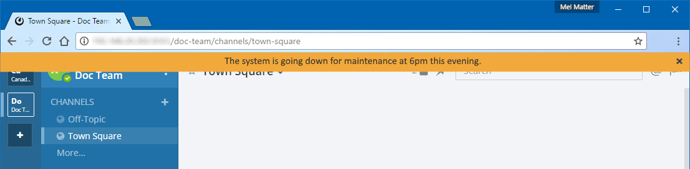

Site Configuration
==================

Announcement Banner
-------------------

You can display an announcement banner notification that's visible to all users on the system.

By default, users can dismiss the banner until they log in again or until you update the banner.

- Update the banner by either changing the text of the banner, or by re-enabling the banner after it's been disabled.
- You can also control the text color, the background color, and allow or prevent users from dismissing the banner.

To enable the banner:

1. Go to **System Console > Site Configuration > Announcement Banner**.
2. Set **Enable Announcement Banner** to **true**.
3. In the **Banner Text** field, enter the text of the announcement that you want to make.
4. Set banner background and text colors.
5. To prevent users from dismissing the banner, set **Allow Banner Dismissal** section to **false**.
6. Select **Save**.

Emoji
-----

Control custom emoji usage through the following three settings:

Under **System Console > Site Configuration > Emoji**:

- **Enable Emoji Picker:** An emoji picker allows users to select emojis to use with messages and as reactions. Enabling the emoji picker with a large number of custom emojis may slow down performance.
- **Enable Custom Emoji:** Control whether the **Custom Emoji** option is available from the **Main Menu** to manage customized emoji.

Select **Save** to apply your changes.

Under **System Console > Permissions > Edit Scheme**:

- Restrict management of custom emoji to specific roles, such as System Admins, Channel Admins, or Team Admins, or allow all users to create and/or delete their own custom emoji. 
- The **Create Custom Emoji** and **Delete Own Custom Emoji** permissions are grouped under **Integrations & Customizations**, and can be set for all members or specific roles. 

Select **Save** to apply your changes.

In-Product Notices
------------------

Mattermost in-product notices keep users and administrators informed of the newest product improvements, features, and releases. Notices are used to raise awareness of new features as part of our monthly release cadence. 

Users will only receive notices that specifically apply to them. For example, if a user is already running the latest Desktop App version, they will not receive an upgrade notice.

.. image:: ../images/notices.png
  :alt: Shows in-product notices for users and administrators.

Administrator Notices
^^^^^^^^^^^^^^^^^^^^^

System Admins may receive notices about recommended configuration options to optimize the user experience of their workspace. Disable admin notices by going to  **System Console > Site Configuration > Notices**, setting **Enable Admin Notices** to **false**, then selecting **Save**.

End User Notices
^^^^^^^^^^^^^^^^

End user notices are used to inform users and System Admins of new feature enhancements and when new desktop versions are available. Disable end user notices by going to **System Console > Site Configuration > Notices**, setting **Enable End User Notices** to **false**, then selecting **Save**.

Are notices enabled by default?
~~~~~~~~~~~~~~~~~~~~~~~~~~~~~~~

Notices are enabled by default for all Mattermost users. System Admins may choose to disable administrator or end user notices.

How often will users receive notices?
~~~~~~~~~~~~~~~~~~~~~~~~~~~~~~~~~~~~~

Notices are used to raise awareness of new features as part of Mattermost's release cadence. Users will only receive notices that specifically apply to them. For example, if a user is already running the latest Desktop App version, they will not receive an upgrade notice.

File Sharing and Downloads
--------------------------

Control file sharing and downloads in your workspace and on mobile devices using the following three settings under **System Console > Site Configuration > File Sharing and Downloads**:

- **Allow File Sharing:** When configuration is set to **false**, file sharing is disabled. All file and image uploads on messages are forbidden across clients and devices, including mobile.
- **Allow File Uploads on Mobile:** When configuration is set to **false**, disables file uploads on mobile apps. All file and image uploads on messages are forbidden across clients and devices, including mobile.
- **Allow File Downloads on Mobile:** When configuration is set to **false**, disables file downloads on mobile apps. Users can still download files from a mobile web browser.

Select **Save** to apply your changes.

Localization
------------

Mattermost is translated into 19 languages. Users can set their default language by going to **Account Settings > Display > Language**, then selecting **Save**.

New languages are added automatically by default. Users can add new languages using the dropdown menu manually as they become available. When manually adding new languages, the Default Client Language must be added before saving the setting.

Notifications
-------------

Control notifications using the following six settings under **System Console > Site Configuration > Notifications**: 

- **Show @channel and @all and group mention confirmation dialog:** Users will be prompted to confirm when posting @channel, @all, and group mentions in channels with over five members.
- **Email Notification Contents:** You can specify the content shown in email notifications. 

  - **Send full message contents** will include Sender name and channel in email notifications. 
  - **Send generic description with only sender name** will include the team name and name of the person who sent the message. No information about channel name or message contents, is included in email notifications. This is typically used for compliance reasons if Mattermost contains confidential information and policy dictates it cannot be stored in email.
- **Notification Display Name:** Set the name displayed on the email account used when sending notification emails from Mattermost.
- **Notification Reply-To Address:** Set the email address used in the Reply-To header when sending notification emails from Mattermost.
- **Notification Footer Mailing Address:** Set the name and mailing address displayed in the footer of email notifications from Mattermost, such as *ABC Corporation, 565 Knight Way, Palo Alto, California, 94305, USA*. If the field is left empty, the organization name and mailing address will not be displayed.
- **Push Notification Contents:** You can configure what information is provided in push notifications. 

  - **Generic description with only sender name** will include only the name of the person who sent the message but no information about channel name or message text. 
  - **Generic description with sender and channel names** will include names of users and channels but no specific details from the message text. 
  - **Full message content sent in the notification payload** will nclude the message contents in the push notification payload that is relayed through Apple's Push Notification Service (APNS) or Google's Firebase Cloud Messaging (FCM). It is highly recommended this option only be used with an "https" protocol to encrypt the connection and protect confidential information sent in messages.  
  - **Full message content fetched from the server on receipt** means the notification payload relayed through APNS or FCM contains no message content. Instead it contains a unique message ID used to fetch message content from the server when a push notification is received by a device. If the server cannot be reached, a generic notification will be displayed.

Select **Save** to apply your changes.

Posts
-----

Control content in posts using the following four settings under **System Console > Site Configuration > Posts**:

- **Enable Link Previews:** Link previews are previews of linked website content, image links, and YouTube videos that are displayed below posts when available.

  - System Admins can disable all website link previews, image link previews, and YouTube previews by changing this setting to **false**. System Admins can also disable link previews from specific domains.
  - When link previews are enabled, users can choose to show or hide website link previews from **Account Settings > Display > Website Link Previews**. 
- **Enable SVGs:** Controls whether users have the ability to see previews of SVG file attachments and SVG image links.
- **Enable LaTeX Rendering:** Controls users' ability to render LaTeX code.
- **Custom URL Schemes:** A list of URL schemes that are used for autolinking in message text. HTTP, HTTPS, FTP, tel, and mailto always create links.

You can also control whether all `in-line images <https://docs.mattermost.com/help/messaging/formatting-text.html#in-line-images>`__ over 100px in height are automatically collapsed or expanded in messages by setting a `user preference <https://docs.mattermost.com/help/settings/account-settings.html#link-previews>`__, or by using the ``/collapse`` and ``/expand`` `slash commands <https://docs.mattermost.com/cloud/cloud-integrations/cloud-slash-commands.html>`__. 

Select **Save** to apply your changes.

Users and Teams
---------------

Control the following users and teams settings under **System Console > Site Configuration > Users and Teams**:

- **Max Users Per Team:** Specify the size of the *team site* which is a workspace a *team of people* inhabits. 

  - A team of people is considered a small organization where people work closely together towards a specific shared goal and share the same etiquette. 
  - In the physical world, a team of people could typically be seated around a single table to have a meal and discuss their project. 
  - The default maximum of 1000 people is at the extreme high end of a single team of people where organizations are more often 'multiple teams of people'. Investments in explicitly defining etiquette, such as channel organization or turning on policy features in Enterprise Edition, are often used to scale the high levels of productivity found in a team of people using Mattermost to multiple teams of people.
- **Max Channels Per Team:** Set the maximum number of channels per team, including both active and deleted channels.
- **Enable users to open Direct Message channels with:** Configure whether users can message any user on the Mattermost workspace or only users in the same team as them.

  - This setting adjusts the users returned in the Direct Messages **More** menu. The CTRL/CMD+K channel switcher only lists users on the current team. 
  - This setting only affects the user interface, not permissions on the server. For instance, a Direct Message channel can be created with anyone on the server regardless of this setting.
- **Teammate Name Display:** Specify how names are displayed in the user interface by default. Please note that users can override this setting in **Account Settings > Display > Teammate Name Display**.

  - **Show username** displays the user's username. 
  - **Show nickname** if one exists displays the user's nickname. If the user does not have a nickname, their full name is displayed. If the user does not have a full name, their username is displayed. 
  - **Show first and last name:** displays the user's full name. If the user doesn't have a full name, their username is displayed. Recommended when using SAML or LDAP if first name and last name attributes are configured.
- **Lock Teammate Name Display for all users:** Specifies whether users can change settings under **Main Menu > Account Settings > Display > Teammate Name Display**.
- **Show Email Address:** When set to **false**, this setting hides a user's email address from other users, including Team Admins. This is designed for managing teams where users choose to keep their contact information private. System Admins will still be able to see email addresses in the user interface.
- **Show Full Name:** When set to **false**, this setting hides full name of users from other users including Team Admins. This is designed for managing teams where users choose to keep their contact information private. System Admins will still be able to see full names in the user interface.
- **Enable Custom Statuses:** Sets whether users can set descriptive status messages and emoji visible to all users.

Select **Save** to apply your changes.
