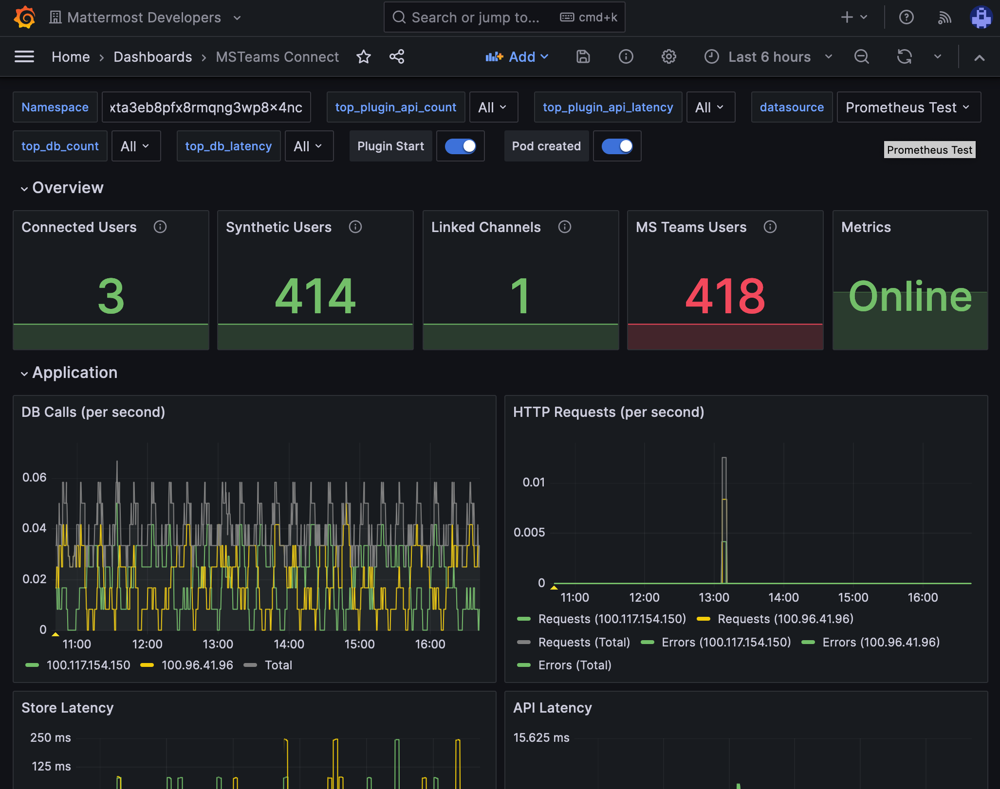

:orphan: :nosearch:

Setup starts in Mattermost, moves to Microsoft Teams, and ends in Mattermost.

Install the Microsoft Teams integration in Mattermost
~~~~~~~~~~~~~~~~~~~~~~~~~~~~~~~~~~~~~~~~~~~~~~~~~~~~~

.. important::

  These installation instructions assume you already have a Mattermost instance running PostgreSQL. Note that this Mattermost integration doesn't support MySQL databases.

1. Log in to your Mattermost workspace as a system administrator.
2. Download the latest version of `the plugin binary release <https://github.com/mattermost/mattermost-plugin-msteams/releases>`__, compatible with Mattermost v9.8.0 and later. If you are using an earlier version of Mattermost, :doc:`follow our documentation </upgrade/upgrading-mattermost-server>` to upgrade to Mattermost v9.8.0 or later.
3. Go to **System Console > Plugins > Plugin Management > Upload Plugin**, and upload the plugin binary you downloaded in the previous step.
4. Go to **System Console > Plugins > Plugin Management**. In the **Installed Plugins** section, scroll to **MS Teams**, and select **Enable Plugin**.

Set up an OAuth application in Azure
~~~~~~~~~~~~~~~~~~~~~~~~~~~~~~~~~~~~

1. Sign into `portal.azure.com <https://portal.azure.com>`_ using an admin Azure account.
2. Navigate to `App Registrations <https://portal.azure.com/#blade/Microsoft_AAD_IAM/ActiveDirectoryMenuBlade/RegisteredApps>`_.
3. Select **New registration** at the top of the page.

  .. image:: ../images/new-azure-registration.png
    :alt: In Azure, create a new app registration.

4. Fill out the form with the following values:

 - **Name**: ``Mattermost MS Teams``
 - **Supported account types**: ``Default value (Single tenant)``
 - **Platform**: ``Web``
 - **Redirect URI**: ``https://(MM_SITE_URL)/plugins/com.mattermost.msteams/oauth-redirect``

Replace ``(MM_SITE_URL)`` with your Mattermost server's Site URL. Select **Register** to submit the form.

  .. image:: ../images/register-azure-app.png
    :alt: In Azure, register the new Mattermost app.

5. Navigate to **Certificates & secrets** in the left pane.

6. Select **New client secret**. Enter the description and select **Add**. After the creation of the client secret, copy the new secret value, not the secret ID. We'll use this value later in the Mattermost System Console.

  .. image:: ../images/azure-certs-secrets.png
    :alt: In Azure, enter client secret details.

7. Navigate to **API permissions** in the left pane.

8. Select **Add a permission**, then **Microsoft Graph** in the right pane.

  .. image:: ../images/azure-configured-permissions.png
    :alt: In Azure, manage API permissions for the Mattermost app.

9. Select **Delegated permissions**, and scroll down to select the following permissions:

 - ``Channel.ReadBasic.All``
 - ``ChannelMessage.Read.All``
 - ``ChannelMessage.ReadWrite``
 - ``ChannelMessage.Send``
 - ``Chat.Create``
 - ``Chat.ReadWrite``
 - ``ChatMessage.Read``
 - ``Directory.Read.All``
 - ``Files.Read.All``
 - ``Files.ReadWrite.All``
 - ``offline_access``
 - ``Team.ReadBasic.All``
 - ``User.Read``

10. Select **Add permissions** to submit the form.

11. Next, add application permissions via **Add a permission > Microsoft Graph > Application permissions**.

12. Select the following permissions:

 - ``Channel.ReadBasic.All``
 - ``ChannelMessage.Read.All``
 - ``Chat.Read.All``
 - ``Files.Read.All``
 - ``Group.Read.All``
 - ``Team.ReadBasic.All``
 - ``User.Read.All``
 - ``Application.ReadWrite.OwnedBy`` (or ``Application.Read.All``)

13. Select **Add permissions** to submit the form.

14. Select **Grant admin consent for...** to grant the permissions for the application.

Ensure you have the metered APIs enabled (and the pay subscription associated to it)
~~~~~~~~~~~~~~~~~~~~~~~~~~~~~~~~~~~~~~~~~~~~~~~~~~~~~~~~~~~~~~~~~~~~~~~~~~~~~~~~~~~~

Follow the steps here: https://learn.microsoft.com/en-us/graph/metered-api-setup

.. important::

  If you don't configure the metered APIs, you must use the **Evaluation model** (configurable in Mattermost) that is limited to a low rate of changes per month. We strongly recommend that you avoid using the Evaluation model configuration in live production environments because you can stop receiving messages due the rate limit. See `this Microsoft documentation <https://learn.microsoft.com/en-us/graph/teams-licenses>`__ for more details.

You're all set for configuration inside Azure.

Mattermost configuration
~~~~~~~~~~~~~~~~~~~~~~~~~

With the Tenant ID, Client ID, and Client secret noted above, the Mattermost plugin is ready for configuration. See the :ref:`Microsoft Teams plugin configuration settings <configure/plugins-configuration-settings:ms teams>` documentation for support in completing the base configuration.

Monitor performance
~~~~~~~~~~~~~~~~~~~~

You can set up :doc:`performance monitoring </scale/deploy-prometheus-grafana-for-performance-monitoring>` and :doc:`performance alerting </scale/performance-alerting>` for this plugin using Prometheus and Grafana.

- Monitoring enables you to proactively review the overall health of the plugin, including database calls, HTTP requests, and API latency.
- Alerting enables you to detect and take action as issues come up, such as the integration being offline.

Grafana dashboards `are available on GitHub <https://github.com/mattermost/mattermost-plugin-msteams/blob/main/server/metrics/dashboards/cloud.json>`__ for Mattermost Cloud deployments as a useful starting point. These dashboards are designed for use in Mattermost Cloud, and filter to a given ``namespace``. 

.. note:: 
  
  Modifications will be necessary for self-hosted Mattermost deployments. Talk to a `Mattermost Expert <https://mattermost.com/contact-sales/>`_ for assistance.
