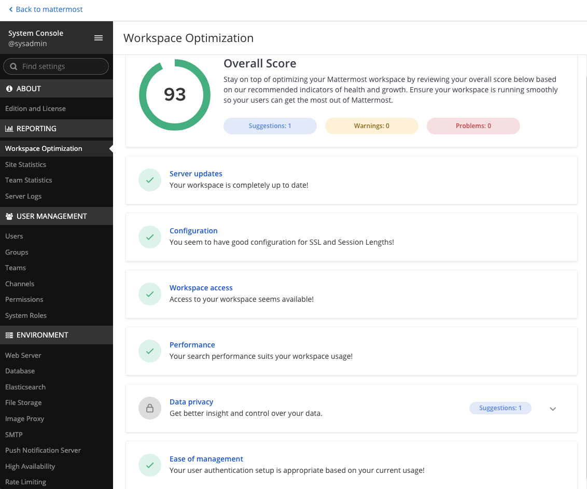

Optimize your Mattermost workspace
==================================

.. include:: ../_static/badges/allplans-cloud-selfhosted.rst
  :start-after: :nosearch:

With workspace optimizations, System Admins can review their workspace health and growth scores, then take advantage of recommended actions for ensuring their workspace is running smoothly and teams are maximizing productivity.

System Admins can access their workspace optimization page in the System Console by going to **Reporting > Workspace Optimization**.

How is the overall score calculated?
------------------------------------

The highest score possible is 100. Your score is calculated based on the type of issue reported and the level of potential security risk introduced to your Mattermost deployment if ignored.

Each item on the dashboard is calculated based on its individual impact score. These differ depending on whether they're problems, warnings, or suggestions. For example, if SSL encryption isn't configured in your workspace, Mattermost reports that as a problem, which reduces your score until it's addressed.

Warnings impact your score less than problems, and suggestions have the least impact on your score.

Want to improve your overall workspace optimization score? Take action towards the problems, warnings, and suggestions reported on this dashboard. We recommend the following workspace optimizations.

Recommendations
---------------

The following optimization areas can alert you to workspace suggestions, warnings, or problems that may require your attention:

+-----------------------+----------------------------------------------------------------------------------------------------------+----------------------------------------------------------------------------------------------------------------------------------------------------------------------+
| Optimization category | Suggestions, Warnings, or Problems Detected                                                              | Additional Information                                                                                                                                               |
+=======================+==========================================================================================================+======================================================================================================================================================================+
| Mattermost release    | Are you on the latest Mattermost release?                                                                | You're notified when updates are available.                                                                                                                          |
|                       |                                                                                                          | See the :doc:`Upgrade Mattermost </upgrade/upgrading-mattermost-server>` product documentation for details on upgrading your workspace.                              |
+-----------------------+----------------------------------------------------------------------------------------------------------+----------------------------------------------------------------------------------------------------------------------------------------------------------------------+
| Configuration issues  | - **SSL**: Should your workspace be more secure with SSL?                                                | See the product documentation to learn more:                                                                                                                         |
|                       |                                                                                                          |                                                                                                                                                                      |
|                       | - **Session Length**: The default value may not provide an optimal user experience.                      | - :doc:`Set up SSL </onboard/ssl-client-certificate>`                                                                                                                |
|                       |                                                                                                          | - :ref:`Configure session length <configure/environment-configuration-settings:session lengths>`                                                                     |
|                       | - **File Storage**: Write access to the configured file storage location is required.                    | - :ref:`Configure file storage <configure/environment-configuration-settings:file storage>`                                                                          |
|                       |                                                                                                          |                                                                                                                                                                      |
|                       | .. include:: ../_static/badges/academy-file-storage.rst                                                  |                                                                                                                                                                      |
|                       |    :start-after: :nosearch:                                                                              |                                                                                                                                                                      |
+-----------------------+----------------------------------------------------------------------------------------------------------+----------------------------------------------------------------------------------------------------------------------------------------------------------------------+
| Workspace access      | Is the Mattermost workspace may not be accessible to users?                                              | If your web server settings don't pass a live URL test, your workspace may not be accessible to others.                                                              |
|                       |                                                                                                          | See the :doc:`Environment Configuration Settings </configure/web-server-configuration-settings>` product documentation to learn more:                                |
+-----------------------+----------------------------------------------------------------------------------------------------------+----------------------------------------------------------------------------------------------------------------------------------------------------------------------+
| Search performance    | As your user base grows, is search getting slower?                                                       | See the :doc:`Elasticsearch </scale/elasticsearch>` product documentation to learn more.                                                                             |
+-----------------------+----------------------------------------------------------------------------------------------------------+----------------------------------------------------------------------------------------------------------------------------------------------------------------------+
| Data privacy          | Do you need more control and insights into your data?                                                    | See the product documentation to learn more:                                                                                                                         |
|                       |                                                                                                          |                                                                                                                                                                      |
|                       |                                                                                                          | - :doc:`Data Retention </comply/data-retention-policy>`                                                                                                              |
|                       |                                                                                                          | - :doc:`Compliance Export </comply/compliance-export>`                                                                                                               |
+-----------------------+----------------------------------------------------------------------------------------------------------+----------------------------------------------------------------------------------------------------------------------------------------------------------------------+
| User authentication   | - **AD/LDAP**: As your user base grows, would you benefit from easier onboarding,                        | See the product documentation to learn more:                                                                                                                         |
|                       |   automated deactivations, and role assignments?                                                         |                                                                                                                                                                      |
|                       |                                                                                                          | - :ref:`AD/LDAP <configure/authentication-configuration-settings:ad/ldap>`                                                                                           |
|                       | - **Guest accounts**: Do you want to control user access to channels and teams with guest accounts?      | - :doc:`Guest accounts </onboard/guest-accounts>`                                                                                                                    |
+-----------------------+----------------------------------------------------------------------------------------------------------+----------------------------------------------------------------------------------------------------------------------------------------------------------------------+
