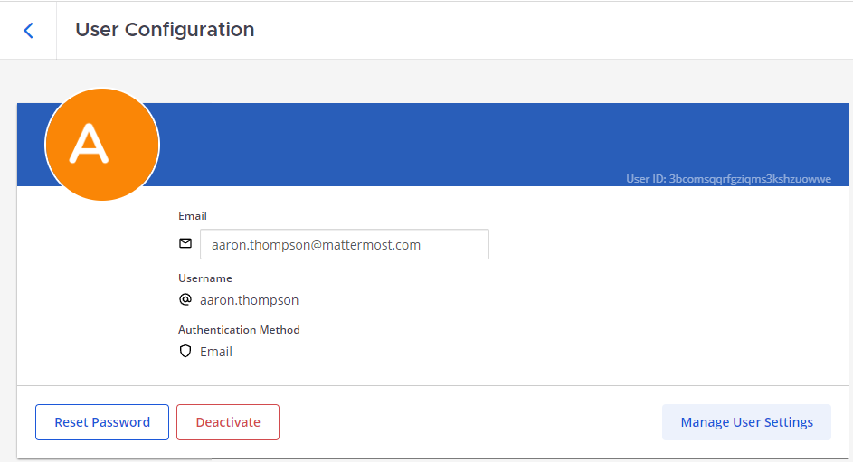
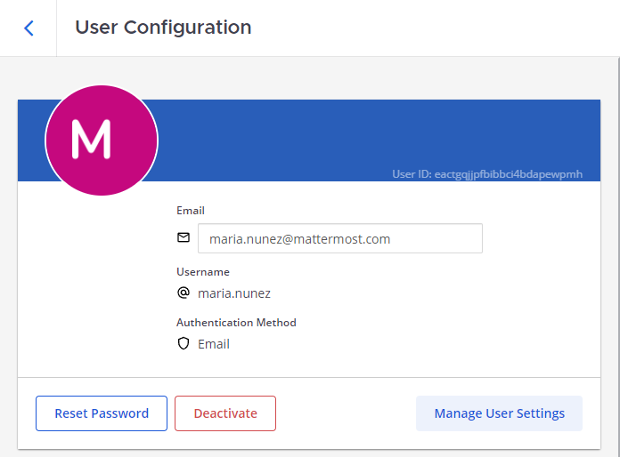
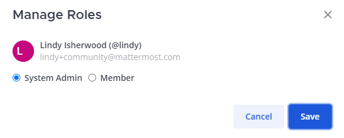
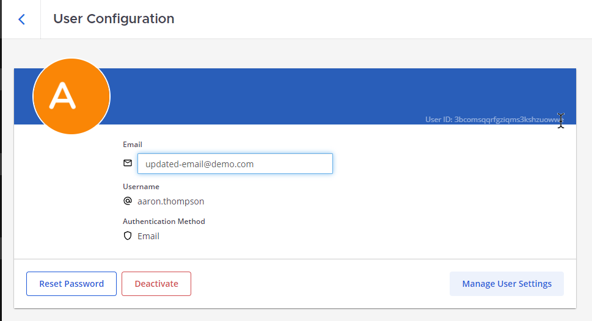
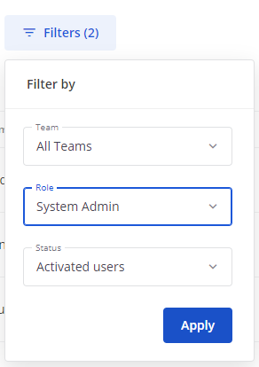

User management configuration settings
======================================

.. include:: ../_static/badges/allplans-cloud-selfhosted.rst
  :start-after: :nosearch:

Manage your Mattermost users including their access permissions, groups, teams, channels, as well as their access to the System Console. Configure this feature in the System Console by going to **User Management**:

- `Users <#users>`__
- `Groups <#groups>`__
- `Teams <#teams>`__
- `Channels <#channels>`__
- `Permissions <#permissions>`__
- `System roles <#system-roles>`__

----

Users
-----

.. raw:: html

 
Also available in legacy Mattermost Enterprise Edition E10 or E20

Getting people set up with a Mattermost account is typically something that system admins do when deploying and configuring the Mattermost workspace. A Mattermost admin can :doc:`provision Mattermost users </onboard/user-provisioning-workflows>` using one or more of the following methods:

- :ref:`Enable account creation <configure/authentication-configuration-settings:enable account creation>`.
- Use :ref:`mmctl user create <manage/mmctl-command-line-tool:mmctl user create>` or Mattermost `APIs <https://api.mattermost.com/#tag/users>`__ to create user accounts.
- :ref:`Migrate user accounts <onboard/migrating-to-mattermost:migration guide>` from other collaboration systems and :doc:`bulk load </onboard/bulk-loading-data>` that user data into Mattermost.
- Connect an authentication service to assist with user provisioning, such as :doc:`AD/LDAP authentication </onboard/ad-ldap>` or :doc:`SAML authentication </onboard/sso-saml>`.

+----------------------------------------------------------------+-------------------------------------------------------------+
| Manage activated and deactivated users, revoke all user        | - System Config path: **User Management > Users**           |
| sessions, access individual users to view their User ID,       | - ``config.json setting``: N/A                              |
| add users to other teams, and view the teams they are on,      | - Environment variable: N/A                                 |
| and what their role is on a team.                              |                                                             |
+----------------------------------------------------------------+-------------------------------------------------------------+
| **Note**: You can search for users by partial first name, last name, nickname, or username.                                  |
+----------------------------------------------------------------+-------------------------------------------------------------+

Identify a User's ID
~~~~~~~~~~~~~~~~~~~~~

Users can be specified in Mattermost by username or user ID. Usernames automatically resolve when a match is detected.
System admins can identify a user's ID using the System Console or Mattermost API or mmctl.

Use the System Console
^^^^^^^^^^^^^^^^^^^^^^

1. Go to **System Console > User Management > Users** to access all user accounts. 
2. Select a **User** to review their ID in the User Configuration page. 

.. tip::
  
  From Mattermost v9.6, you can:
  
  - Customize this page by showing or hiding user details, including email address, member duration, last login, activity, or post, number of days active (PostgreSQL only), and number of messages posted (PostgreSQL only). You can also control how many user records display on the page at a time.
  - Search for specific users by entering a partial or full username, first name, last name, or email address in the **Search** field and pressing :kbd:`Enter`.
  - Filter users by team, role, or status.
  - Filter users by activity timeframes, including the last 30 days, the previous month, and the last 6 months.
  - Mattermost Enterprise and Professional customers can also export user data as a CSV report. You'll receive the report as a direct message in Mattermost.

Use the API
^^^^^^^^^^^

Use the API when you want to automate user-related tasks, or integrate with external systems.

Make an HTTP GET request to the following endpoint: ``https://your-mattermost-url/api/v4/users/username/username_here``.
Replace ``your-mattermost-url`` with the URL of your Mattermost instance and ``username_here`` with the username you are looking for.

The API response contains a JSON object that includes the user's ID among other details.

Use mmctl
^^^^^^^^^

If you prefer command-line tools, Mattermost offers mmctl for system administration.

In a terminal window, use the following command to list all users and their IDs: ``mmctl user list`` to return a list of user IDs.

Find Users
~~~~~~~~~~

System Admins can find a user using the System Console.

Use the System Console
^^^^^^^^^^^^^^^^^^^^^^

1. Go to **System Console > User Management > Users** to access all user accounts.
2. Type the name of the user or the username or the user ID in the **Search users** box to find the particular user, if they exist.

.. image:: ../images/find-users.png
  :alt: In System Console, find a User under User Management.

Activate or deactivate users
~~~~~~~~~~~~~~~~~~~~~~~~~~~~

If you need to remove a user from your Mattermost deployment, you can deactivate the user account. Deactivated users have an deactivated status, are logged out of Mattermost as soon as they are deactivated, and deactivated users can no longer log back in. While a user account is deactivated, you can manage the user's role, password, and email address.

Use the System Console
^^^^^^^^^^^^^^^^^^^^^^

1. Go to **System Console > User Management > Users** to access all user accounts.
2. Select a **User** that you wish to activate/deactivate.
3. If the selected user is currently active, you can find the **Deactivate** button in the **User Configuration** page.
4. Click on the **Deactivate** button and then select **Deactivate** on the pop-up dialog box to deactivate the user.

.. image:: ../images/deactivate-user.png
  :alt: In System Console, deactivate a User under User Management.

5. If the user is deactivated, click on the **Activate** button to re-activate the user.

Manage user roles
~~~~~~~~~~~~~~~~~

Admins can choose to apply roles to users using the System Console. The current available roles are **System Admin** and **Member**.

Use the System Console
^^^^^^^^^^^^^^^^^^^^^^

1. Go to **System Console > User Management > Users** to access all user accounts.
2. Under the **Actions** column for the specific user, select **Manage roles** from the dropdown.
3. Choose the required role for the current user in the pop-up dialog box and then click on **Save**.

Manage user teams
~~~~~~~~~~~~~~~~~

Admins can choose to add or remove a user from a team using the System Console.

Use the System Console
^^^^^^^^^^^^^^^^^^^^^^

1. Go to **System Console > User Management > Users** to access all user accounts.
2. Select the user for which you want to manage the teams.
3. You have the option to include the user in either a new team or a group of teams. Simply click on the **Add Team** button, select the desired new team(s) in the pop-up dialog box, and then click **Add** to complete the process of adding the user to them.

.. image:: ../images/add-user-to-team.png
  :alt: In System Console, Add a User to a Team under User Management.

4. If you wish to remove the user from a certain team, then click on the **three horizontal dots** against that team name in the **User Cofiguration** page and select **Remove from team** from the dropdown.

.. image:: ../images/remove-user-from-team.png
  :alt: In System Console, Remove a User from a Team under User Management.

You can also remove the user from a certain team using the **Actions** column for the specific user on the **Users** page. Select **Manage Teams** from the **Actions** column dropdown and click on **Remove from Team** for the team(s) that you wish to remove the user from.

Update user's email
~~~~~~~~~~~~~~~~~~~

Admins can update the emails of users using the System Console.

Use the System Console
^^^^^^^^^^^^^^^^^^^^^^

1. Go to **System Console > User Management > Users** to access all user accounts.
2. Select the user from the list and then type the new email in the **Email** input box on the **User Configuration**  page for that user.
3. Click on **Save** to update it.

You can also update the email using the **Actions** column for the specific user on the **Users** page. Select **Update email** from the **Actions** column dropdown, enter the new email for the user in the pop-up dialog box and click on **Reset** to update it.

Reset user's password
~~~~~~~~~~~~~~~~~~~

Admins can reset the password for a user using the System Console.

Use the System Console
^^^^^^^^^^^^^^^^^^^^^^

1. Go to **System Console > User Management > Users** to access all user accounts.
2. Select the user from the list and then click on **Reset Password** button on the **User Configuration** page.
3. Enter the new password in the pop-up dialog box and click on **Reset** to save.

.. image:: ../images/user-password-reset.png
  :alt: In System Console, Reset the password of a User under User Management.

You can also reset the password using the **Actions** column for the specific user on the **Users** page. Select **Reset password** from the **Actions** column dropdown, enter the new password in the pop-up dialog box and click on **Reset** to save it.

Revoke a user's session
~~~~~~~~~~~~~~~~~~~~~~~

Admins can revoke the user sessions in case of an emergency to secure the user account using the System Console. This logs the user out of all devices.

Use the System Console
^^^^^^^^^^^^^^^^^^^^^^

1. Go to **System Console > User Management > Users** to access all user accounts.
2. Under the **Actions** column for the specific user, select **Remove sessions** from the dropdown.
3. Click **Revoke** on the pop-up that appears to remove all sessions for that user.

.. image:: ../images/revoke-user-session.png
  :alt: In System Console, Revoke the sessions of a User under User Management.

Review user profile details
~~~~~~~~~~~~~~~~~~~~~~~~~~~

Admins can view the profile details of a user using the System Console. This allows the admins to gather info like the user ID, username, email, authentication method and the team memberships of a particular user.

Use the System Console
^^^^^^^^^^^^^^^^^^^^^^

1. Go to **System Console > User Management > Users** to access all user accounts.
2. Select the user from the list to view its **User Configuration** page.
3. Browse the profile details of the user on that page.

.. image:: ../images/user-profile-details.png
  :alt: In System Console, Review the details of a User under User Management.

Filter user searches
~~~~~~~~~~~~~~~~~~~~~~~~~~~

Admins can use different filters to retrieve user(s) based on the team memberships, role and the user status using the System  Console. This helps to narrow down the list of users and find the essential ones as and when required.

Use the System Console
^^^^^^^^^^^^^^^^^^^^^^
1. Go to **System Console > User Management > Users** to access all user accounts.
2. Now click on **Filters**, available to the right of the **Search users** box, to browse and choose different filter types.
3. Click on **Apply** to use those filters and narrow down the available user list to the matching ones only.

----

Groups
------

.. raw:: html

 
Also available in legacy Mattermost Enterprise Edition E20

+---------------------------------------------------------------+-------------------------------------------------------------+
| Manage default teams and channels by linking AD/LDAP groups   | - System Config path: **User Management > Groups**          |
| to Mattermost groups.                                         | - ``config.json setting``: N/A                              |
|                                                               | - Environment variable: N/A                                 |
+---------------------------------------------------------------+-------------------------------------------------------------+
| See the :doc:`AD/LDAP groups </onboard/ad-ldap-groups-synchronization>` documentation for                                   |
| details.                                                                                                                    |
+---------------------------------------------------------------+-------------------------------------------------------------+

----

Teams
-----

.. raw:: html

 
Also available in legacy Mattermost Enterprise Edition E20

+---------------------------------------------------------------+-------------------------------------------------------------+
| Manage team settings, including group synchronization for     | - System Config path: **User Management > Teams**           |
| teams.                                                        | - ``config.json setting``: N/A                              |
|                                                               | - Environment variable: N/A                                 |
+---------------------------------------------------------------+-------------------------------------------------------------+
| See the :ref:`using AD/LDAP synchronized groups to manage team or private channel membership                                |
| <onboard/ad-ldap-groups-synchronization:synchronize ad/ldap groups to mattermost>` documentation for details.               |
+---------------------------------------------------------------+-------------------------------------------------------------+

----

Channels
--------

.. raw:: html

 
Also available in legacy Mattermost Enterprise Edition E20

+-------------------------------------------------------------------------+-------------------------------------------------------------+
| Manage channel settings, including group synchronization on channels.   | - System Config path: **User Management > Channels**        |
|                                                                         | - ``config.json setting``: N/A                              |
|                                                                         | - Environment variable: N/A                                 |
+-------------------------------------------------------------------------+-------------------------------------------------------------+
| **Notes**:                                                                                                                            |
|                                                                                                                                       |
| - Channels can be deleted with all content, including posts in the database, using the `mmctl channel delete </manage/mmctl-command-  |
|   line-tool.html#mmctl-channel-delete>`__ tool.                                                                                       |
| - You can search for channels by channel name or by channel ID.                                                                       |
+-------------------------------------------------------------------------+-------------------------------------------------------------+

----

Permissions
-----------

.. include:: ../_static/badges/ent-pro-only.rst
  :start-after: :nosearch:

.. raw:: html

 
Also available in legacy Mattermost Enterprise Edition E10 or E20

+---------------------------------------------------------------------+-------------------------------------------------------------+
| Restrict actions in Mattermost to authorized users only.            | - System Config path: **User Management > Permissions**     |
|                                                                     | - ``config.json setting``: N/A                              |
|                                                                     | - Environment variable: N/A                                 |
+---------------------------------------------------------------------+-------------------------------------------------------------+
| See :doc:`advanced permissions </onboard/advanced-permissions>` documentation for details                                         |
+---------------------------------------------------------------------+-------------------------------------------------------------+

----

System roles
------------

.. raw:: html

 
Also available in legacy Mattermost Enterprise Edition E10 or E20

+----------------------------------------------------------------------+------------------------------------------------------------+
| Restrict System Console access to authorized users only.             | - System Config path: **User Management > System Roles**   |
|                                                                      | - ``config.json setting``: N/A                             |
|                                                                      | - Environment variable: N/A                                |
+----------------------------------------------------------------------+------------------------------------------------------------+
| See :doc:`additional system admin roles </onboard/system-admin-roles>` documentation for details                                  |
+----------------------------------------------------------------------+------------------------------------------------------------+