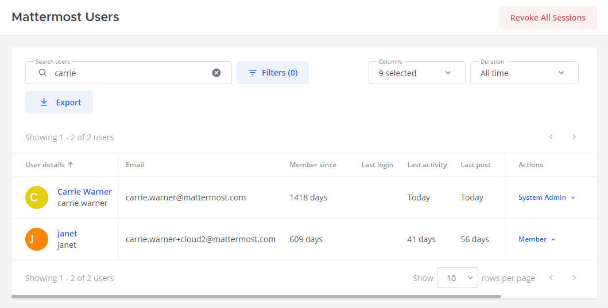
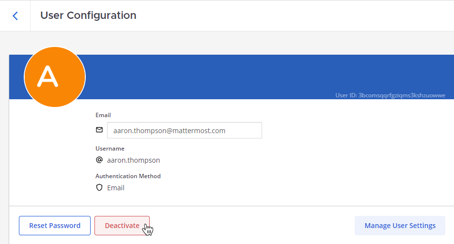

User management configuration settings
======================================

.. include:: ../_static/badges/allplans-cloud-selfhosted.rst
  :start-after: :nosearch:

.. |more-icon| image:: ../images/dots-horizontal_F01D8.svg
  :alt: You can access more options from the More icon.
  :class: theme-icon

Manage your Mattermost users including their access permissions, groups, teams, channels, as well as their access to the System Console. Access user management options in the System Console by going to **User Management**:

- `Users <#users>`__
- `Groups <#groups>`__
- `Teams <#teams>`__
- `Channels <#channels>`__
- `Permissions <#permissions>`__
- `System roles <#system-roles>`__

----

Users
-----

.. raw:: html

 
Also available in legacy Mattermost Enterprise Edition E10 or E20

Mattermost system admins can provision and manage user accounts, team membership, roles and permissions, and update user email addresses.

Provision users
~~~~~~~~~~~~~~~

Getting people set up with a Mattermost account is typically something that system admins do when deploying and configuring the Mattermost workspace. A Mattermost admin can :doc:`provision Mattermost users </onboard/user-provisioning-workflows>` using one or more of the following methods:

- :ref:`Enable account creation <configure/authentication-configuration-settings:enable account creation>`.
- Use :ref:`mmctl user create <manage/mmctl-command-line-tool:mmctl user create>` or Mattermost `APIs <https://api.mattermost.com/#tag/users>`__ to create user accounts.
- :ref:`Migrate user accounts <onboard/migrating-to-mattermost:migration guide>` from other collaboration systems and :doc:`bulk load </onboard/bulk-loading-data>` that user data into Mattermost.
- Connect an authentication service to assist with user provisioning, such as :doc:`AD/LDAP authentication </onboard/ad-ldap>` or :doc:`SAML authentication </onboard/sso-saml>`.

Find users
~~~~~~~~~~

You can find a user using the System Console.

1. Go to **System Console > User Management > Users** to access all user accounts.
2. Type the name of the user or the username or the user ID in the **Search users** box to find the particular user, if they exist.

.. tip::

  From Mattermost v9.6, you can:

  - Customize this page by showing or hiding user details, including email address, member duration, last login, activity, or post, number of days active (PostgreSQL only), and number of messages posted (PostgreSQL only). You can also control how many user records display on the page at a time.
  - Search for specific users by entering a partial or full username, first name, last name, or email address in the **Search** field and pressing :kbd:`Enter`.

Identify a user's ID
^^^^^^^^^^^^^^^^^^^^

Users can be specified in Mattermost by username or user ID. Usernames automatically resolve when a match is detected.
You can identify a user's ID using the System Console, the Mattermost API, or mmctl.

1. Go to **System Console > User Management > Users** to access all user accounts. 
2. Select a **User** to review their ID in the User Configuration page. 

.. image:: ../images/user-id.png
  :alt: Find the User ID under User Management using the System Console.

Alternatively, identify a user's ID using the Mattermost API or mmctl:

- Using the Mattermost API, make an HTTP GET request to the following endpoint: ``https://your-mattermost-url/api/v4/users/username/username_here``. Replace ``your-mattermost-url`` with the URL of your Mattermost instance and ``username_here`` with the username you are looking for. The API response contains a JSON object that includes the user's ID among other details.
- Using mmctl, in a terminal window, use the following command to list all users and their IDs: ``mmctl user list`` to return a list of user IDs.

Filter user searches
~~~~~~~~~~~~~~~~~~~~

You can filter System Console user searches to narrow down results based on the team membership, role, and user status.

1. Go to **System Console > User Management > Users** to access all user accounts.
2. Select **Filters** located to the right of the **Search users** field to access available filter options.
3. Select **Apply** to filter user search results.

.. image:: ../images/user-search-filters.png
  :alt: Filter the user list based on team membership, role, and user status using the System Console.

.. tip::

  From Mattermost v9.6, you can also:

  - Filter users by activity timeframes, including the last 30 days, the previous month, and the last 6 months.
  - Mattermost Enterprise and Professional customers can export user data as a CSV report. You'll receive the report as a direct message in Mattermost.

Activate or deactivate users
~~~~~~~~~~~~~~~~~~~~~~~~~~~~

To delete a user from your Mattermost deployment, you can deactivate the user's account. Deactivated users have an deactivated status, are logged out of Mattermost as soon as they are deactivated, and deactivated users can no longer log back in. You can manage the user's role, password, and email address while a user's account is deactivated.

1. Go to **System Console > User Management > Users** to access all user accounts.
2. Select a **User** that you wish to activate/deactivate.
3. If the selected user is currently active, you can find the **Deactivate** button in the **User Configuration** page.
4. Select **Deactivate**, and confirm the deactivation.

You can re-activate a deactivated user by selecting **Activate**.

.. image:: ../images/activate-user.png
  :alt: Activate a user in Mattermost using the System Console.

What happens to deactivated user integrations?
^^^^^^^^^^^^^^^^^^^^^^^^^^^^^^^^^^^^^^^^^^^^^^

.. important::

  If you deactivate a Mattermost user who has integrations tied to their user account, consider the following consequences and recommendations based on the integration type:

  - **Slash commands** will continue to work after user deactivation. Consider deleting the existing slash command and creating a new slash command associated with a different user account to decouple sensitive token data from the deactivated user account. Alternatively, consider regenerating the token of the existing slash command. Check that the deactivated user doesn't have access to the slash command **Request URL** which is the callback URL to receive the HTTP POST or GET event request when the slash command is run.
  - **Outgoing webhooks** will continue to work after user deactivation. Consider regenerating the webhook token and check that the deactivated user no longer has access to the callback URLs, as having access would result in the deactivating user receiving the outgoing webhooks.
  - **Incoming webhooks** will continue to work after user deactivation. Because the `URL produced <https://developers.mattermost.com/integrate/webhooks/incoming/#create-an-incoming-webhook>`_ includes ``xxx-generatedkey-xxx``, anyone who has the URL can post messages to the Mattermost instance. We recommend removing the incoming webhook and creating a new one associated with a different user account. 
  - **Bot accounts** won't continue to work after user deactivation when the :ref:`disable bot accounts when owner is deactivated <configure/integrations-configuration-settings:disable bot accounts when owner is deactivated>` is enabled. This configuration setting is enabled by default.
  - **OAuth apps** won't continue to work after user deactivation, and associated tokens are deleted. Manual action is needed to keep these integrations running.

Manage user's roles
~~~~~~~~~~~~~~~~~~~~

Apply roles to users using the System Console. The current available roles are **System admin** and **Member**.

1. Go to **System Console > User Management > Users** to access all user accounts.
2. Under **Actions**, select **Manage roles**.
3. Specify whether the user has the role of **System admin** or **Member**, and then select **Save**.

.. image:: ../images/manage-roles.png
  :alt: Manage a user's Mattermost role using the System Console.

Manage user's settings
~~~~~~~~~~~~~~~~~~~~~~

.. include:: ../_static/badges/ent-only.rst
  :start-after: :nosearch:

From Mattermost v9.11, system admins can help end users customize their Mattermost notifications by editing the user's :doc:`notification settings </preferences/manage-your-notifications>` on the user's behalf within the System Console. Users can view, modify, and override their own settings at any time.

1. Go to **System Console > User Management > Users** to access all user accounts.
2. Select the user you want to manage.
3. Select **Manage User Settings**.
4. In **Admin Mode**, modify the user's settings as needed. Saved changes take effect immediately in the user's account.

Manage user's teams
~~~~~~~~~~~~~~~~~~~~

Add or remove users from teams using the System Console.

1. Go to **System Console > User Management > Users** to access all user accounts.
2. Select the user you want to manage.
3. You can include the user in one new team or a group of teams. Select **Add Team**, select one or more teams, and then select **Add**.

.. image:: ../images/add-user-to-team.png
  :alt: Add a user to a Mattermost team using the System Console.

4. To remove the user from a specific team, select **More** |more-icon| next to the team name, and select **Remove from team**.

.. image:: ../images/remove-user-from-team.png
  :alt: Remove a user from a Mattermost team using the System Console.

.. tip::
  You can also remove the user from a specific team from the **Actions** column on the **Users** page. Select **Manage Teams**, and then select **Remove from Team** for applicable teams.

Update user's email
~~~~~~~~~~~~~~~~~~~

Update the emails of users using the System Console.

1. Go to **System Console > User Management > Users** to access all user accounts.
2. Select the user, and enter a new email in the **Email** field.
3. Select **Save**.

.. image:: ../images/user-email-update.png
  :alt: Update the email of a Mattermost user using the System Console.

.. tip::
  You can also update the email from the **Actions** column on the **Users** page. Select **Update email**, enter the new email for the user, and then select **Save**.

Reset user's password
~~~~~~~~~~~~~~~~~~~~~~

Reset a user's password using the System Console.

1. Go to **System Console > User Management > Users** to access all user accounts.
2. Select the user from the list, and then select **Reset Password**.
3. Enter a new password and select **Reset**.

.. image:: ../images/user-password-reset.png
  :alt: In System Console, Reset the password of a User under User Management.

You can also reset the password using the **Actions** column for the specific user on the **Users** page. Select **Reset password** from the **Actions** column dropdown, enter the new password in the pop-up dialog box and select **Reset**.

Revoke a user's session
~~~~~~~~~~~~~~~~~~~~~~~

Revoke the user sessions in case of an emergency to secure the user account using the System Console. This logs the user out of all devices.

1. Go to **System Console > User Management > Users** to access all user accounts.
2. Under the **Actions** column for the specific user, select **Remove sessions**.
3. Select **Revoke** to remove all sessions for that user.

.. image:: ../images/revoke-user-session.png
  :alt: Revoke the sessions of a user using the System Console.

Review user profile details
~~~~~~~~~~~~~~~~~~~~~~~~~~~

View user profile details using the System Console. Gather information including the user's ID, username, email, authentication method, and team memberships.

1. Go to **System Console > User Management > Users** to access all user accounts.
2. Select the user from the list, and browse user details.

.. image:: ../images/user-profile-details.png
  :alt: Review user details using the System Console

----

Groups
------

.. raw:: html

 
Also available in legacy Mattermost Enterprise Edition E20

+---------------------------------------------------------------+-------------------------------------------------------------+
| Manage default teams and channels by linking AD/LDAP groups   | - System Config path: **User Management > Groups**          |
| to Mattermost groups.                                         | - ``config.json setting``: N/A                              |
|                                                               | - Environment variable: N/A                                 |
+---------------------------------------------------------------+-------------------------------------------------------------+
| See the :doc:`AD/LDAP groups </onboard/ad-ldap-groups-synchronization>` documentation for                                   |
| details.                                                                                                                    |
+---------------------------------------------------------------+-------------------------------------------------------------+

----

Teams
-----

.. raw:: html

 
Also available in legacy Mattermost Enterprise Edition E20

+---------------------------------------------------------------+-------------------------------------------------------------+
| Manage team settings, including group synchronization for     | - System Config path: **User Management > Teams**           |
| teams.                                                        | - ``config.json setting``: N/A                              |
|                                                               | - Environment variable: N/A                                 |
+---------------------------------------------------------------+-------------------------------------------------------------+

See the :ref:`using AD/LDAP synchronized groups  <onboard/ad-ldap-groups-synchronization:synchronize ad/ldap groups to mattermost>` documentation for details on managing team or private channel membership.

See the :ref:`archive a team <collaborate/organize-using-teams:archive a team>` documentation for details on archiving teams that are no longer needed.

----

Channels
--------

.. raw:: html

 
Also available in legacy Mattermost Enterprise Edition E20

+-------------------------------------------------------------------------+-------------------------------------------------------------+
| Manage channel settings, including group synchronization on channels.   | - System Config path: **User Management > Channels**        |
|                                                                         | - ``config.json setting``: N/A                              |
|                                                                         | - Environment variable: N/A                                 |
+-------------------------------------------------------------------------+-------------------------------------------------------------+
| **Notes**:                                                                                                                            |
|                                                                                                                                       |
| - Channels can be deleted with all content, including posts in the database, using the                                                |
|   :ref:`mmctl channel delete <manage/mmctl-command-line-tool:mmctl channel delete>` tool.                                             |
| - You can search for channels by channel name or by channel ID.                                                                       |
+-------------------------------------------------------------------------+-------------------------------------------------------------+

----

Permissions
-----------

.. include:: ../_static/badges/ent-pro-only.rst
  :start-after: :nosearch:

.. raw:: html

 
Also available in legacy Mattermost Enterprise Edition E10 or E20

+---------------------------------------------------------------------+-------------------------------------------------------------+
| Restrict actions in Mattermost to authorized users only.            | - System Config path: **User Management > Permissions**     |
|                                                                     | - ``config.json setting``: N/A                              |
|                                                                     | - Environment variable: N/A                                 |
+---------------------------------------------------------------------+-------------------------------------------------------------+
| See :doc:`advanced permissions </onboard/advanced-permissions>` documentation for details                                         |
+---------------------------------------------------------------------+-------------------------------------------------------------+

----

System roles
------------

.. raw:: html

 
Also available in legacy Mattermost Enterprise Edition E10 or E20

+----------------------------------------------------------------------+------------------------------------------------------------+
| Restrict System Console access to authorized users only.             | - System Config path: **User Management > System Roles**   |
|                                                                      | - ``config.json setting``: N/A                             |
|                                                                      | - Environment variable: N/A                                |
+----------------------------------------------------------------------+------------------------------------------------------------+
| See the :doc:`delegated granular administration </onboard/delegated-granular-administration>` documentation for details           |
+----------------------------------------------------------------------+------------------------------------------------------------+