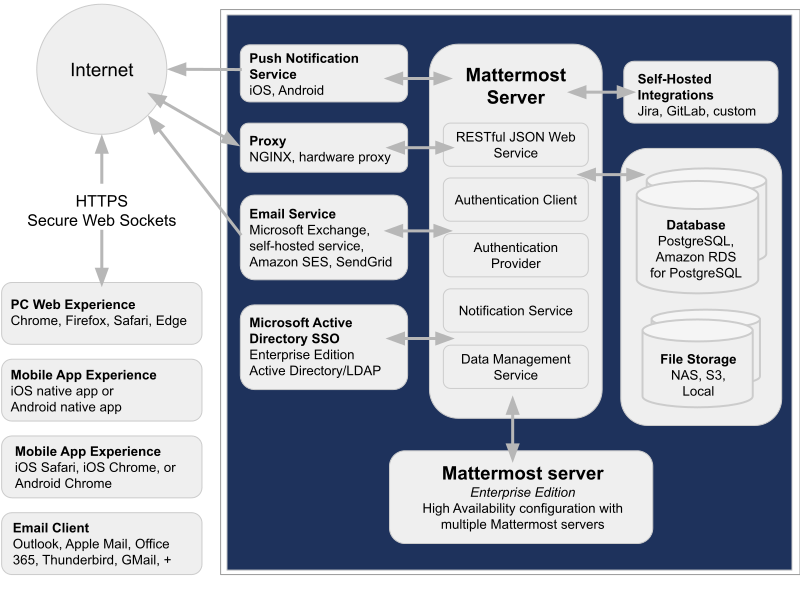

Application architecture
=========================

Mattermost is an open-source collaboration platform that offers secure messaging, file sharing, and integrations for team communication. It's self-hosted, providing IT admins full control over data, security, integrations, and customization. The platform is built with modular components to ensure scalability, flexibility, and extensibility.

Workflow overview
-----------------

Users connect through various access points (web, mobile, desktop, email). Their requests are processed by the application layer (Mattermost Server), which manages API communications, authentication, notifications, and data workflows.

The backend infrastructure supports these operations by storing all data and files in well-architected storage systems.

Extendability and security layers ensure that the platform integrates seamlessly with enterprise systems while protecting sensitive data.

Core components
----------------

The technical architecture revolves around 3 main layers: `Access layer <#access-layer>`__, `Application layer <#application-layer>`__, and `Backend infrastructure <#backend-infrastructure>`__.

Access layer
~~~~~~~~~~~~

The Access layer includes all the ways users interact with Mattermost, including:

- **Web Interface**: Users can access Mattermost through a web browser (Chrome, Firefox, Safari, Edge). The web client communicates with the Mattermost server over HTTPS protocols.
- **Desktop and Mobile Apps**: Native apps for iOS, Android, macOS, Windows, and Linux provide seamless functionality across devices. These apps rely on secure APIs to interact with the server for real-time messaging and updates.
- **Email Interaction**: Support for email clients like Outlook, Gmail, or Thunderbird enables integration of email notifications (e.g., new message alerts, invitations) into users' typical workflows. The Access Layer ensures that users are always connected via platforms of their choice while maintaining secure, synchronized communication paths.

Application layer
~~~~~~~~~~~~~~~~~

The Mattermost Server is the heart of the platform and responsible for processing all user and system operations. It's composed of multiple modular elements as follows:

**RESTful JSON Web Service**: Handles all incoming API requests (from web clients, apps, and integrations) and ensures that responses are formatted in JSON. Acts as the communication bridge between the clients (Access Layer) and backend systems.

**Authentication client**: Manages user authentication, ensuring secure login sessions. Integrates with traditional username/password-based authentication or enterprise-grade solutions like SSO (Single Sign-On) through Active Directory/LDAP.

**Authentication Provider**: Provides pluggable authentication frameworks to support OAuth, SSO, and third-party identity services. Particularly important for enterprise environments with centralized identity management.

**Notification Service**: Sends notifications through supported mediums:

- Push Notifications: Real-time notifications to iOS and Android devices (via a Push Notification Service).
- Email Notifications: Delivered to users when they are offline or need event alerts.

**Data Management Service**: Responsible for managing message data, metadata, user profiles, and logs. Ensures the integrity of data passed between the database and the server. This layer serves as the operational core of the platform, orchestrating user activities with data handling and integration capabilities.

Backend infrastructure
~~~~~~~~~~~~~~~~~~~~~~

The backend infrastructure provides the storage and data handling capabilities required for Mattermost operations. It consists of the following components:

**Database Systems**: Mattermost uses PostgreSQL as its primary database (supports Amazon RDS for cloud-hosted PostgreSQL) to store all persistent data, such as:

- Messages
- User accounts and credentials
- Configuration settings
- Team/channel metadata

**File Storage**: Manages all multimedia assets (e.g., file uploads, images, videos) shared across channels. Storage solutions include the following options:

- **Local Storage**: Files stored directly on the server’s filesystem.
- **Network Attached Storage (NAS)**: Common for enterprises centralizing file storage within their network.
- **S3**: Offers cloud-based scalable storage for larger environments or organizations with distributed deployments. The database and file storage handle scalability, ensuring efficient support for millions of messages and files while guaranteeing data consistency.

**System Extensions**: Mattermost is not only a collaboration tool but also a platform designed for extensibility. Key extensibility features include:

**Self-Hosted Integrations**: Connect Mattermost to other local or cloud-based systems like Jira, GitLab, or any custom integrations your team needs. Leverage built-in APIs and webhooks to automate workflows and trigger system-to-system communications.

**Third-Party Authentication**: Bind integrations to third-party platforms (e.g., Slack-importing APIs, OAuth services). Third-party identity services ensure consistent and secure user access flows.

**Security and Scalability Features**: Security and scalability are baked into the architecture, making Mattermost ideal for enterprise use cases:

**Security**

- A reverse proxy like NGINX or a hardware proxy is deployed to manage external traffic. It protects servers, enforces HTTPS, and handles load balancing.
- Configurable SSL/TLS encryption ensures data security during transmission.
- Granular user permissions and roles secure sensitive information within teams.

**Scalability**: The Enterprise Edition supports deploying multiple Mattermost servers in a clustered environment to balance user requests across multiple servers for reliability and performance in large organizations.

**Notifications and communication services**: Mattermost supports asynchronous and real-time communication, enhanced by notification systems tailored for different workflows:

- **Push Notifications**: Delivered to mobile devices for message alerts or mentions.
- **Email Integration**: Provides regular notifications when users are offline or inactive.

These services ensure continuous engagement and communication.

Communication protocols
~~~~~~~~~~~~~~~~~~~~~~~

There are also communication protocols (HTTPS and WS) that define the type of connection the user makes with the Mattermost server.

**HTTPS Connection** (Secure Hypertext Transfer Protocol)

- HTTPS connections to the Mattermost server render pages and provide access to core platform functionality, but do not include real-time interactivity (which is enabled by WSS connections).
- HTTPS is a secure, encrypted protocol and is highly recommended for production. Unencrypted HTTP connections may be used in initial testing and configuration, but should never be used in a production environment.

**WSS Connection** (Secure WebSocket Protocol)

Secure WebSocket (WSS) connections to the Mattermost Server enable real-time updates and notifications between clients and the server.

If a WSS connection is not available and HTTPS is substituted, the system will appear to work but real-time updates and notifications will not. In this mode of operation, updates will only appear on a page refresh. WSS has a persistent connection to the Mattermost server when a client is connected, while HTTPS has an intermittent connection and only connects to the server when a page or file is requested.

.. image:: ../images/architecture_with_protocol.png

Mattermost services ports
^^^^^^^^^^^^^^^^^^^^^^^^^

The following table lists the Mattermost services ports for Mattermost Server, push proxy, and mobile app clients. System admins with clients that need to speak to the Mattermost server without a proxy can open specific firewall ports as needed.

**Mattermost Server**

+-------------------------------------------------------------+---------------------------------------+-----------------------------------+-----------+------------+---------------------------------------------------------------+
| Service Name                                                | Config Setting                        | Port (default)                    | Protocol  | Direction  | Info                                                          |
+=============================================================+=======================================+===================================+===========+============+===============================================================+
| HTTP/Websocket                                              | ServiceSettings.ListenAddress         | 8065/80/443 (TLS)                 | TCP       | Inbound    | External (no proxy) / Internal (with proxy)                   |
+-------------------------------------------------------------+---------------------------------------+-----------------------------------+-----------+------------+ Usually this requires port 80 and 443 when running HTTPS.     |
|                                                             |                                       |                                   |           |            |                                                               |
+-------------------------------------------------------------+---------------------------------------+-----------------------------------+-----------+------------+---------------------------------------------------------------+
| Cluster                                                     | ClusterSettings.GossipPort            | 8074                              | TCP/UDP   | Inbound    | Internal                                                      |
+-------------------------------------------------------------+---------------------------------------+-----------------------------------+-----------+------------+---------------------------------------------------------------+
| Metrics                                                     | MetricsSettings.ListenAddress         | 8067                              | TCP       | Inbound    | External (no proxy) / Internal (with proxy)                   |
+-------------------------------------------------------------+---------------------------------------+-----------------------------------+-----------+------------+---------------------------------------------------------------+
| Database                                                    | SqlSettings.DataSource                | 5432 (PostgreSQL) / 3306 (MySQL)  | TCP       | Outbound   | Usually internal (recommended)                                |
+-------------------------------------------------------------+---------------------------------------+-----------------------------------+-----------+------------+---------------------------------------------------------------+
| LDAP                                                        | LdapSettings.LdapPort                 | 389                               | TCP/UDP   | Outbound   |                                                               |
+-------------------------------------------------------------+---------------------------------------+-----------------------------------+-----------+------------+---------------------------------------------------------------+
| S3 Storage                                                  | FileSettings.AmazonS3Endpoint         | 443 (TLS)                         | TCP       | Outbound   |                                                               |
+-------------------------------------------------------------+---------------------------------------+-----------------------------------+-----------+------------+---------------------------------------------------------------+
| SMTP                                                        | EmailSettings.SMTPPort                | 10025                             | TCP/UDP   | Outbound   |                                                               |
+-------------------------------------------------------------+---------------------------------------+-----------------------------------+-----------+------------+---------------------------------------------------------------+
| Push Notifications                                          | EmailSettings.PushNotificationServer  | 443 (TLS)                         | TCP       | Outbound   |                                                               |
+-------------------------------------------------------------+---------------------------------------+-----------------------------------+-----------+------------+---------------------------------------------------------------+

**Push Proxy**

+---------------+-----------------+-----------------+-----------+------------+----------------------------------------------+
| Service Name  | Config Setting  | Port (default)  | Protocol  | Direction  | Info                                         |
+===============+=================+=================+===========+============+==============================================+
| Push Proxy    | ListenAddress   | 8066            | TCP       | Inbound    | External (no proxy) / Internal (with proxy)  |
+---------------+-----------------+-----------------+-----------+------------+----------------------------------------------+

**Mobile Clients**

In order to receive push notifications, your network must allow traffic on `port 5223 for iOS devices <https://support.apple.com/en-us/102266>`_ and `ports 5228-5230 for Android <https://firebase.google.com/docs/cloud-messaging/concept-options#messaging-ports-and-your-firewall>`_.