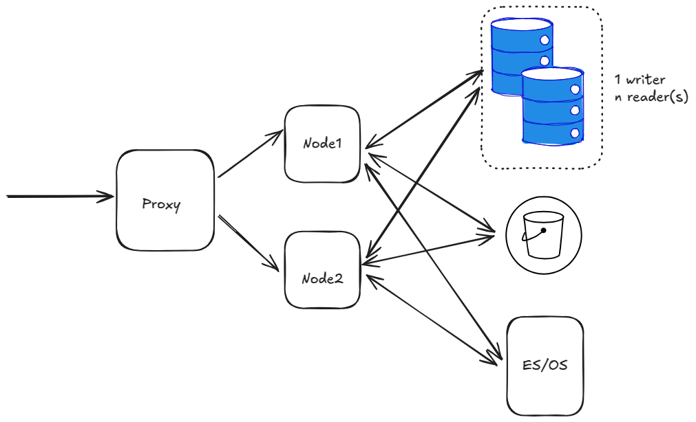
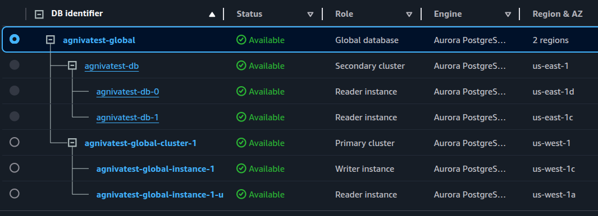
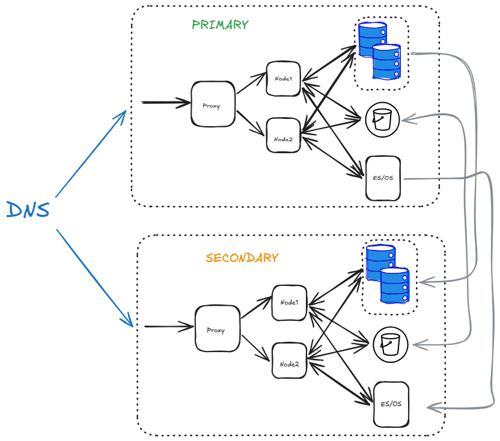

Backup and disaster recovery 
=============================

.. include:: ../_static/badges/allplans-selfhosted.rst
  :start-after: :nosearch:

Options to protect your Mattermost server from different types of failures range from simple backup to sophisticated disaster recovery deployments and automation.

Backup
------

The state of your Mattermost server is contained in multiple data stores that need to be separately backed up and restored to fully recover your system from failure. 

To back up your Mattermost server:

1. Back up your Mattermost database using standard procedures depending on your database version. `PostgreSQL SQL Dump backup documentation <https://www.postgresql.org/docs/10/backup-dump.html>`__ is available online. Use the navigation at the top of the page to select your PostgreSQL version.

2. Back up your server settings stored in ``config/config.json``.

      - If you are using SAML configuration for Mattermost, your SAML certificate files will be saved in the ``config`` directory. Therefore, it is recommended to back up the entire directory.
   
3. Back up files stored by your users with one of the following options: 

     - If you use local storage using the default ``./data`` directory back up this directory.
     - If you use local storage using a non-default directory specified in the ``Directory`` setting in ``config.json``, back up files in that location.
     - If you store your files in S3, you can typically keep the files where they are located without backup.
     
Please note that to make a 'clean' backup you need to stop Mattermost during the duration of the backup otherwise the database and files may become out of sync.

To restore a Mattermost instance from backup, restore your database, ``config.json`` file, and optionally locally stored user files into the locations from which they were backed up.

Disaster recovery 
-----------------

An appropriate disaster recovery plan weighs the benefits of mitigating specific risks against the cost and complexity of setting up disaster recovery infrastructure and automation.

There are two common approaches: 

Automated backup
~~~~~~~~~~~~~~~~

Automating backups for a Mattermost server provides a copy of the server's state at a particular point in time, which can be restored if a failure in the future leads to loss of data. Options include:

- Automation to periodically back up the Mattermost server, which may include all the components listed above or a subset depending on what you choose to protect.
- Automation to restore a server from backup, or deploy a new server, to reduce recovery time.
- Automation to verify a backup has been successfully produced to protect against backup automation failures.
- Storing backups off-site, to protect against physical loss of onsite systems.

Recovering from a failure using a backup is typically a manual process and will incur downtime. The alternative is to automate recovery using a high availability deployment.

High Availability deployment 
~~~~~~~~~~~~~~~~~~~~~~~~~~~~

Enterprise customers who use Mattermost for mission-critical environments must ensure continuous availability and operational resilience. A robust disaster recovery strategy is essential to mitigate risks associated with data center failures, ensuring that users can access Mattermost seamlessly, even in the event of unexpected outages.

In this section, we go through the various steps needed to set up Mattermost in a disaster recovery mode, and how to failover from one data center to another.

**Setting up in one data center**

As a first step, set up Mattermost in a single data center. At a very basic high level, this would be something like below:

The above diagram has a single proxy, forwarding traffic to 2 nodes. And then we have a database with single writer + n readers. An S3 bucket and ES/OS using AWS Opensearch service.

At this stage, we are ignoring other details like LDAP/SAML, SMTP etc.

.. tip::
  The following architecture is to be implemented for when an entire region goes down. This does not cover the case when a single server/service goes down.

  For example:
  If a single app node goes down, follow best practices to provision a new node.
  If a DB replica node goes down, create a new replica from AWS console. Or set a policy to do it automatically.

**Replicating Database**

The first task would be to create a global AWS Cluster. This can be done by clicking the RDS instance in the AWS Console, and expand the “Actions“ menu and click “Add AWS Region“. In the next page, choose the secondary region, and fill up the other details.

.. warning::

  Ensure to tick the “Enable write forwarding“ on the secondary cluster. This will help to forward write operations from secondary to primary. ``Link`` (https://docs.aws.amazon.com/AmazonRDS/latest/AuroraUserGuide/aurora-global-database-write-forwarding-apg.html#aurora-global-database-write-forwarding-enabling-apg).

  Also check for the PG version and ensure it allows “write forwarding“. Not all PG versions allow that. ``Link`` (https://docs.aws.amazon.com/AmazonRDS/latest/AuroraUserGuide/aurora-global-database-write-forwarding-apg.html#aurora-global-database-write-forwarding-regions-versions-apg).

At the end, you should have a global cluster like this:

We can see we have a global cluster with the primary cluster in us-west-1, and the secondary cluster in us-east-1.

**Replicating S3 bucket**

- Create a new S3 bucket in the secondary region.

- Back in the original bucket, go to Properties tab, and enable “Bucket versioning”.

- Go to the Management tab, scroll down to Replication Rules, and create a Replication rule.

- In the rule, select the source bucket. And then choose “Apply to all objects in the bucket” to replicate everything in the bucket.

- Then choose the destination bucket.

- For the IAM role, select “Create new role“.

.. warning::

  Ensure to select “Replica modification sync” for the bucket as well. This will help us keep the replica and source buckets in sync with each other.

Then click Save. It will prompt you whether to kick off a job to replicate any existing objects to the secondary bucket or not. Click Yes.

Do the same thing all over again on the secondary bucket as well.

Now we have bi-directional replication working between the two S3 buckets.

**Replicating ES/OS storage**

To replicate ES/OS storage, we need to set up CCR (cross-cluster replication) for AWS Opensearch.

Note that there are some requirements for this:

- Elasticsearch 7.10 or OpenSearch 1.1 or later

- Fine-grained access control enabled

- Node-to-node encryption enabled

#3 is automatically enabled once you enable #2. So all that’s needed is a recent OpenSearch version with fine-grained access control enabled.

You would also need to add the `CrossClusterGet` permission on the IAM policy for the OS cluster. We recommend the following as per AWS, but feel free to fine-tune as necessary.

.. code-block:: sh
  {
    "Version": "2012-10-17",
    "Statement": [
      {
        "Effect": "Allow",
        "Principal": {
          "AWS": "*"
        },
        "Action": "es:ESHttp*",
        "Resource": "arn:aws:es:<region>:<acc_num>:domain/<domain_name>/*"
      },
      {
        "Effect": "Allow",
        "Principal": {
          "AWS": "*"
        },
        "Action": "es:ESCrossClusterGet",
        "Resource": "arn:aws:es:<region>:<acc_num>:domain/<domain_name>"
      }
    ]
  }

This can be set under the “Security Configuration“ tab for your OS domain.

To recap:

- Use Opensearch 2.x.

- Enable fine-grained access control.

- Create the master user, And note the user/pass.

- Set the IAM policy as above.

.. warning::

  Note that after you create the master user, IP based access to OS might not work from MM app nodes. So you might need to update the ElasticSearchSettings section in config.json to update the username/password.

Now create a new OS cluster in the secondary region. Follow the same steps again for this cluster.

After that, we need to begin replication from the primary to secondary region.

.. warning::

  At this stage, ensure that you have all indices populated with data in the primary region. Run a “bulk index“ to do that if you haven’t already.

To set up replication, first we need to create a connection from secondary to primary. Note that replication in OS works in a “pull“ model. So the secondary site, pulls data from the primary.

- In the Amazon OpenSearch Service console, select the secondary domain, go to the Connections tab, and choose Request.

- For Connection alias, enter a name for your connection.

- And then choose “connect to a domain in another AWS account or region“, and enter the ARN of the primary domain.

- Click “Request“.

This will send a permission request to the primary domain. Open the primary domain, and you will see the incoming request under the “Connections“ tab. Click “Accept“.

Now we need to set up the replication rules for indices.

For this, SSH into an app node in the secondary region. We will set up an auto-follow rule for the posts* indices because of the daily naming scheme and monthly aggregation. And for the other indices, we will replicate each of them. We could also set up a rule with * to replicate everything. But that would also include the hidden and system indices which we don’t want.

First, let’s set up the auto-follow for posts* indices

.. code-block:: sh
  curl -XPOST -H 'Content-Type: application/json' -u '<USERNAME>:<PASSWORD>'  'https://<HOSTNAME>/_plugins/_replication/_autofollow?pretty' -d '
  {
     "leader_alias" : "<LEADER_ALIAS>",
     "name": "autofollow-rule",
     "pattern": "posts*",
     "use_roles":{
        "leader_cluster_role": "all_access",
        "follower_cluster_role": "all_access"
     }
  }'

Check the status of the auto-follow rule by:

.. code-block:: sh
  curl -H 'Content-Type: application/json' -u 'username/password'  'https://<>/_plugins/_replication/autofollow_stats?pretty'
  {
    "num_success_start_replication" : 2,
    "num_failed_start_replication" : 0,
    "num_failed_leader_calls" : 0,
    "failed_indices" : [ ],
    "autofollow_stats" : [
      {
        "name" : "autofollow-rule",
        "pattern" : "posts*",
        "num_success_start_replication" : 2,
        "num_failed_start_replication" : 0,
        "num_failed_leader_calls" : 0,
        "failed_indices" : [ ],
        "last_execution_time" : 1737699113927
      }
    ]
  }

Next, set up replication for the other indices

.. code-block:: sh
  curl -XPUT -H 'Content-Type: application/json' -u '<USERNAME>:<PASSWORD>'  'https://<HOSTNAME>/_plugins/_replication/channels/_start?pretty' -d '
  {
     "leader_alias": "<LEADER_ALIAS>",
     "leader_index": "channels",
     "use_roles":{
        "leader_cluster_role": "all_access",
        "follower_cluster_role": "all_access"
     }
  }'

  curl -XPUT -H 'Content-Type: application/json' -u '<USERNAME>:<PASSWORD>'  'https://<HOSTNAME>/_plugins/_replication/users/_start?pretty' -d '
  {
     "leader_alias": "<LEADER_ALIAS>",
     "leader_index": "users",
     "use_roles":{
        "leader_cluster_role": "all_access",
        "follower_cluster_role": "all_access"
     }
  }'

  curl -XPUT -H 'Content-Type: application/json' -u '<USERNAME>:<PASSWORD>'  'https://<HOSTNAME>/_plugins/_replication/files/_start?pretty' -d '
  {
     "leader_alias": "<LEADER_ALIAS>",
     "leader_index": "files",
     "use_roles":{
        "leader_cluster_role": "all_access",
        "follower_cluster_role": "all_access"
     }
  }'

Check the status of the replication rules by:

.. code-block:: sh
  curl -H 'Content-Type: application/json' -u '<USERNAME>:<PASSWORD>'  'https://<HOSTNAME>/_plugins/_replication/channels/_status?pretty'
  curl -H 'Content-Type: application/json' -u '<USERNAME>:<PASSWORD>'  'https://<HOSTNAME>/_plugins/_replication/files/_status?pretty'
  curl -H 'Content-Type: application/json' -u '<USERNAME>:<PASSWORD>'  'https://<HOSTNAME>/_plugins/_replication/users/_status?pretty'
  curl -H 'Content-Type: application/json' -u '<USERNAME>:<PASSWORD>'  'https://<HOSTNAME>/_plugins/_replication/posts_<DATE>/_status?pretty'
  curl -H 'Content-Type: application/json' -u '<USERNAME>:<PASSWORD>'  'https://<HOSTNAME>/_plugins/_replication/posts_<DATE>/_status?pretty'
  Sample output:
  {
    "status" : "SYNCING",
    "reason" : "User initiated",
    "leader_alias" : "<LEADER_ALIAS>",
    "leader_index" : "<INDEX>",
    "follower_index" : "<INDEX>",
    "syncing_details" : {
      "leader_checkpoint" : 16,
      "follower_checkpoint" : 16,
      "seq_no" : 17
    }
  }

Now we can check for indices. We should be able to see all the indices from the primary domain in our secondary domain.

.. code-block:: sh
  curl -s -u '<USERNAME>:<PASSWORD>' 'https://<HOSTNAME>/_cat/indices?pretty'

**Replicating Job servers**

If the job scheduler is left running in the secondary region, it will pick up jobs and start running them. Therefore, we need to set JobSettings.RunScheduler to false on all nodes in the secondary region. When a failover happens, we need to enable it for the new primary region, and deactivate it for the new secondary region.

**Test the secondary region**

With the above steps complete, we have a fully functioning secondary region. We can replicate the same setup of nodes and a proxy server like the primary region. Only thing to note is that, the app nodes in the secondary region won’t be able to come up in the first time because Mattermost will try to run some DDL statements which are not allowed with write-forwarding. So it will be stuck in a loop trying to connect.

.. warning::

  Ensure to have separate ClusterNames for the different clusters in two regions. This will allow us to use the same database across 2 clusters.

But once we failover the region, it will start working. And the primary region will still be readable, and any periodic writes will be forwarded to the secondary (now primary).

**Failing Over RDS to secondary**

To perform the failover, go to the RDS global cluster, and under “Actions“, select “Switchover or Failover global database“. Then select “switchover“ if you want to switch over without any data loss. This takes more time, but is safer. Or choose “failover“ for a quicker failover, at the expense of data-loss. If the entire region is unavailable anyways, then “failover“ is no worse than “switchover“.

After this is done, the app nodes which were stuck trying to connect should move forward and everything should be functional. You can read/write, upload images and everything should be replicated. Everything except Opensearch data.

**Failing over OS to secondary**

ES/OS does not allow multi-writer for a single index. You can only write to one index at one time. Therefore, we need to perform some manual steps to reverse the replication direction. And start replicating from secondary to primary.

For simplicity, let’s say site1 is primary, and site2 is secondary. Therefore, OS in site1 is the leader domain, and in site2 is the follower. And follower pulls from the leader. Now we need to switch the direction where site2 becomes leader, and site1 becomes follower.

1. Remove the rule from site1 → site 2 in AWS Console. This will auto-pause the replication. But the indices in site2 will still be read-only. We need to remove the replication rules for that.

2. Remove auto-follow rule.

.. code-block:: sh
  curl -XDELETE -H 'Content-Type: application/json' -u '<USERNAME>:<PASSWORD>'  'https://<HOSTNAME>/_plugins/_replication/_autofollow?pretty' -d '
  {
     "leader_alias" : "<LEADER_ALIAS>",
     "name": "autofollow-rule"
  }'

3. Check the status of the auto-follow rule as mentioned before.

4. Remove replication rules:

.. code-block:: sh
  curl -XPOST -H 'Content-Type: application/json' -u '<USERNAME>:<PASSWORD>'  'https://<HOSTNAME>/_plugins/_replication/channels/_stop?pretty' -d '{}'
  curl -XPOST -H 'Content-Type: application/json' -u '<USERNAME>:<PASSWORD>'  'https://<HOSTNAME>/_plugins/_replication/files/_stop?pretty' -d '{}'
  curl -XPOST -H 'Content-Type: application/json' -u '<USERNAME>:<PASSWORD>'  'https://<HOSTNAME>/_plugins/_replication/users/_stop?pretty' -d '{}'

5. Check the status of replication rules as mentioned before.

6. Now indices will become writable

7. Add rule from site2 → site1 in AWS console.

8. Now back in site1, we need to make all the indices as followers. This cannot simply be done without deleting all indices first unfortunately.

9. Delete all indices.

.. code-block:: sh
  curl -XDELETE -u '<USERNAME>:<PASSWORD>' 'https://<HOSTNAME>/posts*?pretty'
  curl -XDELETE -u '<USERNAME>:<PASSWORD>' 'https://<HOSTNAME>/channels?pretty'
  curl -XDELETE -u '<USERNAME>:<PASSWORD>' 'https://<HOSTNAME>/files?pretty'
  curl -XDELETE -u '<USERNAME>:<PASSWORD>' 'https://<HOSTNAME>/users?pretty'

10. Refresh indices:

.. code-block:: sh
  curl -XPOST -u '<USERNAME>:<PASSWORD>' 'https://<HOSTNAME>/_refresh?pretty'

11. Confirm that everything is deleted:

.. code-block:: sh
  curl -s -u '<USERNAME>:<PASSWORD>' 'https://<HOSTNAME>/_cat/indices?pretty'

12. Now we have to add the auto-follow rule, add replication rules. Follow the same steps as before.

13. List the indices again to confirm that replication has started, and indices are available.

**S3 Bucket is auto-replicated both ways**

There’s nothing to do for that.

**Testing everything**

Once the failover has happened, and the ES/OS replication direction has been swapped, the new site can be used normally.

This becomes the final architecture:

One can use DNS to easily switch between PRIMARY to SECONDARY during a failover.

.. tip::
  Note that websockets will still point to the old data center even if you have switched DNS. So you would need to roll over each app node gradually to move those connections to the new data center. Or in case all your nodes are down, no action is necessary and the clients will automatically re-connect to the new data center.

Note that, the S3 bucket is replicated bi-directionally. But the DB and ES/OS is replicated uni-directionally.

Failover from Single Sign-On outage 
~~~~~~~~~~~~~~~~~~~~~~~~~~~~~~~~~~~~

When using Single Sign-on with Mattermost Enterprise Edition an outage to your SSO provider can cause a partial outage on your Mattermost instance.

**What happens during an SSO outage?**

- **Most people can still log in.** By default, when a user logs in to Mattermost they receive a session token lasting 30 days (the duration can be configured in the System Console). During an SSO outage, users with valid session tokens can continue to using Mattermost uninterrupted.
- **Some people can't log in.** During an SSO outage, there are two situations under which a user cannot log in:
  
  * Users whose session token expires during the outage.
  * Users trying to log in to new devices.

In each case, the user cannot reach the SSO provider, and cannot log in. In this case, there are several potential mitigations:

Configure your SSO provider for High Availability 
~~~~~~~~~~~~~~~~~~~~~~~~~~~~~~~~~~~~~~~~~~~~~~~~~

If you're using a self-hosted Single Sign-on provider, several options are available for `High Availability configurations that protect your system from unplanned outages <https://learn.microsoft.com/en-us/microsoft-identity-manager/pam/high-availability-disaster-recovery-considerations-bastion-environment>`_.

For SaaS-based authentication providers, while you still have a dependency on service uptime, you can set up redundancy in source systems from which data is being pulled. For example, with the OneLogin SaaS-based authentication service, you can set up High Availability LDAP connectivity to further reduce the chances of an outage.

Set up your own IDP to provide an automated or manual SSO failover option 
~~~~~~~~~~~~~~~~~~~~~~~~~~~~~~~~~~~~~~~~~~~~~~~~~~~~~~~~~~~~~~~~~~~~~~~~~

Create a custom Identity Provider for SAML authentication that connects to both an active and a standby authentication option, that can be manually or automatically switched in case of an outage.

In this configuration, security should be carefully reviewed to prevent the standby SSO option from weakening your authentication protocols.

Set up a manual failover plan for SSO outages 
~~~~~~~~~~~~~~~~~~~~~~~~~~~~~~~~~~~~~~~~~~~~~

When users are unable to reach your organization's SSO provider during an outage, an error message directing them to contact your support link (defined in your System Console settings) is displayed.

Once IT is contacted about an SSO outage issue, they can temporarily change a user's account from SSO to email-password using the System Console, and the end user can use password to claim the account, until the SSO outage is over and the account can be converted back to SSO.

When the outage is over, it's critical to switch everyone back to SSO from email-password to maintain consistency and security.
