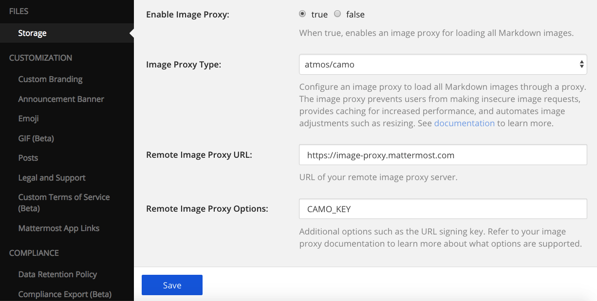

.. _image-proxy:

Image Proxy
===========

Using an image proxy means that all requests for images made by Mattermost clients will go through the proxy instead of contacting third-party servers directly. This helps protect user privacy by preventing third-party servers from tracking who views an image. This also prevents the use of tracking pixels (invisible images that do the same thing without the user even seeing an image).

Certain proxy servers also provide a layer of caching which can make loading images faster and more reliable. This caching also helps preserve posts by protecting them from dead images.

When enabled, the image proxy needs to be publicly accessible to both the Mattermost client and server.

Mattermost clients will use the image proxy to load all external images. The Mattermost server will use the image proxy when possible, but will not use it when requesting content that may not be an image, such as for `image previews of plaintext URLs <https://github.com/mattermost/mattermost-server/issues/11857>`_.

An image proxy can be configured in **System Console > Environment > Image Proxy** (or **System Console < Files > Storage** in versions prior to 5.12).

Local Image Proxy
-----------------

The local image proxy is available as part of the Mattermost server deployment. When using the local image proxy, images are served to clients through the server which helps anonymize users. If SSL is enabled on the server, it provides a secure connection. This method does not offer any caching behavior.

.. note:: 
   With the local image proxy enabled, requests for images hosted on the local network are now affected by the ``AllowUntrustedInternalConnections`` setting. See `documentation <https://docs.mattermost.com/administration/config-settings.html#allow-untrusted-internal-connections-to>`_ for more information or if you are seeing unintentionally blocked images.

.. _atmos-camo:

atmos/camo Image Proxy
----------------------

The `atmos/camo <https://github.com/atmos/camo>`_ image proxy is a standalone image proxy that can be deployed separately from the Mattermost server. It provides additional configuration options over the built-in image proxy, and it can also be used if isolation between the Mattermost server and image proxy is desired.

Once you've deployed an ``atmos/camo`` (https://github.com/atmos/camo) instance, you must specify the **Remote Image Proxy URL** and **Remote Image Proxy Options** settings. The **Remote Image Proxy Options** should be set to the image proxy's shared key which is specified with the ``CAMO_KEY`` environment variable used when setting up the image proxy.

For example, if the image proxy is located at ``https://image-proxy.mattermost.com``, it would be configured as follows:

 - **Image Proxy Type**: ``atmos/camo``
 - **Remote Image Proxy URL**: ``https://image-proxy.mattermost.com``
 - **Remote Image Proxy Options**: ``CAMO_KEY``, which is the secret string used for the sample ``atmos/camo`` deployment.

  
