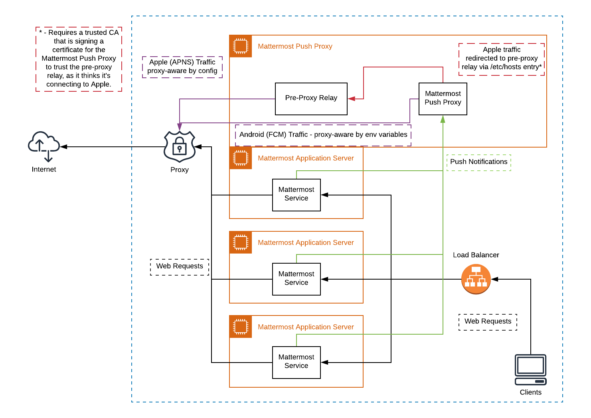
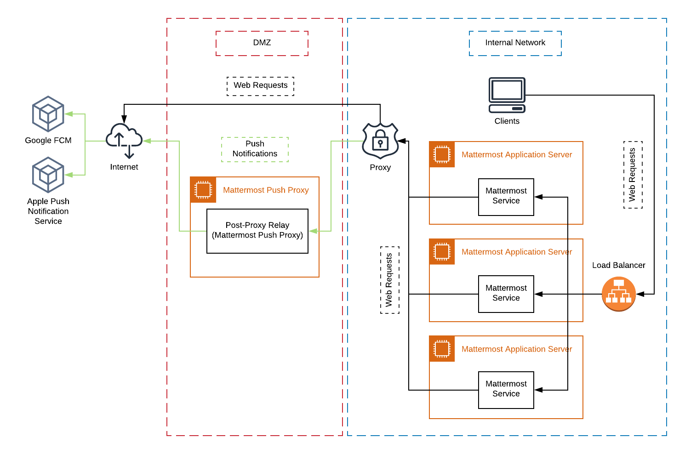

Mobile Apps FAQ
===============

.. contents::
  :backlinks: top
  :local:

Can I connect to multiple Mattermost servers using the mobile apps?
-------------------------------------------------------------------

At the moment, we only support connecting to one server at a time; however, we are aware that this is one of the `top feature requests <https://mattermost.uservoice.com/forums/306457-general/suggestions/10975938-ios-and-android-apps-should-allow-multiple-server>`__ for the mobile app. We are currently investigating some technical challenges, such as how to handle push notifications coming from multiple servers. To follow our progress on this feature, you can join the `RN: Multi-Server <https://community.mattermost.com/core/channels/rn-multi-server-suppot>`_ channel on our community server.

As a workaround, you can install the released Mattermost mobile app and sign up to be a `tester <https://github.com/mattermost/mattermost-mobile/blob/master/README.md#testing>`__ for the Mattermost Beta mobile app. This allows you to connect and log in to a different server from each app.

Is there a tablet version of the mobile apps?
---------------------------------------------

Mattermost Classic mobile apps support tablets.

Our second generation mobile apps (Mattermost) have beta support for tablets.

Can the permanent sidebar on tablet devices be disabled?
--------------------------------------------------------

The permanent sidebar is on by default for tablet-sized devices, but can be disabled from **Settings > Display > Sidebar > Permanent Sidebar**. When disabled, the sidebar behaves similarly to mobile devices where the user must open it using the button in the top-left corner of the screen.

How is data handled on mobile devices after a user account is deactivated?
--------------------------------------------------------------------------

App data is wiped from the device when a user logs out of the app. If the user is logged in when the account is deactivated, then within one minute of deactivation the system logs the user out. Thereafter all app data is wiped from the device.

Do I need to compile the mobile apps to host my own push notification server?
------------------------------------------------------------------------------

Yes. To host your own push notification server, you'll need to compile the mobile apps. See `documentation <https://docs.mattermost.com/mobile/mobile-compile-yourself.html>`__ to learn how to compile your own mobile apps.

.. _push-faq:

How do push notifications work?
--------------------------------

Your Mattermost server sends push notifications to a hosted push proxy server, which relays them via mobile push notification services provided by Apple and Google.

To ensure push notifications are coming from a trusted source, Apple and Google only allow push notifications sent from a service using a key or signature corresponding to a secret compiled into the mobile app itself.

The full process is outlined below:

1. An action triggering a push notification is detected in the Mattermost server running in your private network.

2. Your Mattermost server sends a push notification message to a Mattermost Push Notification Service (MPNS), either self-hosted in your private network, or publicly hosted by Mattermost, Inc.

3. MPNS sends a push notification message to either Apple Push Notification Service (APNS) or to Google’s Firebase Cloud Messaging (FCM) service over a TLS connection.

  - If sent to Apple, the message has a signature corresponding to a secret compiled in the iOS app.
  - If sent to Google, the message uses a key corresponding to a secret compiled in the Android app.

Regardless of whether you're using iOS or Android, the MPNS needs to have access to the appropriate secret compiled into the mobile app.

This means if you use the Mattermost apps from the Apple App Store or Google Play, you need to use the hosted push notification service from Mattermost, Inc. If you compile the apps yourself, you must also compile and use your own MPNS with the corresponding secret.

4. Either APNS or FCM receives the push notification message from MPNS over TLS, and then relays the message to the user's iOS or Android device to be displayed.

.. Note:: The use of push notifications with iOS and Android applications will require a moment where the contents of push notifications are visible and unencrypted by a server controlled by either Apple or Google. This is standard for any iOS or Android app. For this reason, there is an `option to omit the contents of Mattermost messages from push notifications <https://docs.mattermost.com/configure/configuration-settings.html#push-notification-contents>`_, or `to configure message content to be fetched from the server <https://docs.mattermost.com/configure/configuration-settings.html#push-notification-contents>`_ when the notification reaches the device (*available in Enterprise Edition E20*) in order to meet certain compliance requirements.

What post metadata is sent in mobile push notifications?
--------------------------------------------------------

The following post metadata is sent in all push notifications:

- ``Team ID``
- ``Channel ID``
- ``Post ID``
- ``User ID`` (post author)
- ``Username`` (post author or webhook override username)
- ``Root ID`` (only if the post is in a thread)
- ``Type`` (create or clear push notification)
- ``Category`` (iOS only, determines if the notifications can be replied to)
- ``Badge number`` (what the notification badge on the app icon should be set to when the notification is received)

Additional metadata may be sent depending on the System Console setting for `Push Notification Contents <https://docs.mattermost.com/configure/configuration-settings.html#push-notification-contents>`__:

- **Generic description with sender and channel names**: ``Channel name`` metadata will be included.
- **Full message content sent in the notification payload**: ``Post content`` and ``Channel name`` metadata will be included.
- **Full message content fetched from the server on receipt** (*available in Enterprise Edition E20*): ``Post content`` and ``Channel name`` are not included in the notification payload, instead the ``Post ID`` is used to fetch ``Post content`` and ``Channel name`` from the server after the push notification is received on the device.

How can I use ID-Only Push Notifications to protect notification content from being exposed to third-party services?
---------------------------------------------------------------------------------------------------------------------

When it comes to mobile data privacy, many organizations prioritize secure handling of messaging data, particularly when it may contain mission-critical or proprietary information. These organizations may have concerns about using mobile notifications because data must pass through third-party entities like Apple Push Notification Service (APNS) or Google Firebase Cloud Messaging (FCM) before it reaches a device. This poses a potential risk for organizations that operate under strict compliance requirements and cannot expose message data to external entities. To solve this, in Mattermost v5.18 and later, we offer an option for greater protection for Mattermost push notification message data by only sending a unique message ID in the notification payload rather than the full message data (*available in Enterprise Edition E20*). Once the device receives the ID, it then fetches the message content directly from the server and displays the notification per usual. External entities, such as APNS and FCM, handle only the ID and are unable to read any part of the message itself. If your organization has strict privacy or compliance needs, the `ID-Only Push Notification <https://docs.mattermost.com/administration/config-settings.html#push-notification-contents>`_ setting offers a high level of privacy while still allowing your team members to benefit from mobile push notifications.

What are my options for securing the mobile apps?
-------------------------------------------------

The following options for secure mobile app deployments are available:

1. Securing network connection to mobile apps

  - Use HTTPS and WSS network connections to encrypt transport.
  - Use of a mobile VPN client on mobile devices to establish secure connection to Mattermost server within private network.

2. Use multifactor authentication options

  - If a VPN client with multifactor authentication is not in use, it's highly recommended that MFA is required on authenticating into Mattermost, either within Mattermost itself or via your SSO provider.

What are my options for securing push notifications?
----------------------------------------------------

The following options are available for securing your push notification service:

1.  Protecting notification contents

  - You can `choose what type of information to include in push notifications <https://docs.mattermost.com/configure/configuration-settings.html#push-notification-contents>`__, such as excluding the message contents if your compliance policies require it. Default server settings have message contents turned off.

2. Disabling push notifications

  - Push notifications can also be disabled entirely depending on security requirements. Default server settings have push notifications disabled.

3. Encrypting connections for apps you compile yourself:

  - When using a privately-hosted Mattermost Push Notification Service (MPNS), use encrypted TLS connections between:

    - MNPS and Apple Push Notification Service (APNS)
    - MPNS and Google’s Firebase Cloud Messaging (FCM)
    - MPNS and your Mattermost server

4. Securing the Mattermost Apple App Store and Google Play apps:

  - When using Mattermost mobile apps from the App Store and Google Play, purchase an annual subscription to Mattermost Enterprise Edition E10 or higher, which offers a `Hosted Push Notification Service (HPNS) <https://docs.mattermost.com/deploy/mobile-hpns.html#hosted-push-notifications-service-hpns>`__.

.. note:: 

  For configuration details, see guides for `deploying the Mattermost App Store and Google Play apps <https://docs.mattermost.com/deploy/use-prebuilt-mobile-apps.html>`__ and `deploying your own version of the apps <https://docs.mattermost.com/deploy/build-custom-mobile-apps.html>`__. 

Why do I sometimes see a delay in receiving a push notification?
---------------------------------------------------------------------

`Apple Push Notification Service (APNS) <https://developer.apple.com/library/archive/documentation/NetworkingInternet/Conceptual/RemoteNotificationsPG/APNSOverview.html#//apple_ref/doc/uid/TP40008194-CH8-SW1>`_ and `Google Fire Cloud Messaging (FCM) <https://firebase.google.com/docs/cloud-messaging>`_ determine when your device receives a push notification from Mattermost. Thus, a delay is usually as a result of those services.

The technical flow for the device to receive a push notification is as follows:

1. User posts a message in Mattermost.
2. Mattermost server identifies if notifications needs to be sent.
3. If yes, Mattermost server sends a payload containing the push notification to the push proxy.
4. The push proxy parses the notification and relays it to APNS and FCM.
5. APNS and FCM informs the relevant devices that there is a push notification for Mattermost. This usually happens almost immediately, but may be delayed by a couple of minutes.
6. Mattermost processes the notification and displays it on the user's device.

How do I deploy Mattermost with Enterprise Mobility Management (EMM) providers?
--------------------------------------------------------------------------------

Mattermost enables customers with high privacy and custom security requirements to deploy mobile app and push notification services using keys that they alone control.

:doc:`Learn more about using AppConfig for EMM providers <mobile-appconfig>`.

How do I host the Mattermost push notification service?
----------------------------------------------------------

First, you can use the :doc:`Mattermost Hosted Push Notification Service (HPNS) <mobile-hpns>`. Organizations can also `host their own push proxy server instead <https://developers.mattermost.com/contribute/mobile/push-notifications/service/>`_. This is applicable when you want to:

1. Customize the `Mattermost mobile apps <https://developers.mattermost.com/contribute/mobile/build-your-own/>`_;
2. Deploy your own push notification service, or
3. Repackage the mobile apps with BlueCedar or AppDome (both of which are not officially supported but have been successfully deployed by some organizations).

How do I receive mobile push notifications if my IT policy requires the use of a corporate proxy server?
---------------------------------------------------------------------------------------------------------

See our `developer documentation about the Mattermost Push Notification Service with Corporate Proxy <https://developers.mattermost.com/contribute/mobile/push-notifications/corporate-proxy/>`_.

How do I white label the app and customize build settings?
----------------------------------------------------------

All files in the ``/assets/base`` folder can be overriden as needed without conflicting with changes made to the upstream version of the app. To do this:

1. Create the folder ``/assets/override``.
2. Copy any files or folders that you wish to replace from ``/assets/base`` into ``/assets/override``.
3. Make your changes to the files in ``/assets/override``.

When you compile the app or run ``make dist/assets``, the contents of those two folders will be merged with files in ``/assets/override``, taking precedence in the case of any conflicts. For binary files such as images, an overridden file will completely replace the base version, while ``JSON`` files will be merged so that fields not set in the overridden copy use the base version.

For a more specific example of how to use this feature, see the following section.

How do I preconfigure the server URL for my users?
----------------------------------------------------

You can preconfigure the server URL and other settings by overriding default ``config.json`` settings and building the mobile apps yourself.

1. Fork the `mattermost-mobile repository <https://github.com/mattermost/mattermost-mobile>`__. 
2. Create the file ``/assets/override/config.json`` in your forked mattermost-mobile repository.
3. Copy and paste all the settings from ``assets/base/config.json`` to the newly-created ``/assets/override/config.json`` file that you want to override.
4. To override the server URL, set ``DefaultServerURL`` to the server URL of your Mattermost server in ``/assets/override/config.json``.
5. (Optional) If you want to prevent users from changing the server URL, set ``AutoSelectServerUrl`` to ``true``.
6. (Optional) Override any other settings you like.

After the above, your ``/assets/override/config.json`` file would look something like this:

  .. code-block:: json
  
    {
        "DefaultServerURL": "my-mattermost-instance.example.com",
        "AutoSelectServerUrl": true,
        "ExperimentalUsernamePressIsMention": true
    }

7. Finally, `compile your own version <https://developers.mattermost.com/contribute/mobile/build-your-own/>`__ of the Mattermost mobile app and Mattermost push proxy server.

How can I get Google SSO to work with the Mattermost mobile app?
-----------------------------------------------------------------

The apps on the Apple App Store and Google Play Store cannot support Google SSO out of the box. This is because Google requires a unique Google API key that's specific to each organization.

If you need Google SSO support, you can create a custom version of the app for your own organization. Fork the `mattermost-mobile <https://github.com/mattermost/mattermost-mobile>`__  repository and add support for Google SSO before compiling the app yourself. If this is something you’re interested in, please `file an issue in GitHub <https://github.com/mattermost/mattermost-mobile/issues>`__ to start the discussion.

How do I configure deep linking?
--------------------------------------

The app checks for platform-specific configuration on app install. If no configuration is found, then the deep linking code sits silently and permalinks act as regular links.

**Set up for iOS**

1. Create an ``apple-app-site-association`` file in the ``.well-known`` directory at the root of your server. It should be accessible by navigating to ``https://<your-site-name>/.well-known/apple-app-site-association``. There should not be a file extension.
2. In order to handle deep links, paste the following ``JSON`` into the ``apple-app-site-association`` file. Make sure to place your app ID in the ``appID`` property:

::

    {
        "applinks": {
            "apps": [],
            "details": [
                {
                    "appID": "<your-app-id-here>",
                    "paths": ["**/pl/*", "**/channels/*"]
                }
            ]
        }
    }

3. Add the associated domains entitlement to your app via the Apple developer portal.
4. Add an entitlement that specifies the domains your app supports via the Xcode entitlements manager.
5. Before installing the app with the new entitlement, make sure that you can view the contents of the ``apple-app-site-association`` file via a browser by navigating to ``https://<your-site-name>/.well-known/apple-app-site-association``. The app will check for this file on install and, if found, will allow outside permalinks to open the app.

Official documentation for configuring deep linking on iOS can be found `here <https://developer.apple.com/library/archive/documentation/General/Conceptual/AppSearch/UniversalLinks.html>`__.

**Set up for Android**

Please refer to the the App Links Assistant in Android Studio for configuring `deep linking on Android <https://developer.android.com/studio/write/app-link-indexing>`__.

How do I connect users across internal and external networks?
-----------------------------------------------------------------

By setting up global network traffic management, you can send a user to an internal or external network when connecting with a mobile app. Moreover, you can have two separate layers of restrictions on internal and external traffic, such as:

- In the internal network, deploy on a private network via per device VPN.
- In the external network, deploy with `TLS mutual auth <https://docs.mattermost.com/deployment/ssl-client-certificate.html>`__ with an NGINX proxy, and `client-side certificates <https://docs.mattermost.com/deployment/certificate-based-authentication.html>`__ for desktop and iOS.
 
Many services such as Microsoft Azure provide options for `managing network traffic <https://docs.microsoft.com/en-us/azure/traffic-manager/traffic-manager-overview>`__, or you can engage a services partner to assist.

How do I receive mobile push notification if my IT policy requires the use of a corporate proxy server?
--------------------------------------------------------------------------------------------------------

When your IT policy requires a corporate proxy to scan and audit all outbound traffic the following options are available:

Deploy Mattermost in a proxy-aware configuration with a pre-proxy relay
~~~~~~~~~~~~~~~~~~~~~~~~~~~~~~~~~~~~~~~~~~~~~~~~~~~~~~~~~~~~~~~~~~~~~~~~

The Mattermost push notification service is designed to send traffic directly to the `Apple Push Notification Service (APNS) <https://developer.apple.com/library/archive/documentation/NetworkingInternet/Conceptual/RemoteNotificationsPG/APNSOverview.html#//apple_ref/doc/uid/TP40008194-CH8-SW1>`_ and `Google Fire Cloud Messaging (FCM) <https://firebase.google.com/docs/cloud-messaging>`_ services. 

In a proxy-aware configuration, a `pre-proxy relay <https://docs.mattermost.com/overview/faq.html#what-are-pre-proxy-and-post-proxy-relays>`_ accepts messages from the `Mattermost Push Proxy <https://developers.mattermost.com/contribute/mobile/push-notifications/service/>`_ and forwards them to a corporate proxy enforcing your internal IT requirements, before transmitting to their final destination.

See a sample architectural overview below: 

This enables the **pre-proxy relay** to act as the `APNS <https://developer.apple.com/library/archive/documentation/NetworkingInternet/Conceptual/RemoteNotificationsPG/APNSOverview.html#//apple_ref/doc/uid/TP40008194-CH8-SW1>`_ and to forward the request to its final destination via your corporate proxy, not requiring the APNS traffic to be proxy-aware. The APNS traffic is redirected to the pre-proxy relay via ``/etc/hosts`` entry. The entry uses a trusted CA that signs a certificate for the Mattermost Push Proxy to trust the pre-proxy relay.

Google's `FCM traffic <https://firebase.google.com/docs/cloud-messaging>`_ is proxy-aware via environment variables, so no actions are required for it. 

Moreover, APNS traffic requires HTTP/2, so your corporate proxy server must support HTTP/2 requests in order to send the push notifications to Apple devices. HTTP/2 support for the pre-proxy relay is also required.

Deploy Mattermost with connection restricted post-proxy relay in DMZ or a trusted cloud environment
~~~~~~~~~~~~~~~~~~~~~~~~~~~~~~~~~~~~~~~~~~~~~~~~~~~~~~~~~~~~~~~~~~~~~~~~~~~~~~~~~~~~~~~~~~~~~~~~~~~~

Some legacy corporate proxy configurations may be incompatible with the requirements of modern mobile architectures, such as the requirement of HTTP/2 requests from Apple to send push notifications to iOS devices.

In this case, a `post-proxy relay <https://docs.mattermost.com/overview/faq.html#what-are-pre-proxy-and-post-proxy-relays>`_ can be deployed to take messages from the Mattermost server passing through your corporate IT proxy in the incompatible format, e.g. HTTP/1.1, transform it to HTTP/2 and relay it to its final destination, either to the `Apple Push Notification Service (APNS) <https://developer.apple.com/library/archive/documentation/NetworkingInternet/Conceptual/RemoteNotificationsPG/APNSOverview.html#//apple_ref/doc/uid/TP40008194-CH8-SW1>`_ and `Google Fire Cloud Messaging (FCM) <https://firebase.google.com/docs/cloud-messaging>`_ services. 

Ths **post-proxy relay** `can be configured using the Mattermost Push Proxy installation guide <https://developers.mattermost.com/contribute/mobile/push-notifications/service/>`_ with connection restrictions to meet your custom security and compliance requirements.

In place of a DMZ, you can also host in a trusted cloud environment such as AWS or Azure depending on your internal approvals and policies. 

Whitelist Mattermost push notification proxy to bypass your corporate proxy server
~~~~~~~~~~~~~~~~~~~~~~~~~~~~~~~~~~~~~~~~~~~~~~~~~~~~~~~~~~~~~~~~~~~~~~~~~~~~~~~~~~

Depending on your internal IT policy and approved waivers/exceptions, you may choose to deploy the `Mattermost Push Proxy <https://developers.mattermost.com/contribute/mobile/push-notifications/service/>`_ to connect directly to `Apple Push Notification Service (APNS) <https://developer.apple.com/library/archive/documentation/NetworkingInternet/Conceptual/RemoteNotificationsPG/APNSOverview.html#//apple_ref/doc/uid/TP40008194-CH8-SW1>`_ without your corporate proxy.

You will need to `whitelist one subdomain and one port from Apple <https://developer.apple.com/library/archive/documentation/NetworkingInternet/Conceptual/RemoteNotificationsPG/CommunicatingwithAPNs.html#//apple_ref/doc/uid/TP40008194-CH11-SW1>`_ for this option:

- Development server: ``api.development.push.apple.com:443``
- Production server: ``api.push.apple.com:443``

Run App Store versions of the Mattermost mobile apps
~~~~~~~~~~~~~~~~~~~~~~~~~~~~~~~~~~~~~~~~~~~~~~~~~~~~

You can use the mobile applications hosted by Mattermost in the `Apple App Store <https://apps.apple.com/ca/app/mattermost/id1257222717>`_ or `Google Play Store <https://play.google.com/store/apps/details?id=com.mattermost.rn>`_ and connect with the `Mattermost Hosted Push Notification Service (HPNS) <https://docs.mattermost.com/deploy/mobile-hpns.html>` through your corporate proxy.

.. note::
  The use of hosted applications by Mattermost `can be deployed with Enterprise Mobility Management solutions via AppConfig <https://docs.mattermost.com/deploy/mobile-appconfig.html>`__ but wrapping is not supported. See the `product documentation <https://docs.mattermost.com/deploy/deploy-mobile-apps-using-emm-provider.html#manage-app-configuration-using-appconfig>`__ for details.
