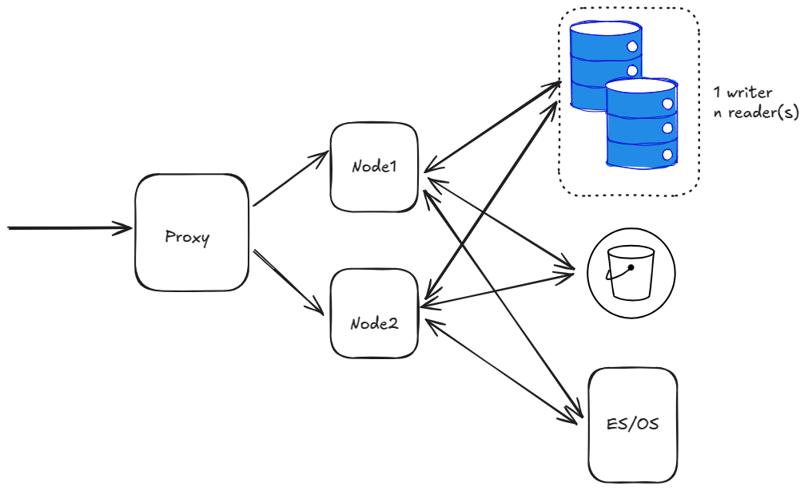
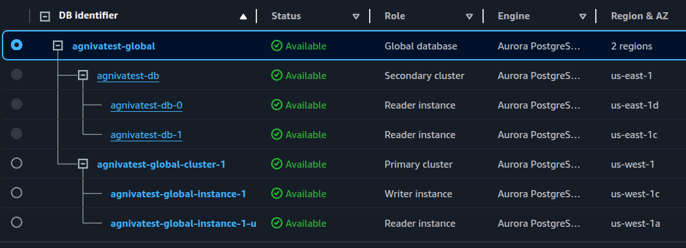
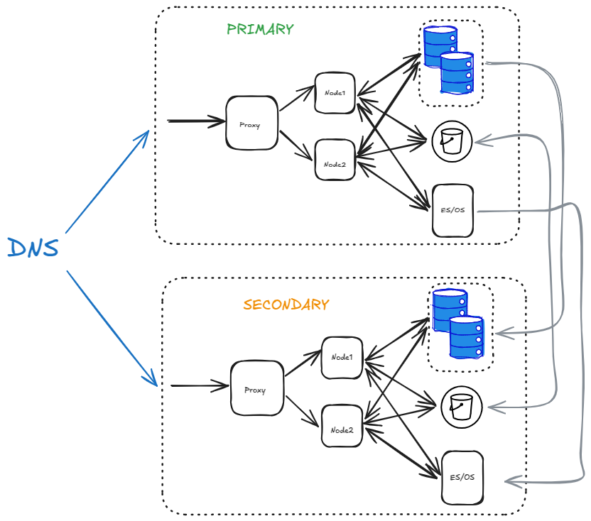

Active/passive DR deployment on AWS
=====================================

.. include:: ../_static/badges/all-commercial.rst
  :start-after: :nosearch:

Before you begin, ensure the following are in place:

- AWS account access with IAM permissions to manage RDS, S3, and OpenSearch resources in both regions
- A chosen primary and secondary AWS region pair for failover
- An existing, healthy Mattermost primary deployment
- DNS control over the domain used to reach Mattermost, so you can redirect traffic during failover
- Required RDS Aurora PostgreSQL global cluster permissions and a verified, restorable database backup
- OpenSearch 2.x with fine-grained access control available in both regions
- Network connectivity between the primary and secondary regions confirmed

Enterprise customers who use Mattermost for mission-critical operations must ensure continuous availability and operational resilience. A robust disaster recovery strategy is essential to mitigate risks associated with data center failures, ensuring that users can access Mattermost seamlessly, even in the event of unexpected outages.

This page details the steps needed to set up Mattermost in an active/passive disaster recovery configuration on AWS, and how to fail over from one data center to another.

.. tip::

  To learn how to safely upgrade your deployment in Kubernetes for High Availability and Active/Active support, see the :doc:`Upgrading Mattermost in Kubernetes and High Availability Environments </administration-guide/upgrade/upgrade-mattermost-kubernetes-ha>` documentation.

Set up in one data center
--------------------------

As a first step, set up Mattermost in a single data center. At a very basic high level, this would be something like below:

The diagram above has a single proxy, forwarding traffic to 2 nodes. There's also a database with single writer + n readers and an S3 bucket and ES/OS using AWS OpenSearch service.

At this stage, we are ignoring other details like LDAP/SAML, SMTP etc.

.. tip::
  The following architecture would be implemented when an entire region goes down. It does not cover the case when a single server/service goes down. For example:

  - If a single app node goes down, follow best practices to provision a new node.
  - If a database replica node goes down, create a new replica from AWS console. Or set a policy to do so automatically.

Replicate database
------------------

The next tasks include creating a global AWS Cluster.

1. Select the RDS instance in the AWS Console, and expand the **Actions** menu to select **Add AWS Region**.

2. Choose the secondary region and enter the other details.

.. warning::

  Select the **Enable write forwarding** option on the secondary cluster to help forward write operations from secondary to primary. See the `AmazonRDS write forwarding <https://docs.aws.amazon.com/AmazonRDS/latest/AuroraUserGuide/aurora-global-database-write-forwarding-apg.html#aurora-global-database-write-forwarding-enabling-apg>`_ documentation for details.

  Also verify the PostgreSQL version and ensure it allows ``write forwarding``. Not all PostgreSQL versions allow it. See the `Amazon RDS write forwarding region and version availability <https://docs.aws.amazon.com/AmazonRDS/latest/AuroraUserGuide/aurora-global-database-write-forwarding-apg.html#aurora-global-database-write-forwarding-regions-versions-apg>`_ documentation for details.

You should now have a global cluster with the primary cluster in ``us-west-1``, and the secondary cluster in ``us-east-1``:

Replicate S3 bucket
--------------------

1. Create a new S3 bucket in the secondary region.

2. Back in the original bucket, go to the **Properties** tab, and enable **Bucket versioning**.

3. Go to the **Management** tab, scroll down to **Replication Rules**, and create a new replication rule.

4. In the rule, select the source bucket, and then choose **Apply to all objects in the bucket** to replicate everything in the bucket.

5. Choose the destination bucket.

6. For the IAM role, select **Create new role**.

.. warning::

  Select the **Replica modification sync** option for the bucket to help keep the replica and source buckets in sync with each other.

7. Select **Save**.

8. Select **Yes** when prompted to start a job to replicate any existing objects to the secondary bucket or not.

9. Perform these same steps on the secondary bucket.

Now you have bi-directional replication working between these S3 replica and source buckets.

Replicate ES/OS storage
------------------------

1. To replicate ES/OS storage, set up CCR (cross-cluster replication) for AWS OpenSearch with the following requirements:

  - Elasticsearch 7.10 or OpenSearch 2.x
  - Fine-grained access control enabled
  - Node-to-node encryption enabled

.. tip::

  All you need is a recent OpenSearch version with fine-grained access control enabled. Node-to-node encryption is automatically enabled once you enable fine-grained access control.

2. You also need to add the ``CrossClusterGet`` permission on the IAM policy for the OS cluster set under the **Security Configuration** tab for your OS domain. We recommend the following as per AWS, but feel free to fine-tune as necessary:

  .. code-block:: json

    {
      "Version": "2012-10-17",
      "Statement": [
        {
          "Effect": "Allow",
          "Principal": {
            "AWS": "*"
          },
          "Action": "es:ESHttp*",
          "Resource": "arn:aws:es:<region>:<acc_num>:domain/<domain_name>/*"
        },
        {
          "Effect": "Allow",
          "Principal": {
            "AWS": "*"
          },
          "Action": "es:ESCrossClusterGet",
          "Resource": "arn:aws:es:<region>:<acc_num>:domain/<domain_name>"
        }
      ]
    }

To recap:

- Use OpenSearch 2.x.
- Enable fine-grained access control.
- Create the master user, and note the server credentials.
- Set the IAM policy as above.

.. warning::

  After creating the master user, IP based access to the OS might not work from Mattermost application nodes. You may need to update the ``ElasticSearchSettings`` section in ``config.json`` to update the server :ref:`username <administration-guide/configure/environment-configuration-settings:server username>` and :ref:`password <administration-guide/configure/environment-configuration-settings:server password>`.

3. Create a new OS cluster in the secondary region. Follow the same steps again for this cluster.

  .. warning::

    At this stage, ensure that you have all indices populated with data in the primary region. Run a bulk index to do that if you haven't already.

4. Begin replication from the primary to secondary region.

  a. First, create a connection from secondary to primary. Note that replication in OS works in a "pull" model, so the secondary site pulls data from the primary.

  b. In the Amazon OpenSearch Service console, select the secondary domain, go to the **Connections** tab, and choose **Request**.

  c. For **Connection alias**, enter a name for your connection.

  d. Choose **connect to a domain in another AWS account or region**, and enter the **ARN** of the primary domain.

  e. Select **Request** to send a permission request to the primary domain.

  f. Open the primary domain to see and accept the incoming request under the **Connections** tab.

5. Now set up the replication rules for indices.

  a. SSH into an app node in the secondary region to set up an auto-follow rule for the ``posts*`` indices because of the daily naming scheme and monthly aggregation.

  b. For the other indices, replicate each of them. You can also set up a rule with ``*`` to replicate everything, but that would also include the hidden and system indices which you don't want.

  c. Set up the auto-follow for ``posts*`` indices:

    .. code-block:: sh

      curl -XPOST -H 'Content-Type: application/json' -u '<USERNAME>:<PASSWORD>'  'https://<HOSTNAME>/_plugins/_replication/_autofollow?pretty' -d '
      {
        "leader_alias" : "<LEADER_ALIAS>",
        "name": "autofollow-rule",
        "pattern": "posts*",
        "use_roles":{
            "leader_cluster_role": "all_access",
            "follower_cluster_role": "all_access"
        }
      }'

  d. Check the status of the auto-follow rule:

    .. code-block:: sh

      curl -H 'Content-Type: application/json' -u '<USERNAME>:<PASSWORD>'  'https://<HOSTNAME>/_plugins/_replication/autofollow_stats?pretty'
      {
        "num_success_start_replication" : 2,
        "num_failed_start_replication" : 0,
        "num_failed_leader_calls" : 0,
        "failed_indices" : [ ],
        "autofollow_stats" : [
          {
            "name" : "autofollow-rule",
            "pattern" : "posts*",
            "num_success_start_replication" : 2,
            "num_failed_start_replication" : 0,
            "num_failed_leader_calls" : 0,
            "failed_indices" : [ ],
            "last_execution_time" : 1737699113927
          }
        ]
      }

  e. Next, set up replication for the other indices:

    .. code-block:: sh

      curl -XPUT -H 'Content-Type: application/json' -u '<USERNAME>:<PASSWORD>'  'https://<HOSTNAME>/_plugins/_replication/channels/_start?pretty' -d '
      {
        "leader_alias": "<LEADER_ALIAS>",
        "leader_index": "channels",
        "use_roles":{
            "leader_cluster_role": "all_access",
            "follower_cluster_role": "all_access"
        }
      }'

      curl -XPUT -H 'Content-Type: application/json' -u '<USERNAME>:<PASSWORD>'  'https://<HOSTNAME>/_plugins/_replication/users/_start?pretty' -d '
      {
        "leader_alias": "<LEADER_ALIAS>",
        "leader_index": "users",
        "use_roles":{
            "leader_cluster_role": "all_access",
            "follower_cluster_role": "all_access"
        }
      }'

      curl -XPUT -H 'Content-Type: application/json' -u '<USERNAME>:<PASSWORD>'  'https://<HOSTNAME>/_plugins/_replication/files/_start?pretty' -d '
      {
        "leader_alias": "<LEADER_ALIAS>",
        "leader_index": "files",
        "use_roles":{
            "leader_cluster_role": "all_access",
            "follower_cluster_role": "all_access"
        }
      }'

  f. Check the status of the replication rules:

    .. code-block:: sh

      curl -H 'Content-Type: application/json' -u '<USERNAME>:<PASSWORD>'  'https://<HOSTNAME>/_plugins/_replication/channels/_status?pretty'
      curl -H 'Content-Type: application/json' -u '<USERNAME>:<PASSWORD>'  'https://<HOSTNAME>/_plugins/_replication/files/_status?pretty'
      curl -H 'Content-Type: application/json' -u '<USERNAME>:<PASSWORD>'  'https://<HOSTNAME>/_plugins/_replication/users/_status?pretty'
      curl -H 'Content-Type: application/json' -u '<USERNAME>:<PASSWORD>'  'https://<HOSTNAME>/_plugins/_replication/posts_<DATE>/_status?pretty'
      Sample output:
      {
        "status" : "SYNCING",
        "reason" : "User initiated",
        "leader_alias" : "<LEADER_ALIAS>",
        "leader_index" : "<INDEX>",
        "follower_index" : "<INDEX>",
        "syncing_details" : {
          "leader_checkpoint" : 16,
          "follower_checkpoint" : 16,
          "seq_no" : 17
        }
      }

  g. Check for indices. You should be able to see all the indices from the primary domain in the secondary domain:

    .. code-block:: sh

      curl -s -u '<USERNAME>:<PASSWORD>' 'https://<HOSTNAME>/_cat/indices?pretty'

Replicate job servers
----------------------

If the job scheduler is left running in the secondary region, it will pick up jobs and start running them. Therefore, set ``JobSettings.RunScheduler`` to ``false`` on all nodes in the secondary region. When a failover happens, you need to enable it for the new primary region, and deactivate it for the new secondary region.

Test the secondary region
--------------------------

With the above steps complete, you have a fully functioning secondary region. You can replicate the same setup of nodes and a proxy server like the primary region. The app nodes in the secondary region won't be able to come up the first time because Mattermost will try to run some DDL statements which are not allowed with write-forwarding. So it will be stuck in a loop trying to connect. Once you fail over the region, it will start working. The primary region will still be readable, and any periodic writes will be forwarded to the secondary (now primary).

.. warning::

  Ensure you have separate ``ClusterNames`` for the different clusters in two regions to use the same database across 2 clusters.

Failover RDS to secondary
--------------------------

To perform the failover, go to the RDS global cluster, and under **Actions**, select **Switchover or Failover global database**, and then select **switchover** to switch over without any data loss (which will take more time to complete). Alternatively, you can choose **failover** for a quicker failover at the expense of data-loss. If the entire region is unavailable anyways, then **failover** is no worse than **switchover**.

After this is done, the app nodes which were stuck trying to connect should move forward and everything should be functional. You can read/write, upload images and everything should be replicated. Everything except OpenSearch data.

Failover ES/OS to secondary
-----------------------------

ES/OS does not allow multi-writer for a single index. You can only write to 1 index at one time. Therefore, you need to perform some manual steps to reverse the replication direction, and start replicating from secondary to primary.

For simplicity, let's say ``site1`` is primary, and ``site2`` is secondary. Therefore, OS in ``site1`` is the leader domain, and in ``site2`` is the follower. The follower pulls from the leader. To switch the direction where ``site2`` becomes leader, and ``site1`` becomes follower.

1. Remove the rule from ``site1`` > ``site 2`` in AWS Console. This will auto-pause the replication, but the indices in ``site2`` will still be read-only. Remove the replication rules for that.

2. Remove auto-follow rule:

  .. code-block:: sh

    curl -XDELETE -H 'Content-Type: application/json' -u '<USERNAME>:<PASSWORD>'  'https://<HOSTNAME>/_plugins/_replication/_autofollow?pretty' -d '
    {
      "leader_alias" : "<LEADER_ALIAS>",
      "name": "autofollow-rule"
    }'

3. Check the status of the auto-follow rule as mentioned before.

4. Remove replication rules:

  .. code-block:: sh

    curl -XPOST -H 'Content-Type: application/json' -u '<USERNAME>:<PASSWORD>'  'https://<HOSTNAME>/_plugins/_replication/channels/_stop?pretty' -d '{}'
    curl -XPOST -H 'Content-Type: application/json' -u '<USERNAME>:<PASSWORD>'  'https://<HOSTNAME>/_plugins/_replication/files/_stop?pretty' -d '{}'
    curl -XPOST -H 'Content-Type: application/json' -u '<USERNAME>:<PASSWORD>'  'https://<HOSTNAME>/_plugins/_replication/users/_stop?pretty' -d '{}'

5. Check the status of replication rules as mentioned before.

6. Now indices will become writable

7. Add rule from ``site2`` > ``site1`` in AWS console.

8. In ``site1``, make all the indices as followers. You must delete all indices first:

  .. code-block:: sh

    curl -XDELETE -u '<USERNAME>:<PASSWORD>' 'https://<HOSTNAME>/posts*?pretty'
    curl -XDELETE -u '<USERNAME>:<PASSWORD>' 'https://<HOSTNAME>/channels?pretty'
    curl -XDELETE -u '<USERNAME>:<PASSWORD>' 'https://<HOSTNAME>/files?pretty'
    curl -XDELETE -u '<USERNAME>:<PASSWORD>' 'https://<HOSTNAME>/users?pretty'

9. Refresh indices:

  .. code-block:: sh

    curl -XPOST -u '<USERNAME>:<PASSWORD>' 'https://<HOSTNAME>/_refresh?pretty'

10. Confirm that everything is deleted:

  .. code-block:: sh

    curl -s -u '<USERNAME>:<PASSWORD>' 'https://<HOSTNAME>/_cat/indices?pretty'

11. Add the auto-follow rule add replication rules. Follow the same steps as before.

12. List the indices again to confirm that replication has started and indices are available.

S3 bucket is auto-replicated both ways
----------------------------------------

There's nothing you need to do to ensure the S3 bucket is auto-replicating both ways.

Testing end to end
-------------------

Once the failover has happened, and the ES/OS replication direction has been swapped, the new site can be used normally.

This becomes the final architecture:

You can use DNS to easily switch between PRIMARY to SECONDARY during a failover.

.. tip::
  Websockets will still point to the old data center even if you have switched DNS. You need to roll over each app node gradually to move those connections to the new data center. If all your nodes are down, no action is necessary and the clients will automatically re-connect to the new data center.

The S3 bucket is replicated bi-directionally while the database and ES/OS is replicated uni-directionally.
