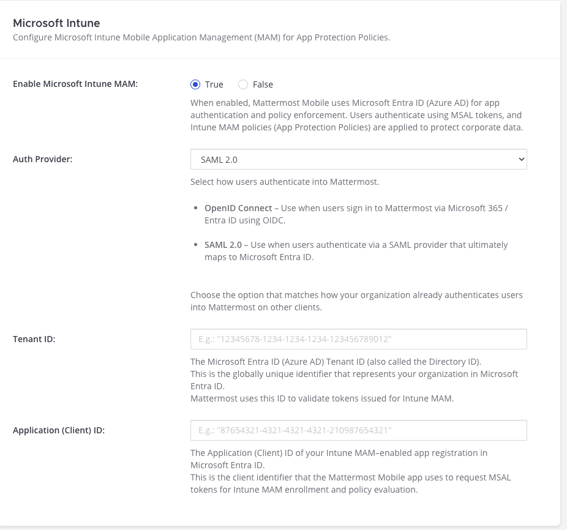

Configure Microsoft Intune Mobile Application Management (MAM)
==============================================================

.. include:: ../../_static/badges/entry-adv.rst
  :start-after: :nosearch:

You can configure the Mattermost Mobile App to enforce Microsoft Intune App Protection Policies (MAM) on iOS devices so organizational data remains protected on Bring Your Own Device (BYOD) and mixed-use devices without requiring device enrollment (MDM). This guide provides the required configuration to activate Intune MAM successfully on iOS.

Getting Started
---------------

This configuration spans identity, mobile enforcement, and licensing systems. The guide is intentionally explicit to prevent misconfiguration and destructive enrollment failures. It's organized to help you validate fit first, then configure Intune MAM correctly.

* Initial sections help you determine whether Intune MAM is compatible with your deployment.
* `Identity <#step-1-identity-configuration-for-intune-mam>`__ sections explain the required identity model and enforcement behavior.
* `Configuration <#configuration-steps>`__ sections provide a prescriptive order of operations.
* `Validation <#step-6-validation-checklist>`__ and `Troubleshooting <#troubleshooting>`__ describe expected runtime behavior and failure modes.

When Not to Use This Guide
--------------------------

If any of the following apply, stop. This configuration will fail.

* You need Intune MAM support on Android devices (not yet available).
* You want Intune MAM enforcement for a sign-in method that isn’t backed by Microsoft Entra ID (Azure AD).
* The sign-in method you select for Intune MAM enforcement can't resolve users to Azure AD ``objectId`` as the authoritative user identifier.
* You require a rollout model where users can defer, bypass, or opt out of Intune MAM enrollment for the sign-in method you’re protecting.

This guidance applies only to the authentication provider you select for Intune MAM enforcement. Other authentication methods, including guest sign-in, can still be enabled and used separately.

Prerequisites
-------------

Before proceeding, confirm the following are true:

* You use Microsoft Entra ID for authentication.
* You can commit to Azure AD ``objectId`` as the authoritative identity.
* You have (or can obtain) a Mattermost Enterprise Advanced license.
* Target users are licensed for Microsoft Intune.
* You can register applications and grant admin consent in Microsoft Entra.
* If using SAML for Intune MAM enforcement, users must already exist in Mattermost before they can complete mobile sign-in. Mobile sign-in doesn’t create users for SAML, so unprovisioned users must first sign in on web or desktop (or be provisioned) before using mobile.

If any of the above are not true, Intune MAM enrollment may fail or users may be unable to sign in on mobile until the prerequisite is met.

.. note::

  In this guide, OpenID Connect (OIDC) refers to the Microsoft Entra sign-in method used by the Mattermost Mobile App via MSAL.

Configuration Overview
----------------------

Configuring Intune MAM for the Mattermost Mobile App requires coordinated setup across the following 4 systems:

* **Microsoft Entra ID (Azure AD)** – identity, app registration, API permissions
* **Microsoft Intune** – app protection policies and user targeting
* **Mattermost Server** – MAM enablement and identity alignment
* **Mattermost Mobile App (iOS)** – enrollment and enforcement

If any system is misconfigured, Intune MAM enrollment will fail.

Setup Summary
~~~~~~~~~~~~~

.. important::

  Intune MAM enforcement is evaluated only for the authentication provider selected in **System Console > Environment > Mobile Security**. Before you enable Intune MAM, confirm all of the following for the selected provider:

  * Mattermost uses Azure AD ``objectId`` as the identity attribute (``IdAttribute = objectId``).
  * Confirm identity alignment (``objectId`` ↔ ``oid``).
  * Required Intune MAM API permissions have tenant-wide admin consent.

Use the summary steps below to understand the overall setup path. Each step links to the authoritative detailed instructions later in this document that you must follow in order to avoid enrollment failures and rework.

Step 1: Confirm identity requirements
^^^^^^^^^^^^^^^^^^^^^^^^^^^^^^^^^^^^^

Confirm that the authentication provider you plan to enforce (OIDC or SAML) resolves users to Azure AD ``objectId`` and confirm identity alignment (``objectId`` ↔ ``oid``).

* Identity must be aligned before enabling Intune MAM.
* If identity alignment fails, Intune MAM enrollment fails even if all other steps are correct.

See: `Step 1: Identity Configuration for Intune MAM <#step-1-identity-configuration-for-intune-mam>`__.

Step 2: Configure Microsoft Entra
^^^^^^^^^^^^^^^^^^^^^^^^^^^^^^^^^

Register a single-tenant Microsoft Entra application that Mattermost Server will use to validate MSAL access tokens and complete Intune MAM enrollment.

In this step you will:

* Create an app registration and configure MSAL v2 access tokens (``accessTokenAcceptedVersion = 2``).
* Expose the API and create the ``login.mattermost`` scope.
* Authorize the official Mattermost Mobile client application ID(s) to request the Mattermost login scope.
* Add required Intune MAM API permissions and grant tenant-wide admin consent.

See: `Step 2: Microsoft Entra Configuration for Intune MAM <#step-2-microsoft-entra-configuration-for-intune-mam>`__.

Step 3: Configure Mattermost Server
^^^^^^^^^^^^^^^^^^^^^^^^^^^^^^^^^^^

Enable Intune MAM in Mattermost and select the authentication provider to enforce.

In this step you will:

* Enable Microsoft Intune MAM in **System Console > Environment > Mobile Security**.
* Select the authentication provider to enforce (OIDC or SAML).
* Configure the Microsoft Entra **Tenant ID** and **Application (Client) ID**.
* Ensure the selected provider resolves identity using ``IdAttribute = objectId``.

See: `Step 3: Configure Mattermost Server for Intune MAM <#step-3-configure-mattermost-server-for-intune-mam>`__.

Step 4: Deploy/Confirm the iOS mobile app (Official builds only)
^^^^^^^^^^^^^^^^^^^^^^^^^^^^^^^^^^^^^^^^^^^^^^^^^^^^^^^^^^^^^^^^^

Install the official Mattermost iOS app and confirm you are using supported distribution methods (App Store or TestFlight).

See: `Step 4: Deploy or Update Mattermost Mobile Apps <#step-4-deploy-or-update-mattermost-mobile-apps>`__.

Step 5: Configure Intune App Protection Policies
^^^^^^^^^^^^^^^^^^^^^^^^^^^^^^^^^^^^^^^^^^^^^^^^

Create and assign an Intune iOS App Protection Policy for the Mattermost iOS app bundle ID so app protection controls are enforced for targeted users.

See: `Step 5: Configure Intune App Protection Policies <#step-5-configure-intune-app-protection-policies>`__.

Step 6: Validate enrollment and enforcement
^^^^^^^^^^^^^^^^^^^^^^^^^^^^^^^^^^^^^^^^^^^

Validate end-to-end enrollment and enforcement using a licensed test user on an iOS device.

See: `Step 6: Validation Checklist <#step-6-validation-checklist>`__ and `Troubleshooting <#troubleshooting>`__.

Quick Diagnostics If Enrollment Fails
~~~~~~~~~~~~~~~~~~~~~~~~~~~~~~~~~~~~~

If enrollment fails, use this order:

1. Confirm identity alignment (``objectId`` ↔ ``oid``). See: `Identity alignment check <#identity-alignment-check-objectid-oid>`__.
2. Confirm the enforced provider uses ``IdAttribute = objectId``. See: `Identity Enforcement by Authentication Method <#identity-enforcement-by-authentication-method>`__.
3. Confirm Entra API permissions and tenant-wide admin consent. See: `API permissions and tenant-wide admin consent <#api-permissions-and-tenant-wide-admin-consent>`__.
4. Confirm Mattermost **Auth Provider** selection matches how users authenticate (OIDC vs SAML). See: `Step 3 <#step-3-configure-mattermost-server-for-intune-mam>`__.
5. Confirm the user is targeted by an Intune App Protection Policy for the correct iOS bundle ID. See: `Step 5 <#step-5-configure-intune-app-protection-policies>`__.
6. Then review the `Intune MAM Errors <#intune-mam-errors>`__ table.

Values You'll Need Later
~~~~~~~~~~~~~~~~~~~~~~~~~~

Copy these values during setup. You’ll use them later across Mattermost and Intune.

+-------------------------------+-----------------------------------------+----------------------------------------------+
| Value                         | Where to get it                         | Where you use it                             |
+===============================+=========================================+==============================================+
| Directory (tenant) ID         | Entra app registration overview         | Mattermost System Console                    |
+-------------------------------+-----------------------------------------+----------------------------------------------+
| Application (client) ID       | Entra app registration overview         | Mattermost System Console                    |
+-------------------------------+-----------------------------------------+----------------------------------------------+
| Application ID URI            | Entra app > Expose an API               | Used when creating/authorizing scope         |
+-------------------------------+-----------------------------------------+----------------------------------------------+
| ``login.mattermost`` scope    | Entra app > Expose an API               | Authorized client applications               |
+-------------------------------+-----------------------------------------+----------------------------------------------+
| Mobile client application IDs | Mattermost documentation (official IDs) | Entra app > Authorized client applications   |
+-------------------------------+-----------------------------------------+----------------------------------------------+
| iOS bundle IDs (prod/beta)    | Mattermost documentation                | Intune App Protection Policies               |
+-------------------------------+-----------------------------------------+----------------------------------------------+

Configuration Steps
-------------------

Step 1: Identity Configuration for Intune MAM
~~~~~~~~~~~~~~~~~~~~~~~~~~~~~~~~~~~~~~~~~~~~~~

.. _step-1-identity-configuration-for-intune-mam:

This section defines the identity requirements, constraints, and runtime behavior for the authentication method selected for Microsoft Intune MAM enforcement.

.. important::

  - Mattermost can support multiple authentication methods at the same time. Intune MAM enforcement applies only to the authentication method selected in the Intune MAM configuration in the Mattermost System Console. That authentication method must resolve users by Azure AD ``objectId``. Other authentication methods are not evaluated by Intune MAM.
  - Intune MAM enforcement is identity-based and policy-driven. Mattermost roles and permissions don't affect whether Intune MAM is required or which protections apply.

All identity prerequisites for the authentication method selected for Intune MAM enforcement must be met before enabling Intune MAM or enrolling users.

Before enabling Intune MAM, commit to Azure AD ``objectId`` as the authoritative identity for the authentication provider you plan to enforce.

Required Identity Model
^^^^^^^^^^^^^^^^^^^^^^^^

Microsoft Intune MAM for Mattermost requires Azure AD ``objectId`` as the authoritative user identifier.

* No alternative identifiers are supported.
* If identity is misconfigured, Intune MAM enrollment will fail, even if all other configuration steps are correct.
* There is no fallback or partial enforcement mode.
* This requirement applies regardless of authentication method.

Identity Alignment Check (objectId ↔ oid)
^^^^^^^^^^^^^^^^^^^^^^^^^^^^^^^^^^^^^^^^^^

.. _identity-alignment-check-objectid-oid:

When this guide says "Confirm identity alignment (``objectId`` ↔ ``oid``)", it means the following values must match for the same user:

* Azure AD ``objectId``
* MSAL access token ``oid`` claim
* SAML ``objectidentifier`` (if applicable)
* LDAP ``msDS-aadObjectId`` (if applicable)

Any mismatch will cause Intune MAM enrollment to fail.

Identity Consistency Requirements
^^^^^^^^^^^^^^^^^^^^^^^^^^^^^^^^^^

The Azure AD ``objectId`` must be resolved consistently across all sign-in paths used by the authentication method selected for Intune MAM, including any of the following that apply to that authentication method and user population:

* Mobile (OIDC via MSAL)
* Web (SAML), if the same IdP is used
* LDAP sync (if you use LDAP to provision those users)

``IdAttribute`` is the Mattermost Server configuration that specifies which user attribute contains the Azure AD ``objectId``.

The following rules apply:

* ``IdAttribute`` must equal Azure AD ``objectId``.
* Confirm identity alignment (``objectId`` ↔ ``oid``).
* Any mobile, web, or directory sign-in flows used by the authentication method selected for Intune MAM must resolve to the same Azure AD ``objectId``.

If any authentication path resolves a different identifier, enrollment will fail.

Supported Identity Attributes
^^^^^^^^^^^^^^^^^^^^^^^^^^^^^^

Only the identity attributes listed below are supported for Intune MAM.

+-------------------+------------------+------------------------------+
| Attribute         | Supported        | Result                       |
+===================+==================+==============================+
| objectId          | Required         | Works                        |
+-------------------+------------------+------------------------------+
| email             | Not supported    | Enrollment fails             |
+-------------------+------------------+------------------------------+
| preferred_username| Not supported    | Identity mismatch            |
+-------------------+------------------+------------------------------+
| objectGUID        | Not supported    | Breaks mobile authentication |
+-------------------+------------------+------------------------------+
| Custom attributes | Not supported    | Unsupported by Intune        |
+-------------------+------------------+------------------------------+

Attribute Synchronization and Access Enforcement
^^^^^^^^^^^^^^^^^^^^^^^^^^^^^^^^^^^^^^^^^^^^^^^^^^

When Intune MAM is enabled, some users may authenticate exclusively through the Mattermost Mobile App. If your deployment uses SAML or OIDC, note the following behavior:

* User attributes synchronize only at login.
* Changes made in the identity provider do not apply until the next login.
* Mobile-only users may not trigger attribute synchronization.

As a result, attribute-based access control (ABAC) may not apply immediately.

If proactive enforcement of attribute-based access changes is required, we recommend LDAP (including Entra ID Domain Services). This behavior affects access enforcement, not Intune MAM enrollment.

Runtime Enforcement Behavior
^^^^^^^^^^^^^^^^^^^^^^^^^^^^^

The Mattermost Mobile App enforces Intune MAM requirements during active sessions, not only at login.

If Intune MAM becomes newly required due to policy, licensing, or configuration changes:

* Enrollment is triggered immediately.
* Access to sensitive content is restricted until enrollment succeeds.
* Users can't bypass enforcement.

Plan rollouts assuming enforcement can occur instantly.

Identity Enforcement by Authentication Method
^^^^^^^^^^^^^^^^^^^^^^^^^^^^^^^^^^^^^^^^^^^^^^

.. _identity-enforcement-by-authentication-method:

The authoritative identity requirement is the same for all sign-in methods (Azure AD ``objectId``). The details below describe where that value must appear for each authentication method.

OIDC (Mobile sign-in via MSAL)
:::::::::::::::::::::::::::::::

* Only the access token is used.
* Confirm identity alignment (``objectId`` ↔ ``oid``).

SAML (Web Login)
:::::::::::::::::

* ``SamlSettings.IdAttribute`` must map to ``objectidentifier``.
* Email, UPN, and ``immutableID`` are not supported.

.. important::

  When SAML is selected as the authentication method for Intune MAM enforcement, users must already exist in Mattermost before signing in on mobile. Users who haven't yet been provisioned must first sign in using the Mattermost web or desktop application. Mobile sign-in doesn't create new users for SAML-based authentication. If a user attempts to sign in on mobile before being provisioned, the user will be prompted to sign in using web or desktop.

LDAP (Entra ID Domain Services)
::::::::::::::::::::::::::::::::

* Use ``msDS-aadObjectId`` as the identity attribute.
* Do not use ``objectGUID``.

With identity alignment confirmed, proceed to Microsoft Entra configuration.

Pre-flight checklist (complete before Step 2)
^^^^^^^^^^^^^^^^^^^^^^^^^^^^^^^^^^^^^^^^^^^^^^

Use this checklist to prevent the most common enrollment failures.

- [ ] You have a licensed Intune test user account available.
- [ ] You can grant tenant-wide admin consent in Microsoft Entra.
- [ ] You know which authentication provider will be enforced (OIDC or SAML).
- [ ] The enforced provider is configured with ``IdAttribute = objectId``.
- [ ] You can validate identity alignment (``objectId`` ↔ ``oid``) for the test user.
- [ ] You are deploying the official Mattermost iOS app via App Store or TestFlight (no wrapped or re-signed binaries).
- [ ] You know the iOS bundle ID(s) you will target in Intune: ``com.mattermost.rn`` (Production), ``com.mattermost.rnbeta`` (Beta).

Step 2: Microsoft Entra Configuration for Intune MAM
~~~~~~~~~~~~~~~~~~~~~~~~~~~~~~~~~~~~~~~~~~~~~~~~~~~~~

.. _step-2-microsoft-entra-configuration-for-intune-mam:

This section provides the detailed Microsoft Entra configuration required to support Mattermost Mobile authentication and Microsoft Intune MAM enrollment.

You register a Microsoft Entra application that is referenced by Mattermost Server when Intune MAM is enabled. This Entra application is used to validate MSAL access tokens issued during mobile sign-in and to support enrollment with Intune App Protection Policies.

You do not register the Mattermost Mobile app itself in Entra for Intune MAM enforcement, and redirect URI configuration is not required.

Complete this section before `configuring Mattermost Server for Intune MAM <#step-3-configure-mattermost-server-for-intune-mam>`__.

Required Steps in Entra
^^^^^^^^^^^^^^^^^^^^^^^

You must complete all of the steps below:

* Register the Entra application.
* Expose the API and create the ``login.mattermost`` scope.
* Authorize the official Mattermost Mobile client application IDs.
* Add required API permissions and grant tenant-wide admin consent.
* Configure MSAL v2 access tokens.

Entra Application Registration
^^^^^^^^^^^^^^^^^^^^^^^^^^^^^^^

1. In the Microsoft Entra admin center, go to **Identity > Applications > App registrations**.
2. Select **New registration**, and enter:

   - **Name**: Mattermost Mobile (Intune MAM)
   - **Supported account types**: Accounts in this organizational directory only (Single tenant)

3. Select **Register**.
4. After registration, copy these values for later configuration in Mattermost:

   - **Application (client) ID**
   - **Directory (tenant) ID**

Expose the API and Create the Mattermost Scope
^^^^^^^^^^^^^^^^^^^^^^^^^^^^^^^^^^^^^^^^^^^^^^^^

Mattermost Mobile sign-in uses a scope exposed by the Entra application.

1. In the app registration, go to **Expose an API**.
2. Confirm the **Application ID URI** is set to ``api://<APPLICATION-ID>`` (typically created automatically).
3. Select **Add a scope**, and create a scope named ``login.mattermost``.
4. Save the scope.

Authorize the Official Mobile Client Application IDs
^^^^^^^^^^^^^^^^^^^^^^^^^^^^^^^^^^^^^^^^^^^^^^^^^^^^^^

After creating the ``login.mattermost`` scope, authorize the Mattermost Mobile client application to request it. This allows the Mattermost iOS app to request the ``login.mattermost`` scope during sign-in.

1. In **Expose an API**, go to **Authorized client applications** (or **Add a client application**).
2. Add the official Mattermost Mobile client application ID, and authorize the ``api://<APPLICATION-ID>/login.mattermost`` scope.
3. Save your changes.

.. note::

  You may need to add both the Production and Beta mobile client application IDs depending on which app you deploy.

API Permissions and Tenant-wide Admin Consent
^^^^^^^^^^^^^^^^^^^^^^^^^^^^^^^^^^^^^^^^^^^^^^

.. _api-permissions-and-tenant-wide-admin-consent:

Intune MAM enrollment requires specific API permissions and tenant-wide admin consent. These permissions allow Mattermost to complete Intune MAM enrollment and apply App Protection Policies.

1. In the app registration, go to **API permissions**.
2. Select **Add a permission**.
3. Add the required Intune MAM permissions, including:

   * ``https://msmamservice.api.application/.default``
   * **Microsoft Mobile Application Management → user_impersonation** (Delegated), as required for enrollment

4. Select **Grant admin consent** for the tenant.

.. important::

  - Admin consent must be granted tenant-wide. If consent is missing, authentication may succeed but Intune MAM enrollment will fail until consent is granted.
  - Microsoft Entra uses both **App registrations** and **Enterprise applications** to represent the same application. You may need access to both areas to complete registration, permission assignment, and admin consent.

Configure MSAL v2 Access Tokens
^^^^^^^^^^^^^^^^^^^^^^^^^^^^^^^^

Mattermost Mobile requires MSAL v2 access tokens when Intune MAM is enabled.

1. In the app registration, go to **Manifest**.
2. Set ``accessTokenAcceptedVersion`` to ``2``.
3. Select **Save**.

Access token requirements
^^^^^^^^^^^^^^^^^^^^^^^^^^^

Mattermost Mobile relies on MSAL access token claims for identity resolution and Intune MAM enforcement.

* Mattermost uses Azure AD ``objectId`` as the authoritative identity (``IdAttribute = objectId``).
* Confirm identity alignment (``objectId`` ↔ ``oid``).

If identity alignment fails, review `Step 1: Identity Configuration for Intune MAM <#step-1-identity-configuration-for-intune-mam>`__.

Step 3: Configure Mattermost Server for Intune MAM
~~~~~~~~~~~~~~~~~~~~~~~~~~~~~~~~~~~~~~~~~~~~~~~~~~~

.. _step-3-configure-mattermost-server-for-intune-mam:

This section configures Mattermost to enable Intune MAM enforcement for the selected authentication provider.

1. Go to **System Console > Environment > Mobile Security**.
2. Set **Enable Microsoft Intune MAM** to **True**.
3. Under **Auth Provider**, select one of the following:

   * **OpenID Connect** (Microsoft Entra-backed)
   * **SAML 2.0** (backed by Microsoft Entra)

4. Enter the following values from your Microsoft Entra application:

   * **Tenant ID** (Directory ID)
   * **Application (Client) ID**

5. Save your changes.

.. important::

  - Intune MAM requires Mattermost to resolve users by Azure AD ``objectId`` (``IdAttribute = objectId``). This value is configured in your authentication provider settings (OIDC or SAML), not in **System Console > Environment > Mobile Security**. If ``IdAttribute`` isn't set correctly, enrollment fails even if the System Console configuration is correct.
  - If you select **SAML** as the authentication provider for Intune MAM enforcement, the SAML identity provider must be backed by Microsoft Entra ID. Mattermost doesn't validate whether a SAML IdP is Entra-backed. Using a non-Entra SAML identity provider with Intune MAM will result in enrollment failures.

Step 4: Deploy or Update Mattermost Mobile Apps
~~~~~~~~~~~~~~~~~~~~~~~~~~~~~~~~~~~~~~~~~~~~~~~~

.. _step-4-deploy-or-update-mattermost-mobile-apps:

Install the Mattermost iOS mobile app using one of the following supported methods:

* Apple App Store (production)
* TestFlight (beta)

Other distribution methods, including Intune-wrapped apps, re-signed binaries, or private IPA deployments, aren't supported for Intune MAM enforcement and won't work.

.. note::

  - Mattermost Beta (``com.mattermost.rnbeta``) and Production (``com.mattermost.rn``) apps can share the same Microsoft Entra app registration when using an exposed API configuration. Separate app registrations are optional and only required if you intentionally isolate environments or scopes.
  - MDM device enrollment isn't required. Intune App Protection Policies are enforced at the app level and require the official Mattermost iOS app from the App Store or TestFlight.

Step 5: Configure Intune App Protection Policies
~~~~~~~~~~~~~~~~~~~~~~~~~~~~~~~~~~~~~~~~~~~~~~~~~

.. _step-5-configure-intune-app-protection-policies:

This section creates and assigns an Intune iOS App Protection Policy for the Mattermost iOS app bundle ID so app protection controls are enforced for targeted users.

1. In the **Microsoft Intune admin center**, go to **Apps > App protection policies**.
2. Select **Create policy**, then configure:

   - **Platform**: iOS/iPadOS
   - **Targeted app**: Managed apps

3. Under **Apps**, add the Mattermost iOS app by bundle ID:

   - **Mattermost Mobile (Production)**: ``com.mattermost.rn``
   - **Mattermost Mobile Beta**: ``com.mattermost.rnbeta``

.. note::

  You must create separate App Protection Policies for Production and Beta. Policies applied to one bundle ID do not apply to the other.

4. Configure the protection settings your organization requires (for example, PIN requirements, data transfer restrictions, and screen capture controls). For a complete list of available App Protection Policy controls and recommended configurations, see Microsoft documentation for Intune app protection policies.
5. Assign the policy to users using Microsoft Entra ID groups.
6. Save the policy.

.. note::

    - You must create separate Intune App Protection Policies for each Mattermost iOS app you deploy. Policies applied to one bundle ID do not apply to the other.
    - Intune App Protection Policies are assigned using Microsoft Entra ID groups, not Mattermost teams, channels, or roles.

Step 6: Validation Checklist
~~~~~~~~~~~~~~~~~~~~~~~~~~~~

.. _step-6-validation-checklist:

Before rolling out to production, validate the configuration using a licensed test user account on an iOS device.

We recommend performing your first validation sign-in using a Microsoft Entra administrator account that can grant tenant-wide admin consent, in case consent prompts appear during enrollment.

Confirm the following:

1. Enrollment completes end-to-end on iOS.
2. Enforcement behavior works at sign-in and mid-session (for example, when Intune MAM becomes newly required due to policy or licensing changes).
3. Confirm identity alignment (``objectId`` ↔ ``oid``) for the same user.

If enrollment fails, use the `Quick diagnostic index <#quick-diagnostic-index-if-enrollment-fails>`__ and then review `Troubleshooting <#troubleshooting>`__.

Expected Mobile Login & Enrollment Flow
---------------------------------------

When **Enable Microsoft Intune MAM** is set to **True** in the Mattermost System Console, the following flow occurs during mobile sign-in:

1. The mobile app checks:

   * Platform is iOS
   * Intune MAM is enabled
   * Authentication service matches
   * License is **Enterprise Advanced**

2. The user taps **Sign in**.
3. MSAL authenticates the user.
4. Mattermost validates the access token.
5. Intune MAM enrollment is triggered.
6. App protection policies are applied.

Troubleshooting
---------------

.. _troubleshooting:

Most Intune MAM enrollment failures are caused by:

* Incorrect ``IdAttribute``
* Missing Microsoft Entra API permissions
* Identity alignment failure (``objectId`` ↔ ``oid``)
* Android device usage

Always fix identity alignment first.

Intune MAM Errors
~~~~~~~~~~~~~~~~~

.. _intune-mam-errors:

The errors below may occur during mobile sign-in or when Intune MAM enforcement is triggered mid-session. Some errors are shown in the Mattermost Mobile App, while others are silent and must be diagnosed using the Mattermost server logs.

.. raw:: html

  

  <table class="mm-intune-errors" aria-label="Microsoft Intune MAM errors and admin remediation steps">
    <thead>
      <tr>
        <th style="width: 26%;">Error</th>
        <th style="width: 20%;">Meaning</th>
        <th style="width: 54%;">Admin cause &amp; next step</th>
      </tr>
    </thead>
    <tbody>

      <!-- Enrollment Failed -->
      <tr>
        <td>
          <strong>Enrollment Failed</strong>
          

            Error ID: <code>(varies)</code> 
            Retry: No 
            Fallback: None
          

        </td>
        <td>
          Intune MAM enrollment failed due to a technical error.
        </td>
        <td>
          Cause: Enrollment could not be completed due to a technical failure (MSAL error, Intune enrollment API failure, identity mismatch, or missing Entra permissions).
          <ul>
            <li>Behavior: The server is removed immediately and there is no retry option.</li>
            <li>Next step: Fix the underlying issue, then have the user re-add the server in the mobile app.</li>
            <li>Admin checks: Verify <code>IdAttribute = objectId</code>; confirm identity alignment (<code>objectId ↔ oid</code>); confirm tenant-wide admin consent; confirm App Protection Policy targets the user and app bundle ID.</li>
          </ul>
        </td>
      </tr>

      <!-- Enrollment Declined -->
      <tr>
        <td>
          <strong>Enrollment Declined</strong>
          

            Error ID: <code>(varies)</code> 
            Retry: Yes 
            Fallback: None
          

        </td>
        <td>
          User declined Intune MAM enrollment.
        </td>
        <td>
          Cause: The user canceled the enrollment prompt.
          <ul>
            <li>Behavior: A <strong>Retry</strong> option is shown.</li>
            <li>Next step: Instruct the user to retry enrollment when ready.</li>
            <li>Admin note: No server data is removed unless a later technical enrollment failure occurs.</li>
          </ul>
        </td>
      </tr>

      <!-- Enterprise not compiled -->
      <tr>
        <td>
          <strong>(silent)</strong>
          

            Error ID: <code>api.user.login_by_intune.not_available.app_error</code> 
            HTTP: 501 
            Retry: No 
            Fallback: Web SSO
          

        </td>
        <td>
          Intune MAM login is not available on this server.
        </td>
        <td>
          Cause: The server does not support Intune MAM (feature not available in this build or not enabled for the deployment).
          <ul>
            <li>Next step: Confirm the server version/build includes Intune MAM support and that the deployment is licensed for Enterprise Advanced.</li>
            <li>User guidance: Have the user sign in via web/desktop while the server is updated or configuration is corrected.</li>
          </ul>
        </td>
      </tr>

      <!-- Intune not configured -->
      <tr>
        <td>
          <strong>(silent)</strong>
          

            Error ID: <code>api.user.login_by_intune.not_configured.app_error</code> 
            HTTP: 400 
            Retry: No 
            Fallback: Web SSO
          

        </td>
        <td>
          Intune MAM is enabled for the org but not configured on the server.
        </td>
        <td>
          Cause: Intune MAM is not fully configured in <strong>System Console &gt; Environment &gt; Mobile Security</strong>.
          <ul>
            <li>Next step: Enable Microsoft Intune MAM and ensure <strong>Tenant ID</strong>, <strong>Application (Client) ID</strong>, and <strong>Auth Provider</strong> are set correctly.</li>
            <li>Admin checks: Confirm the selected auth provider is Entra-backed and that required permissions/admin consent have been granted for the Entra app registration.</li>
            <li>User guidance: Have the user sign in via web/desktop while configuration is completed.</li>
          </ul>
        </td>
      </tr>

      <!-- Bot login forbidden -->
      <tr>
        <td>
          <strong>Bot accounts cannot sign in using this method.</strong>
          

            Error ID: <code>api.user.login_by_intune.bot_login_forbidden.app_error</code> 
            HTTP: 403 
            Retry: No 
            Fallback: None
          

        </td>
        <td>
          The account cannot use Intune MAM sign-in.
        </td>
        <td>
          Cause: Bot accounts are not allowed to authenticate via Intune MAM.
          <ul>
            <li>Next step: Use a human user account for Intune MAM enrollment and access.</li>
          </ul>
        </td>
      </tr>

      <!-- Account locked/deactivated -->
      <tr>
        <td>
          <strong>Your account has been deactivated. Please contact your administrator.</strong>
          

            Error ID: <code>api.user.login_by_intune.account_locked.app_error</code> 
            HTTP: 409 
            Retry: No 
            Fallback: None
          

        </td>
        <td>
          The account is not permitted to sign in.
        </td>
        <td>
          Cause: The user is deleted, disabled, or locked in Mattermost.
          <ul>
            <li>Next step: Re-enable or restore the user account in Mattermost, then retry sign-in and enrollment.</li>
          </ul>
        </td>
      </tr>

      <!-- IsConfigured() false -->
      <tr>
        <td>
          <strong>(silent)</strong>
          

            Error ID: <code>ent.intune.login.not_configured.app_error</code> 
            HTTP: 403 
            Retry: No 
            Fallback: Web SSO
          

        </td>
        <td>
          Intune MAM is not configured for the current sign-in path.
        </td>
        <td>
          Cause: Intune MAM is not configured for the requested authentication path (configuration incomplete or mismatched provider selection).
          <ul>
            <li>Next step: Confirm Intune MAM is enabled and configured, and that the selected <strong>Auth Provider</strong> matches how users authenticate (OIDC vs SAML).</li>
            <li>User guidance: Have the user sign in via web/desktop while configuration is corrected.</li>
          </ul>
        </td>
      </tr>

      <!-- IdAttribute mapping failed -->
      <tr>
        <td>
          <strong>We couldn't complete your sign in. Please try again.</strong>
          

            Error ID: <code>ent.intune.login.extract_auth_data.app_error</code> 
            HTTP: 400 
            Retry: Yes (1x) 
            Fallback: None
          

        </td>
        <td>
          Identity mapping failed during sign-in.
        </td>
        <td>
          Cause: The server couldn’t extract or map the identity attribute required for Intune MAM (commonly <code>IdAttribute</code> is misconfigured or the token is not MSAL v2).
          <ul>
            <li>Next step: Ensure <code>IdAttribute = objectId</code>, then confirm identity alignment (<code>objectId ↔ oid</code>).</li>
            <li>Admin checks: Verify the Entra app registration is configured to issue v2 tokens and includes <code>accessTokenAcceptedVersion = 2</code>.</li>
          </ul>
        </td>
      </tr>

      <!-- SAML user not found -->
      <tr>
        <td>
          <strong>Your account isn't fully set up yet. Please sign in to Mattermost via the web or desktop app first.</strong>
          

            Error ID: <code>ent.intune.login.account_not_found.app_error</code> 
            HTTP: 428 
            Retry: No 
            Fallback: None
          

        </td>
        <td>
          The user does not exist in Mattermost for SAML-based sign-in.
        </td>
        <td>
          Cause: When SAML is the selected provider for Intune MAM enforcement, mobile sign-in cannot create a new user.
          <ul>
            <li>Next step: Have the user sign in once via the web or desktop app to create/provision the account, then retry mobile sign-in.</li>
            <li>Admin checks: Ensure provisioning is in place (SAML JIT via web/desktop, LDAP sync, or another provisioning method).</li>
          </ul>
        </td>
      </tr>

      <!-- Token validation failed -->
      <tr>
        <td>
          <strong>We couldn't verify your sign in. Please try again.</strong>
          

            Error ID: <code>ent.intune.validate_token.invalid_token.app_error</code> 
            HTTP: 400 
            Retry: Yes (1x) 
            Fallback: None
          

        </td>
        <td>
          The access token could not be validated.
        </td>
        <td>
          Cause: Token validation failed (token malformed, wrong issuer/audience, missing permissions, or Entra configuration mismatch).
          <ul>
            <li>Next step: Verify the configured <strong>Tenant ID</strong> and <strong>Application (Client) ID</strong> match the Entra app that issued the token.</li>
            <li>Admin checks: Confirm tenant-wide admin consent for required Intune MAM permissions; confirm the app registration issues MSAL v2 access tokens (<code>accessTokenAcceptedVersion = 2</code>); confirm identity alignment (<code>objectId ↔ oid</code>).</li>
          </ul>
        </td>
      </tr>

      <!-- Token expired -->
      <tr>
        <td>
          <strong>Your sign in session has expired. Please try signing in again.</strong>
          

            Error ID: <code>ent.intune.validate_token.token_expired.app_error</code> 
            HTTP: 400 
            Retry: Yes (1x) 
            Fallback: None
          

        </td>
        <td>
          The authentication session expired before enrollment completed.
        </td>
        <td>
          Cause: The access token or interactive session expired during sign-in/enrollment.
          <ul>
            <li>Next step: Have the user sign in again and complete enrollment promptly.</li>
            <li>Admin checks: If repeated, validate the device has network access to Entra/Intune endpoints and that enrollment prompts are not being blocked.</li>
          </ul>
        </td>
      </tr>

      <!-- Missing claims -->
      <tr>
        <td>
          <strong>We couldn't complete your sign in. Please contact your IT administrator.</strong>
          

            Error ID: <code>ent.intune.validate_token.missing_claims.app_error</code> 
            HTTP: 400 
            Retry: No 
            Fallback: None
          

        </td>
        <td>
          The access token is missing required identity claims.
        </td>
        <td>
          Cause: Required claims are missing from the access token (most commonly <code>oid</code>).
          <ul>
            <li>Next step: Ensure MSAL v2 tokens are issued (<code>accessTokenAcceptedVersion = 2</code>) and confirm the enforced provider uses <code>IdAttribute = objectId</code>. Then confirm identity alignment (<code>objectId ↔ oid</code>).</li>
            <li>Admin checks: Confirm <code>accessTokenAcceptedVersion = 2</code> in the app manifest; confirm <code>IdAttribute = objectId</code> for the enforced provider; confirm identity alignment (<code>objectId ↔ oid</code>).</li>
          </ul>
        </td>
      </tr>

      <!-- Invalid tenant -->
      <tr>
        <td>
          <strong>There was a configuration issue. Please contact your IT administrator.</strong>
          

            Error ID: <code>ent.intune.validate_token.invalid_tenant_id.app_error</code> 
            HTTP: 400 
            Retry: No 
            Fallback: None
          

        </td>
        <td>
          The token tenant does not match the configured tenant.
        </td>
        <td>
          Cause: The token was issued by a different tenant than the one configured in Mattermost (tenant mismatch).
          <ul>
            <li>Next step: Verify the <strong>Tenant ID</strong> configured in the System Console matches the Entra tenant issuing MSAL tokens for Mattermost Mobile.</li>
            <li>Admin checks: Confirm the user is authenticating against the expected tenant and that the mobile configuration points to the correct environment.</li>
          </ul>
        </td>
      </tr>

      <!-- AADSTS650057 -->
      <tr>
        <td>
          <strong>AADSTS650057</strong> 
          (invalid_resource)
          

            Error ID: <code>(AADSTS650057)</code> 
            Retry: No (until fixed) 
            Fallback: None
          

        </td>
        <td>
          Required Intune MAM API permission is missing.
        </td>
        <td>
          Cause: Required Intune MAM API permissions are missing or do not have tenant-wide admin consent.
          <ul>
            <li>Next step: Add and grant admin consent for <code>https://msmamservice.api.application/.default</code> and <code>Microsoft Mobile Application Management → user_impersonation</code> (Delegated), as required.</li>
            <li>Admin checks: Confirm admin consent was granted under the Enterprise application (service principal), then have the user retry sign-in.</li>
          </ul>
        </td>
      </tr>

      <!-- NotLicensed -->
      <tr>
        <td>
          <strong>NotLicensed</strong>
          

            Error ID: <code>(NotLicensed)</code> 
            Retry: No 
            Fallback: None
          

        </td>
        <td>
          The server is not licensed for Intune MAM enforcement.
        </td>
        <td>
          Cause: Enterprise Advanced licensing is missing or not applied to the server.
          <ul>
            <li>Next step: Apply an Enterprise Advanced license to the server and confirm the license is active.</li>
          </ul>
        </td>
      </tr>

      <!-- HTTP 403 Forbidden -->
      <tr>
        <td>
          <strong>HTTP 403 Forbidden</strong>
          

            Error ID: <code>(HTTP 403)</code> 
            Retry: No 
            Fallback: None
          

        </td>
        <td>
          Server-side access is blocked.
        </td>
        <td>
          Cause: A server gating condition is preventing enrollment (not an Intune service failure).
          <ul>
            <li>Next step: Verify Enterprise Advanced licensing, Intune MAM is enabled, Auth Provider selection matches how users authenticate, Tenant ID and Client ID are valid, admin consent is granted, and <code>IntuneScope</code> is set. Then confirm identity alignment (<code>objectId ↔ oid</code>).</li>
            <li>Admin checks: Confirm provider selection (OIDC vs SAML); confirm <code>IdAttribute = objectId</code> for the enforced provider; confirm identity alignment (<code>objectId ↔ oid</code>); confirm the user is licensed for Intune and targeted by an App Protection Policy for the correct bundle ID.</li>
          </ul>
        </td>
      </tr>

    </tbody>
  </table>

Enrollment Failure Session Behavior
~~~~~~~~~~~~~~~~~~~~~~~~~~~~~~~~~~~

If Intune MAM enrollment fails due to a **technical error**, the following occurs:

* The user is logged out of the affected Mattermost server.
* The server is removed from the Mattermost Mobile App.
* All cached data for that server is wiped from the device.

If a user has multiple Mattermost servers configured in the app, **only the failing server is removed**. Other servers remain accessible and unaffected.

If the user **declines enrollment**, retry is allowed and no server data is removed unless enrollment later fails due to a technical error.

Rollback / Recovery Guidance
~~~~~~~~~~~~~~~~~~~~~~~~~~~~

Because enrollment failures can remove the server and wipe cached data for that server, plan rollouts carefully:

* Pilot Intune MAM with a small group of test users first.
* Validate identity alignment (``objectId`` ↔ ``oid``) before enabling enforcement for broad populations.
* Expect enforcement to occur mid-session if policy/licensing/configuration changes make Intune MAM newly required.

Consent Required During First Login
~~~~~~~~~~~~~~~~~~~~~~~~~~~~~~~~~~~

In some cases, a user’s first mobile sign-in may succeed, but Intune MAM enrollment doesn't complete. Authentication can succeed even when required Intune MAM permissions are missing, which can make this issue non-obvious during initial rollout or testing.

This issue occurs when required Microsoft Entra permissions for Intune MAM haven't yet been granted with tenant-wide admin consent. This issue is most commonly encountered during initial rollout or testing, before admin consent has been granted for the tenant.

If users are prompted for Microsoft Entra consent during first login, this is expected behavior when tenant-wide admin consent hasn't yet been granted. A Microsoft Entra administrator with permission to grant tenant-wide admin consent must approve the request on behalf of the organization before Intune MAM enrollment can complete.

Verify that the following permissions have been granted with admin consent in Microsoft Entra:

* Microsoft Mobile Application Management → ``user_impersonation`` (Delegated)
* ``https://msmamservice.api.application/.default``

If admin consent is missing, Intune MAM enrollment can't complete, even if authentication succeeds.

To resolve this:

1. Go to **Microsoft Entra Admin Center > Enterprise applications**.
2. Locate the Mattermost Mobile enterprise application (service principal).
3. Grant **tenant-wide admin consent** for all required Intune MAM permissions.
4. Have the affected user **retry mobile sign-in**.

Once admin consent is granted, enrollment should complete successfully on retry.
