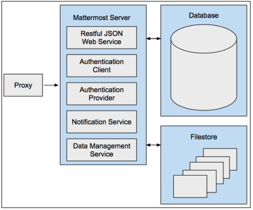

(Recommended) Set up an NGINX proxy
===================================

A proxy server is a server (a computer system or an application) that acts as an intermediary for requests from clients seeking resources from other servers. Mattermost recommends using a proxy in front of Mattermost to increase security, performance and the ability to monitor and shape traffic connecting to Mattermost:

- **Security:** A proxy server can manage Secure Socket Layer (TLS/SSL) encryption and set policy on how network traffic will be routed to the Mattermost server.
- **Performance:** In a High Availability configuration, the proxy server balances the network load across multiple Mattermost servers for optimized performance. A hardware proxy with dedicated devices for processing SSL encryption and decryption can also be used to increase performance.
- **Monitoring**: A proxy server can monitor connection traffic and record traffic in standard audit logs that common monitoring tools like Kibana and Splunk can consume and report on. Some of the events that can be captured include file uploads and downloads, which are not tracked by the Mattermost server logging process.

Mattermost supports the `NGINX proxy <https://www.f5.com/go/product/welcome-to-nginx>`_

Install NGINX server
--------------------

NGINX is a popular web server and is responsible for hosting some of the largest and highest-traffic sites on the internet. It's more resource-friendly than Apache in most cases, and can be used as a web server or reverse proxy.

In a production setting, we recommend using a proxy server for greater security and performance of Mattermost:

-  SSL termination
-  HTTP to HTTPS redirect
-  Port mapping ``:80`` to ``:8065``
-  Standard request logs

Install NGINX on Ubuntu Server
~~~~~~~~~~~~~~~~~~~~~~~~~~~~~~

1. Log in to the server that will host the proxy and open a terminal window.

2. Install NGINX.

  Because NGINX is available in Ubuntu's default repositories, it's possible to install it from these repositories using the ``apt`` packaging system. First, update your local ``apt`` package index for access to the most recent package listings. Then, install ``nginx``:

  .. code-block:: sh

    sudo apt update
    sudo apt install nginx

  After accepting the procedure, ``apt`` will install NGINX and any required dependencies to your server.

3. After installing it, you already have everything you need. You can point your browser to your server IP address. You should see the default NGINX landing page:

  .. image:: /images/install_nginx_welcome.png
    :alt: Example of the default NGINX landing page.

  If you see this page, you've successfully installed NGINX on your web server. This page is included with NGINX to show you that the server is running correctly.

  Or you can also verify it by running ``curl http://localhost``. 

  If NGINX is running, you see the following output:

  .. code-block:: html

    <!DOCTYPE html>
    <html>
    <head>
    <title>Welcome to nginx!</title>
    .
    .
    .
    
<em>Thank you for using nginx.</em>

    </body>
    </html>

Manage the NGINX process
~~~~~~~~~~~~~~~~~~~~~~~~

Now that you have your web server up and running, let's review some basic management commands. These are all run in the command line interface.

To stop your web server, use: ``sudo systemctl stop nginx``

To start the web server when it's stopped, use: ``sudo systemctl start nginx``

To stop and then start the service again, use: ``sudo systemctl restart nginx``

If you're simply making configuration changes, NGINX can often reload without dropping connections. To do this, use: ``sudo systemctl reload nginx``

By default, NGINX is configured to start automatically when the server boots. If this isn't what you want, you can disable this behavior using: ``sudo systemctl disable nginx``
 
To re-enable the service to start up at boot, use: ``sudo systemctl enable nginx``

What to do next
~~~~~~~~~~~~~~~

1. Map a fully qualified domain name (FQDN) such as ``mattermost.example.com`` on your DNS server/service, to point to the NGINX server.
2. Configure NGINX to proxy connections from the internet to the Mattermost server.

Configure NGINX as a proxy for Mattermost server
------------------------------------------------

NGINX is configured using a file in the ``/etc/nginx/sites-available`` directory. You need to create the file and then enable it. When creating the file, you need the IP address of your Mattermost server and the fully qualified domain name (FQDN) of your Mattermost website.

1. Log in to the server that hosts NGINX and open a terminal window.
2. Create a configuration file for Mattermost by running the following command:

  ``sudo touch /etc/nginx/sites-available/mattermost`` on Ubuntu

  ``sudo touch /etc/nginx/conf.d/mattermost`` on RHEL 8

3. Open the file ``/etc/nginx/sites-available/mattermost`` (Ubuntu) or  ``/etc/nginx/conf.d/mattermost`` (RHEL 8) as *root* user in a text editor and replace its contents, if any, with the following lines. Make sure that you use your own values for the Mattermost server IP address and FQDN for *server_name*.

SSL and HTTP/2 are enabled in the provided configuration example.

.. note::

  - If you're going to use Let's Encrypt to manage your SSL certificate, stop at step 3 and see the :ref:`NGINX HTTP/2 and SSL product documentation <deployment-guide/server/setup-nginx-proxy:configure nginx with ssl and http/2>` for details.
  - You'll need valid SSL certificates in order for NGINX to pin the certificates properly. Additionally, your browser must have permissions to accept the certificate as a valid CA-signed certificate.
  - Note that the IP address included in the examples in this documentation may not match your network configuration.
  - If you're running NGINX on the same machine as Mattermost, and NGINX resolves ``localhost`` to more than one IP address (IPv4 or IPv6), we recommend using ``127.0.0.1`` instead of ``localhost``.

  .. code-block:: text

    upstream backend {
       server 10.10.10.2:8065;
       keepalive 32;
    }

    server {
      listen 80 default_server;
      server_name   mattermost.example.com;
      return 301 https://$server_name$request_uri;
    }

    server {
       listen 443 ssl http2;
       listen [::]:443 ssl http2;
       server_name    mattermost.example.com;

       ssl_certificate /etc/letsencrypt/live/{domain-name}/fullchain.pem;
       ssl_certificate_key /etc/letsencrypt/live/{domain-name}/privkey.pem;
       ssl_session_timeout 1d;

       # Enable TLS versions (TLSv1.3 is required upcoming HTTP/3 QUIC).
       ssl_protocols TLSv1.2 TLSv1.3;

       # Enable TLSv1.3's 0-RTT. Use $ssl_early_data when reverse proxying to
       # prevent replay attacks.
       #
       # @see: https://nginx.org/en/docs/http/ngx_http_ssl_module.html#ssl_early_data
       ssl_early_data on;

       ssl_ciphers 'ECDHE-ECDSA-AES256-GCM-SHA384:ECDHE-RSA-AES256-GCM-SHA384:ECDHE-ECDSA-CHACHA20-POLY1305:ECDHE-RSA-CHACHA20-POLY1305:ECDHE-ECDSA-AES256-SHA384:ECDHE-RSA-AES256-SHA384';
       ssl_prefer_server_ciphers on;
       ssl_session_cache shared:SSL:50m;
       # HSTS (ngx_http_headers_module is required) (15768000 seconds = six months)
       add_header Strict-Transport-Security max-age=15768000;
       # OCSP Stapling ---
       # fetch OCSP records from URL in ssl_certificate and cache them
       ssl_stapling on;
       ssl_stapling_verify on;

       add_header X-Early-Data $tls1_3_early_data;

       location ~ /api/v[0-9]+/(users/)?websocket$ {
           proxy_set_header Upgrade $http_upgrade;
           proxy_set_header Connection "upgrade";
           client_max_body_size 50M;
           proxy_set_header Host $host;
           proxy_set_header X-Real-IP $remote_addr;
           proxy_set_header X-Forwarded-For $proxy_add_x_forwarded_for;
           proxy_set_header X-Forwarded-Proto $scheme;
           proxy_set_header X-Frame-Options SAMEORIGIN;
           proxy_buffers 256 16k;
           proxy_buffer_size 16k;
           client_body_timeout 60s;
           send_timeout 300s;
           lingering_timeout 5s;
           proxy_connect_timeout 90s;
           proxy_send_timeout 300s;
           proxy_read_timeout 90s;
           proxy_http_version 1.1;
           proxy_pass http://backend;
       }

       location / {
           client_max_body_size 100M;
           proxy_set_header Connection "";
           proxy_set_header Host $host;
           proxy_set_header X-Real-IP $remote_addr;
           proxy_set_header X-Forwarded-For $proxy_add_x_forwarded_for;
           proxy_set_header X-Forwarded-Proto $scheme;
           proxy_set_header X-Frame-Options SAMEORIGIN;
           proxy_buffers 256 16k;
           proxy_buffer_size 16k;
           proxy_read_timeout 600s;
           proxy_http_version 1.1;
           proxy_pass http://backend;
       }
    }

    # This block is useful for debugging TLS v1.3. Please feel free to remove this
    # and use the `$ssl_early_data` variable exposed by NGINX directly should you
    # wish to do so.
    map $ssl_early_data $tls1_3_early_data {
      "~." $ssl_early_data;
      default "";
    }

4. Remove the existing default sites-enabled file by running ``sudo rm /etc/nginx/sites-enabled/default`` (Ubuntu) or ``sudo rm /etc/nginx/conf.d/default`` (RHEL 8)

5. Enable the mattermost configuration by running ``sudo ln -s /etc/nginx/sites-available/mattermost /etc/nginx/sites-enabled/mattermost`` (Ubuntu) or ``sudo ln -s /etc/nginx/conf.d/mattermost /etc/nginx/conf.d/default.conf`` (RHEL 8)

6. Restart NGINX by running ``sudo systemctl restart nginx``.

7. Verify that you can see Mattermost through the proxy by running ``curl https://localhost``. If everything is working, you will see the HTML for the Mattermost signup page.

8. Restrict access to port 8065.

  By default, the Mattermost server accepts connections on port 8065 from every machine on the network. Use your firewall to deny connections on port 8065 to all machines except the machine that hosts NGINX and the machine that you use to administer the Mattermost server. If you're installing on Amazon Web Services, you can use Security Groups to restrict access.

Now that NGINX is installed and running, you can configure it to use SSL, which allows you to use HTTPS connections and the HTTP/2 protocol.

Configure NGINX with SSL and HTTP/2
-----------------------------------

NGINX is configured using a file in the ``/etc/nginx/sites-available`` directory. You need to create the file and then enable it. When creating the file, you need the IP address of your Mattermost server and the fully qualified domain name (FQDN) of your Mattermost website.

Using SSL gives greater security by ensuring that communications between Mattermost clients and the Mattermost server are encrypted. It also allows you to configure NGINX to use the HTTP/2 protocol.

Although you can configure HTTP/2 without SSL, both Firefox and Chrome browsers support HTTP/2 on secure connections only.

You can use any certificate that you want, but these instructions show you how to download and install certificates from `Let's Encrypt <https://letsencrypt.org/>`__, a free certificate authority.

.. note::

  If Let’s Encrypt is enabled, forward port 80 through a firewall, with :ref:`Forward80To443 <administration-guide/configure/environment-configuration-settings:forward port 80 to 443>` ``config.json`` setting set to ``true`` to complete the Let’s Encrypt certification. See the `Let's Encrypt/Certbot documentation <https://certbot.eff.org>`_ for additional assistance.

1. Log in to the server that hosts NGINX and open a terminal window.

2. Open the your Mattermost ``nginx.conf`` file as *root* in a text editor, then update the ``{ip}`` address in the ``upstream backend`` to point towards Mattermost (such as ``127.0.0.1:8065``), and update the ``server_name`` to be your domain for Mattermost.

  .. note::

    - On Ubuntu this file is located at ``/etc/nginx/sites-available/``. If you don't have this file, run ``sudo touch /etc/nginx/sites-available/mattermost``.
    - On CentOS/RHEL this file is located at ``/etc/nginx/conf.d/``. If you don't have this file, run ``sudo touch /etc/nginx/conf.d/mattermost``.
    - The IP address included in the examples in this documentation may not match your network configuration.
    - If you're running NGINX on the same machine as Mattermost, and NGINX resolves ``localhost`` to more than one IP address (IPv4 or IPv6), we recommend using ``127.0.0.1`` instead of ``localhost``.

  .. code-block:: text

   upstream backend {
       server {ip}:8065;
       keepalive 32;
       }

   server {
       listen 80 default_server;
       server_name mattermost.example.com;

       location ~ /api/v[0-9]+/(users/)?websocket$ {
           proxy_set_header Upgrade $http_upgrade;
           proxy_set_header Connection "upgrade";
           client_max_body_size 50M;
           proxy_set_header Host $http_host;
           proxy_set_header X-Real-IP $remote_addr;
           proxy_set_header X-Forwarded-For $proxy_add_x_forwarded_for;
           proxy_set_header X-Forwarded-Proto $scheme;
           proxy_set_header X-Frame-Options SAMEORIGIN;
           proxy_buffers 256 16k;
           proxy_buffer_size 16k;
           client_body_timeout 60s;
           send_timeout 300s;
           lingering_timeout 5s;
           proxy_connect_timeout 90s;
           proxy_send_timeout 300s;
           proxy_read_timeout 90s;
           proxy_pass http://backend;
       }

       location / {
           client_max_body_size 50M;
           proxy_set_header Connection "";
           proxy_set_header Host $http_host;
           proxy_set_header X-Real-IP $remote_addr;
           proxy_set_header X-Forwarded-For $proxy_add_x_forwarded_for;
           proxy_set_header X-Forwarded-Proto $scheme;
           proxy_set_header X-Frame-Options SAMEORIGIN;
           proxy_buffers 256 16k;
           proxy_buffer_size 16k;
           proxy_read_timeout 600s;
           proxy_http_version 1.1;
           proxy_pass http://backend;
       }
   }

3. Remove the existing default sites-enabled file by running ``sudo rm /etc/nginx/sites-enabled/default`` (Ubuntu) or ``sudo rm /etc/nginx/conf.d/default`` (RHEL 8).

4. Enable the Mattermost configuration by running ``sudo ln -s /etc/nginx/sites-available/mattermost /etc/nginx/sites-enabled/mattermost`` (Ubuntu) or ``sudo ln -s /etc/nginx/conf.d/mattermost /etc/nginx/conf.d/default.conf`` (RHEL 8).

5. Run ``sudo nginx -t`` to ensure your configuration is done properly. If you get an error, look into the NGINX config and make the needed changes to the file under ``/etc/nginx/sites-available/mattermost``.

6. Restart NGINX by running ``sudo systemctl start nginx``.

7. Verify that you can see Mattermost through the proxy by running ``curl http://localhost``.

  If everything is working, you will see the HTML for the Mattermost signup page. You will see invalid certificate when accessing through the IP or localhost. Use the full FQDN domain to verify if the SSL certificate has pinned properly and is valid.

8. Install and update Snap by running ``sudo snap install core; sudo snap refresh core``.

9. Install the Certbot package by running ``sudo snap install --classic certbot``.

10. Add a symbolic link to ensure Certbot can run by running ``sudo ln -s /snap/bin/certbot /usr/bin/certbot``.

11. Run the Let's Encrypt installer dry-run to ensure your DNS is configured properly by running ``sudo certbot certonly --dry-run``.

  This will prompt you to enter your email, accept the TOS, share your email, and select the domain you're activating certbot for. This will validate that your DNS points to this server properly and you are able to successfully generate a certificate. If this finishes successfully, proceed to step 12.

12. Run the Let's Encrypt installer by running ``sudo certbot``. This will run certbot and will automatically edit your NGINX config file for the site(s) selected.

13. Ensure your SSL is configured properly by running ``curl https://{your domain here}``

14. Finally, we suggest editing your config file again to increase your SSL security settings above the default Let's Encrypt. This is the same file from Step 2 above. Edit it to look like the below:

  .. code-block:: text

   upstream backend {
       server {ip}:8065;
      keepalive 32;
       }

   proxy_cache_path /var/cache/nginx levels=1:2 keys_zone=mattermost_cache:10m max_size=3g inactive=120m use_temp_path=off;

   server {
       server_name mattermost.example.com;

       location ~ /api/v[0-9]+/(users/)?websocket$ {
           proxy_set_header Upgrade $http_upgrade;
           proxy_set_header Connection "upgrade";
           client_max_body_size 50M;
           proxy_set_header Host $http_host;
           proxy_set_header X-Real-IP $remote_addr;
           proxy_set_header X-Forwarded-For $proxy_add_x_forwarded_for;
           proxy_set_header X-Forwarded-Proto $scheme;
           proxy_set_header X-Frame-Options SAMEORIGIN;
           proxy_buffers 256 16k;
           proxy_buffer_size 16k;
           client_body_timeout 60s;
           send_timeout 300s;
           lingering_timeout 5s;
           proxy_connect_timeout 90s;
           proxy_send_timeout 300s;
           proxy_read_timeout 90s;
           proxy_http_version 1.1;
           proxy_pass http://backend;
       }

       location / {
           client_max_body_size 50M;
           proxy_set_header Connection "";
           proxy_set_header Host $http_host;
           proxy_set_header X-Real-IP $remote_addr;
           proxy_set_header X-Forwarded-For $proxy_add_x_forwarded_for;
           proxy_set_header X-Forwarded-Proto $scheme;
           proxy_set_header X-Frame-Options SAMEORIGIN;
           proxy_buffers 256 16k;
           proxy_buffer_size 16k;
           proxy_read_timeout 600s;
           proxy_http_version 1.1;
           proxy_pass http://backend;
       }

       listen 443 ssl http2; # managed by Certbot
       ssl_certificate /etc/letsencrypt/live/mattermost.example.com/fullchain.pem; # managed by Certbot
       ssl_certificate_key /etc/letsencrypt/live/mattermost.example.com/privkey.pem; # managed by Certbot
       # include /etc/letsencrypt/options-ssl-nginx.conf; # managed by Certbot
       ssl_dhparam /etc/letsencrypt/ssl-dhparams.pem; # managed by Certbot

       ssl_session_timeout 1d;

       # Enable TLS versions (TLSv1.3 is required upcoming HTTP/3 QUIC).
       ssl_protocols TLSv1.2 TLSv1.3;

       # Enable TLSv1.3's 0-RTT. Use $ssl_early_data when reverse proxying to
       # prevent replay attacks.
       #
       # @see: https://nginx.org/en/docs/http/ngx_http_ssl_module.html#ssl_early_data
       ssl_early_data on;

       ssl_ciphers ECDHE-ECDSA-AES256-GCM-SHA384:ECDHE-RSA-AES256-GCM-SHA384:ECDHE-ECDSA-CHACHA20-POLY1305:ECDHE-RSA-CHACHA20-POLY1305:ECDHE-ECDSA-AES256-SHA;
       ssl_prefer_server_ciphers on;
       ssl_session_cache shared:SSL:50m;
       # HSTS (ngx_http_headers_module is required) (15768000 seconds = six months)
       add_header Strict-Transport-Security max-age=15768000;
       # OCSP Stapling ---
       # fetch OCSP records from URL in ssl_certificate and cache them
       ssl_stapling on;
       ssl_stapling_verify on;
   }

   server {
       if ($host = mattermost.example.com) {
           return 301 https://$host$request_uri;
       } # managed by Certbot

       listen 80 default_server;
       server_name mattermost.example.com;
       return 404; # managed by Certbot

   }

15.  Check that your SSL certificate is set up correctly.

  * Test the SSL certificate by visiting a site such as https://www.ssllabs.com/ssltest/index.html.
  * If there’s an error about the missing chain or certificate path, there is likely an intermediate certificate missing that needs to be included.

High-performance scaling configuration
---------------------------------------

For high-scale deployments with multiple Mattermost servers and heavy traffic loads, additional NGINX optimizations are recommended. This configuration is based on performance testing with large-scale Mattermost deployments.

.. note::
  These settings are designed for high-performance environments. For standard deployments, the basic configuration above should be sufficient.

NGINX main configuration optimizations
~~~~~~~~~~~~~~~~~~~~~~~~~~~~~~~~~~~~~~~

Update your main NGINX configuration file (``/etc/nginx/nginx.conf``) with the following performance optimizations:

.. code-block:: text

  user www-data;
  worker_processes auto;
  worker_rlimit_nofile 100000;
  pid /run/nginx.pid;
  include /etc/nginx/modules-enabled/*.conf;

  events {
    worker_connections 20000;
    use epoll;
  }

  http {
    map $status $loggable {
      ~^[23] 0;
      default 1;
    }

    sendfile on;
    tcp_nopush on;
    tcp_nodelay off;
    keepalive_timeout 75s;
    keepalive_requests 16384;
    types_hash_max_size 2048;
    include /etc/nginx/mime.types;
    default_type application/octet-stream;
    ssl_prefer_server_ciphers on;
    access_log /var/log/nginx/access.log combined if=$loggable;
    error_log /var/log/nginx/error.log;
    gzip on;
    include /etc/nginx/sites-enabled/*;
  }

Key optimizations in this configuration:

- **worker_processes auto**: Automatically sets worker processes based on CPU cores
- **worker_rlimit_nofile 100000**: Increases file descriptor limit for high-concurrency
- **worker_connections 20000**: Allows each worker to handle more concurrent connections
- **use epoll**: Enables efficient connection handling on Linux
- **keepalive_timeout 75s** and **keepalive_requests 16384**: Optimizes connection reuse
- **Conditional logging**: Reduces log volume by only logging errors and non-2xx/3xx responses

Multi-node backend configuration
~~~~~~~~~~~~~~~~~~~~~~~~~~~~~~~~

For deployments with multiple Mattermost application servers, configure your site file (``/etc/nginx/sites-available/mattermost``) with load balancing:

.. code-block:: text

  upstream backend {
    server 172.27.205.186:8065 max_fails=0;
    server 172.27.213.167:8065 max_fails=0;
    # Add additional Mattermost servers as needed
    
    keepalive 256;
  }

  proxy_cache_path /var/cache/nginx levels=1:2 keys_zone=mattermost_cache:10m max_size=3g inactive=60m use_temp_path=off;

  server {
    listen 80 reuseport;
    server_name _;

    location ~ /api/v[0-9]+/(users/)?websocket$ {
      proxy_set_header Upgrade $http_upgrade;
      proxy_set_header Connection "upgrade";
      include /etc/nginx/snippets/proxy.conf;
    }

    location ~ /api/v[0-9]+/users/[a-z0-9]+/image$ {
      proxy_set_header Connection "";
      include /etc/nginx/snippets/proxy.conf;
      include /etc/nginx/snippets/cache.conf;
      proxy_ignore_headers Cache-Control Expires;
      proxy_cache_valid 200 24h;
    }

    location / {
      proxy_set_header Connection "";
      include /etc/nginx/snippets/proxy.conf;
      include /etc/nginx/snippets/cache.conf;
    }
  }

NGINX proxy configuration snippets
~~~~~~~~~~~~~~~~~~~~~~~~~~~~~~~~~~~

Create optimized proxy configuration snippets for reuse across different locations.

Create ``/etc/nginx/snippets/proxy.conf``:

.. code-block:: text

  client_max_body_size 50M;
  proxy_set_header Host $http_host;
  proxy_set_header X-Real-IP $remote_addr;
  proxy_set_header X-Forwarded-For $proxy_add_x_forwarded_for;
  proxy_set_header X-Forwarded-Proto $scheme;
  proxy_set_header X-Frame-Options SAMEORIGIN;
  proxy_buffers 256 16k;
  proxy_buffer_size 16k;
  client_body_timeout 60s;
  send_timeout 300s;
  lingering_timeout 5s;
  proxy_connect_timeout 30s;
  proxy_send_timeout 90s;
  proxy_read_timeout 90s;
  proxy_http_version 1.1;
  proxy_pass http://backend;

Create ``/etc/nginx/snippets/cache.conf``:

.. code-block:: text

  proxy_cache mattermost_cache;
  proxy_cache_revalidate on;
  proxy_cache_min_uses 2;
  proxy_cache_use_stale timeout;
  proxy_cache_lock on;

Key performance optimizations
~~~~~~~~~~~~~~~~~~~~~~~~~~~~~~

The high-performance configuration includes several critical optimizations:

**Load Balancing**:

- **max_fails=0**: Prevents servers from being marked as unavailable
- **keepalive 256**: Maintains persistent connections to backend servers
- **reuseport**: Allows multiple worker processes to bind to the same port

**Caching Strategy**:

- **User images cached for 24 hours**: Reduces load on application servers for static content
- **Cache revalidation**: Ensures fresh content while maintaining performance
- **Cache locking**: Prevents cache stampede scenarios

**Buffer and Timeout Optimization**:

- **proxy_buffers 256 16k**: Handles high-throughput data transfer efficiently
- **Optimized timeouts**: Balances responsiveness with resource usage
- **HTTP/1.1 keepalive**: Reduces connection overhead

**Resource Limits**:

- **50M client_max_body_size**: Accommodates large file uploads
- **Increased file descriptor limits**: Supports high-concurrency scenarios

Implementation notes
~~~~~~~~~~~~~~~~~~~~

1. **Replace IP addresses**: Update the backend server IPs (172.27.205.186, 172.27.213.167) with your actual Mattermost server addresses.

2. **Create cache directory**: Ensure the cache directory exists and has proper permissions:

   .. code-block:: sh

     sudo mkdir -p /var/cache/nginx
     sudo chown -R www-data:www-data /var/cache/nginx

3. **Test configuration**: Always test your configuration before applying:

   .. code-block:: sh

     sudo nginx -t

4. **Monitor performance**: Use NGINX access logs and monitoring tools to verify the performance improvements.

5. **Scale incrementally**: Apply these optimizations gradually and monitor their impact on your specific deployment.

NGINX configuration FAQ
-----------------------

Why am I seeing the error "Too many redirects?"
~~~~~~~~~~~~~~~~~~~~~~~~~~~~~~~~~~~~~~~~~~~~~~~~

You may see this error if you're setting Mattermost in a sub-path. To resolve this error, add the following block to the HEAD request:

.. code-block:: text

  location ~* ^/sub-path {
      client_max_body_size 250M;
      proxy_set_header Connection "";

      if ($request_method = HEAD) {
          return 200;
      }
  }

Why are Websocket connections returning a 403 error?
~~~~~~~~~~~~~~~~~~~~~~~~~~~~~~~~~~~~~~~~~~~~~~~~~~~~~

This is likely due to a failing cross-origin check. A check is applied for WebSocket code to see if the ``Origin`` header is the same as the host header. If it's not, a 403 error is returned. Open the file ``/etc/nginx/sites-available/mattermost`` as *root* in a text editor and make sure that the host header being set in the proxy is dynamic:

.. code-block:: text
  :emphasize-lines: 4

  location ~ /api/v[0-9]+/(users/)?websocket$ {
    proxy_pass            http://backend;
    (...)
    proxy_set_header      Host $host;
    proxy_set_header      X-Forwarded-For $remote_addr;
  }

Then in ``config.json`` set the ``AllowCorsFrom`` setting to match the domain being used by clients. You may need to add variations of the host name that clients may send. Your NGINX log will be helpful in diagnosing the problem.

.. code-block:: text
  :emphasize-lines: 2

  "EnableUserAccessTokens": false,
  "AllowCorsFrom": "domain.com domain.com:443 im.domain.com",
  "SessionLengthWebInDays": 30,

How do I setup an NGINX proxy with the Mattermost Docker installation?
~~~~~~~~~~~~~~~~~~~~~~~~~~~~~~~~~~~~~~~~~~~~~~~~~~~~~~~~~~~~~~~~~~~~~~

1. Find the name of the Mattermost network and connect it to the NGINX proxy.

.. code-block:: sh

  docker network ls
  # Grep the name of your Mattermost network like "mymattermost_default".
  docker network connect mymattermost_default nginx-proxy

2. Restart the Mattermost Docker containers.

.. code-block:: sh

  docker-compose stop app
  docker-compose start app

.. tip::

  You don't need to run the 'web' container, since NGINX proxy accepts incoming requests.

3. Update your ``docker-compose.yml`` file to include a new environment variable ``VIRTUAL_HOST`` and an ``expose`` directive.

.. code-block:: text

  environment:
    # set same as db credentials and dbname
    - MM_USERNAME=mmuser
    - MM_PASSWORD=mmuser-password
    - MM_DBNAME=mattermost
    - VIRTUAL_HOST=mymattermost.tld
  expose:
    - "80"
    - "443"

Why does NGINX fail when installing GitLab CE with Mattermost on Azure?
~~~~~~~~~~~~~~~~~~~~~~~~~~~~~~~~~~~~~~~~~~~~~~~~~~~~~~~~~~~~~~~~~~~~~~~

You may need to update the Callback URLs for the Application entry of Mattermost inside your GitLab instance.

1. Log in to your GitLab instance as the admin.
2. Go to **Admin > Applications**.
3. Select **Edit** on GitLab-Mattermost.
4. Update the callback URLs to your new domain/URL.
5. Save the changes.
6. Update the external URL for GitLab and Mattermost in the ``/etc/gitlab/gitlab.rb`` configuration file.

Why does Certbot fail the http-01 challenge?
~~~~~~~~~~~~~~~~~~~~~~~~~~~~~~~~~~~~~~~~~~~~

.. code-block:: text

  Requesting a certificate for yourdomain.com
  Performing the following challenges:
  http-01 challenge for yourdomain.com
  Waiting for verification...
  Challenge failed for domain yourdomain.com
  http-01 challenge for yourdomain.com
  Cleaning up challenges
  Some challenges have failed.

If you see the above errors this is typically because Certbot wasn't able to access port 80. This can be due to a firewall or other DNS configuration. Make sure that your A/AAAA records are pointing to this server and your ``server_name`` within the NGINX config doesn't have a redirect.

.. note::
   If you're using Cloudflare you'll need to disable ``force traffic to https``.

Certbot rate limiting
^^^^^^^^^^^^^^^^^^^^^^

If you're running certbot as stand-alone you'll see this error:

.. code-block:: text

      Error: Could not issue a Let's Encrypt SSL/TLS certificate for example.com.
      One of the Let's Encrypt rate limits has been exceeded for example.com.
      See the related Knowledge Base article for details.
      Details
      Invalid response from https://acme-v02.api.letsencrypt.org/acme/new-order.
      Details:
      Type: urn:ietf:params:acme:error:rateLimited
      Status: 429
      Detail: Error creating new order :: too many failed authorizations recently: see https://letsencrypt.org/docs/rate-limits/

If you're running Let's Encrypt within Mattermost you'll see this error:

.. code-block:: json

    {"level":"error","ts":1609092001.752515,"caller":"http/server.go:3088","msg":"http: TLS handshake error from ip:port: 429 urn:ietf:params:acme:error:rateLimited: Error creating new order :: too many failed authorizations recently: see https://letsencrypt.org/docs/rate-limits/","source":"httpserver"}

This means that you've attempted to generate a cert too many times. You can find more information `here <https://letsencrypt.org/docs/rate-limits>`_.