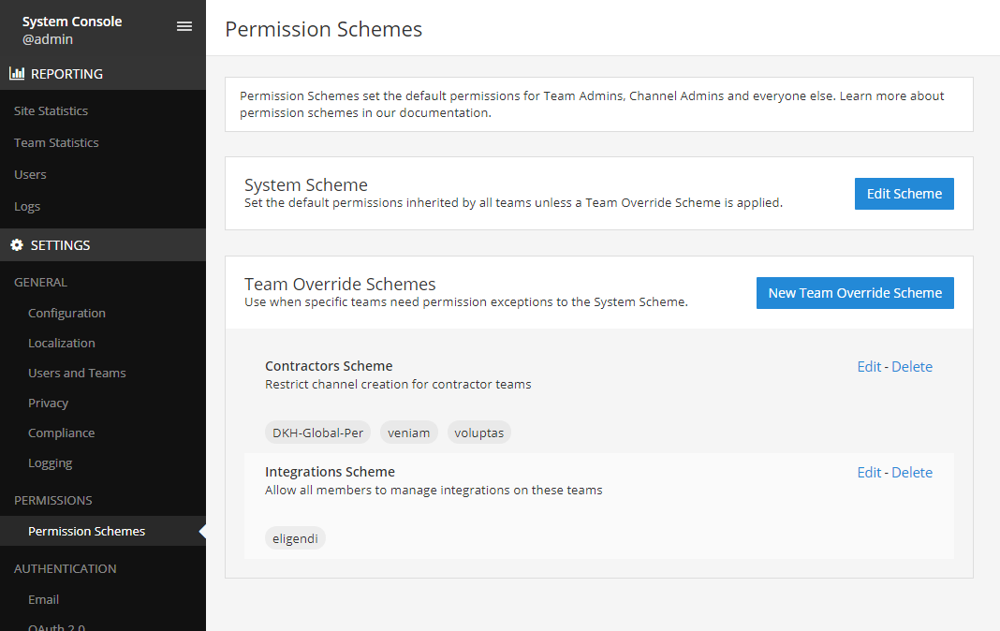

Advanced Permissions (E10/E20)
===============================

Advanced permissions offers Admins a way to restrict actions in Mattermost to authorized users only. The Mattermost permission system is based on a modified RBAC (role-based access control) architecture and will be rolled out over a number of server releases, starting with Mattermost server v5.0. The permissions interface can be accessed in the **System Console** > **Advanced Permissions**.

.. note::

  This document applies to Mattermost Server version 5.0 and later. For previous versions, see `permission settings  available in the System Console > Policy page <https://docs.mattermost.com/administration/config-settings.html#policy>`_.

.. contents::
  :backlinks: top
  :local:
  
  
Permissions Structure
----------------------

Mattermost user interface surfaces a number of elements for Admins to control the permissions in their system.
  

System Scheme (E10)
~~~~~~~~~~~~~~~~~~~~~

*Available in Enterprise Edition E10 and higher.*

Set the default permissions granted to System Admins, Team Admins, Channel Admins and all other members. The permissions granted in the System Scheme apply system-wide, meaning:

- Team Admins: permissions granted apply to all Team Admins, in all teams.
- Channel Admins: permissions granted apply to all Channel Admins in all channels, in all teams.
- All Members: permissions granted apply to all members, including Admins, in all channels, in all teams. 

To override the System Scheme default permissions in a specific team, you must set up a Team Override Scheme.

**System Scheme Interface** 

Interface for editing permissions in the System Scheme, with panels for All members, Channel Admins, Team Admins and System Admins. Available in System Console > Advanced Permissions > System Scheme:

.. image:: ../images/system-scheme.png

Team Override Scheme (E20)
~~~~~~~~~~~~~~~~~~~~~~~~~~~~~

*Available in Enterprise Edition E20*

Overrides the default System Scheme permissions in specific teams for Team Admins, Channel Admins and all other team members. 

- The permissions granted in a Team Override Scheme apply only in the teams which are assigned to the scheme. 
- The System Scheme does not apply to teams that are added to a Team Override Scheme.
- Teams can only belong to one Team Override Scheme.

**Scheme List Interface** 

List of all Team Override Schemes in the system. Sorted alphabetically by scheme name. Also displayed is the scheme description and tags with all asociated teams. Available in System Console > Advanced Permissions > Permissions Schemes:

**Team Override Scheme Interface** 

Interface for naming, assigning teams and editing permissions in a Team Override Scheme Scheme, with panels for All members, Channel Admins and Team Admins. Available in System Console > Advanced Permissions > Permissions Schemes > Team Override Scheme:

.. image:: ../images/team-scheme.png

Channel Override Permissions (E20)
~~~~~~~~~~~~~~~~~~~~~~~~~~~~~~~~~~~

.. note::
*Available in a future release of Enterprise Edition E20*

Allows Admins to restrict permissions within specific channels. Permissions under consideration for this phase include:

- **Read-only Channels:** The ability for Admins to turn off posting in specified channels.
- **Restrict Channel Mentions:** Turn off the ability for users to post channel wide mentions (@-all/channel/here) in specified channels.
- **Channel member management:** Restricting adding and removing channel members to Admins only in specified channels.

Supplementary Roles (E20)
~~~~~~~~~~~~~~~~~~~~~~~~~~~

.. note::
*Available in a future release of Enterprise Edition E20*

Allows Admins to grant additional permissions to specific users or to a group of users based on AD/LDAP group membership. Permissions can be granted within the scope of channels, teams or system level.

Recipes
--------

Administration Tools
--------------------

There are a number of CLI tools available for Admins to help in configuring and troubleshooting the permissions system:

1. `Reset to default <https://docs.mattermost.com/administration/command-line-tools.html#mattermost-permissions-reset>`_: Resets all permissions to the default on new installs.
2. `Reset to default <https://docs.mattermost.com/administration/command-line-tools.html#mattermost-permissions-export>`_: Exports the System Scheme and any Team Override Schemes to a jsonl file.
3. `Reset to default <https://docs.mattermost.com/administration/command-line-tools.html#mattermost-permissions-import>`_: Imports the System Scheme and any Team Override Schemes to your Mattermost instance from a jsonl input file in the format outputted by ``mattermost permissions export``.

Backend Infrastructure
-----------------------

Technical Admins or developers looking for a deeper understanding of the permissions backend can refer to our :doc:`permissions-backend` technical documentation.

Glossary
----------

- Permission: The ability to execute certain actions. Permissions are granted to roles.
- Roles: A set of permissions. Users or groups are assigned to roles.
- Group: A set of users, usually synced from AD/LDAP. Groups are assigned to roles.
- Default Roles: System Admin, Team Admin, Channel Admin, Member.
- System Scheme: A set of default roles that apply system wide
- Team Scheme: A set of default roles that apply only in the team specified. The permissions granted to the roles in a team scheme override role permissions of a system scheme.
- System Wide: Applies across the entire system, including all teams of which the user is a member.
- Team Wide: Applies in a specific team only.

