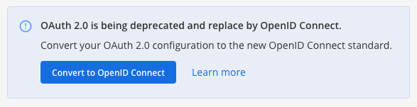

Converting OAuth 2.0 Service Provider to OpenID Connect (E20)
=============================================================

OAuth 2.0 is being deprecated in the System Console and replaced by OpenID Connect. Using the System Console, you can migrate your existing service provider OAuth 2.0 configuration to the OpenID Connect standard.

A one-time, one-click conversion tool is available within the existing OAuth 2.0 page. You can also go to **System Console > Authentication > OpenID Connect**.

Select **Convert to OpenID Connect** to migrate your active service provider configuration to the new standard. No further changes are required.

.. note::

  Any inactive service providers configured for OAuth 2.0 are also migrated to the new OpenID Connect standard. Converting to OpenID Connect removes the **OAuth 2.0** option from the System Console menu.

Configuring OpenID Connect Single Sign-On
-----------------------------------------

For details on configuring Mattermost to use a service provider as a Single Sign-on (SSO) service for team creation, account creation, and user sign-in OpenID Connect, refer to the following documentation:

- `OpenID Connect Single Sign-On <https://docs.mattermost.com/deployment/sso-openid-connect.html>`__
- `GitLab Single Sign-On <https://docs.mattermost.com/deployment/sso-gitlab.html>`__
- `Google Apps Single Sign-On <https://docs.mattermost.com/deployment/sso-google.html>`__
- `Office 365 Single Sign-On <https://docs.mattermost.com/deployment/sso-office.html>`__
