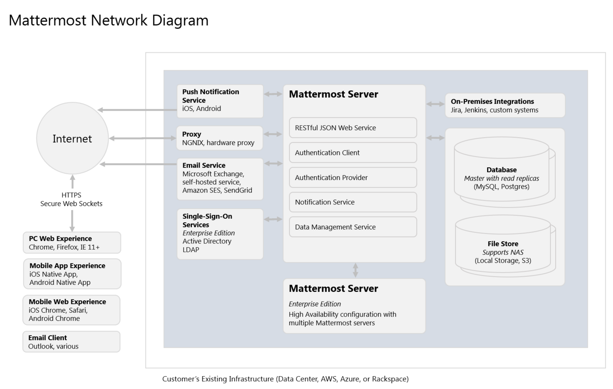

# Deployment Overview

The below diagram illustrates an on-premises deployment of Mattermost with optional configurations for scaling to performance from teams to large organizations.

[View Mattermost Network Diagram](https://raw.githubusercontent.com/mattermost/docs/master/source/images/networkDiagram.PNG)

Note: GitLab Mattermost deployment is [documented separately](http://doc.gitlab.com/omnibus/gitlab-mattermost/) and not included below.

## Requirements and Installation Guides

Mattermost supports workplace messaging for teams using one to three servers using instructions available on [docs.mattermost.com](http://docs.mattermost.com/install/requirements.html). See [Software and Hardware Requirements](http://docs.mattermost.com/install/requirements.html) documentation for server sizing estimates.

## User Experience

### PC Web Experience 

End users can securely share messages and files using a web-based Mattermost experience in IE, Chrome and Firefox. Please see [Software and Hard Requirements](http://docs.mattermost.com/install/requirements.html) documentation for full details.

### Mobile App Experience

Note: At the time of this writing Android application has yet to be released. It should be released by end of February 2016.

Native applications for iOS and Android are available for interacting with the Mattermost server and receiving encrypted push notifications.

#### Mobile Apps for Mattermost Enterprise Edition

Customers of Mattermost Enterprise Edition have a convenience feature for using hosted versions of the iOS and Android applications provided by Mattermost.com from iTunes and the Google Play stores. These hosted applications include 256-bit AES SSL encryption from the customer's server to the hosted Mattermost service (https://push.mattermost.com) and then from the service to the native mobile application on iOS or Android.

Mattermost Enterprise Edition customers may also choose to customize, compile, and extend their own versions of the Mattermost mobile applications for their internal Enterprise App Store, or public iTunes or Google Play App Stores, using open source repositories for the native applications:

- [Open source Mattermost iOS application](https://github.com/mattermost/ios)
- Open source Mattermost Android application

#### Mobile App for Mattermost Team Edition

Users of the free Mattermost Team Edition can also compile the open source repositories for the native mobile applications to enable the same functionality offered in hosted service for Enterprise Edition customers.

In addition, for organizations evaluating whether to compile their own mobile applications or upgrade to Enterprise Edition, a test service (http://push-test.mattermost.com) is available for using the same pre-compiled iOS and Android applications available in iTunes and on Google Play for Enterprise Edition customers.

The test service does not offer encryption and may have occassional unannounced downtime, therefore it is not recommended for production.

### Mobile Web Experience 

End users can securely share messages and files using a web-mobiled-based Mattermost experience on iOS and Android devices. Please see [Software and Hard Requirements](http://docs.mattermost.com/install/requirements.html) documentation for full details.

### Email Client 

Receive emails on desktop and mobile from the Mattermost server.

## Communication Protocols

### HTTPS Connection (Secure Hypertext Transfer Protocol)

The HTTPS connection to the Mattermost server renders pages and provides core functionality. It does not include real-time interactivity, which is enabled by the WSS connection.

If the HTTPS connection is not available, the Mattermost service will not work. HTTPS is a secure, encrypted protocol and is highly recommended for production. An unencrypted HTTP connection may be used in initial testing and configuration but it is not recommended for production.

### WSS Connection (Secure WebSocket Protocol)

The WSS connection to the Mattermost server enables real-time updates and notifications. If the WSS connection is not available, but HTTPS is available, the system will appear to work, but real time updates and notifications will not work. Updates will only appear on a page refresh. WSS will be a persistent connection to the Mattermost server while you are connected, while HTTPS will be intermittent depending on when you load a page or a file.

Typically a "Mattermost unreachable" error message will be displayed warning users that the Mattermost server is either unreachable or the WebSocket connection is not properly configured.

WSS is a secure, encrypted connection and is highly recommended. An unencrypted WS connection may be used in initial testing and configuration but it is not recommended for production.

## Data Center Infrastructure

### Push Notification Service

[Mattermost Push Notification Service](http://docs.mattermost.com/administration/config-settings.html?highlight=config#push-notification-settings) routes push notifications to: 

1. Apple Push Notification Service to send notifications to the Mattermost iOS app. 
2. Google Push Notification Service to send notifications to the Mattermost Android app.

### Proxy

The proxy manages Secure Socket Layer encryption and sets the policy on how network traffic will be routed to the Mattermost server.

Mattermost install guides include setup instructions for the NGNIX software proxy by default. For large scale deployments, a hardware proxy with dedicated devices for processing SSL encryption and decryption could potentially increase efficiencies.

In a high availability configuration (Enteprise Edition only) the proxy would also balance network load across multiple Mattermost servers.

### Single-Sign-On Service (Enterprise Edition only)

In an enterprise, often Microsoft Active Directory or a similar LDAP-compatible systems are used to centrally manage single-sign-on and system provisioning.

Mattermost Enterprise Edition supports Active Directory and LDAP single-sign-on. Support for Active Directory and LDAP groups is expected to be added during 2016 to subscribers.

### On-Premises Integrations

Mattermost offers complete access to its Web Service APIs, along with incoming and outgoing webhooks, and Slash command options for integrating with your on-premises systems.

Dozens of open source integrations to common tools like Jira, Jenkins, GitLab, Trac, Redmine, and SVN, along with interactive bot applications (Hubot, mattermost-bot), and other communication tools (Email, IRC, XMPP, Threema) are freely available for use and customization.

### Email Service

For notifications and account verification, Mattermost connects to your existing email service over SMTP, including Microsoft Exchange, Amazon SES, SendGrid and self-hosted email solutions.

## Mattermost Server

The Mattermost server installs as a single compiled binary file. All server settings are stored in a configuration file, `config/config.json`, which can be updated directly or via a web-based System Console user interface.

#### RESTful JSON Web Service

The entirety of the Mattermost server is accessible through a RESTful Web Service API. The API can be completely accessed by developers creating custom applications for Mattermost either directly or via Javascript and Golang drivers.

#### Authentication Client

Authenticates users by email or username plus password.

For customers of Enterprise Edition, single-sign-on via Microsoft Active Directory and LDAP is also available.

#### Authentication Provider

Enables authentication of Mattermost server to other services with Authentication Client interface using OAuth2.

#### Notification Service

Sends notifications via SMTP email and mobile push notifications via Mattermost Push Notificiation Service.

#### Data Management Service

Connects to and manages supported databases.

### Mattermost Server for Horizontal Scaling

_Enterprise Edition only, available 2016_

Large organizations needing high scale, high availability configurations can contact the [Enteprise team](https://about.mattermost.com/contact/) for advisory on how to configure and size Mattermost Enterprise Edition to support their specific needs. Depending on customer needs, multiple Mattermost servers may be configured with cache and event synchronization to horizontally scale the Mattermost service.

## Data Stores

### Databases

Mattermost uses a MySQL or Postgres database to store and retrieve system data and to execute full text search. 

See [Database requirements](http://docs.mattermost.com/install/requirements.html#database-software) for full details. 

### File Store

Images and files shared by users are stored and retrieved in one of three options.

For teams sharing only modest amounts of file data, local storage on the same physical machine as the Mattermost server may be sufficient. For enterprises sharing very large amounts of data, a Network-Attached Storage server may be used, which can scale to peta-bytes if necessary. Alternatively, for both easy-of-use and scale, Amazon's S3 file storage service is another option as well.
