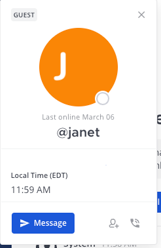

.. _guest-accounts:

Guest Accounts (Beta) (E10 and E20)
===================================

Available in `Enterprise Edition E10 and higher <https://about.mattermost.com/pricing/>`__. 

Guest Accounts are a new role within Mattermost Enterprise editions which allow organizations to collaborate with individuals (such as vendors and contractors) outside of their organization. The Guest Account feature controls access to channels and other members within the organization. 

An organization may use guest accounts to work on a website project with resources from external design firm.  Or Guest accounts could be used to collaborate with customers on a support issue.  

Guests can: 
1. Pin messages to channels
2. Use slash commands (with the exception of those used to invite members)
3. Favorite channels
4. Mute channels
3. Update their account settings

Guests cannot: 
1.  Discover public channels
2.  Join open teams
3.  Create direct messages or group messages with members who aren’t within the same channel

Enabling Guest Accounts
-----------------------------------
To enable Guests Accounts: 
1. Navigate to **System Console > Authentication > Guest Access**.
2. Update **Enable Guest Access** to ”True”.
3. **Whitelist domains that are acceptable for Guest Access** (Optional).  
- This allows the System Administrators to set a list of approved guest domains. If you have team domain restrictions, you will also need to add your guest domain to **Team Settings > Allow only users with a specific email domain to join this team**.
4. **Enforce Multi-Factor Authentication (MFA) for your Guests** (Optional)
- If you are enforcing MFA for your users, you can optionally choose to enforce MFA for your guest users. 

Guest Authentication
-----------------------------
Guests can access the Mattermost server via email authentication. Please ensure you enable email invites from **System Console > Signup > Enable Email Invitations**.   

SAML 2.0 and AD/LDAP authentication will be provided in a future release.

Inviting Guests to the Mattermost Server
------------------------------------------------------
Guests can be invited into one for more Mattermost channels within a team by System Administrators and roles that have the **Invite Guest** permission. 

**Note:** Guest invitations will be revoked after 48 hours per the member email invitation process. If your guest has not accepted the invitation in the time window, please follow the steps below to resend an invitation to the guest again. 

To invite guests into one or more Mattermost channels

1. Navigate to **Main Menu > Invite People**.  This is a new invitation option that combines inviting guests and members and consolidates **Send Email**, **Get Team Invite Link**, and **Add Members to the Team**. 
2. Select **Invite Guests**.
3. Enter the guest’s email address.
4. Choose the channels the guest can join. 
5. (Optional) Enter a custom message.

.. image:: ../images/Guest_Invite_Screen.png

Guest Permission Settings 
---------------------------------------

In E10 and E20, you can also control which users can invite guests. By default, only the System Administrator can invite guests. There are additional permissions in E20 that can be adjusted under **System Console > Advanced Permissions > System Scheme** to control a guest’s ability to:  

 - Edit posts
 - Delete posts
 - Post reactions
 - Create private channels with members they are allowed to collaborate with

Guest Identification
---------------------------
Guess are identified with a guest badge. This badge is visible in various places on the interface and mobile apps such as on a guest’s profile and next to their name on user lists, including at mentions and quick switcher lists. When guests are added to a channel, a system message informs other channel members that the added user is a guest. 

Channels that contain guests will have their header automatically updated with a message stating: *This channel has guests*.

Managing Guests
-------------------------

Adding Guests to Additional Channels
^^^^^^^^^^^^^^^^^^^^^^^^^^^^^^^^^^
Users with the permissions to invite guests can use the **Invite Guests** modal to add a guest to additional channels. 

A system message will be posted in the channels to let other members know a guest user has been added.  

Removing Guests from Channels and Teams
^^^^^^^^^^^^^^^^^^^^^^^^^^^^^^^^^^^^^^^^
Guests can be removed from a channel through the normal manage members modals.  

When a guest has been removed from all channels within a team and they belong to other teams, they will default into the last channel on the last team they have accessed.  If they are removed from all channels on all teams, they will be taken to a screen letting them know they have no channels assigned. 

Promoting and Demoting User Roles
^^^^^^^^^^^^^^^^^^^^^^^^^^^^^^^^^^^^^^^^^^^
System Administrators can demote a *Member* to *Guest* by updating their role in **System Console > User Management > Users**. The demoted user will retain their existing channel and team memberships but will be restricted from discovering public channels and collaborating with users outside of the channels they are in.  This is useful if you are already collaborating with external contractors and want to restrict their abilities within your Mattermost instance. 

System Administrators can also promote a *Guest* to *Member* by updating their role in **System Console > User Management > Users**.  

Note: You can filter the list in **System Console >  User Management > Users** to view all guests on the system. 

Disabling Guest Accounts
-----------------------------------
To disable Guest Accounts,  go to **System Console > Authentication > Guest Access > Enable Guest Access** and select “False”. Current Guest accounts will remain active until guest users are manually marked “inactive” in **System Console >  User Management > Users**. 

In a future release when a guest account is disabled, the guests will be marked as inactive, be logged out of Mattermost, and all their sessions will be revoked. 

Frequently Asked Questions
--------------------------------------

How am I Charged for Guest Accounts? 
^^^^^^^^^^^^^^^^^^^^^^^^^^^^^^^^^^^^^^^^^^^
Guests are charged as a user seat.  

Why doesn’t Mattermost Have Single-Channel Guests? 
^^^^^^^^^^^^^^^^^^^^^^^^^^^^^^^^^^^^^^^^^^^^^^^^^^^
We wanted to support collaboration with external guests for the broadest use cases without limiting guests' access to channels. In the future, we may consider adding single-channel guests. 

Can I Set an Expiration Date for Guests? 
^^^^^^^^^^^^^^^^^^^^^^^^^^^^^^^^^^^^^^
Currently, you cannot. This feature may be added at a later stage. 

Why is the Guest Account feature in Beta?
^^^^^^^^^^^^^^^^^^^^^^^^^^^^^^
The Guest Account feature is in beta while we address feedback from our customers on the feature. We anticipate it being in general production in early 2020. 

Has the Guest Accounts Feature Been Reviewed by an External Security Firm? 
^^^^^^^^^^^^^^^^^^^^^^^^^^^^^^^^^^^^^^^^^^^^^^^^^^^^^^^^^^^^^^^^^^^^^^^^
The Guest Account feature was reviewed by the Mattermost security team. We do not have an external firm review scheduled but will include this feature in future reviews. 
