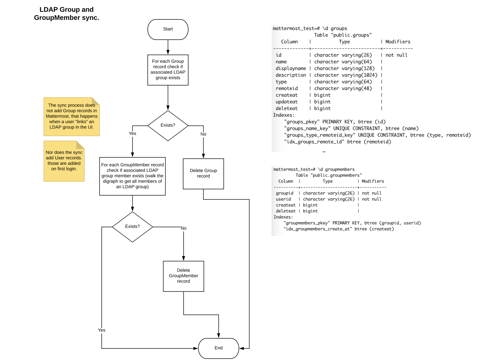
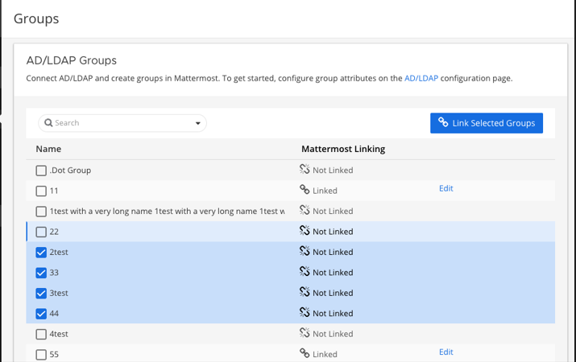

.. _ldap-group-sync:

AD/LDAP Groups (Experimental) (E20)
===================================

Overview
--------------------

The groups feature is useful for organizations that have many new users to onboard or that onboard users frequently and want to ensure users are added to default teams and channels that are pertinent to them. The group feature currently supports creating groups by synchronization with your AD/LDAP system groups. AD/LDAP nested groups are also supported.  Please see `this forum post <https://forum.mattermost.org/t/ldap-group-sync-alpha-release/6351>`__ for more details.  For a technical overview of the feature by Martin Kraft, who led the development of the feature, please see `this blog post <https://developers.mattermost.com/blog/2019-06-05-ldap-nested-groups-modelling-and-representation-in-code/>`_. 

Synchronized groups can also be used to manage the membership of teams and private channels. See `this documentation <https://docs.mattermost.com/deployment/ldap-group-constrained-team-channel.html>`_ for more information. 

Pre-installation notes
----------------------

For customers that have enabled synchronization with AD/LDAP, all groups matching the default filter ``(|(objectClass=group)(objectClass=groupOfNames)(objectClass=groupOfUniqueNames))`` will be available to be linked in the groups list view at **System Console** > **Access Control > Groups** in prior versions or **System Console** > **User Management** > **Groups** in versions after 5.12. The group filter is an optional configuration setting available under **System Console > AD/LDAP**, which will allow you to specify the groups you would like to be able to access in Mattermost.  The group filter is independent of the user filter, however it does leverage the Base DN attribute.  You may need to adjust your Base DN to ensure group objects can be searched in your AD/LDAP tree.  

The synchronization of groups happens with the synchronization of users, during which Mattermost queries AD/LDAP for updated account information. Please see the `Active Directory/LDAP Set up documentation <https://docs.mattermost.com/deployment/sso-ldap.html?highlight=ldap#configure-ad-ldap-synchronization>`__. for more information. The group feature has no effect on users' authentication to Mattermost.

Enable AD/LDAP group synchronization
------------------------------------

To enable this feature, go to **System Console > Advanced > Experimental > Enable AD/LDAP Group Sync** in prior versions or **System Console** > **Experimental** > **Features** in versions after 5.12. You can also edit the ``config.json file`` setting ``ExperimentalLdapGroupSync``. Then restart the Mattermost server after changing.  

AD/LDAP group synchronization
-----------------------------

To synchronize specific AD/LDAP groups to Mattermost, specify the ``Group ID Attribute`` and the ``Group Display Name Attribute`` (ie: "cn" for Common Name) under **System Console > Authentication > AD/LDAP**.  

Additionally, you can specify the Group filter used to retrieve groups.  If the group filter configuration is left blank, then all groups matching the default filter ``(|(objectClass=group)(objectClass=groupOfNames)(objectClass=groupOfUniqueNames))`` are returned. 

.. note:: 
   Attribute values for Group ID and Group Display Name are case sensitive. 

Synchronization of groups occurs after user synchronization and results for group synchronization are available on the synchonization status table (located at the bottom of the AD/LDAP configuration page). 

After the AD/LDAP groups have been synchronized, go to **System Console > Access Control > Groups** in prior versions or **System Console** > **User Management** > **Groups** in versions after 5.12 to link and configure Mattermost groups. 
 
.. image:: ../images/Group_filter.png

.. note::
   The sync process does not create Mattermost groups.  Mattermost groups are created when you “link” the AD/LDAP group as outlined in the next section **Linking AD/LDAP groups to Mattermost groups**. Existing AD/LDAP users are added to the Mattermost groups on the next synchronization and new users are added on their first login. 

On subsequent synchronizations and once groups are linked: 

 - Users that have been added to an AD/LDAP group will be added to the linked Mattermost group and to teams and channels configured for that group.
 - Mattermost groups that are linked to AD/LDAP groups no longer included in your filter are deleted.  
 - Users removed from an AD/LDAP group are removed from the linked Mattermost group, but their channel and team membership is not revoked. 

Linking AD/LDAP groups to Mattermost groups
--------------------------------------------

Groups that have been returned from the default filter or your AD/LDAP group filter will be available in a list view on the Groups page. The link action will create Mattermost groups corresponding to the AD/LDAP group. AD/LDAP groups that have been linked to a Mattermost group will display the ‘Linked’ icon. AD/LDAP groups that have not been linked to a Mattermost group will display the ‘Not Linked’ icon. An AD/LDAP group that is not linked does not create a Mattermost group.  

Groups can be linked individually by the inline “Linked” button or by using the checkbox next the group name to select multiple groups and by using the blue “Link Selected Groups” button. When selecting multiple groups with a mix of “Linked” and “Not Linked” states, the bulk action of the button will be “Link Selected Groups” until all selected are marked “Linked”. Using the bulk action speeds the process of creating Mattermost groups from your AD/LDAP Groups.  

If you see a “Link Failed” message, either click on the message or check the box before the group name to expose the inline link message, allowing you to try the link again.

.. image:: ../images/LinkFailed.png

Configure the group
-------------------

AD/LDAP groups that have been linked to Mattermost groups can be configured to add team and channels. To configure the group, select “Configure”. This will open up the Group Configuration page.  

The Group Configuration page displays the group profile which includes the group name. This name is automatically mapped from the AD/LDAP group common name attribute and is read-only.  

Add default teams or channels for the group
--------------------------------------------
To add the teams and channels that you want the group members to default in, select either “Add Team” or “Add Channel” from the blue “Add Team or Channel” button. 

.. image:: ../images/Add_Team_Or_Channel.png

Channels are nested below the Team they belong to in the team and channel list.  

Teams that are open for anyone to join are indicated by:
 
.. image:: ../images/open_team.png  
   
Teams that are not open for anyone to join are indicated by:
 

 
Public channels are indicated by: 
 
.. image:: ../images/public_channel.png

Private channels are indicated by:
 
.. image:: ../images/private_channel.png  

When a team is added, the ``Town Square``, ``Off-Topic`` channels will also be added as default, as well as any default channels set in the `ExperimentalDefaultChannels config setting <https://docs.mattermost.com/administration/config-settings.html?highlight=configuration%20settings#default-channels-experimental>`__. 

When a channel is added without setting the team explicitly, the team will be shown in the Team and Channel Membership listing, but it will not be added to the group specifically. Because of this dependency, when the channel is removed, the team will also be removed. Teams are listed in parentheses after the channel name in the channel selector.

Teams and channels membership synchronization
----------------------------------------------

For new users, default teams and channels will be added when they log in for the first time. For existing users, default teams and channels will be added after the next scheduled AD/LDAP sychronization. 

It may take a few seconds to load all team and channel memberships for a user depending on the number of teams and channels the group is defaulted to. In our testing, it took 6 seconds for an organization with 200,000 users and 30,000 linked groups.

.. note::
   Users are not removed from the team or channel on subsequent synchronizations of the AD/LDAP groups. Users will need to be manually removed from the team or channel per the existing functionality. This is being considered for a future improvement. They will not be re-added if they were manually removed or removed themselves.

.. image:: ../images/Team_Channel_Membership_Sync.png

To manage a team or private channel with synchronized groups, please see `this documentation <https://docs.mattermost.com/deployment/ldap-group-constrained-team-channel.html>`_.

Remove configured teams and channels from a group
-------------------------------------------------
To remove a team or channel configured for a group, click “Remove” to the right of the team or channel name. Users already part of the team and channel will not be removed from that channel by this action. 

View users belonging to the group
---------------------------------

Users who have logged in and accessed Mattermost will be visible in the members list on the group object. Members are read-only at this time and new members can be added through management in your AD/LDAP system. 

.. image:: ../images/Group_Members.png

Users can be removed from the Mattermost group on subsequent synchronizations. However, they will not be removed from teams and channels. 

.. note:: 
   When a member removes themselves manually from a channel, that action is tracked in the Channel Member History table.  Users are not re-added to channels from which they previously removed themselves. 

Disabling and re-activating LDAP/AD users
-----------------------------------------
If a user is removed from an AD/LDAP group and then later re-added, they will be defaulted again into the teams and channels configured in the group. If a user is deactivated in AD/LDAP or filtered from the AD/LDAP user filter, they will be removed from the group and will lose access to Mattermost.  If that user is reactivated, they will regain access and will have access to the teams and channels as well as any additional teams and channels added to the Mattermost Group configuration. 

Managing groups
---------------
Once a group has been configured, the default teams and channels can be changed by clicking "Edit" on the group list view.  

Deleting groups
---------------
Mattermost groups can be deleted by adjusting your AD/LDAP group filter to remove the group or by unlinking the group on the groups listing page. If you add the group back by re-adjusting the AD/LDAP group filter and link the group again on the group configuration page, the previous team and channel configurations will be available.

Frequently Asked Questions
----------------------------

Why is AD/LDAP Group Sync experimental?
^^^^^^^^^^^^^^^^^^^^^^^^^^^^^^^^^^^^

We want to make sure we have tested this feature in environments that have different AD/LDAP system and group structures to ensure the feature works well in the different varieties of environments our customers have, as well as collect feedback on the functionality. Our testing has included Active Directory and Open LDAP systems. 

When will AD/LDAP Group Sync be in beta?
^^^^^^^^^^^^^^^^^^^^^^^^^^^^^^^^^^^^^^^^

We expect AD/LDAP Group Sync to be in beta early in 2019. 

LDAP group sync will be in beta for a period of time until: 

1. Searching and support for managing large volumes of groups and users is released. 
2. This feature has been tested on a system with 10,000s of concurrent active users.

Why can't my existing users see the teams and channels they have been synced to?
^^^^^^^^^^^^^^^^^^^^^^^^^^^^^^^^^^^^^^^^^^^^^^^^^^^^^^^^^^^^^^^^^^^^^^^^^^^^^^^^

Existing Mattermost users that are members of linked Mattermost groups will be added to teams and channels on the next scheduled synchronization job that is run after teams and channels are added to the Mattermost group. You can manually initiate a synchronization from **System Console > Authentication > AD/LDAP > AD/LDAP Synchronize Now**.  

How do nested groups work with AD/LDAP Group Sync?
^^^^^^^^^^^^^^^^^^^^^^^^^^^^^^^^^^^^^^^^^^^^^^^^^^

Users within nested groups are included as members of parent groups. The group filter that you specify can include any type of AD/LDAP group on your system. The ``member`` AD/LDAP attribute is used to determine nested groups that belong to a parent group.

How do I manage a team or private channel membership with synchronized groups?
^^^^^^^^^^^^^^^^^^^^^^^^^^^^^^^^^^^^^^^^^
You can do so by setting the team or channel management to synced groups instead defaulting a group to a team or channel. See `this documentation <https://docs.mattermost.com/deployment/ldap-group-constrained-team-channel.html>`_ to learn more

How do I use AD/LDAP Group Sync with SAML?
^^^^^^^^^^^^^^^^^^^^^^^^^^^^^^^^^^^^^^^^^^^
You can use AD/LDAP Group Sync with SAML by enabling `SAML Synchronization with AD/LDAP <https://docs.mattermost.com/deployment/sso-saml-okta.html#configure-saml-synchronization-with-ad-ldap>`_.  For the feature to work, it is critical that the unique identifier you have chosen in your directory service (AD/LDAP) as your Mattermost ID attribute is the same for both the SAML and AD/LDAP configurations. For instance, if ``ObjectGUID`` has been chosen as your ID attribute in your Mattermost AD/LDAP configuration, then an attribute that has the same value should also be mapped to the ID attribute in your SAML assertion. We also recommend that the ID attribute you change is unique and unchanging, such as a GUID.  You do not need to enable sign-in with LDAP for this to work.
