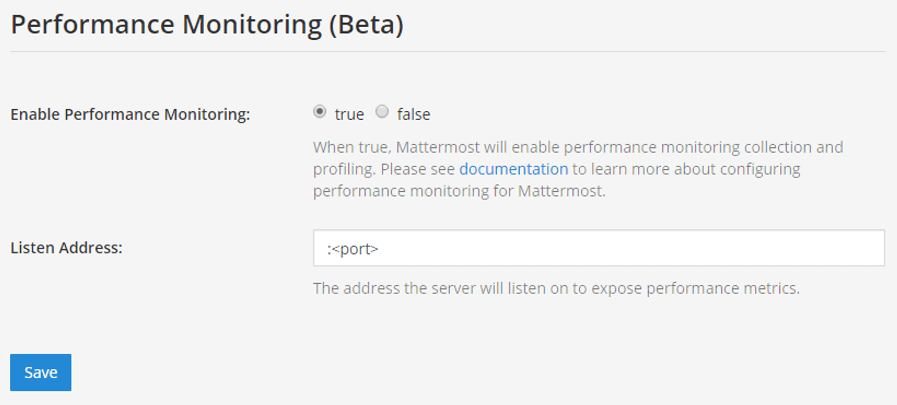
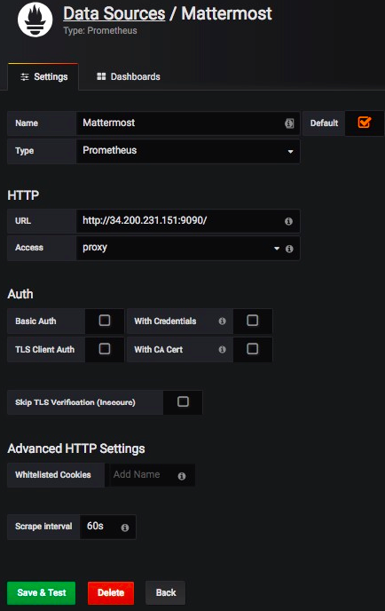
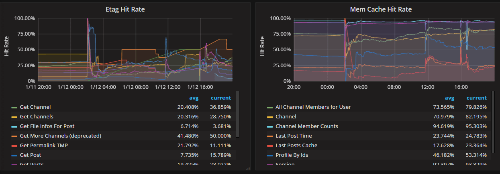
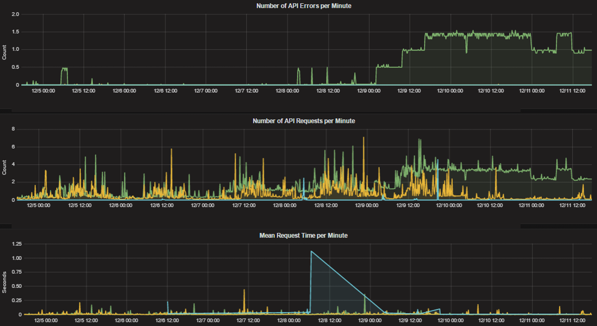
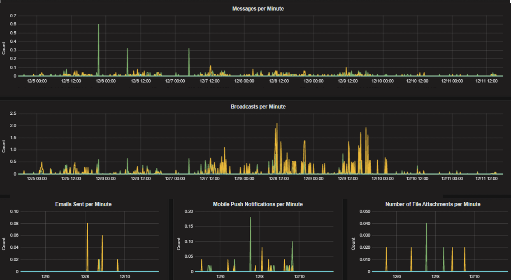
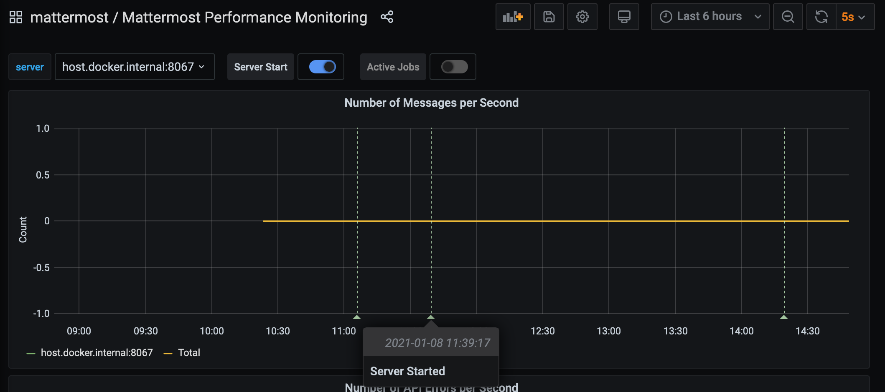
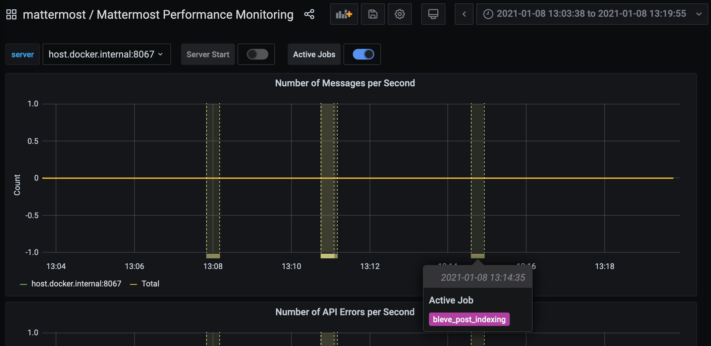
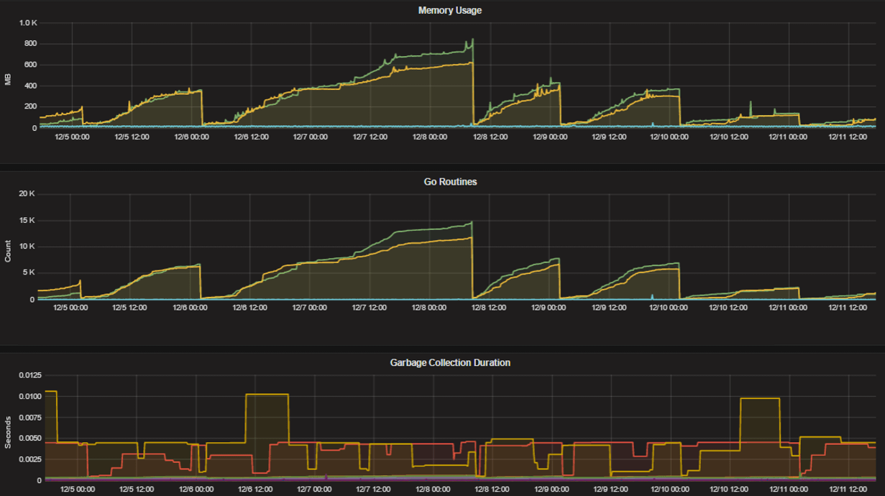

Performance Monitoring (E20)
===================================

*Available in Mattermost Enterprise Edition E20*

Performance monitoring support enables a Mattermost server to track system health for large Enterprise deployments through integrations with `Prometheus <https://prometheus.io/>`__ and `Grafana <https://grafana.org/>`__.

The integration supports data collection from several Mattermost servers, particularly useful if you're running Mattermost `in high availability mode <https://docs.mattermost.com/deployment/cluster.html>`__.

Deployment Guide
----------------

Details on integrating your Mattermost server with Prometheus and Grafana.

Installing Prometheus
----------------------

1. `Download a precompiled binary for Prometheus <https://prometheus.io/download/>`__. Binaries are provided for many popular distributions, including Darwin, Linux, and Windows. For installation instructions, see the `Prometheus install guides <https://prometheus.io/docs/introduction/getting_started/>`__.

2. The following settings are recommended in the Prometheus configuration file named ``prometheus.yml``:

.. code:: yaml

    # my global config
    global:
      scrape_interval:     60s # By default, scrape targets every 15 seconds.
      evaluation_interval: 60s # By default, scrape targets every 15 seconds.
      # scrape_timeout is set to the global default (10s).

      # Attach these labels to any time series or alerts when communicating with
      # external systems (federation, remote storage, Alertmanager).
      external_labels:
          monitor: 'mattermost-monitor'

    # Load rules once and periodically evaluate them according to the global 'evaluation_interval'.
    rule_files:
      # - "first.rules"
      # - "second.rules"

    # A scrape configuration containing exactly one endpoint to scrape:
    # Here it's Prometheus itself.
    scrape_configs:
      # The job name is added as a label `job=<job_name>` to any timeseries scraped from this config.
      - job_name: 'prometheus'

        # Override the global default and scrape targets from this job every 5 seconds.
        # scrape_interval: 5s

        # metrics_path defaults to '/metrics'
        # scheme defaults to 'http'.

        static_configs:
          - targets: ["<hostname1>:<port>", "<hostname2>:<port>"]

Replace the ``<hostname1>:<port>`` parameter with your Mattermost host IP address and port to scrape the data. It connects to ``/metrics`` using HTTP. 

3. In the Mattermost System Console, go to **Environment > Performance Monitoring** to set **Enable Performance Monitoring** to **true**, then specify the **Listen Address** and select **Save**. See our `configuration settings documentation <https://docs.mattermost.com/administration/config-settings.html#performance-monitoring>`__ for details.

4. To test that the server is running, go to ``<ip>:<port>/metrics``.

.. note::
   A Mattermost Enterprise Edition E20 license is required to connect to ``/metrics`` using HTTP.

5. Finally, run ``vi prometheus.yml`` to finish configuring Prometheus. For starting the Prometheus service, read the `comprehensive guides provided by Prometheus <https://prometheus.io/docs/introduction/getting_started/#starting-prometheus>`__.

6. Once the service has started, you can access the data in ``<localhost>:<port>/graph``. While you can use the Prometheus service to create graphs, we'll focus on creating metric and analytics dashboards in Grafana.

.. note:: 
  For troubleshooting advice, check the `Prometheus FAQ page <https://prometheus.io/docs/introduction/faq/>`__.

Installing Grafana
-------------------

1. `Download a precompiled binary for Grafana <https://docs.grafana.org/installation/debian/>`__ on Ubuntu or Debian. Binaries are also available for other distributions, including Redhat, Windows and Mac. For install instructions, see `Grafana install guides <https://docs.grafana.org/installation/debian/>`__

2. The Grafana package is installed as a service, so it is easy to start the server. See their `install guides <https://docs.grafana.org/installation/debian/>`__ to learn more.

3. The default HTTP port is ``3000`` and default username and password are ``admin``.

4. Add a Mattermost data source with settings defined in the screenshot below.

.. note:: 

  - For troubleshooting advice, check the `Grafana Troubleshooting page <https://docs.grafana.org/installation/troubleshooting/>`__. 
  - For user guides and tutorials, check the `Grafana documentation to learn more <https://docs.grafana.org/guides/basic_concepts/>`__.

Getting Started
---------------

To help you get started, you can download three sample dashboards shared in Grafana:

- `Mattermost Performance KPI Metrics <https://grafana.com/dashboards/2539>`__, which contains key metrics for monitoring performance and system health.
- `Mattermost Performance Monitoring <https://grafana.com/dashboards/2542>`__, which contains detailed charts for performance monitoring.
- `Mattermost Performance Monitoring (Bonus Metrics) <https://grafana.com/dashboards/2545>`__, which contains additional metrics such as emails sent or files uploaded, which may be important to monitor in some deployments.

See `this guide <https://docs.grafana.org/reference/export_import/>`__ to learn how to import Grafana dashboards either from the UI or from the HTTP API.

Statistics
----------

Mattermost provides the following performance monitoring statistics to integrate with Prometheus and Grafana.

Custom Mattermost Metrics
~~~~~~~~~~~~~~~~~~~~~~~~~

The following is a list of custom Mattermost metrics that can be used to monitor your system's performance:

API Metrics
^^^^^^^^^^^

- ``mattermost_api_time``: The total time in seconds to execute a given API handler.

Caching Metrics
^^^^^^^^^^^^^^^

- ``mattermost_cache_etag_hit_total``: The total number of ETag cache hits for a specific cache.
- ``mattermost_cache_etag_miss_total``: The total number of ETag cache misses for an API call.
- ``mattermost_cache_mem_hit_total``: The total number of memory cache hits for a specific cache.
- ``mattermost_cache_mem_invalidation_total``: The total number of memory cache invalidations for a specific cache.
- ``mattermost_cache_mem_miss_total``: The total number of cache misses for a specific cache.

The above metrics can be used to calculate ETag and memory cache hit rates over time.

Cluster Metrics
^^^^^^^^^^^^^^^

- ``mattermost_cluster_cluster_request_duration_seconds``:  The total duration in seconds of the inter-node cluster requests.
- ``mattermost_cluster_cluster_requests_total``: The total number of inter-node requests.
- ``mattermost_cluster_event_type_totals``: The total number of cluster requests sent for any type.

Database Metrics
^^^^^^^^^^^^^^^^

- ``mattermost_db_master_connections_total``: The total number of connections to the master database.
- ``mattermost_db_read_replica_connections_total``: The total number of connections to all the read replica databases.
- ``mattermost_db_search_replica_connections_total``: The total number of connections to all the search replica databases.
- ``mattermost_db_store_time``: The total time in seconds to execute a given database store method.
- ``mattermost_db_replica_lag_abs``: Absolute lag time based on binlog distance/transaction queue length.
- ``mattermost_db_replica_lag_time``: The time taken for the replica to catch up.

HTTP Metrics
^^^^^^^^^^^^

- ``mattermost_http_errors_total``: The total number of http API errors.
- ``mattermost_http_request_duration_seconds``: The total duration in seconds of the http API requests.
- ``mattermost_http_requests_total``: The total number of http API requests.

Login and Session Metrics
^^^^^^^^^^^^^^^^^^^^^^^^^

- ``mattermost_http_websockets_total`` The total number of WebSocket connections to the server.
- ``mattermost_login_logins_fail_total``: The total number of failed logins.
- ``mattermost_login_logins_total``: The total number of successful logins.

Messaging Metrics
^^^^^^^^^^^^^^^^^

- ``mattermost_post_broadcasts_total``: The total number of WebSocket broadcasts sent because a post was created.
- ``mattermost_post_emails_sent_total``: The total number of emails sent because a post was created.
- ``mattermost_post_file_attachments_total``: The total number of file attachments created because a post was created.
- ``mattermost_post_pushes_sent_total``: The total number of mobile push notifications sent because a post was created.
- ``mattermost_post_total``: The total number of posts created.
- ``mattermost_post_webhooks_totals``: The total number of webhook posts created.

Process Metrics
^^^^^^^^^^^^^^^

- ``mattermost_process_cpu_seconds_total``: Total user and system CPU time spent in seconds.
- ``mattermost_process_max_fds``: Maximum number of open file descriptors.
- ``mattermost_process_open_fds``: Number of open file descriptors.
- ``mattermost_process_resident_memory_bytes``: Resident memory size in bytes.
- ``mattermost_process_start_time_seconds``: Start time of the process since unix epoch in seconds.
- ``mattermost_process_virtual_memory_bytes``: Virtual memory size in bytes.

Search Metrics
^^^^^^^^^^^^^^

- ``mattermost_search_posts_searches_duration_seconds_sum``: The total duration, in seconds, of search query requests.
- ``mattermost_search_posts_searches_duration_seconds_count``: The total number of search query requests.

WebSocket Metrics
^^^^^^^^^^^^^^^^^

- ``mattermost_websocket_broadcasts_total``: The total number of WebSocket broadcasts sent by type.
- ``mattermost_websocket_event_total``: The total number of WebSocket events sent by type.
    
Logging Metrics
^^^^^^^^^^^^^^^

- ``logger_queue_used``: Current logging queue level(s).
- ``logger_logged_total``: The total number of logging records emitted.
- ``logger_error_total``: The total number of logging errors.
- ``logger_dropped_total``: The total number of logging records dropped.
- ``logger_blocked_total``: The total number of logging records blocked.
    
Debugging Metrics
^^^^^^^^^^^^^^^^^

- ``mattermost_system_server_start_time``: Server start time. Set to the current time on server start. 
- ``mattermost_jobs_active``: Increment when a job starts and decrement when the job ends. 
    
Use ``mattermost_system_server_start_time`` to dynamically add an annotation corresponding to the event.

Use ``mattermost_jobs_active`` to display an active jobs chart.

.. image:: ../images/mattermost_active_jobs_chart.png
   :alt: Mattermost active jobs chart debugging metrics

Or, use ``mattermost_jobs_active`` to dynamically add a range annotation corresponding to jobs being active.

Use annotations to streamline analysis when a job is long running, such as an LDAP synchronization job. 

.. note:: 
  Jobs where the runtime is less than the Prometheus polling interval are unlikely to be visible because Grafana is performing range queries over the raw Prometheus timeseries data, and rendering an event each time the value changes.

Standard Go Metrics
~~~~~~~~~~~~~~~~~~~

The performance monitoring feature provides standard Go metrics for HTTP server runtime profiling data and system monitoring, such as:

- ``go_memstats_alloc_bytes`` for memory usage
- ``go_goroutines`` for number of goroutines
- ``go_gc_duration_seconds`` for garbage collection duration
- ``go_memstats_heap_objects`` for object tracking on the heap

.. note::
  Profile reports are available to Team Edition and Enterprise Edition users.

To learn how to set up runtime profiling, see the `pprof package Go documentation <https://golang.org/pkg/net/http/pprof/>`__. You can also visit the ``ip:port`` page for a complete list of metrics with descriptions.

.. note::
   A Mattermost Enterprise Edition E20 license is required to connect to ``/metrics`` using HTTP.

If enabled, you can run the profiler by

``go tool pprof channel http://localhost:<port>/debug/pprof/profile``

where you can replace ``localhost`` with the server name. The profiling reports are available at ``<ip>:<port>``, which include:

- ``/debug/pprof/`` for CPU profiling
- ``/debug/pprof/cmdline/`` for command line profiling
- ``/debug/pprof/symbol/`` for symbol profiling
- ``/debug/pprof/goroutine/`` for GO routine profiling
- ``/debug/pprof/heap/`` for heap profiling
- ``/debug/pprof/threadcreate/`` for threads profiling
- ``/debug/pprof/block/`` for block profiling

Frequently Asked Questions
--------------------------

Why Are Chart Labels Difficult To Distinguish?
~~~~~~~~~~~~~~~~~~~~~~~~~~~~~~~~~~~~~~~~~~~~~~

The chart labels used in server filters and legends are based on the hostname of your machines. If the hostnames are similar, then it will be difficult to distinguish the labels.

You can either set more descriptive hostnames for your machines or change the display name with a ``relabel_config`` in  `Prometheus configuration <https://prometheus.io/docs/prometheus/latest/configuration/configuration/#relabel_config>`__.
