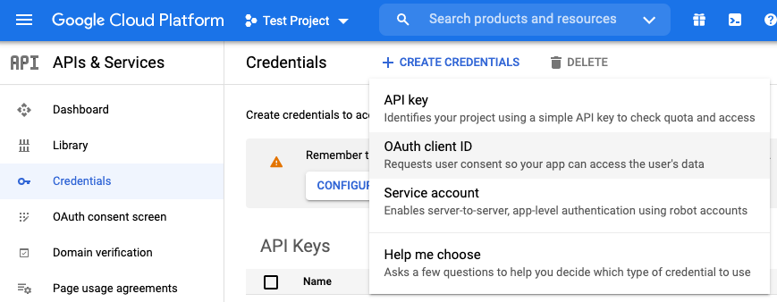

Google Single Sign-On (E20)
===========================

## Migrating from OAuth 2.0 to OpenID Connect

OAuth 2.0 is being deprecated and replaced by OpenID Connect. Refer to the product documentation to [convert your existing OAuth 2.0 service provider configuration for Google Apps](https://docs.mattermost.com/deployment/converting-oauth-service-providers-to-openid-connect).

## Configuring Google Apps as a Single Sign-On (SSO) service

Follow these steps to configure Mattermost to use Google as a Single Sign-on (SSO) service for team creation, account creation, and sign-in.

**Note:** The [Google People API](https://developers.google.com/people) has replaced the Google+ API, which was deprecated by Google as of March 7th, 2019 [per their notice](https://developers.google.com/+/api-shutdown).

### Step 1: Create OpenID Connect project in Google API Manager

1. Go to [Google Cloud Platform](https://console.developers.google.com).
2. Select **Credentials** in the left-hand sidebar.
3. Select **Create Credentials**, then select **OAuth client ID**.
4. Select the **Web application** as the application type.
5. Enter ``Mattermost-<your-company-name>`` as the **Name**, replacing with the name of your organization.
6. Under **Authorized redirect URIs**, select **Add URL**, then enter ``{your-mattermost-url}/signup/google/complete``. For example: ``http://localhost:8065/signup/google/complete``.
7. Select **Create**.
8. Copy and paste the **Your Client ID** and **Your Client Secret** values to a temporary location. You will enter these values in the Mattermost System Console.




### Step 2: Enable Google People API

Go to the [Google People API](https://console.developers.google.com/apis/api/plus/overview), then select **Enable** in the header. This might take a few minutes to propagate through Google's systems.

### Step 3: Configure Mattermost for Google Apps SSO

Configure Mattermost for Google Apps SSO using the System Console or by adding the Google Apps settings directly to the ``config.json`` file directly on your Mattermost server. 

#### Using the System Console

1. Log in to Mattermost, then go to **System Console > Authentication > OpenID Connect**.
2. Select **Google Apps** as the service provider.
3. The **Discovery Endpoint** for OpenID Connect with Google Apps is prepopulated with ``https://accounts.google.com/.well-known/openid-configuration``.
4. Paste in the **Client ID** from Google in Mattermost.
5. Paste in the **Client Secret** from Google in Mattermost.
6. Select **Save**.

#### Modifying the ``config.json`` file

1. Open ``config.json`` as root in a text editor. It’s usually in ``/opt/mattermost/config`` but it might be elsewhere on your system.
2. Locate the ``GoogleSettings`` section, then add or update the following information:

```
"Enable": true,
        "Secret": "P-k9R-7E7ayX9LdddddWdXVg",
        "Id": "1022ddddd5846-bkddddd4a1ddddd9d88j1kb6eqc.apps.googleusercontent.com",
        "Scope": "profile openid email",
        "AuthEndpoint": "",
        "TokenEndpoint": "",
        "UserApiEndpoint": "",
        "DiscoveryEndpoint": "https://accounts.google.com/.well-known/openid-configuration",
        "ButtonText": "",
        "ButtonColor": ""
```
3. Save your changes, then restart your Mattermost server. After the server restarts, users must change their sign-in method before they can sign in with Google Apps.
