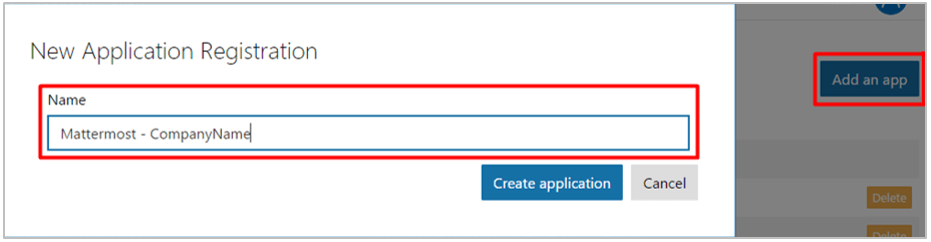
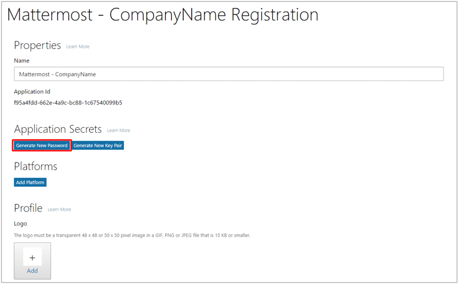
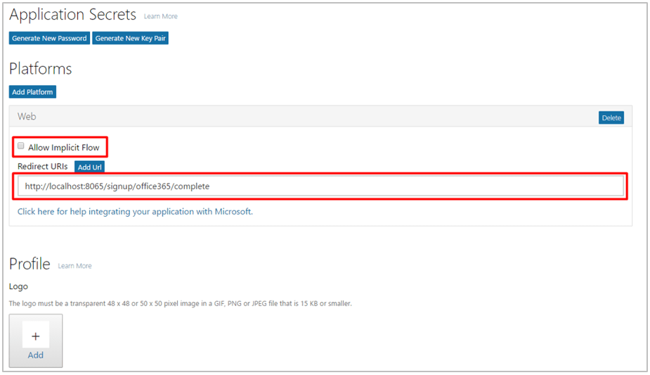
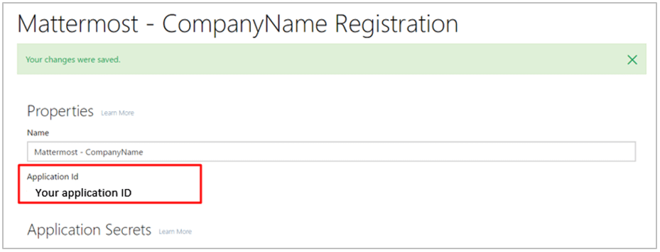

# Office 365 Single-Sign-On (E20)
___

Follow these steps to configure Mattermost to use Office 365 as a single-sign-on (SSO) service for team creation, account creation and sign-in.

Note that the system must be using SSL for use with Office365 as Microsoft only allows OAuth redirect URIs that are SSL enabled.

1 - [Log in](https://login.microsoftonline.com/) to your Microsoft or Office 365 account. Make sure it's the account on the same tenant that you would like users to log in with.

2 - Go to [Application Registration Portal](https://apps.dev.microsoft.com), click **Go to app list** > **Add an app** and use "Mattermost - your-company-name" as the **Application Name**.

3 - Under **Application Secrets**, click **Generate New Password** and copy it, as it will be used to configure Office 365 SSO for Mattermost.

4 - Under **Platforms**, click **Add Platform**, choose **Web** and enter `your-mattermost-url/signup/office365/complete` (example: `http://localhost:8065/signup/office365/complete`) under **Redirect URIs**. Also uncheck **Allow Implicit Flow**.

5 - Click **Save** and copy the **Application ID**.

6 - In **System Console > OAuth 2.0 > Select OAuth 2.0 service provider**, choose **Office 365 (Beta)** as the service provider and enter **Application ID** from step 5 and **Application Secret Password** from step 3 in their respective fields.

7 - Restart your Mattermost server to see the changes take effect.

Notes: 
- You may also enter **Application ID** and **Application Secret Password** fields from steps 5 and 3 directly in `Office365Settings` section of `config/config.json`.
- The following default values in `Office365Settings` section of `config/config.json` are recommended:
    - `Scope`: `User.Read`
    - `AuthEndpoint`: `https://login.microsoftonline.com/common/oauth2/v2.0/authorize` 
    - `TokenEndpoint`: `https://login.microsoftonline.com/common/oauth2/v2.0/token`  
    - `UserApiEndpoint`: `https://graph.microsoft.com/v1.0/me`  
