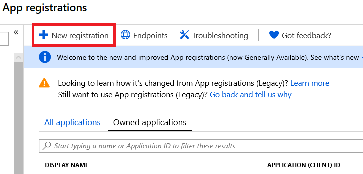
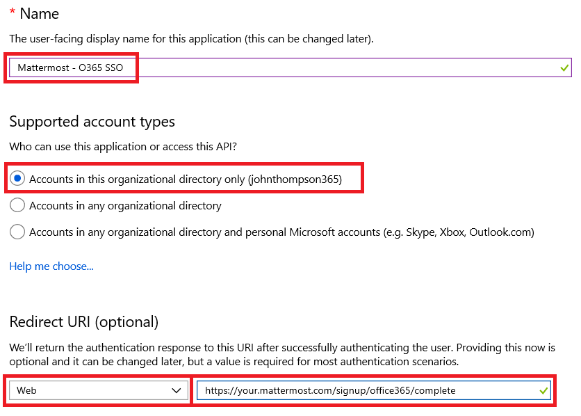
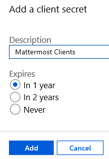
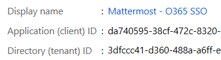

# Office 365 Single Sign-On (E20)
___

Follow these steps to configure Mattermost to use your Office 365 logon credentials and Azure Active Directory account as a single sign-on (SSO) service for team creation, account creation and sign-in. 

**The system must be using SSL for use with Office365 as Microsoft only allows OAuth redirect URIs that are SSL enabled.** 

1 - Login to your [Azure Portal](https://portal.azure.com/) with the account that relates to the Azure AD tenant you want to register the application in. (You can check the tenant in the top right corner of the portal).

2 - In the left-hand navigation pane, select the **Azure Active Directory service**, and then select **App registrations > New registration**.

3 - Give your new registration a **Name**, and then define which **Supported account types** can access the application. For example, if this is to be only accessed from your enterprise's Azure AD accounts, then select _Accounts in this organizational directory only_. The **Redirect URI** should be defined as Web client. Also input the URL with the host name that will be specific to your Mattermost service followed by /signup/office365/complete. An example below is: https://your.mattermost.com/signup/office365/complete

   

Now the App Registration has been created and you can configure it further. The standard Azure AD documentation is [here](https://docs.microsoft.com/en-gb/azure/active-directory/develop/quickstart-register-app) for reference.

4 - Select **Certificates and Secrets** from the menu, and click the button to generate a **New Client secret**. Provide a description and define the expiry for the token. 

   

Click _Add_ and you will be provided with the _client secret value_, copy this and save it for use in the Mattermost configuration as the **Application Secret Password**.

5 - Select **Overview** from the menu and copy the _Application (client) ID_ and the _Directory (tenant) ID_, for use in the Mattermost configuration as the **Application ID** and as part of the **Auth Endpoint** and **Token Endpoint** URL.

   

6 - Login to Mattermost and then go to the **System Console > OAuth 2.0 > Select OAuth 2.0 service provider**, choose **Office 365** as the service provider. Enter the _client secret value_ you copied in Step 4 as the **Application Secret Password**. Paste the _Application (client) ID_ you saved in Step 5 into the **Application ID** field. 

7 - Open your config.json file and copy the _Directory (tenant) ID_ value from Step 5. In the `Office365Settings` section of `config/config.json` you will be updating the default values from 
 - `AuthEndpoint`: `https://login.microsoftonline.com/common/oauth2/v2.0/authorize` 
 - `TokenEndpoint`: `https://login.microsoftonline.com/common/oauth2/v2.0/token` 
 
 to include _Directory (tenant) ID_ value, for example
 
 - `AuthEndpoint`: `https://login.microsoftonline.com/3dfccc41-d360-488a-a6ff-e9e565b3xbf1/oauth2/v2.0/authorize` 
 - `TokenEndpoint`: `https://login.microsoftonline.com/3dfcc41-d360-488a-a6ff-e9e565b3xbf1/oauth2/v2.0/token`

8 - Restart your Mattermost server to see the changes take effect.

### Note about Microsoft Active Directory Tenants

A Microsoft Active Directory (AD) tenant is a dedicated instance of Azure Active Directory (Azure AD) that you own and would have received when signing up for a Microsoft cloud service such as Azure or Office 365. Tenants are commonly used by organizations who want to store information about their users such as passwords, user profile data and permissions. You can learn more about [getting an Azure AD tenant here](https://docs.microsoft.com/en-us/azure/active-directory/active-directory-howto-tenant).

To allow your Azure AD users to sign in to Mattermost using Office 365 SSO, you must register Mattermost in the Microsoft Azure AD tenant that contains the users' information. The registration can be done from the [Microsoft Azure portal](https://manage.windowsazure.com/). The steps to register the Mattermost account in the tenant should be similar to those provided above, and you can find more information about [integrating apps with Azure AD here](https://azure.microsoft.com/en-us/documentation/articles/active-directory-integrating-applications/). 

If you don't register Mattermost in the Microsoft Azure AD tenant your organization uses, Office 365 SSO will likely fail for your users. 

If you're interested in configuring a multi-tenant Mattermost application, which allows access to users from several organizations, you can [find out more here](https://azure.microsoft.com/en-us/documentation/articles/active-directory-integrating-applications/#configuring-multi-tenant-applications).

Note that if you do not use Azure Active Directory, you may simply register Mattermost with your Office 365 or Azure account (either your personal, work or school account) and set up Office 365 SSO with Mattermost using the steps provided above.
