## Configure SAML with Microsoft ADFS (Active Directory Federation Services)

The following process provides steps to configure SAML with Okta for Mattermost.

### Pre-installation

Before configuring SAML with Microsoft ADFS, make sure you have the [XML Security Library](https://www.aleksey.com/xmlsec/download.html)  installed on your Mattermost instance. The XML Security Library is usually included as part of Debian GNU/Linux.

### Basic Requirements in ADFS

The following are basic requirements to use ADFS for Mattermost:
 - An Active Directory instance where all users have a specified email, first name, last name and username attributes.
 - A Microsoft Server running. The screenshots used in this guide are from Microsoft Server 2012R2, but similar steps should work for other versions.
 - A SSL certificate to sign your ADFS login page
 - ADFS installed on your Microsoft Server. You can find a detailed guide for deploying and configuring ADFS in [this article](https://msdn.microsoft.com/en-us/library/gg188612.aspx)

On your ADFS installation, note down the value of the **SAML 2.0/W-Federation URL** in ADFS Endpoints section, also known as the **SAML SSO URL**. If you chose the defaults for the installation, this will be `/adfs/ls/`.

### Adding a Relying Party Trust

1) In ADFS management sidebar, go to **AD FS > Trust Relationships > Relying Party Trusts** and click **Add Relying Party Trust…**

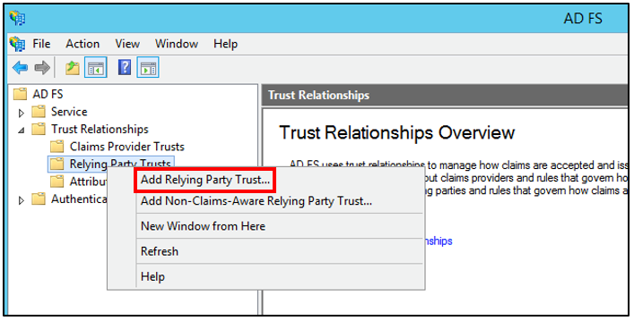

2) A configuration wizard for adding a new relying party trust opens. In the **Welcome** screen, click **Start**.

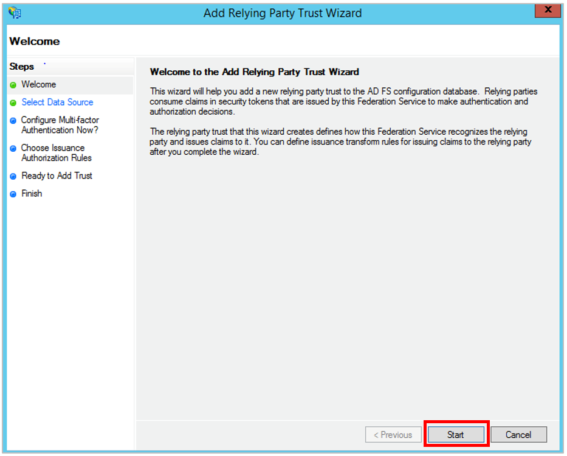

3) In the **Select Data Source** screen, select the option **Enter data about the relying party manually**.

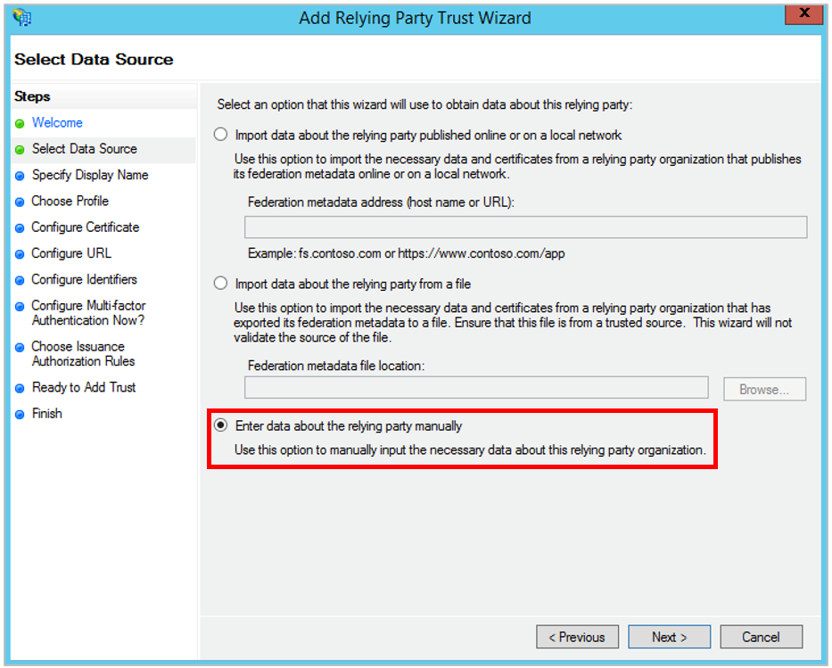

4) In the **Specify Display Name** screen, enter a **Display Name** to recognize the trust, such as `Mattermost`, and add any notes you want to make.

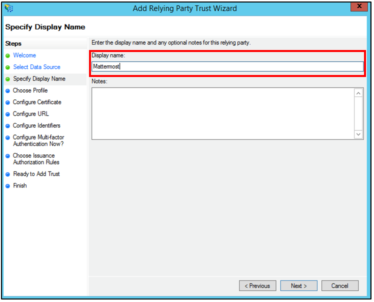

5) In the **Choose Profile** screen, select the option **AD FS profile**.

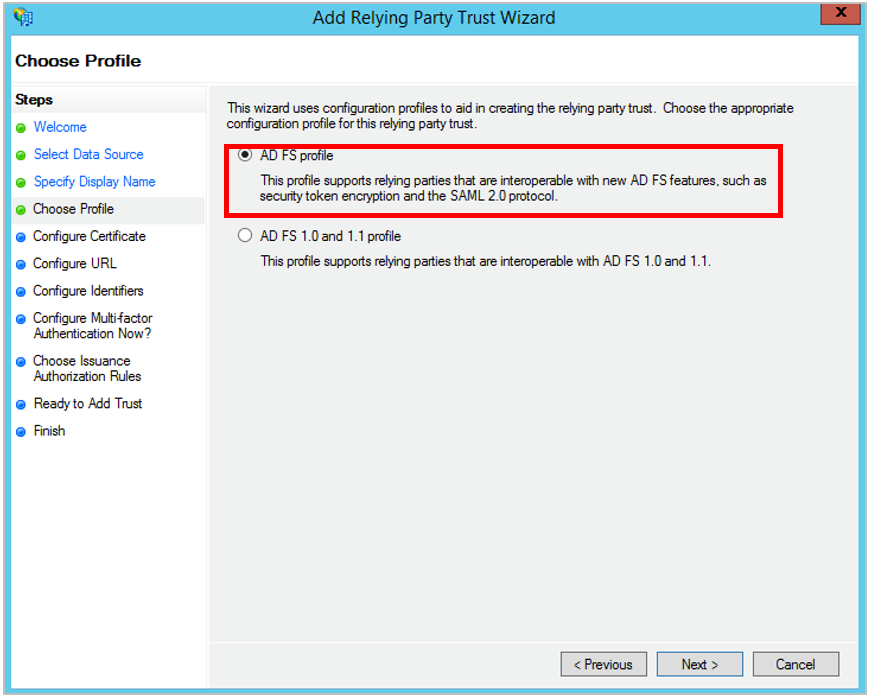

6) In the **Configure Certificate** screen, leave the certificate settings at their default values. 

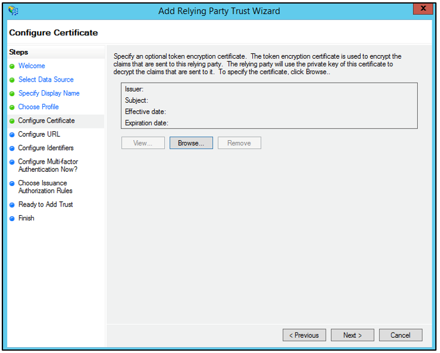

However, if you would like to set up encryption for your SAML connection, click the **Browse…** button and upload your Service Provider Private Key and Service Provider Public Certificate. You are welcome to generate the certificate by [downloading a built script here](broken link, to be added).

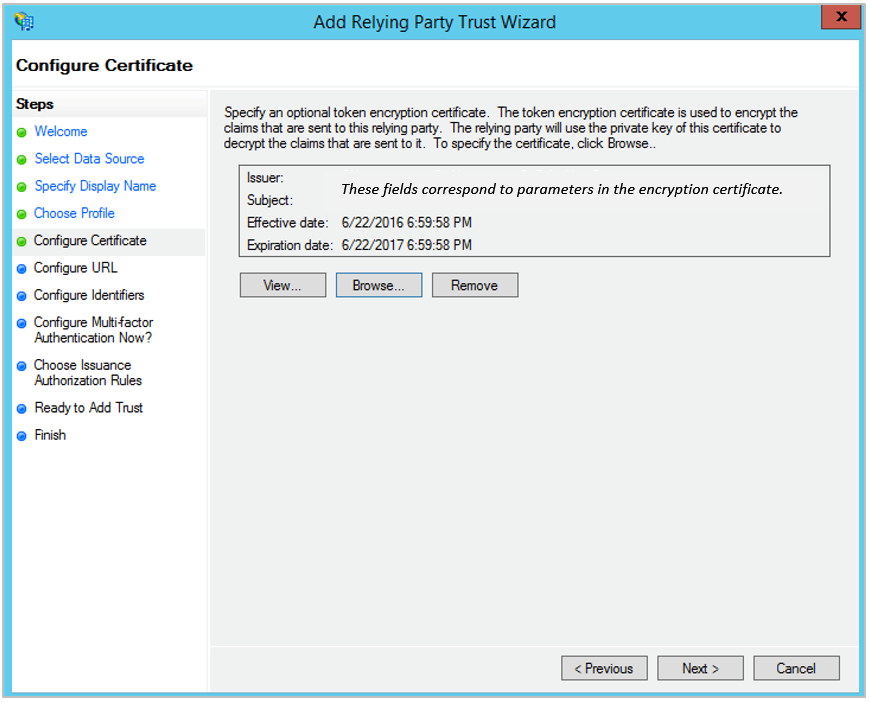

7) In the **Configure URL** screen, select the option **Enable Support for the SAML 2.0 WebSSO protocol** and enter the **SAML 2.0 SSO service URL**, which is of the form `https://<your-mattermost-url>/login/sso/saml`.

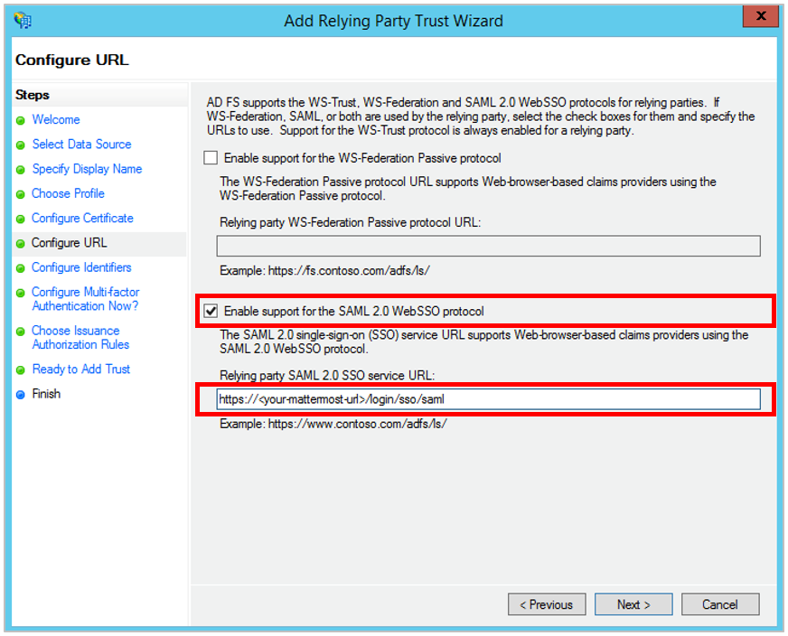

8) In the **Configure Identifiers** screen, enter the **Relying party trust identifier** (also known as the **Identity Provider Issuer URL**) of the form `https://<your-idp-url>/adfs/services/trust`and click `Add`.

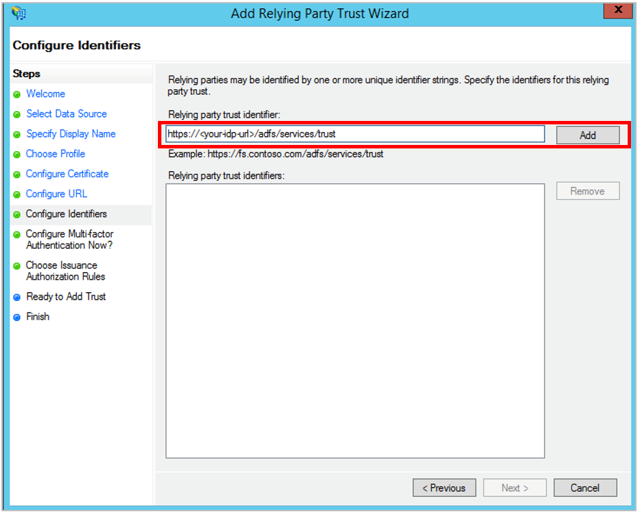

9) In the **Configure Multi-factor Authentication Now?** screen, you may enable multi-factor authentication, but this is beyond the scope of this guide.

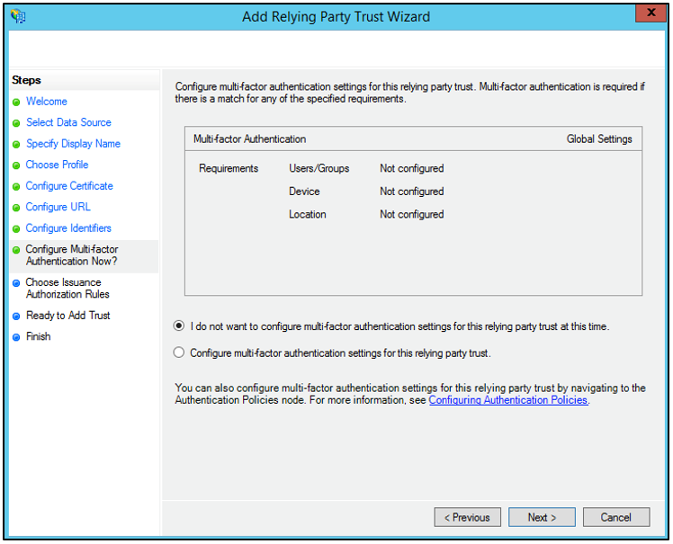

10) In the **Choose Issuance Authorization Rules** screen, select the option **Permit all users to access this relying party**.

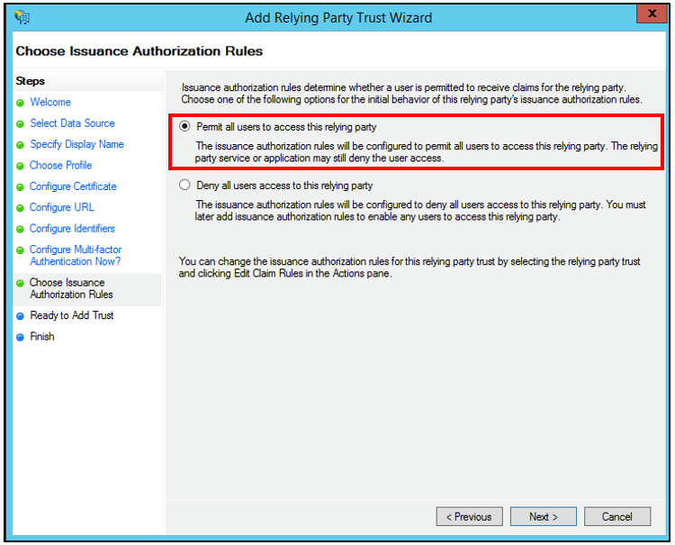

11) In the **Ready to Add Trust** screen, you can review your settings.

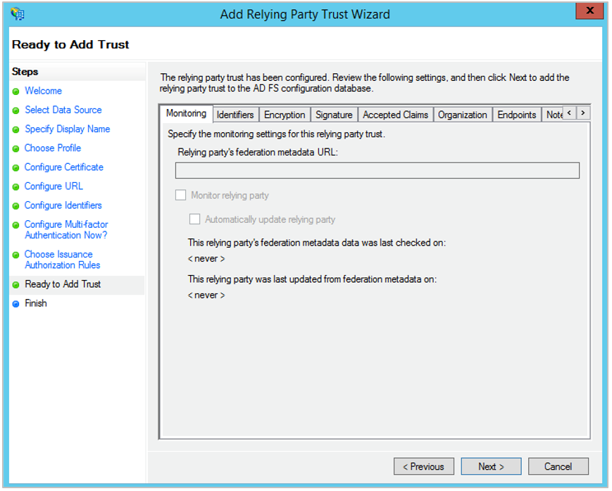

12) In the **Finish** screen, select the option **Open the Edit Claim Rules dialog for this relying party trust when the wizard closes**, and click `Close`. You will now exit configuration wizard and a **Claim Rules** editor opens.

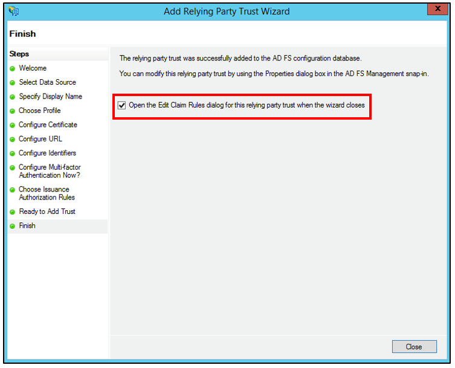

### Creating Claim Rules

13) In the **Issuance Transform Rules** of the **Claim Rules** editor, click the **Add Rule…** button. This action opens an **Add Transform Claim Rule Wizard**.

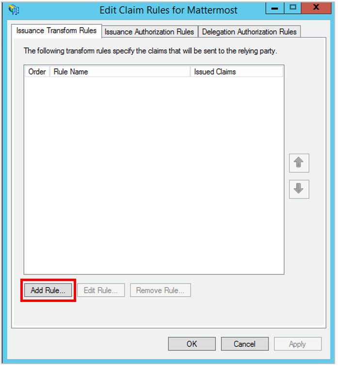

14) In the **Choose Rule Type** screen, select **Send LDAP Attributes as Claims** from the drop-down menu, then click **Next**.

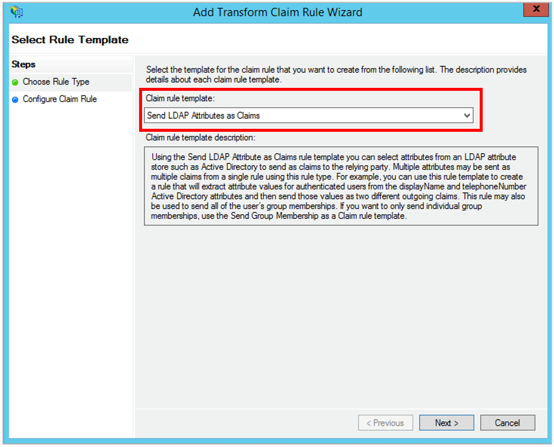

15) In the **Configure Claim Rule** screen, enter a **Claim Rule Name** of your choice, select **Active Directory** as the **Attribute Store** and do the following:
  - From the **LDAP Attribute column**, select `E-Mail-Addresses`. From the **Outgoing Claim Type**, type `Email`
  - From the **LDAP Attribute column**, select `Given-Name`. From the **Outgoing Claim Type**, type `FirstName`
  - From the **LDAP Attribute column**, select `Surname`. From the **Outgoing Claim Type**, type `LastName`
  - From the **LDAP Attribute column**, select `SAM-Account-Name`. From the **Outgoing Claim Type**, type `Username`

Then, click **OK** to add the rule.

Note that the entries in the **Outgoing Claim Type** column can be chosen to be something else. They can contain dashes but no spaces. Note that they will be used to map the corresponding fields in Mattermost later.

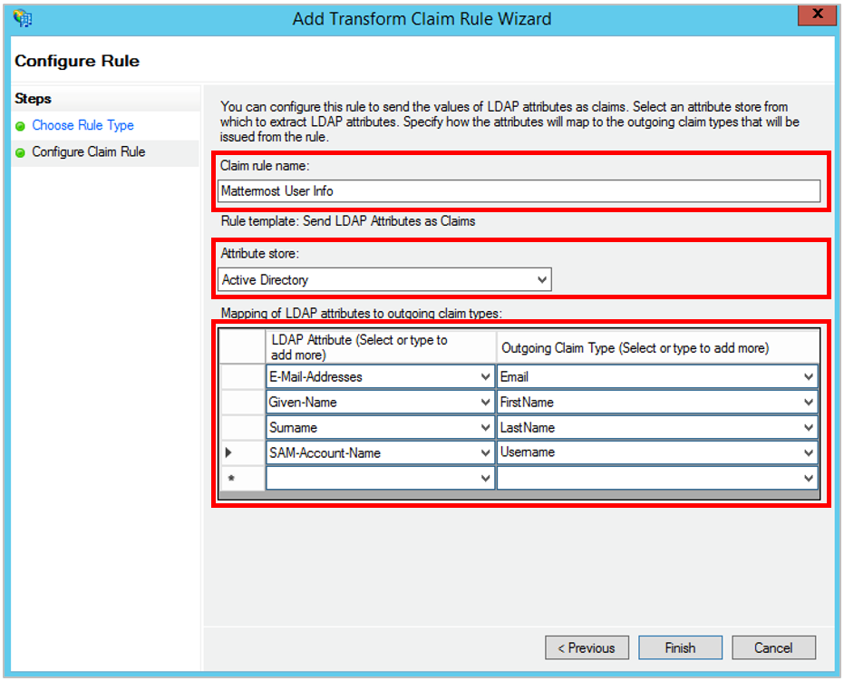

16) Create another new rule by clicking the **Add Rule…** button.

17) In the **Choose Rule Type** screen, select **Transform an Incoming Claim** from the drop-down menu, then click **Next**.

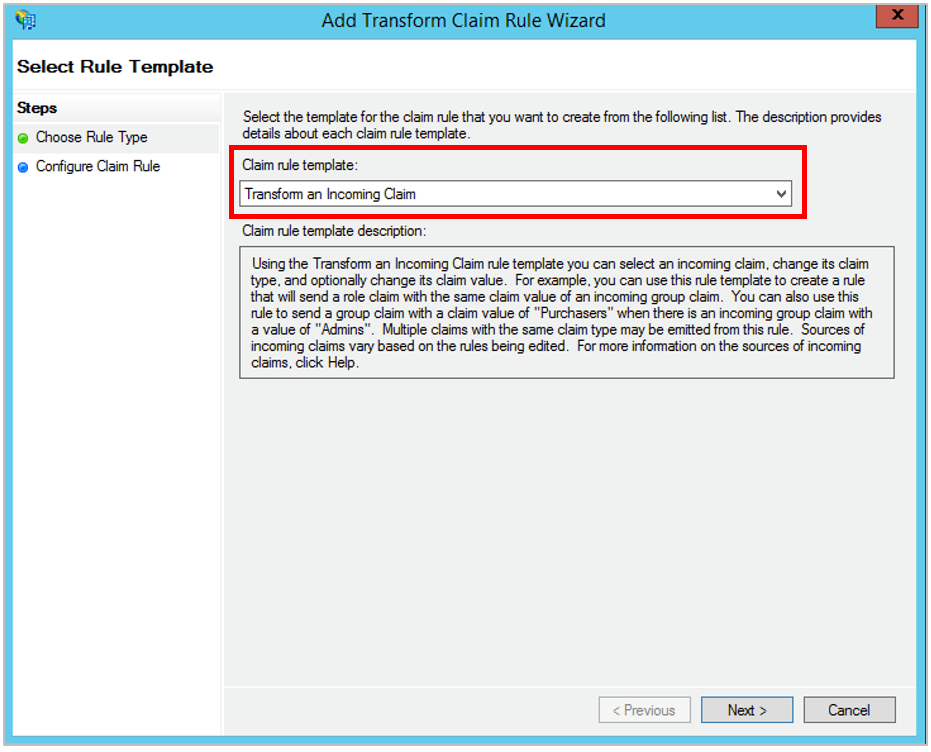

18) In the **Configure Claim Rule** screen, enter a **Claim Rule Name** of your choice, then
  - Select `Name ID` for the **Incoming claim type**
  - Select `Unspecified` for the **Incoming name ID format**
  - Select `E-Mail Address` for the **Outgoing claim type**

Moreover, select the *Pass through all claim values* option. Then click *Finish*.

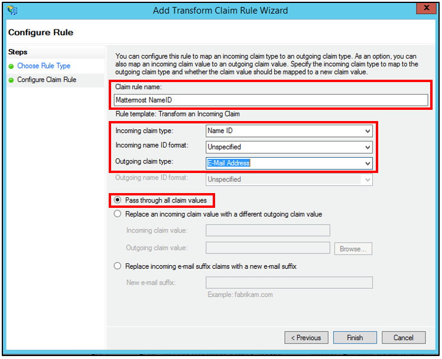

19) Click **OK** to create the claim rule, and **OK** again to finish creating rules.

# // Is step 20 optional???

20) Open Windows PowerShell as an administrator and run the following command:

`Set-ADFSRelyingPartyTrust -TargetName <display-name> -SamlResponseSignature "MessageAndAssertion"`

where <display-name> is the name you specified in step 4. In our example it would be `mattermost`.

This action will add the signature to SAML messages, making verification successful.

### Export Identity Provider Certificate

Next, we export the identity provider certificate, which will be later uploaded to Mattermost to finish SAML configuration.

21) In ADFS management sidebar, go to **AD FS > Service > Certificates** and double click on the certificate under **Token-signing**

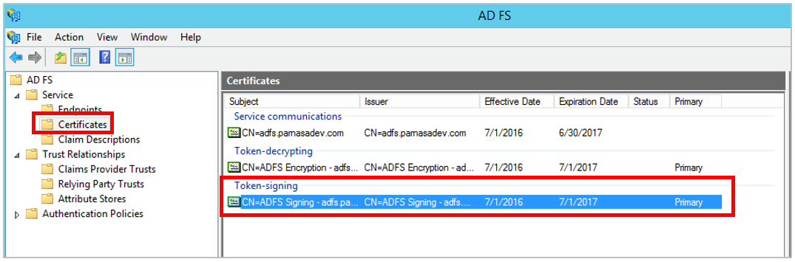

22) In the **Certificate** screen, go to the **Details** tab and click **Copy to File…**, then **OK**. This opens a **Certificate Export Wizard**.

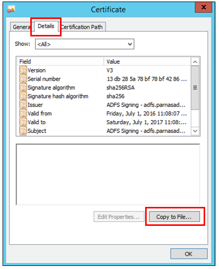

23) In the **Certificate Export Wizard** screen, select the option **Base-64 encoded X.509 (.CER)** and click **Next**.

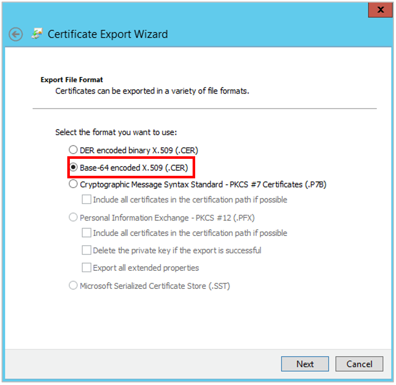

24) In the **Completing the Certificate Export Wizard** screen, click `Finish`, then `OK`.

You’re now about to finish configuring SAML for Mattermost!

### Configure SAML for Mattermost

25) Start Mattermost server and sign into Mattermost as a System Administrator. Go to **System Console > Authentication > SAML**.
  - `SAML SSO URL`: **SAML 2.0/W-Federation URL** from the ADFS Endpoints section (see [Basic Requirements](http://docs.mattermost.com/deployment/sso-saml-adfs-basic-requirements.html))
  - `Identity Provider Issuer URL`: `Relying party trust identifier` from ADFS you specified in step 8.
  - `Identity Provider Public Certificate`: X.509 Public Certificate you downloaded in step 24.

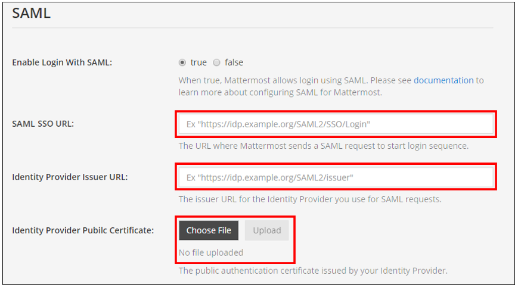

26) (Optional) Configure Mattermost to verify the signature. The `Service Provider Login URL` is the `SAML 2.0 SSO service URL` you specified in ADFS in step 7.

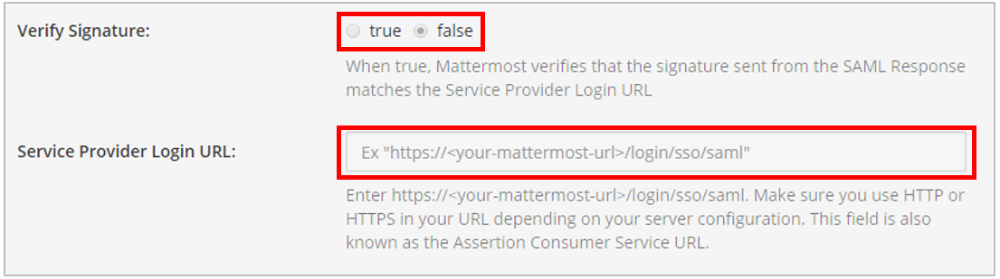

27) (Optional) Enable encryption based on the parameters provided in ADFS in step 6.

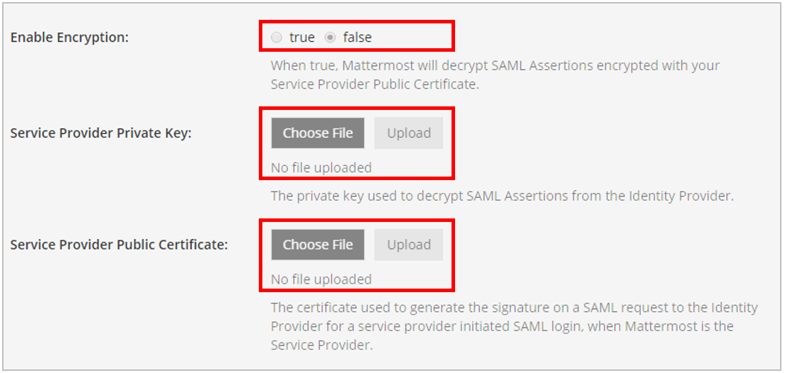

28) Set attributes for the SAML Assertions, which will be used to update user information in Mattermost. Attributes for email, username, first name and last name are required and should match the values you entered in ADFS in step 15. See [documentation on SAML configuration settings](http://docs.mattermost.com/administration/config-settings.html#saml-enterprise) for more detail.

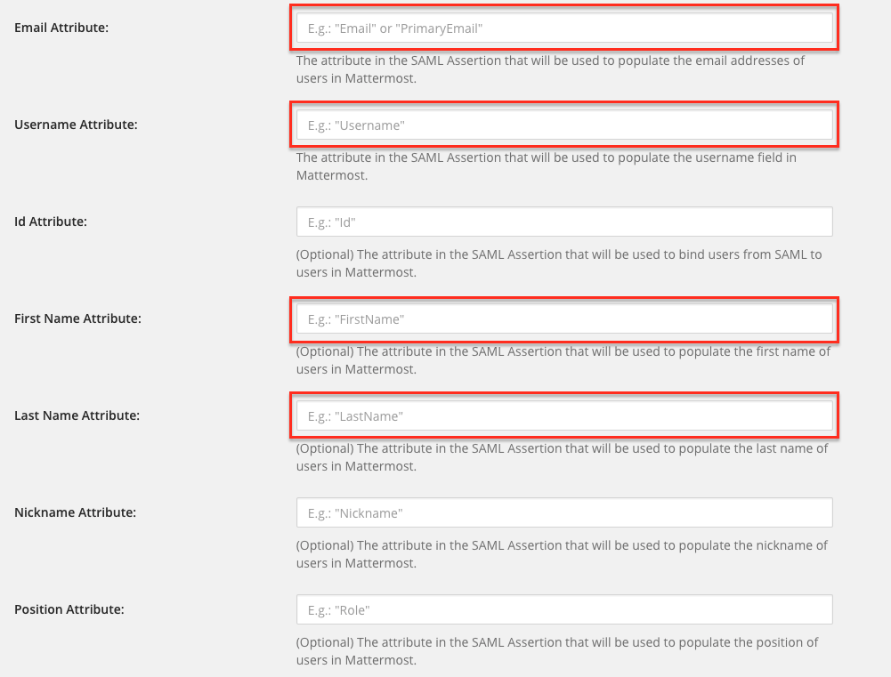

29) (Optional) Lastly, customize the login button text.

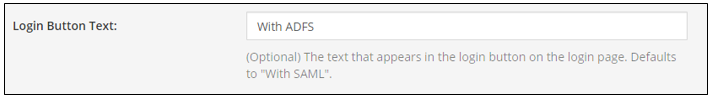

30) Click `Save`.

You’re done! If you’d like to confirm SAML SSO is successfully enabled, switch your System Administrator account from email to SAML-based authentication via **Account Settings > General > Sign-in Method > Switch to SAML SSO** and sign in with your SAML credentials to complete the switch.

It is also recommended to post an announcement about how the migration will work to users.

You may also configure SAML for ADFS by editing `config.json`. Before starting the Mattermost server, edit `config.json` to enable SAML based on [SAML configuration settings](http://docs.mattermost.com/administration/config-settings.html#saml-enterprise). You must restart Mattermost server for the changes to take effect.

### Troubleshooting

The following are troubleshooting suggestions on common error messages and issues. 

#### 1. System Administrator locks themselves out of the system

If the System Administrator is locked out of the system during SAML configuration process, they can set an existing account to System Administrator using [a commandline tool](http://docs.mattermost.com/deployment/on-boarding.html#creating-system-administrator-account-from-commandline). 

#### 2. Received error message: `An account with that username already exists. Please contact your Administrator.`

This usually means an existing account has another authentication method enabled. If so, the user should sign in using that method (such as email and password), then change their sign-in method to SAML via **Account Settings > Security > Sign-in method**.

This error message can also be received if the `Username Attribute` of their SAML credentials is incorrect. If so, the user can update the attribute at their identity provider (for instance, back to the old value if it had been previously updated). 

#### 3. Received error message: `An account with that email already exists. Please contact your Administrator.`

This usually means an existing account has another authentication method enabled. If so, the user should sign in using that method (such as email and password), then change their sign-in method to SAML via **Account Settings > Security > Sign-in method**.

This error message can also be received if the `Email Attribute` of their SAML credentials is incorrect. If so, the user can update the attribute at their identity provider (for instance, back to the old value if it had been previously updated).
