## Configure SAML with Okta

The following process provides steps to configure SAML with Okta for Mattermost.

### Pre-installation

Before configuring SAML with Okta, make sure you have the [XML Security Library](https://www.aleksey.com/xmlsec/download.html)  installed on your Mattermost instance. The XML Security Library is usually included as part of Debian GNU/Linux.

### Set up a connection app for Mattermost SSO

1) Sign into Okta as an administrator.

2) Go to **Admin Dashboard > Applications > Add Application**.

3) Click **Create New App** and choose `SAML 2.0` as the Sign on method.

4) Enter **General Settings** for the application, including `App name` and `App logo` (optional). It is recommended to display the application icon to users, including in the Okta Mobile app.

If you’d like to use a Mattermost logo for the application, you are free to download one [from our page](http://www.mattermost.org/brand-guidelines/)

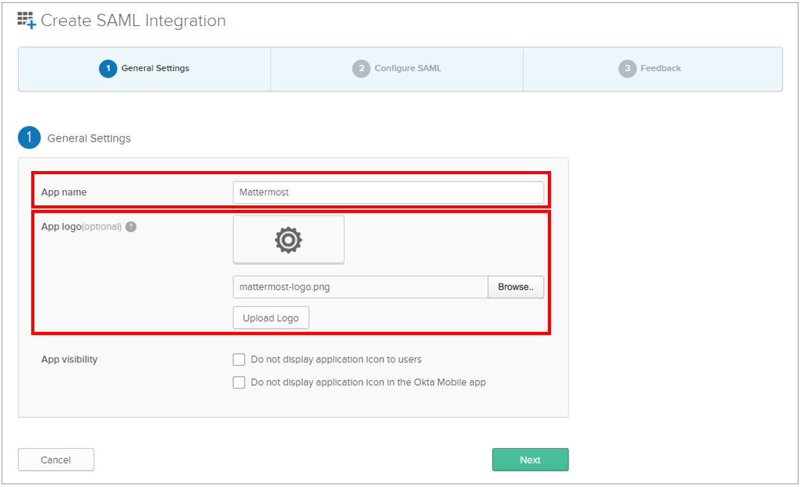

5) Enter **SAML Settings**, including:
 - Single sign on URL: `https://<your-mattermost-url>/login/sso/saml`
 - Audience URL: For instance, `mattermost`
 - Name ID format: `unspecified`
 - Application username: `Email`

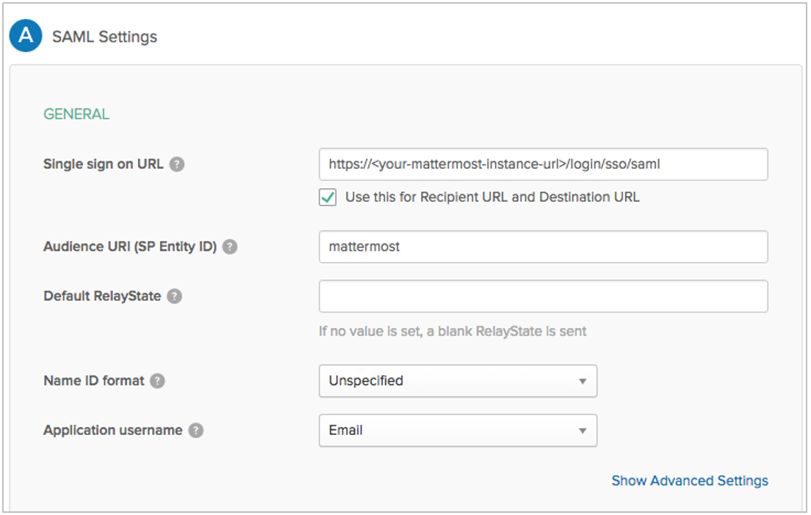

6) (Optional) Set up encryption for your SAML connection. First, click **Show Advanced Settings**

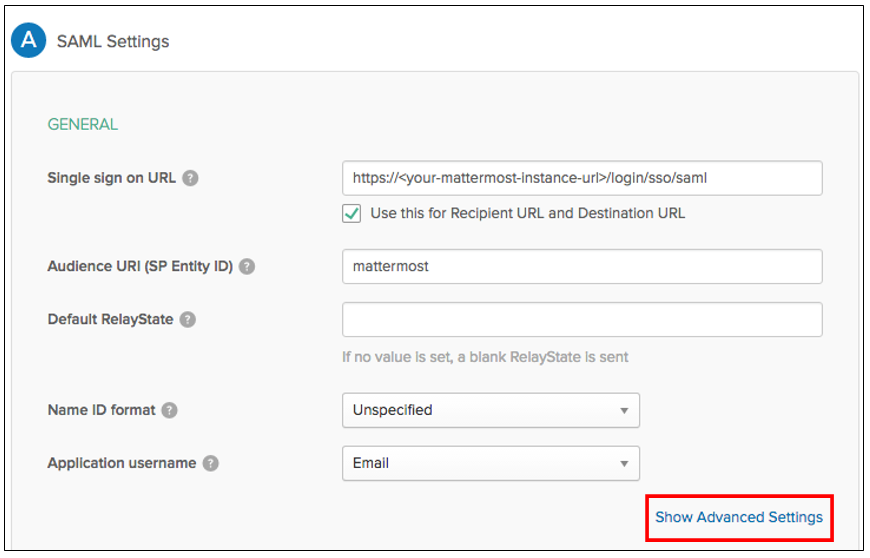

Then, set **Assertion Encryption** as `Encrypted` and generate the encryption certificates. You are welcome to generate the certificates by [downloading a built script here](broken link, to be added).

After generating your x509.crt encryption certificate, upload it to **Encryption Certificate** field.

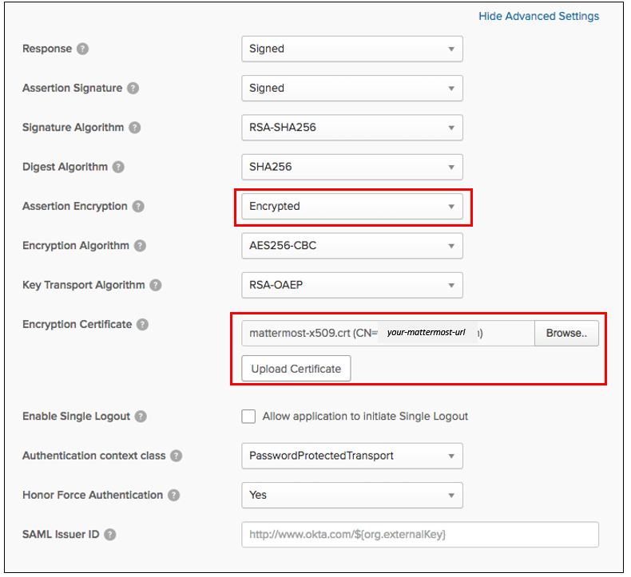

7) Enter attribute statements, which will be used to map attributes between Okta and Mattermost. For more information on which attributes are configurable, see our [documentation on SAML configuration settings](http://docs.mattermost.com/administration/config-settings.html#saml-enterprise). Email, first name, last name and username attributes are required.

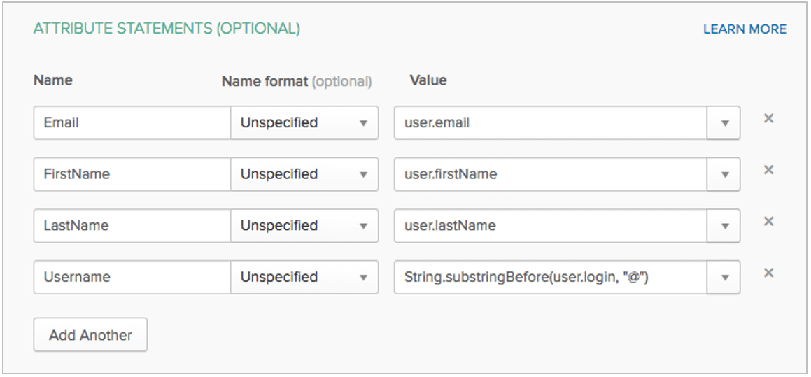

8) Click **Next**. Then, set Okta support parameters for the application. Recommended settings:
 - I’m an Okta customer adding an internal app
 - This is an internal app that we have created

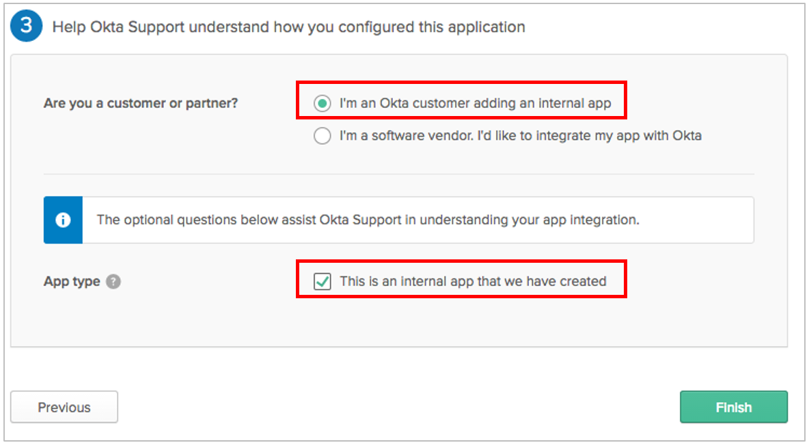

9) Click **Finish**. On the next screen, click the **Sign On** tab and click **View Setup Instructions**.

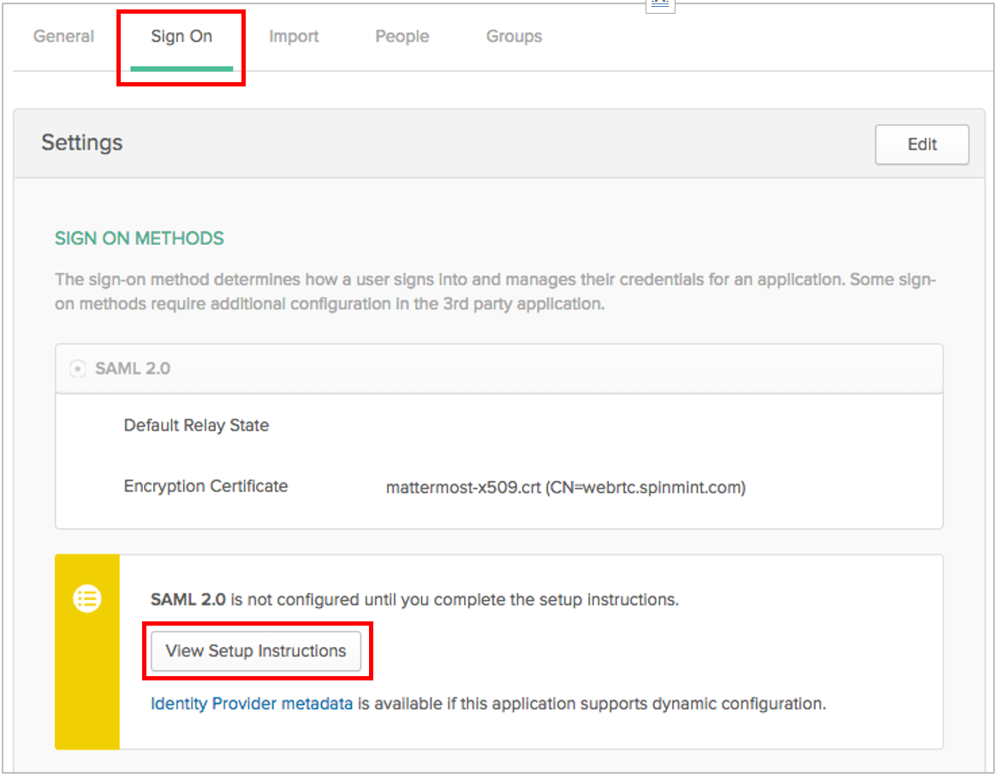

10) Take note of `Identity Provider Single Sign-On URL` (also known as `SAML SSO URL`), and the Identity Provider Issuer, as both will be needed to configure SAML for Mattermost. 

Furthermore, you **must download the X.509 Public Certificate file** and save it. You will need to upload it to Mattermost at a later step.

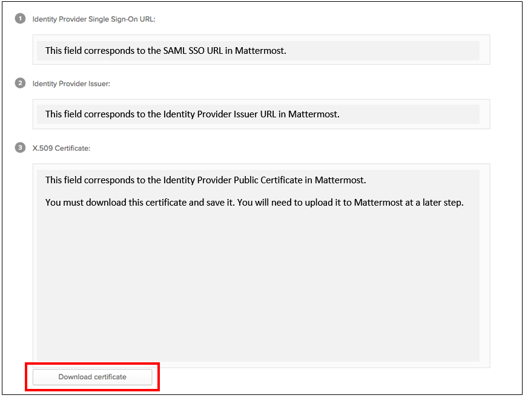

### Configure SAML for Mattermost

11) Start Mattermost server and sign into Mattermost as a System Administrator. Go to **System Console > Authentication > SAML**, and enter the following fields:
 - **SAML SSO URL**: `Identity Provider Single Sign-On URL` from Okta, specified in step 10.
 - **Identity Provider Issuer URL**: `Identity Provider Issuer` from Okta, specified in step 10.
 - **Identity Provider Public Certificate**: X.509 Public Certificate file you downloaded from Okta in step 10.

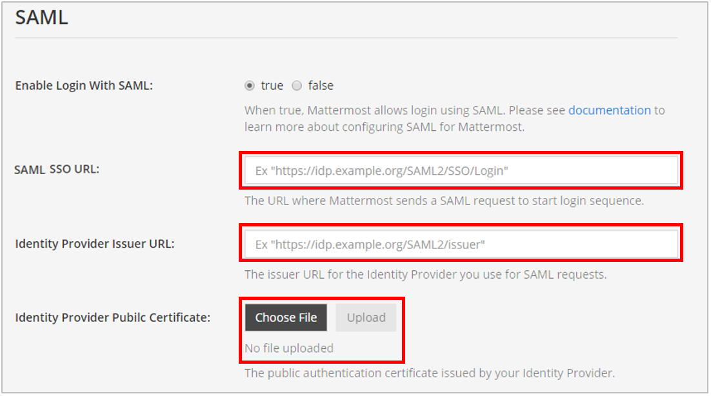

12) (Optional) Configure Mattermost to verify the signature. The **Service Provider Login URL** is the `Single sign on URL` you specified in Okta in step 5.

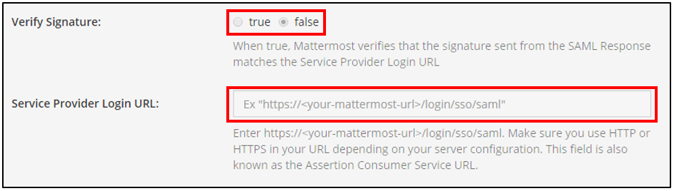

13) (Optional) Enable encryption based on the parameters provided in step 6.

14) Set attributes for the SAML Assertions, which will be used to update user information in Mattermost. Attributes for email, username, first name and last name are required and should match the values you entered in Okta in step 7. See [documentation on SAML configuration settings](http://docs.mattermost.com/administration/config-settings.html#saml-enterprise) for more detail.

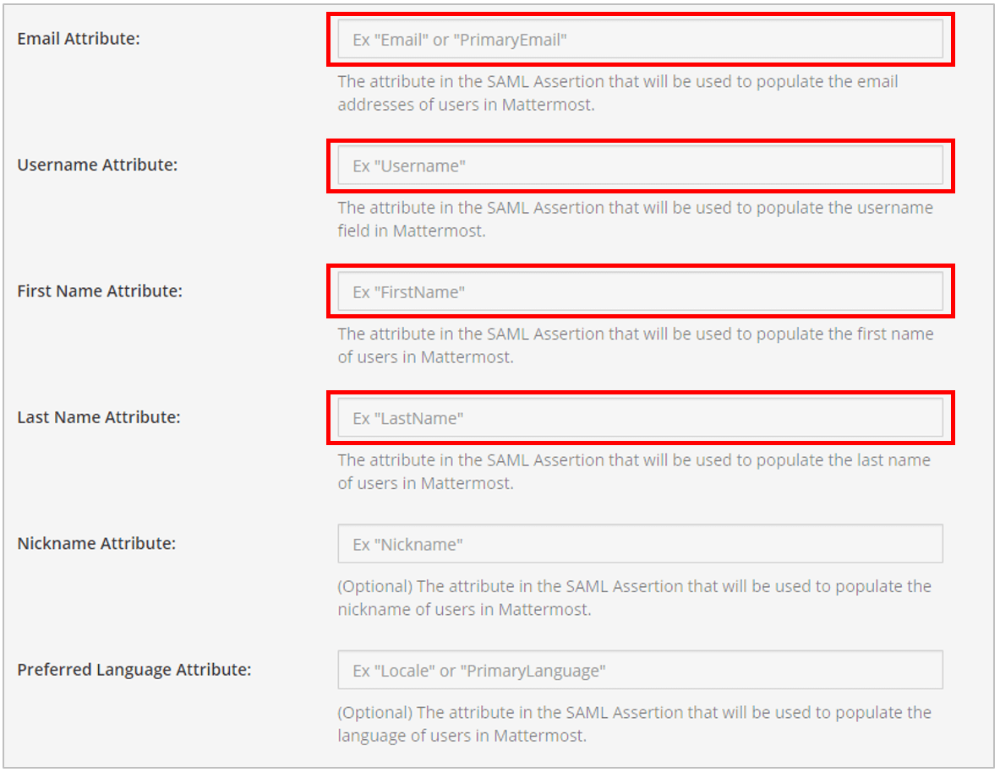

15) (Optional) Lastly, customize the login button text.

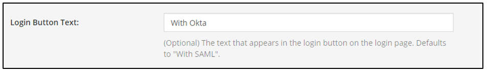

16) Click **Save**.

You’re done! If you’d like to confirm SAML SSO is successfully enabled, switch your System Administrator account from email to SAML-based authentication via **Account Settings > General > Sign-in Method > Switch to SAML SSO** and sign in with your SAML credentials to complete the switch.

It is also recommended to post an announcement about how the migration will work to users.

You may also configure SAML for Okta by editing `config.json`. Before starting the Mattermost server, edit `config.json` to enable SAML based on [SAML configuration settings](http://docs.mattermost.com/administration/config-settings.html#saml-enterprise). You must restart Mattermost server for the changes to take effect.

### Troubleshooting

The following are troubleshooting suggestions on common error messages and issues. 

#### 1. System Administrator locks themselves out of the system

If the System Administrator is locked out of the system during SAML configuration process, they can set an existing account to System Administrator using [a commandline tool](http://docs.mattermost.com/deployment/on-boarding.html#creating-system-administrator-account-from-commandline). 

#### 2. Received error message: `An account with that username already exists. Please contact your Administrator.`

This usually means an existing account has another authentication method enabled. If so, the user should sign in using that method (such as email and password), then change their sign-in method to SAML via **Account Settings > Security > Sign-in method**.

This error message can also be received if the `Username Attribute` of their SAML credentials is incorrect. If so, the user can update the attribute at their identity provider (for instance, back to the old value if it had been previously updated). 

#### 3. Received error message: `An account with that email already exists. Please contact your Administrator.`

This usually means an existing account has another authentication method enabled. If so, the user should sign in using that method (such as email and password), then change their sign-in method to SAML via **Account Settings > Security > Sign-in method**.

This error message can also be received if the `Email Attribute` of their SAML credentials is incorrect. If so, the user can update the attribute at their identity provider (for instance, back to the old value if it had been previously updated).
