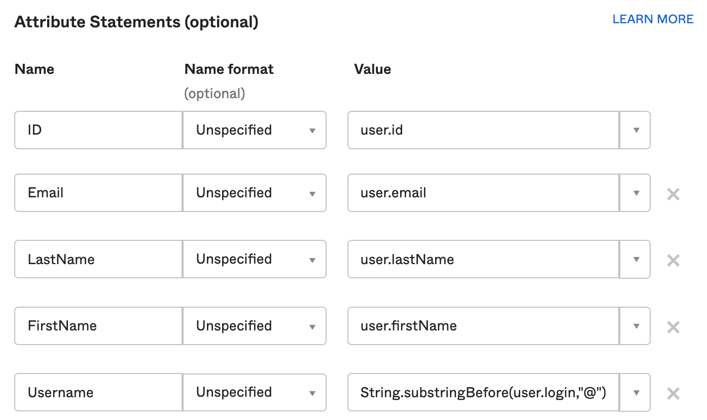
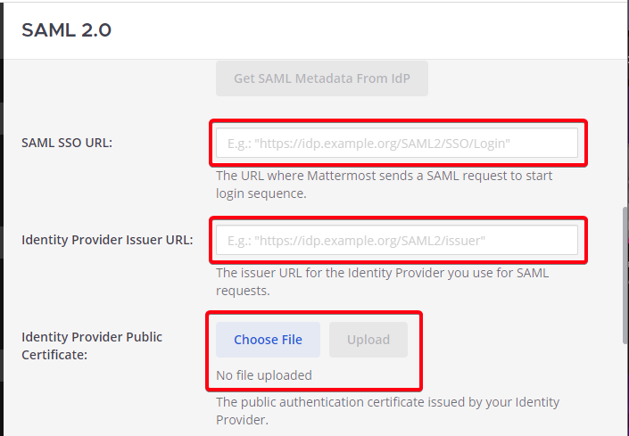
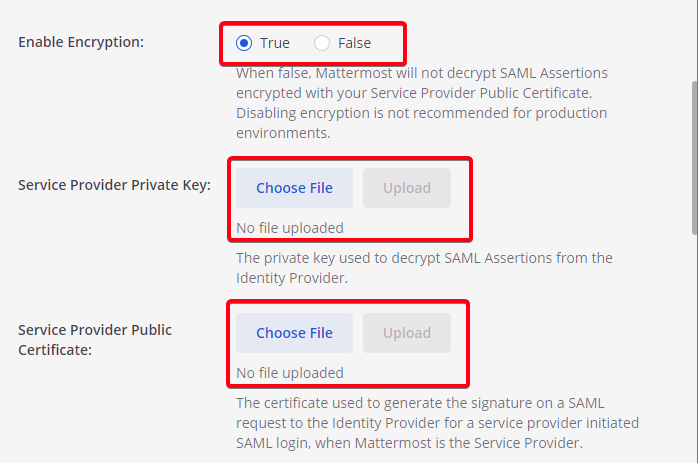
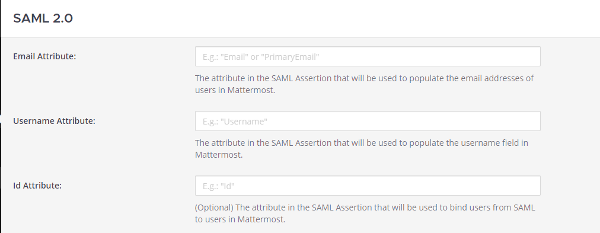
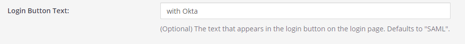

## Configure SAML with Okta

The following process provides steps to configure SAML with Okta for Mattermost.

### Pre-installation

1 - Before configuring SAML with Okta, make sure you have the [XML Security Library](https://www.aleksey.com/xmlsec/download.html) installed on your Mattermost instance. The XML Security Library is usually included as part of Debian GNU/Linux.

Also confirm if the `xmlsec1-openssl` library was successfully installed. If not, run
 - `apt-get install libxmlsec1-openssl` on Ubuntu
 - `yum install xmlsec1-openssl` on RHEL

2 - (Optional) If you would like to set up encryption for your SAML connection, generate encryption certificates now. You are free to use [our script in the `/docs` repo](https://github.com/mattermost/docs/tree/master/source/scripts/generate-certificates) or use another method to generate them.

You should save the two files that are generated, which will be referred to as the **Service Provider Private Key** and the **Service Provider Public Certificate** in this guide.

### Set up a connection app for Mattermost SSO

3 - Sign into Okta as an administrator.

4 - Go to **Admin Dashboard > Applications > Add Application**.

5 - Click **Create New App** and choose `SAML 2.0` as the Sign on method.

6 - Enter **General Settings** for the application, including `App name` and `App logo` (optional). It is recommended to display the application icon to users, including in the Okta Mobile app.

If you’d like to use a Mattermost logo for the application, you are free to download one [from our page](https://mattermost.org/brand-guidelines/).

7 - Enter **SAML Settings**, including:
 - Single sign on URL: `https://<your-mattermost-url>/login/sso/saml`
 - Audience URL: For instance, `mattermost`
 - Name ID format: `unspecified`
 - Application username: `Email`

8 - (Optional) Set up encryption for your SAML connection. First, click **Show Advanced Settings**.

Then, set **Assertion Encryption** as `Encrypted` and upload the **Service Provider Public Certificate** you generated in step 2 to the **Encryption Certificate** field.

9 - Enter attribute statements, which will be used to map attributes between Okta and Mattermost. For more information on which attributes are configurable, see our [documentation on SAML configuration settings](https://docs.mattermost.com/administration/config-settings.html#saml-enterprise). Email and username attributes are required. For Mattermost servers running 3.3 and earlier, first name and last name attributes are also required.

10 - Click **Next**. Then, set Okta support parameters for the application. Recommended settings:
 - I’m an Okta customer adding an internal app
 - This is an internal app that we have created

11 - Click **Finish**. On the next screen, click the **Sign On** tab and click **View Setup Instructions**.

12 - Take note of `Identity Provider Single Sign-On URL` (also known as `SAML SSO URL`), and the Identity Provider Issuer, as both will be needed to configure SAML for Mattermost. 

Furthermore, you **must download the X.509 Public Certificate file** and save it. You will need to upload it to Mattermost at a later step.

### Configure SAML for Mattermost

13 - Start Mattermost server and sign into Mattermost as a System Administrator. Go to **System Console > Authentication > SAML**, and enter the following fields:
 - **SAML SSO URL**: `Identity Provider Single Sign-On URL` from Okta, specified in step 12.
 - **Identity Provider Issuer URL**: `Identity Provider Issuer` from Okta, specified in step 12.
 - **Identity Provider Public Certificate**: X.509 Public Certificate file you downloaded from Okta in step 12.

14 - (Optional) Configure Mattermost to verify the signature. The **Service Provider Login URL** is the `Single sign on URL` you specified in Okta in step 7.

15 - (Optional) Enable encryption based on the parameters provided in step 8.

16 - Set attributes for the SAML Assertions, which will be used to update user information in Mattermost. Attributes for email and username are required and should match the values you entered in Okta in step 9. See [documentation on SAML configuration settings](https://docs.mattermost.com/administration/config-settings.html#saml-enterprise) for more detail.

For Mattermost servers running 3.3 and earlier, the first name and last name attributes are also required fields.

17 - (Optional) Lastly, customize the login button text.

18 - Click **Save**.

You’re done! If you’d like to confirm SAML SSO is successfully enabled, switch your System Administrator account from email to SAML-based authentication via **Account Settings > General > Sign-in Method > Switch to SAML SSO** and sign in with your SAML credentials to complete the switch.

It is also recommended to post an announcement about how the migration will work to users.

You may also configure SAML for Okta by editing `config.json`. Before starting the Mattermost server, edit `config.json` to enable SAML based on [SAML configuration settings](https://docs.mattermost.com/administration/config-settings.html#saml-enterprise). You must restart the Mattermost server for the changes to take effect.

#### Troubleshooting

The following are troubleshooting suggestions on common error messages and issues. 

##### 1. System Administrator locks themselves out of the system

If the System Administrator is locked out of the system during SAML configuration process, they can set an existing account to System Administrator using [a commandline tool](https://docs.mattermost.com/deployment/on-boarding.html#creating-system-administrator-account-from-commandline). 

##### 2. Received error message: `An account with that username already exists. Please contact your Administrator.`

This usually means an existing account has another authentication method enabled. If so, the user should sign in using that method (such as email and password), then change their sign-in method to SAML via **Account Settings > Security > Sign-in method**.

##### 3. Received error message: `An account with that email already exists. Please contact your Administrator.`

This usually means an existing account has another authentication method enabled. If so, the user should sign in using that method (such as email and password), then change their sign-in method to SAML via **Account Settings > Security > Sign-in method**.

##### 4. Received error message: `SAML login was unsuccessful because one of the attributes is incorrect. Please contact your System Administrator.`

Confirm all attributes, including `Email Attribute` and `Username Attribute`, are correct in both the Okta configuration and in **System Console > SAML**.

##### 5. Unable to switch to SAML authentication successfully

First, ensure you have installed the [XML Security Library](https://www.aleksey.com/xmlsec/download.html) on your Mattermost instance and that **it is available in your** `PATH`.

Second, ensure you have completed each step in our guide above for configuring SAML with Okta.

Lastly, if you are still having trouble with configuration, feel free to post in our [Troubleshooting forum](https://mattermost.org/troubleshoot/) and we'll be happy to help with issues during setup.
