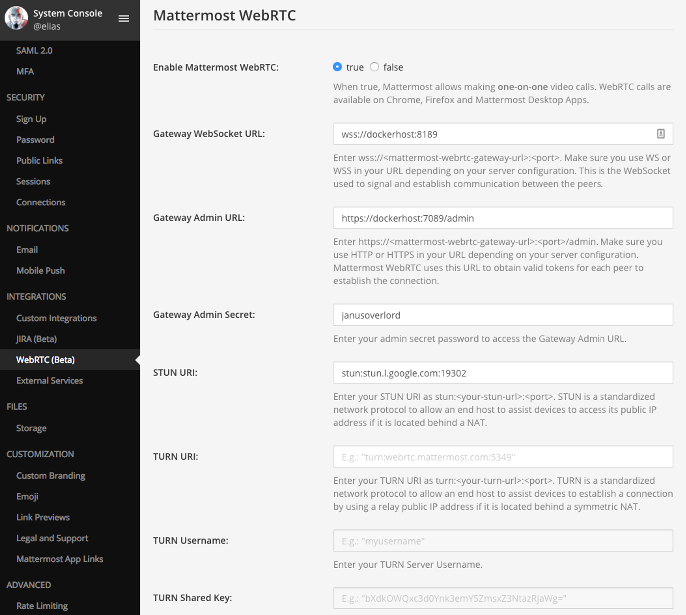

Video and Audio Calling (Beta)
=====================================

Mattermost supports an early preview of video and audio calling option using a self-hosted proxy. The implementation is based on WebRTC integration enabling one-on-one video and audio calling within a browser without needing additional software to be installed.

The feature is a working prototype for community development and not recommended for production. It has been tested on Chrome and Firefox running on Mac and Windows and the Mattermost Mac and Windows Apps using a Mattermost server running in SSL mode.

.. note:: This feature will be removed in Mattermost 5.6 in favor of open source plugins. For more information, see `this forum post <https://forum.mattermost.org/t/built-in-webrtc-video-and-audio-calls-removed-in-v5-6-in-favor-of-open-source-plugins/5998>`_.

Configuring video and audio calls with WebRTC
----------------------------------------------

This guide is aimed to set up `Mattermost WebRTC with a Docker image and Janus Gateway server <https://hub.docker.com/r/mattermost/webrtc/>`_. 

If you want to use a full `Janus Gateway <https://janus.conf.meetecho.com/>`_, please visit their `GitHub repo <https://github.com/meetecho/janus-gateway>`_ for detailed instructions. You may also optionally set up `Coturn <https://github.com/coturn/coturn/wiki>`_ for TURN servers for your Mattermost installation.

Pre-requisites
~~~~~~~~~~~~~~~

- Install Docker using the `Ubuntu online guide <https://docs.docker.com/installation/ubuntulinux/`_. Docker installation, configuration and management are out of scope for this guide.
- Install a Mattermost server using the `official install guides <https://docs.mattermost.com/guides/administrator.html#installing-mattermost>`_. Mattermost server installation, configuration and management are out of scope for this guide.
- Ability to connect using SSL or plain WebSocket and HTTP.
- At least one STUN server. You can use the public Google STUN server address, ``stun:stun.l.google.com:19302``, or deploy your own.

The Docker image includes a Janus Gateway server v0.2.2 and an SSL certificate for host **dockerhost**, valid until January 2, 2018.

TURN servers are not required for this setup.

Deploy Mattermost WebRTC Docker container
~~~~~~~~~~~~~~~~~~~~~~~~~~~~~~~~~~~~~~~~~~~~~

After installing Docker, run the following command in a terminal to install the Mattermost WebRTC Docker image.

   .. code:: bash

       docker run --name mattermost-webrtc -p 7088:7088 -p 7089:7089 -p 8188:8188 -p 8189:8189 -d mattermost/webrtc:latest

The command downloads, installs and runs your ``mattermost-webrtc`` container with the Janus Gateway pre-configured to use WebRTC on Chrome, Firefox or the Mattermost Desktop Apps.

.. note::
  Make sure your Mattermost server can reach the running Mattermost WebRTC Docker container. For instance, you can issue a Telnet to one of these ports (7088, 7089, 8188, 8189).

Configure Mattermost to enable WebRTC
~~~~~~~~~~~~~~~~~~~~~~~~~~~~~~~~~~~~~~~~~~~~~

1 - (Optional) Only required if you want to establish the connection to the Mattermost WebRTC Docker container, running the Janus Gateway, with SSL. If you prefer to establish the connection to the Mattermost WebRTC Docker container without SSL, proceed to the following step.

Mattermost makes an HTTP request to the Janus Gateway service to get a ``Token``, which is used to identify a user and establish a connection between peers. If you configure Mattermost to make requests to that service with SSL, the SSL certificate included in the Docker image and used to run the Janus Gateway will not be considered signed by a trusted CA.

To make the successful connection via SSL, go to **System Console > Security > Connections** and set **Enable Insecure Outgoing Connections** to ``true``. This change is not recommended in production given it allows any outgoing HTTPS requests to accept unverified, self-signed certificates and makes these connections susceptible to man-in-the-middle attacks. For example, outgoing webhooks to a server with a self-signed TLS certificate, using any domain, will be allowed.

2 - Go to **System Console > Integrations > WebRTC (Beta)** and set the following values:

- **Enable Mattermost WebRTC** - ``true``.
- **Gateway WebSocket URL** - example: ``wss://dockerhost:8189``. WebSocket route for the Janus Gateway service, inside the Mattermost WebRTC container, used to connect peers on a video call. For SSL connections, set the protocol to ``wss://`` and the port to ``8189``. For non-SSL connections, set the protocol to ``ws://`` and port to ``8188``.
- **Gateway Admin URL** - example: ``https://dockerhost:7089/admin``.  Admin route for the Janus Gateway service inside the Mattermost WebRTC container, used to fetch a valid ``Token``. For SSL connections, set the protocol to ``https://`` and the port to ``7089``. For non-SSL connections, set the protocol to ``http://`` and port to ``7088``.
- **Gateway Admin Secret** - example: ``janusoverlord``: The secret that validates the request made to fetch the ``Token``. For any Janus Gateway installation the default value is ``janusoverlord``. Change it by editing the ``janus.cfg`` file under the ``/opt/janus/etc/janus`` directory, and modifying the value for ``admin_secret``.
- **STUN URI** (Optional) - example: ``stun:stun.l.google.com:19302``: This is the STUN server to use for establishing a connection. You can use the public Google STUN server address, ``stun:stun.l.google.com:19302``, or deploy your own.
- **TURN URI** (Optional): If you need an NAT Traversal, you'll need to configure a TURN server such as a `Coturn <https://github.com/coturn/coturn/wiki>`_ server. Configuring the TURN server is out of scope for this guide.
- **TURN Username** (Optional): The username of your TURN server if you have one.
- **TURN Shared Key** (Optional): The password of your TURN server if you have one.

3 - Hit **Save**. You are now ready to start video and audio calls within Mattermost.

Start a video call
--------------------------

After enabling the feature in the System Console by a System Administrator:

1. Initiate a call with another user by either:

    Clicking **Start Video Call** on a user's profile popover, which appears after clicking their profile picture or name on the center channel or right hand sidebar.

    .. image:: ../images/webrtc-popover.png

    Clicking the video icon on the channel header of a direct message channel with that user.

    .. image:: ../images/webrtc-header.png

Troubleshooting
--------------------------

As noted previously, video and audio calls are intended as a working prototype for community development and not recommended for production.

To review a list of open video and audio call issues, refer to our `existing Jira ticket queue for WebRTC <https://mattermost.atlassian.net/browse/PLT-4735?jql=issuetype%20in%20(Bug%2C%20Improvement%2C%20%22New%20Feature%22%2C%20Story%2C%20Task)%20AND%20status%20in%20(Open%2C%20%22In%20Progress%22%2C%20Reopened%2C%20Submitted)%20AND%20text%20~%20webrtc>`_. If the issue is not on the list, try the following troubleshooting steps.

If you are still experiencing problems, post your issue in our `Troubleshooting forum <https://forum.mattermost.org/t/how-to-use-the-troubleshooting-forum/150>`_ or `file a bug <https://www.mattermost.org/filing-issues/>`_ if it's a product defect.

There was a problem connecting the video call
..........................

Confirm video and audio calls were `configured successfully <https://docs.mattermost.com/deployment/webrtc.html#configuring-video-and-audio-calls>`_ and that both users have a good Internet connection.

Unable to access camera or microphone
..........................

Confirm you have allowed Mattermost to access your camera and microphone. See instructions on how to give permissions on `Chrome <https://support.google.com/chrome/answer/2693767?hl=en>`_ and `Firefox <https://support.ring.md/hc/en-us/articles/115008801608-Browser-settings-for-enabling-webcam-and-microphone-Mozilla-Firefox->`_.
