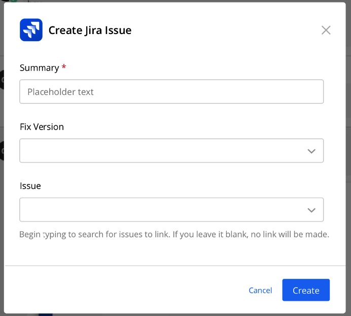
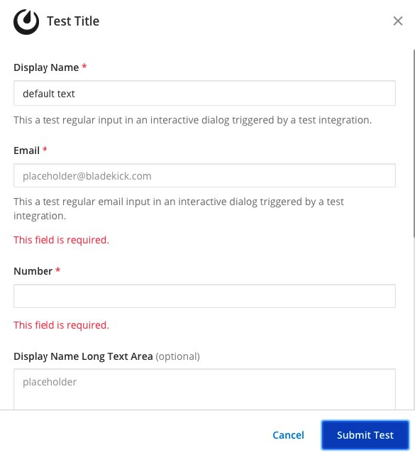
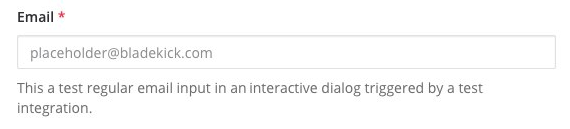
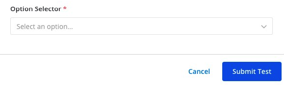
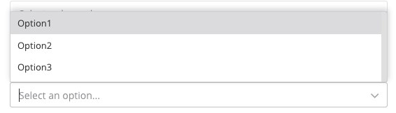
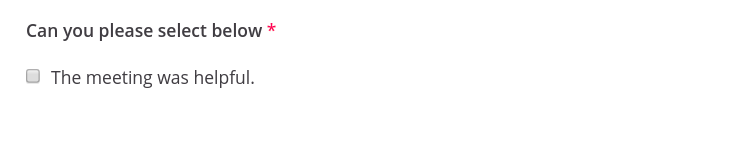
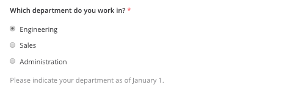
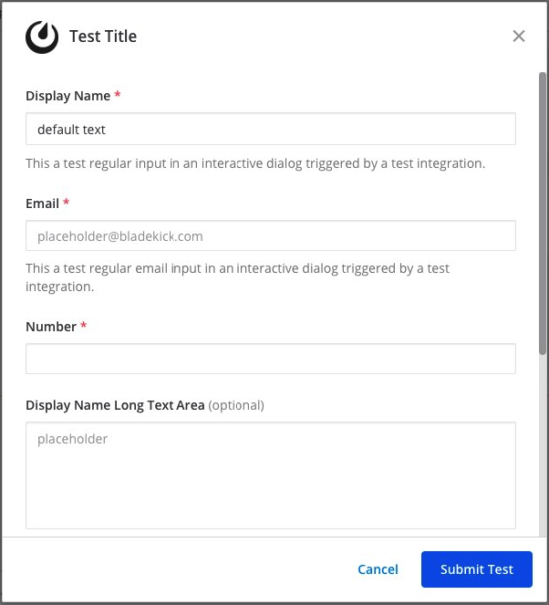

.. _interactive-dialogs:

Interactive Dialogs
===================

Interactive dialogs are used by applications that integrate with the Mattermost server. They are a method for integrations to receive some form-styled input from users and have that input submitted back to the integration. Use them to gather structured information from the end user to perform an action or a request.

Integrations open dialogs by sending an ``HTTP POST``, containing some data in the request body, to an endpoint on the Mattermost server. Integrations can use this endpoint to open dialogs when users :doc:`click message buttons or select an option from a menu <interactive-messages>`, or use a :doc:`custom slash command <slash-commands>`.

Moreover, :doc:`plugins <../administration/plugins>` can trigger a dialog based on user actions. For instance, if a plugin adds a button in the channel header, clicking that button may open a dialog.

Here is an example of what a dialog looks like for creating a Jira issue within the Mattermost user interface:

.. contents::
  :backlinks: top
  :depth: 1
  :local:

Opening a Dialog
----------------

To open a dialog, your integration must first receive an HTTP request from the Mattermost server. This request will be triggered by a slash command or an interactive message. It will include a trigger ID.

Once you have the trigger ID you can use it to open the interactive dialog by sending an ``HTTP POST`` request to ``https://<your-mattermost-url>/api/v4/actions/dialogs/open``. See the below section for what to include in the body of that HTTP request.

Parameters
----------

Interactive dialogs support the following parameters:

.. csv-table::
    :header: "Parameter", "Type", "Description"

    "``title``", "String", "Title of the dialog. Maximum 24 characters."
    "``introduction_text``", "string", "Markdown-formatted introduction text which is displayed above the dialog ``elements``."
    "``elements``", "Array", "Up to 5 elements allowed per dialog. See below for more details on elements. If none are supplied the dialog box acts as a simple confirmation."
    "``url``", "String", "The URL to send the submitted dialog payload to."
    "``icon_url``", "String", "(Optional) The URL of the icon used for your dialog. If none specified, no icon is displayed."
    "``submit_label``", "String", "(Optional) Label of the button to complete the dialog. Default is ``Submit``."
    "``notify_on_cancel``", "Boolean", "(Optional) When ``true``, sends an event back to the integration whenever there's a user-induced dialog cancellation. No other data is sent back with the event. Default is ``false``."
    "``state``", "String", "(Optional) String provided by the integration that will be echoed back with dialog submission. Default is the empty string."

Sample JSON is given below. Form submissions are sent back to the URL defined by the integration. You must also include the trigger ID you received from the slash command or interactive message.

.. code-block:: json

  {
      "trigger_id": "<unique ID generated by the server>",
      "url": "<URL to send the submitted request to>",
      "dialog": {
          "callback_id": "<ID specified by the integration to identify the request>",
          "title": "<title of the dialog>",
          "introduction_text": "<Text describing the dialog box content>",
          "elements": ["<Array of UI elements to display in the dialog>"],
          "submit_label": "<label of the button to complete the dialog>",
          "notify_on_cancel": false,
          "state": "<string provided by the integration that will be echoed back with dialog submission>",
      }
  }

Elements
--------

Each dialog supports elements for users to enter information.

- ``text``: Single-line plain text field. Use this for inputs such as names, email addresses, or phone numbers.
- ``textarea``: Multi-line plain text field. Use this field when the answer is expected to be longer than 150 characters.
- ``select``: Message menu. Use this for pre-selected choices. Can either be static menus or dynamic menus generated from users and Public channels of the system. For more information on message menus, see :doc:`the documentation <interactive-messages>`.
- ``bool``: Checkbox option. Use this for binary selection.
- ``radio``: Radio button option. Use this to quickly select an option from pre-selected choices.

Each element is required by default, otherwise the client will return an error as shown below. Note that the error message will appear below the help text, if one is specified. To make an element optional, set the field ``"optional": "true"``.

Text elements
^^^^^^^^^^^^^

Text elements are single-line plain text fields. Below is an example of a ``text`` element that asks for an email address.

.. code-block:: json

  {
    "display_name": "Email",
    "name": "email",
    "type": "text",
    "subtype": "email",
    "placeholder": "placeholder@example.com"
  }

There is an optional ``"subtype": "email"`` field in the above example, which specifies the keyboard layout used on mobile. For this example, the email keypad is shown to the user given the subtype is set to ``email``.

The full list of supported fields is included below:

.. csv-table::
    :header: "Field", "Type", "Description"

    "``display_name``", "String", "Display name of the field shown to the user in the dialog. Maximum 24 characters."
    "``name``", "String", "Name of the field element used by the integration. Maximum 300 characters. You should use unique ``name`` fields in the same dialog."
    "``type``", "String", "Set this value to ``text`` for a text element."
    "``subtype``", "String", "(Optional) One of ``text``, ``email``, ``number``, ``password`` (as of v5.14), ``tel``, or ``url``. Default is ``text``. Use this to set which keypad is presented to users on mobile when entering the field."
    "``min_length``", "Integer", "(Optional) Minimum input length allowed for an element. Default is 0."
    "``max_length``", "Integer", "(Optional) Maximum input length allowed for an element. Default is 150. If you expect the input to be greater 150 characters, consider using a ``textarea`` type element instead."
    "``optional``", "Boolean", "(Optional) Set to ``true`` if this form element is not required. Default is ``false``."
    "``help_text``", "String", "(Optional) Set help text for this form element. Maximum 150 characters."
    "``default``", "String", "(Optional) Set a default value for this form element. Maximum 150 characters."
    "``placeholder``", "String", "(Optional) A string displayed to help guide users in completing the element. Maximum 150 characters."
    
Textarea elements
^^^^^^^^^^^^^^^^^

Textarea elements are multi-line plain text fields. A sample JSON is provided below:

.. code-block:: json

  {
    "display_name": "Ticket Description",
    "name": "ticket_description",
    "type": "textarea",
    "help_text": "Provide description for your ticket."
  }

The maximum length for a ``textarea`` is 3,000 characters.

The list of supported fields is the same as for the ``textarea`` type element.

.. csv-table::
    :header: "Field", "Type", "Description"

    "``display_name``", "String", "Display name of the field shown to the user in the dialog. Maximum 24 characters."
    "``name``", "String", "Name of the field element used by the integration. Maximum 300 characters. You should use unique ``name`` fields in the same dialog."
    "``type``", "String", "Set this value to ``textarea`` for a textarea element."
    "``subtype``", "String", "(Optional) One of ``text``, ``email``, ``number``, ``tel``, or ``url``. Default is ``text``. Use this to set which keypad is presented to users on mobile when entering the field."
    "``min_length``", "Integer", "(Optional) Minimum input length allowed for an element. Default is 0."
    "``max_length``", "Integer", "(Optional) Maximum input length allowed for an element. Default is 3,000."
    "``optional``", "Boolean", "(Optional) Set to ``true`` if this form element is not required. Default is ``false``."
    "``help_text``", "String", "(Optional) Set help text for this form element. Maximum 150 characters."
    "``default``", "String", "(Optional) Set a default value for this form element. Maximum 3,000 characters."
    "``placeholder``", "String", "(Optional) A string displayed to help guide users in completing the element. Maximum 3,000 characters."

Select elements
^^^^^^^^^^^^^^^^^^^^^^^

Select elements are message menus that allow users to select one predefined option from a list. Below is an example of a ``select`` element that asks for one of three different options.

.. code-block:: json

  {
    "display_name": "Option Selector",
    "name": "options",
    "type": "select",
    "options": [
       {
         "text": "Option1",
         "value": "opt1"
       },
       {
         "text": "Option2",
         "value": "opt2"
       },
       {
         "text": "Option3",
         "value": "opt3"
       }
     ]
  }

Note that the JSON payload for ``select`` type elements matches :doc:`interactive message menus <interactive-messages>`.

The ``select`` element can also be generated dynamically from users and channels of the system.

For users, use:

.. code-block:: json

  {
    "display_name": "Assignee",
    "name": "assignee",
    "type": "select",
    "data_source": "users"
  }

and for Public channels, use:

.. code-block:: json

  {
    "display_name": "Post this message to",
    "name": "channel",
    "type": "select",
    "data_source": "channels"
  }

The list of supported fields for the ``select`` type element is included below:

.. csv-table::
    :header: "Field", "Type", "Description"

    "``display_name``", "String", "Display name of the field shown to the user in the dialog. Maximum 24 characters."
    "``name``", "String", "Name of the field element used by the integration. Maximum 300 characters. You should use unique ``name`` fields in the same dialog."
    "``type``", "String", "Set this value to ``select`` for a ``select`` element."
    "``data_source``", "String", "(Optional) One of ``users``, or ``channels``. If none specified, assumes a manual list of options is provided by the integration."
    "``options``", "Array", "(Optional) An array of options for the select element. Not applicable for ``users`` or ``channels`` data sources."
    "``optional``", "Boolean", "(Optional) Set to ``true`` if this form element is not required. Default is ``false``."
    "``help_text``", "String", "(Optional) Set help text for this form element. Maximum 150 characters."
    "``default``", "String", "(Optional) Set a default value for this form element. Maximum 3,000 characters."
    "``placeholder``", "String", "(Optional) A string displayed to help guide users in completing the element. Maximum 3,000 characters."

Checkbox element
^^^^^^^^^^^^^^^^

From Mattermost v5.16 you can use ``checkbox`` elements. It looks like a plain text field with a checkbox to be selected. Below is an example of a ``checkbox`` element that asks for meeting feedback.

.. code-block:: json

  {
    "display_name": "Can you please select below",
    "placeholder": "The meeting was helpful.",
    "name": "meeting_input",
    "type": "bool",
  }

The full list of supported fields is included below:

.. csv-table::
    :header: "Field", "Type", "Description"

    "``display_name``", "String", "Display name of the field shown to the user in the dialog. Maximum 24 characters."
    "``name``", "String", "Name of the field element used by the integration. Maximum 300 characters. You should use unique ``name`` fields in the same dialog."
    "``type``", "String", "Set this value to ``bool`` for a checkbox element."
    "``optional``", "Boolean", "(Optional) Set to ``true`` if this form element is not required. Default is ``false``."
    "``help_text``", "String", "(Optional) Set help text for this form element. Maximum 150 characters."
    "``default``", "String", "(Optional) Set a default value for this form element. ``true`` or ``false``."
    "``placeholder``", "String", "(Optional) A string displayed to include a label besides the checkbox. Maximum 150 characters."
    

Radio element
^^^^^^^^^^^^^

From Mattermost v5.16 you can use ``radio`` elements. It looks like a plain text field with a radio button to be selected. Below is an example of a ``radio`` element that asks for a department.

.. code-block:: json

  {
    "display_name": "Which department do you work in?",
    "name": "department",
    "type": "radio",
    "options": [
      {
        "text": "Engineering",
        "value": "engineering"
      },
      {
        "text": "Sales",
        "value": "sales"
      },
      {
        "text": "Administration",
        "value": "administration"
      }
    ],
    "help_text": "Please indicate your department as of January 1.",
    "default": "engineering"
  }

The full list of supported fields are included below:

.. csv-table::
    :header: "Field", "Type", "Description"

    "``display_name``", "String", "Display name of the field shown to the user in the dialog. Maximum 24 characters."
    "``name``", "String", "Name of the field element used by the integration. Maximum 300 characters. You should use unique ``name`` fields in the same dialog."
    "``type``", "String", "Set this value to ``radio`` for a radio element."
    "``options``", "Array", "(Optional) An array of options for the radio element."
    "``help_text``", "String", "(Optional) Set help text for this form element. Maximum 150 characters."
    "``default``", "String", "(Optional) Set a default value for this form element."

Dialog submission
-----------------

When a user submits a dialog, Mattermost will perform client-side input validation to make sure:

  - All required fields are filled.
  - All formats are correct (e.g. email, telephone number, etc.).

The submission payload sent to the integration is:

.. code-block:: json

  {
      "type": "dialog_submission",
      "callback_id": "<callback ID provided by the integration>",
      "state": "<state provided by the integration>", 
      "user_id": "<user ID of the user who submitted the dialog>",
      "channel_id": "<channel ID the user was in when submitting the dialog>",
      "team_id": "<team ID the user was on when submitting the dialog>",
      "submission": {
          "some_element_name": "<value of that element>",
          "some_other_element": "<value of some other element>"
      },
      "cancelled": false
  }

Optionally, the dialog can send an event back to the integration if ``notify_on_cancel`` parameter is set to ``true``. If this happens, ``cancelled`` will be set to ``true`` on the above payload, and ``submission`` will be empty.

Moreover, Mattermost also allows the integration itself to perform input validation. This can be done by responding to the dialog submission request with a JSON body containing an ``errors`` field. The ``errors`` field can contain a JSON object, mapping input field names to string error messages you would like to display to the user. For example, if you have a field named ``num_between_0_and_10``, you can enforce the user to enter a number between 0 and 10 by returning the following response body if the condition isn't satisfied:

.. code-block:: json

  {"errors": {"num_between_0_and_10": "Enter a number between 0 and 10."}}

The integration may also return a generic error message to the user that is not attached to a specific field. This can be done by responding to the dialog submission request with a JSON body containing an ``error`` field. The ``error`` field should contain a string with the error message to display to the user. For example, if a server-side error occurs, you can return a message explaining it:

.. code-block:: json

  {"error": "Failed to fetch additional data. Please try again."}

Support for generic error messages was added in Mattermost v5.18.

Finally, once the request is submitted, we recommend that the integration responds with a system message or an ephemeral message confirming the submission. This should be a separate request back to Mattermost once the service has received and responded to a submission request from a dialog. This can be done either via `the REST API <https://api.mattermost.com/#tag/posts%2Fpaths%2F~1posts~1ephemeral%2Fpost>`_, or via the `Plugin API <https://developers.mattermost.com/extend/plugins/server/reference/#API.SendEphemeralPost>`_ if you're developing a plugin.

.. note::

  If the dialog is closed by clicking **Cancel** or **X**, no data will be submitted. If a user clicks away from the dialog, the dialog won’t close. This is to prevent accidentally losing any answers they've made to an unsubmitted dialog.

Example
-------

Below is a full example of a JSON payload that creates an interactive dialog in Mattermost:

.. code-block:: json

  {
     "trigger_id":"nbt1dxzqwpn6by14sfs66ganhc",
     "url":"http://localhost:5000/dialog_submit",
     "dialog":{
        "callback_id":"somecallbackid",
        "title":"Test Title",
        "icon_url":"https://mattermost.org/wp-content/uploads/2016/04/icon.png",
        "elements":[
           {
              "display_name":"Display Name",
              "name":"realname",
              "type":"text",
              "subtype":"",
              "default":"default text",
              "placeholder":"placeholder",
              "help_text":"This a regular input in an interactive dialog triggered by a test integration.",
              "optional":false,
              "min_length":0,
              "max_length":0,
              "data_source":"",
              "options":null
           },
           {
              "display_name":"Email",
              "name":"someemail",
              "type":"text",
              "subtype":"email",
              "default":"",
              "placeholder":"placeholder@bladekick.com",
              "help_text":"This a regular email input in an interactive dialog triggered by a test integration.",
              "optional":false,
              "min_length":0,
              "max_length":0,
              "data_source":"",
              "options":null
           },
           {
              "display_name":"Number",
              "name":"somenumber",
              "type":"text",
              "subtype":"number",
              "default":"",
              "placeholder":"",
              "help_text":"",
              "optional":false,
              "min_length":0,
              "max_length":0,
              "data_source":"",
              "options":null
           },
           {
              "display_name":"Display Name Long Text Area",
              "name":"realnametextarea",
              "type":"textarea",
              "subtype":"",
              "default":"",
              "placeholder":"placeholder",
              "help_text":"",
              "optional":true,
              "min_length":5,
              "max_length":100,
              "data_source":"",
              "options":null
           },
           {
              "display_name":"User Selector",
              "name":"someuserselector",
              "type":"select",
              "subtype":"",
              "default":"",
              "placeholder":"Select a user...",
              "help_text":"",
              "optional":false,
              "min_length":0,
              "max_length":0,
              "data_source":"users",
              "options":null
           },
           {
              "display_name":"Channel Selector",
              "name":"somechannelselector",
              "type":"select",
              "subtype":"",
              "default":"",
              "placeholder":"Select a channel...",
              "help_text":"Choose a channel from the list.",
              "optional":true,
              "min_length":0,
              "max_length":0,
              "data_source":"channels",
              "options":null
           },
           {
              "display_name":"Option Selector",
              "name":"someoptionselector",
              "type":"select",
              "subtype":"",
              "default":"",
              "placeholder":"Select an option...",
              "help_text":"",
              "optional":false,
              "min_length":0,
              "max_length":0,
              "data_source":"",
              "options":[
                 {
                    "text":"Option1",
                    "value":"opt1"
                 },
                 {
                    "text":"Option2",
                    "value":"opt2"
                 },
                 {
                    "text":"Option3",
                    "value":"opt3"
                 }
              ]
           }
        ],
        "submit_label":"Submit",
        "notify_on_cancel":true,
        "state":"somestate"
     }
  }

Share your integration
-----------------------

If you've built an integration for Mattermost, please consider `sharing your work <https://mattermost.org/share-your-mattermost-projects/>`__ in our `app directory <https://integrations.mattermost.com/>`__.

The `app directory <https://integrations.mattermost.com/>`__ lists open source integrations developed by the Mattermost community and are available for download, customization and deployment to your private cloud or self-managed infrastructure.

Slack compatibility
--------------------

Like Slack, dialogs are triggered by an interactive message menu or button, or by a custom slash command. Additionally, Mattermost can trigger dialogs via plugins.

The schema for these objects is the same as Slack's, except for the following differences:

  - ``url`` field must be specified for Mattermost dialogs, which specifies where the request is sent to. In Slack, this is handled by specifying the URL within the Slack app that uses the dialog.
  - ``icon_url`` is an optional field to set the icon for Mattermost dialogs. In Slack, the dialogs use the icon set for the app that uses the dialog.
  - ``label`` in Slack dialogs is ``display_name`` in Mattermost dialogs for a more consistent naming convention with other integration types.
  - ``hint`` in Slack dialogs is ``help_text`` in Mattermost dialogs for a more consistent naming convention with other integration types.
  - ``value`` in Slack dialogs is ``default`` in Mattermost dialogs for a more consistent naming convention with other integration types.

Moreover, the JSON payload for ``select`` type elements matches :doc:`interactive message menus <interactive-messages>`.
