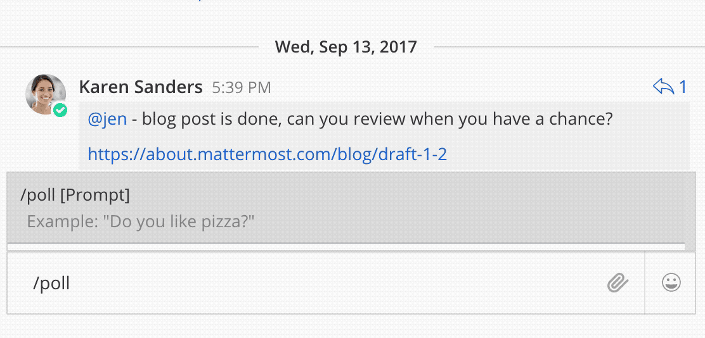

.. _interactive-messages:

Interactive Messages
============================

Mattermost supports interactive messages for :doc:`incoming <webhooks-incoming>` and :doc:`outgoing webhooks <webhooks-outgoing>`, :doc:`custom slash commands <slash-commands>` and :doc:`plugins <../administration/plugins>` via actions. They help make your integrations richer by completing common tasks inside Mattermost conversations, increasing user engagement and productivity.

Use interactive messages to simplify complex workflows by allowing users to take quick actions directly through your integration post. For example, they enable your integration to:

- mark a task complete in your project management tracker
- conduct a customer survey or a poll
- initiate a command to merge a branch into a release

To try it out, you can use this `matterpoll plugin <https://github.com/matterpoll/matterpoll>`_ to add polling to Mattermost channels via a ``/poll`` slash command.

.. toctree::
  :maxdepth: 2

Message Buttons
----------------

Add message buttons as ``actions`` in your integration `message attachments <https://docs.mattermost.com/developer/message-attachments.html>`_.

The following payload gives an example that uses message buttons.

.. code-block:: text

  {
    "attachments": [
      {
        "pretext": "This is the attachment pretext.",
        "text": "This is the attachment text.",
        "actions": [
          {
            "name": "Ephemeral Message",
            "integration": {
              "url": "http://127.0.0.1:7357",
              "context": {
                "action": "do_something_ephemeral"
              }
            }
          }, {
            "name": "Update",
            "integration": {
              "url": "http://127.0.0.1:7357",
              "context": {
                "action": "do_something_update"
              }
            }
          }
        ]
      }
    ]
  }

The integration can respond with an update to the original post, or with an ephemeral message:

.. code-block:: text

  {
    "update": {
      "message": "Updated!"
    },
    "ephemeral_text": "You updated the post!"
  }

.. image:: ../../source/images/interactive_message.gif

Message Menus
----------------

Similar to buttons, add message menus as ``actions`` in your integration `message attachments <https://docs.mattermost.com/developer/message-attachments.html>`_.

.. image:: ../../source/images/message-menus.png

The following payload gives an example that uses message menus.

.. code-block:: text

  {
    "attachments": [
      {
        "pretext": "This is the attachment pretext.",
        "text": "This is the attachment text.",
        "actions": [
          {
            "name": "Select an option...",
            "integration": {
              "url": "http://127.0.0.1:7357/action_options",
              "context": {
                "action": "do_something"
              }
            },
            "type": "select",
            "options": [
                    {
                        "text": "Option1",
                        "value": "opt1"
                    },
                    {
                        "text": "Option2",
                        "value": "opt2"
                    },
                    {
                        "text": "Option3",
                        "value": "opt3"
                    }
            ]
          }
        ]
      }
    ]
  }

The integration can respond with an update to the original post, or with an ephemeral message:

.. code-block:: text

  {
    "update": {
      "message": "Updated!"
    },
    "ephemeral_text": "You updated the post!"
  }

Message menus for channels
^^^^^^^^^^^^^^^^^^^^^^^^^^^^^^^^^^^^^

You can also provide a list of channels for message menus that the user can choose from. Users can only to select from public channels in their teams.

Specify ``channels`` as your action's ``data_source`` as follows:

.. code-block:: text

  {
    "attachments": [
      {
        "pretext": "This is the attachment pretext.",
        "text": "This is the attachment text.",
        "actions": [
          {
            "name": "Select an option...",
            "integration": {
              "url": "http://127.0.0.1:7357/action_options",
              "context": {
                "action": "do_something"
              }
            },
            "type": "select",
            "data_source": "channels"
          }
        ]
      }
    ]
  }

Message menus for users
^^^^^^^^^^^^^^^^^^^^^^^^^^^^^^^^^^^^^

Similar to channels, you can also provide a list of users for message menus. The user can choose anyone part of the Mattermost system.

Specify ``users`` as your action's ``data_source`` as follows:

.. code-block:: text

  {
    "attachments": [
      {
        "pretext": "This is the attachment pretext.",
        "text": "This is the attachment text.",
        "actions": [
          {
            "name": "Select an option...",
            "integration": {
              "url": "http://127.0.0.1:7357/action_options",
              "context": {
                "action": "do_something"
              }
            },
            "type": "select",
            "data_source": "users"
          }
        ]
      }
    ]
  }

Parameters
^^^^^^^^^^^^^

Below is a brief description of each parameter to help you customize the interactive message in Mattermost. For more information on message attachments, `see our documentation <https://docs.mattermost.com/developer/message-attachments.html>`_.

Name
  Give your action a descriptive name.

URL
  The actions are backed by an integration that handles HTTP POST requests when users click the message button. The URL parameter determines where this action is sent to. The request contains an ``application/json`` JSON string.

Context
  The requests sent to the specified URL contain the user id, post id, channel id, team id, and any context that was provided in the action definition. The post id can be used to, for example, delete or edit the post after clicking on a message button.
  
  A simple example of a request is given below:
  
  .. code-block:: text

    {
    "user_id": "rd49ehbqyjytddasoownkuqrxe",
    "post_id": "gqrnh3675jfxzftnjyjfe4udeh",
    "channel_id": "j6j53p28k6urx15fpcgsr20psq",
    "team_id": "5xxzt146eax4tul69409opqjlf",
    "context": {
      "action": "do_something"
      }
    }

  In most cases, your integration will do one or both of these things:
  
  1. **Identifying which action was triggered**. For example, a GitHub integration might store something like this in the context:

    .. code-block:: text

      {
      "user_id": "rd49ehbqyjytddasoownkuqrxe",
      "post_id": "gqrnh3675jfxzftnjyjfe4udeh",
      "channel_id": "j6j53p28k6urx15fpcgsr20psq",
      "team_id": "5xxzt146eax4tul69409opqjlf",
      "context": {
        "repo": "mattermost/mattermost-server"
        "pr": 1234,
        "action": "merge"
        }
      }
      
  In the example above, when the message button is clicked, your integration sends a request to the specified URL with the intention to merge the pull request identified by the context.

  2. **Authenticating the server**. An important property of the context parameter is that it's kept confidential. Hence, if your integration is not behind a firewall, you could add a token to your context without users ever being able to see it:

    .. code-block:: text

      {
      "user_id": "rd49ehbqyjytddasoownkuqrxe",
      "post_id": "gqrnh3675jfxzftnjyjfe4udeh",
      "channel_id": "j6j53p28k6urx15fpcgsr20psq",
      "team_id": "5xxzt146eax4tul69409opqjlf",
      "context": {
        "repo": "mattermost/mattermost-server"
        "pr": 1234,
        "action": "merge",
        "token": "somerandomlygeneratedsecret"
        }
      }
   
  Then, when your integration receives the request, it can verify that the token matches one that you previously generated and know that the request is legitimately coming from the Mattermost server and not forged.

  Depending on the application, integrations can also perform authentication statelessly with cryptographic signatures such as:

    .. code-block:: text

      {
      "user_id": "rd49ehbqyjytddasoownkuqrxe",
      "post_id": "gqrnh3675jfxzftnjyjfe4udeh",
      "channel_id": "j6j53p28k6urx15fpcgsr20psq",
      "team_id": "5xxzt146eax4tul69409opqjlf",
      "context": {
        "repo": "mattermost/mattermost-server"
        "pr": 1234,
        "action": "merge",
        "signature": "mycryptographicsignature"
        }
      }

  It's also possible for integrations to do both of these things with a single token and use something like this as context:

    .. code-block:: text

      {
      "user_id": "rd49ehbqyjytddasoownkuqrxe",
      "post_id": "gqrnh3675jfxzftnjyjfe4udeh",
      "channel_id": "j6j53p28k6urx15fpcgsr20psq",
      "team_id": "5xxzt146eax4tul69409opqjlf",
      "context": {
        "action_id": "someunguessableactionid"
        }
      }

  Then, when the integration receives the request, it can act based on the action id.

Tips and Best Practices
------------------------

1. The external application may be written in any programming language. It needs to provide a URL which receives the request sent by your Mattermost server and responds with in the required JSON format.
2. To get started, you can use this `sample plugin <https://github.com/matterpoll/matterpoll>`_ to add polling to Mattermost channels via a `/poll` slash command.

Share Your Integration
-----------------------

If you've built an integration for Mattermost, please consider `sharing your work <https://www.mattermost.org/share-your-mattermost-projects/>`_ in our `app directory <https://about.mattermost.com/default-app-directory/>`_.

The `app directory <https://about.mattermost.com/default-app-directory/>`_ lists open source integrations developed by the Mattermost community and are available for download, customization and deployment to your private cloud or on-prem infrastructure.

Slack Compatibility
--------------------

Like Slack, actions are specified in an "actions" list within the message attachment. Moreover, your integrations can react with ephemeral messages or message updates similar to Slack.

However, the schema for these objects is slightly different given Slack requires a Slack App and action URL to be pre-configured beforehand. Mattermost instead allows an integration to create an interactive message without pre-configuration.

Troubleshooting
--------------------

Interactive messages don't show up for slash commands
^^^^^^^^^^^^^^^^^^^^^^^^^^^^^^^^^^^^^^^^^^^^^^^^^^^^^^^^^^^^^^^^^^^^^^^^^^^^

Make sure the `response type <https://docs.mattermost.com/developer/slash-commands.html#message-type>`_ of your slash command is set to ``in_channel``, not ``ephemeral``.

Ephemeral messages do not have a state, and therefore do not support interactive message buttons at this time.

Message buttons and menus do not trigger an action and return a 400 error
^^^^^^^^^^^^^^^^^^^^^^^^^^^^^^^^^^^^^^^^^^^^^^^^^^^^^^^^^^^^^^^^^^^^^^^^^^^^

It is likely for one of three reasons:

1. Mattermost wasn't able to connect to the integration. If the integration is on your internal infrastructure, it'll need to be whitelisted (see `"AllowedUntrustedInternalConnections" config.json setting <https://docs.mattermost.com/administration/config-settings.html#allow-untrusted-internal-connections-to>`_). The log will include the text ``err=address forbidden`` in the error message.

2. The integration didn't return HTTP status 200. The log will include the text ``status=XXX`` in the error message.

3. The integration didn't return a valid JSON response. The log will include the text ``err=some json error message`` in the error message.
