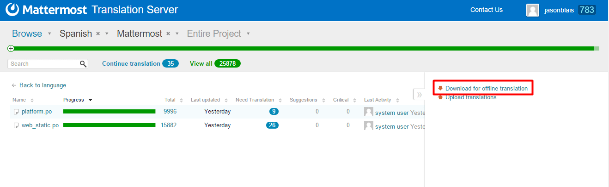

Localization
------------------

The goal of the localization process is to consistently produce high quality translations release after release through collaboration between the international community, translators, project managers, language leads and the core team.

Translation Process
===================

If you're interested in contributing translations to Mattermost, please join the `Mattermost localization channel to discuss <https://pre-release.mattermost.com/core/channels/localization>`_. Below are descriptions of the overall localization process.

Initial Translation
===================

To translate a language:

1 - Join the `Mattermost Translation Server <http://translate.mattermost.com>`_. 

2 - Confirm that the language you want to help translate is listed in the `Translation Server <http://translate.mattermost.com>`_.

    - If it is, perhaps offer to help translate or review and make suggestions.
    - If not, ask to setup your language on the `Mattermost localization channel <https://pre-release.mattermost.com/core/channels/localization>`_, so you can start helping with the translation.
    
3 - Review translation rules written by localization leads, when applicable:

    - `French (Règles pour la traduction francophone de Mattermost) <https://github.com/wget/mattermost-localization-french-translation-rules>`_
    - `German (Regeln zur Übersetzung von Mattermost) <https://gist.github.com/meilon/1317a9425988b3ab296c894a72270787>`_

Translations Updates
====================

1 - New and updated strings are imported to the `Mattermost Translation Server <http://translate.mattermost.com>`_ each day at 00:00 GMT

2 - A new pull request with latest translations that reach at least Beta Quality is submitted to the `Mattermost Platform Repo <https://github.com/mattermost/platform>`_ each Monday at 22:00 GMT.

    - A pull request will also be submitted on the day of major feature complete and code complete to ensure latest translations are included in the release. 
    - A pull request may also be submitted for a release candidate.

**IMPORTANT:** Please do not submit translations directly with a pull request as they may be lost with the next updates from the Mattermost Translation Server.

Translation Quality
===================

So users understand the accuracy and coverage of language translations, quality levels are explicitly defined for each language:

-----------------
Official
-----------------
- 100% of translation verified by someone deeply knowledgeable in Mattermost functionality.
- 100% of translation verified by someone deeply knowledgeable in target language.
- No translation may be out-of-date due to changes to English-language text since the last translation and review cycle.
- Language must have at least one official reviewer who maintains the language with updated strings imported to the `Translation Server <http://translate.mattermost.com>`_ over time.
- Language must have been in use for **at least 2 full release cycles** where end users in target language can share feedback and corrections.

Language option is listed as an option in **Account Settings > Display > Language**.

-----------------
Beta
-----------------
- 100% of translation verified by someone deeply knowledgeable in Mattermost functionality.
- 100% of translation verified by someone deeply knowledgeable in target language.
- Up to 10% of translation may be out-of-date due to changes to English-language text since the last translation and review cycle.

Language option is listed as an option in **Account Settings > Display > Language** prefixed with **(Beta)**.

-----------------
Alpha
-----------------
- Translation has not yet reached Beta quality.

An official language may be changed back to Beta or Alpha if the specified requirements are not met for a release. Similarly, Beta-quality language may be dropped back to Alpha.

Test Translations
===================

If you'd like to review and verify translations prior to achieving Beta-quality status, you can follow these steps:

1 - Build Mattermost on your machine following the `Developer Machine Setup Guides <http://docs.mattermost.com/developer/developer-setup.html>`_.

2 - Download a copy of your translations to your local machine.

3 - Use `Mattermosti18n <https://github.com/rodrigocorsi2/mattermosti18n#convert-po---json>`_ to convert Pootle's output into JSON files.

4 - Copy the generated [locale].json files to the corresponding directories:

    - For platform they should be in the `i18n` directory.
    - For webapp they should be in the `webapp/i18n` directory.

5 - Modify the file `webapp/i18n/i18n.jsx` to include your translated strings.

6 - Compile and run **Mattermost** to confirm everything works. You can then review and verify translations from your machine.

Translation Maintenance
=======================

Translations require updates on a monthly basis as features are added and changed. The formal process for updates has yet to be determined.

Below are current official reviewers and maintainers for languages that have reached at least Beta-quality. Official reviewers submit final translations for languages; maintainers suggest translations and step in when official reviewers aren't able to help in a certain release. 

If you're interested in contributing to the process, please join the `Mattermost localization channel to discuss <https://pre-release.mattermost.com/core/channels/localization>`_.

+------------------------------------------+-----------------------------------------------------------------------------------------------------------------------+------------------------------------------------------------------------------------------------------+
| Language                                 | Official Reviewer(s)                                                                                                  | Maintainers                                                                                          | 
+==========================================+=======================================================================================================================+======================================================================================================+
| Deutsch - German                         | `Christian Arnold <https://github.com/meilon>`_                                                                       | `Tim Estermann <https://github.com/der-test>`_                                                       |
+------------------------------------------+-----------------------------------------------------------------------------------------------------------------------+------------------------------------------------------------------------------------------------------+
| Español - Spanish                        | `Elias Nahum <https://github.com/enahum>`_                                                                            |                                                                                                      |
+------------------------------------------+-----------------------------------------------------------------------------------------------------------------------+------------------------------------------------------------------------------------------------------+
| Français - French                        | `William Gathoye <https://github.com/wget>`_                                                                          | `Pierre-Julien Grizel <https://github.com/pjgrizel>`_                                                |
+------------------------------------------+-----------------------------------------------------------------------------------------------------------------------+------------------------------------------------------------------------------------------------------+
| Nederlands - Dutch                       | TBD (Open Role)                                                                                                       | `Ron Hartman <https://github.com/rononline>`_ , `Wai Yi Leung <https://github.com/wyleung>`_         |
+------------------------------------------+-----------------------------------------------------------------------------------------------------------------------+------------------------------------------------------------------------------------------------------+
| Polski - Poland                          | `Robert Japełski <https://github.com/robert843>`_                                                                     |                                                                                                      |
+------------------------------------------+-----------------------------------------------------------------------------------------------------------------------+------------------------------------------------------------------------------------------------------+
| Português do Brasil - Portuguese         | `Rodrigo Corsi <https://github.com/rodcorsi>`_                                                                        | `Carlos Tadeu Panato Junior <https://github.com/cpanato>`_                                           |
+------------------------------------------+-----------------------------------------------------------------------------------------------------------------------+------------------------------------------------------------------------------------------------------+
| Pусский - Russian                        | TBD (Open Role)                                                                                                       | `Archie Roller <https://github.com/archroller>`_ (primary)                                           |
+------------------------------------------+-----------------------------------------------------------------------------------------------------------------------+------------------------------------------------------------------------------------------------------+
| 한국어 - Korean                          | TBD (Open Role)                                                                                                       | `Hyeseong Kim <https://github.com/cometkim>`_                                                        |
+------------------------------------------+-----------------------------------------------------------------------------------------------------------------------+------------------------------------------------------------------------------------------------------+
| 中文 (简体) - Simplified Chinese         | `aeomin <http://translate.mattermost.com/user/aeomin/>`_                                                              |                                                                                                      |
+------------------------------------------+-----------------------------------------------------------------------------------------------------------------------+------------------------------------------------------------------------------------------------------+
| 中文 (繁體) - Traditional Chinese        | `Tze-Kei Lee <https://github.com/chikei>`_                                                                            |                                                                                                      |
+------------------------------------------+-----------------------------------------------------------------------------------------------------------------------+------------------------------------------------------------------------------------------------------+
| 日本語 - Japanese                        | `Ryo Onodera <https://github.com/ryoon>`_ , `Yusuke Nemoto <https://github.com/kaakaa>`_                              |                                                                                                      |
+------------------------------------------+-----------------------------------------------------------------------------------------------------------------------+------------------------------------------------------------------------------------------------------+
