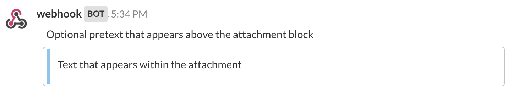
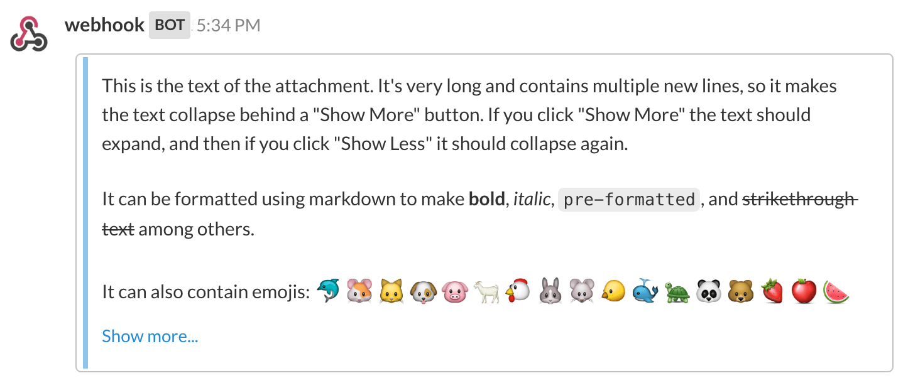
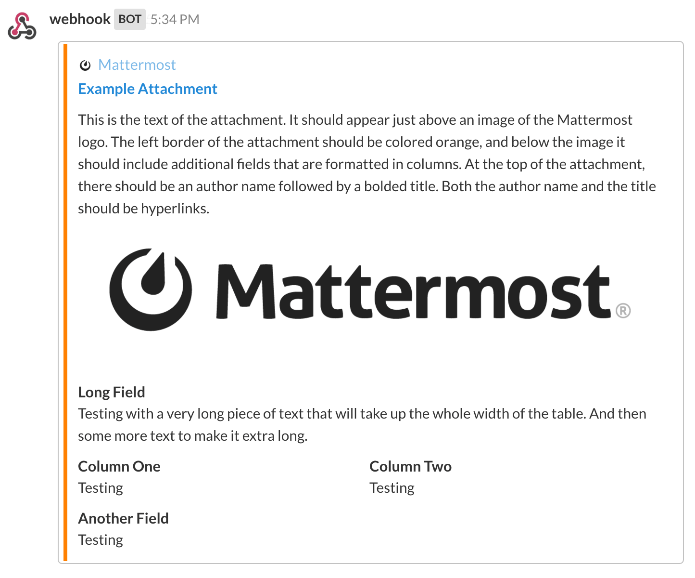

Message Attachments
-------------------

Basic formatting such as bold and italic can be included in the ``text`` field of an integration’s payload by using markdown.

For more advanced formatting, it is necessary to send an ``attachments`` array in the payload sent by an integration.

There is no support for attachments in Slash commands [as of yet](https://github.com/mattermost/platform/issues/4238)

---------------------------

|

Attachment Options
==================

When sending an attachment, you can use any of the following to format how you want the posted message to look.

``fallback``: A required plain-text summary of the post. This is used in notifications, and in clients that don’t support formatted text (eg IRC).

``color``: A hex color code that will be used as the left border color for the attachment. If not specified, it will default to match the left hand sidebar header background color.

.. image:: ../images/attachments-color.png

``pretext``: An optional line of text that will be shown above the attachment.

``text``: The text to be included in the attachment. It can be formatted using  `markdown <http://docs.mattermost.com/help/messaging/formatting-text.html>`_. If it includes more than 700 characters or more than 5 line breaks, the message will be collapsed and a “Show More” link will be added to expand the message.

**Author Details**

``author_name``: An optional name used to identify the author. It will be included in a small section at the top of the attachment.

``author_link``: An optional URL used to hyperlink the ``author_name``. If no ``author_name`` is specified, this field does nothing.

``author_icon``: An optional URL used to display a 16x16 pixel icon beside the ``author_name``.

.. image:: ../images/attachments-author.png

**Titles**

``title``: An optional title displayed below the author information in the attachment.

``title_link``: An optional URL used to hyperlink the ``title``. If no ``title`` is specified, this field does nothing.

.. image:: ../images/attachments-titles.png

**Fields**

Fields can be included as an optional array within ``attachments``, and are used to display information in a table format inside the attachment.

``title``: A title shown in the table above the ``value``.

``value``: The text value of the field. It can be formatted using `markdown <http://docs.mattermost.com/help/messaging/formatting-text.html>`_.

``short``: Optionally set to “True” or “False” to indicate whether the ``value`` is short enough to be displayed beside other values.

.. image:: ../images/attachments-fields.png

**Images**

``image_url``: An optional URL to an image file (GIF, JPEG, PNG, or BMP) that will be displayed inside a message attachment.

Large images will be resized to a maximum width of 400px or a maximum height of 300px, while still maintaining the original aspect ratio.

.. image:: ../images/attachments-image.png

``thumb_url``: An optional URL to an image file (GIF, JPEG, PNG, or BMP)  that will be displayed as a 75x75 pixel thumbnail on the right side of an attachment. We recommend using an image that is already 75x75 pixels, but larger images will be scaled down with the aspect ratio maintained.

.. image:: ../images/attachments-thumb.png

Example Message Attachment
==========================

Here is an example message attachment:

.. code-block:: JSON
  :linenos:

  {
    "attachments": [
      {
        "fallback": "test",
        "color": "#FF8000",
        "pretext": "This is optional pretext that shows above the attachment.",
        "text": "This is the text of the attachment. It should appear just above an image of the Mattermost logo. The left border of the attachment should be colored orange, and below the image it should include additional fields that are formatted in columns. At the top of the attachment, there should be an author name followed by a bolded title. Both the author name and the title should be hyperlinks.",
        "author_name": "Mattermost",
        "author_icon": "http://www.mattermost.org/wp-content/uploads/2016/04/icon_WS.png",
        "author_link": "http://www.mattermost.org/",
        "title": "Example Attachment",
        "title_link": "http://docs.mattermost.com/developer/message-attachments.html",
        "fields": [
          {
            "short": false,
            "title":"Long Field",
            "value":"Testing with a very long piece of text that will take up the whole width of the table. And then some more text to make it extra long."
          },
          {
            "short":true,
            "title":"Column One",
            "value":"Testing"
          },
          {
            "short":true,
            "title":"Column Two",
            "value":"Testing"
          },
          {
          "short":false,
          "title":"Another Field",
          "value":"Testing"
          }
        ],
        "image_url": "http://www.mattermost.org/wp-content/uploads/2016/03/logoHorizontal_WS.png"
      }
    ]
  }

And here is how it renders in Mattermost:

Known Issues
=============

1. ``color`` parameter does not support "good", "warning", and "danger" values
2. Footer information fields are not yet supported (``footer``, ``footer_icon``, and timestamp ``ts``)
3. Message Attachment contents do not show up in search
